# sea2_demo — 大航海時代II 资源逆向

KOEI《大航海時代II》(Uncharted Waters II, 1993, PC-9801) 的资源文件逆向。

源文件不在 git 里（本地路径 `/Users/dong/Projects/Koukai2/`）。

> **版本说明**：磁盘上的是**台湾繁体汉化版**（不是日文原版）。`2.pat` 是繁体中文字模（6800 字），消息文本中的双字节对通过自定义查找表索引到 2.pat。汉化作者保留了日版 Shift-JIS 字节结构（这样游戏引擎不用改），只把日文字模文件换成了繁体字模——所以 Big5 / GBK / SJIS 标准解码都解不出来，需要从 `Main.exe` 反汇编出 byte→tile mapping。

## 研究总纲

这次逆向不是为了复刻原作，而是为了回答两个问题：

- AI 到底怎么帮人做逆向工程
- 老一代设计师在极低资源下，是怎么做出复杂世界和分叉结构的

完整说明见 [docs/RESEARCH_PURPOSE.md](docs/RESEARCH_PURPOSE.md)。
具体怎么做、按什么顺序做，见 [docs/RESEARCH_WORKFLOW.md](docs/RESEARCH_WORKFLOW.md)。
老游戏设计智慧结构见 [docs/LEGACY_DESIGN_WISDOM.md](docs/LEGACY_DESIGN_WISDOM.md)。
样板切片见 [docs/SAMPLE_SLICE_SNR1_JOHN_FARRELL.md](docs/SAMPLE_SLICE_SNR1_JOHN_FARRELL.md)。

## 当前进度

| 资源 | 状态 | 输出 |
|---|---|---|
| `Kao.lzw` — 128 张头像 | ✅ | 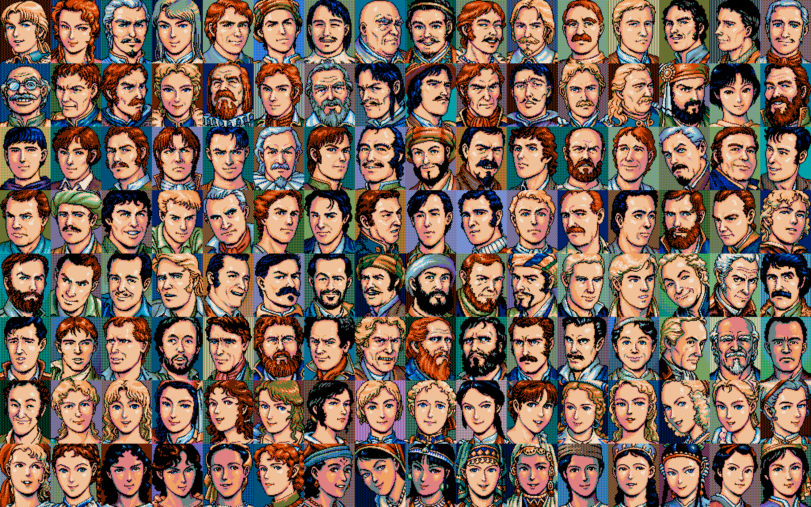 |
| `Kao.lzw` — 128 个 48×48 发现物/道具 | ✅ | 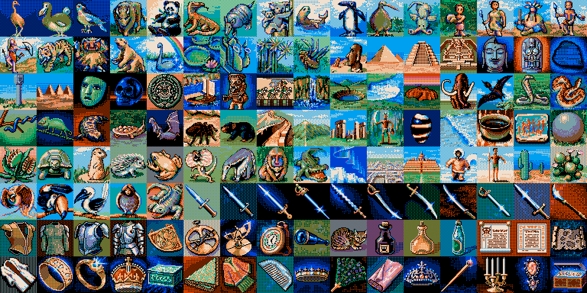 |
| `Portchip.lzw` — 7 套港口 tile atlas | ✅ | `output/portchip_v2/` |
| `Portmap.lzw` — 101 个港口地图（图为前 4 个） | ✅ | 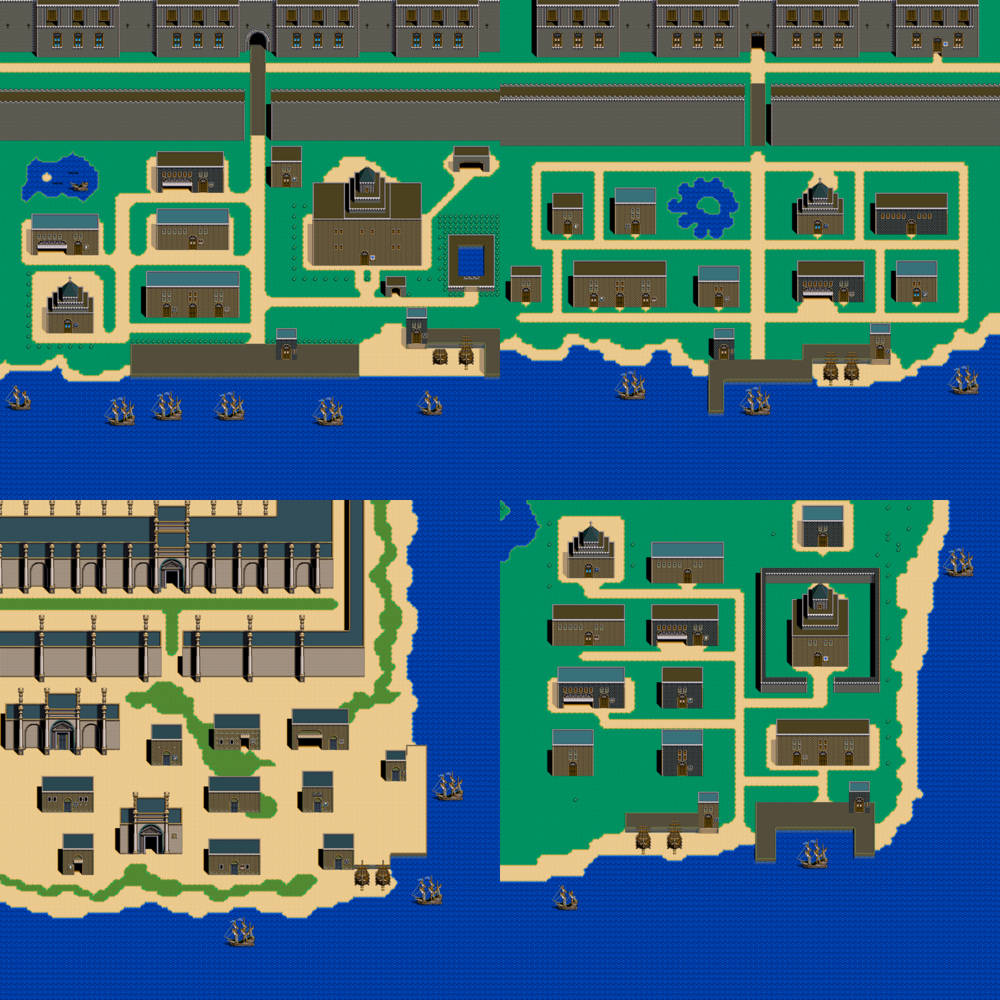 |
| `Worldmap.lzw` — 3 张世界地图（含沙漠/海岸/极地后处理）| ✅ | 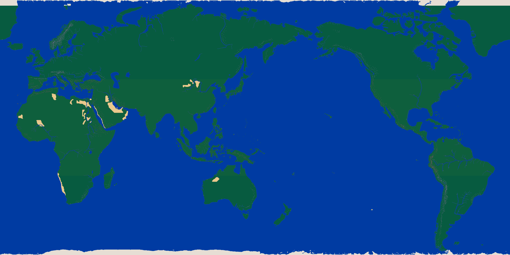 |
| `Iap1-6.lzw` `Iae1.lzw` — 875 决斗 sprite（6 玩家 + 1 敌人）| ✅ | `output/contact_iap{1-6}_v1.png` `contact_iae1_v1.png` |
| `Char.lzw` — 72 角色 walking sprite（不是字体！）| ✅ | 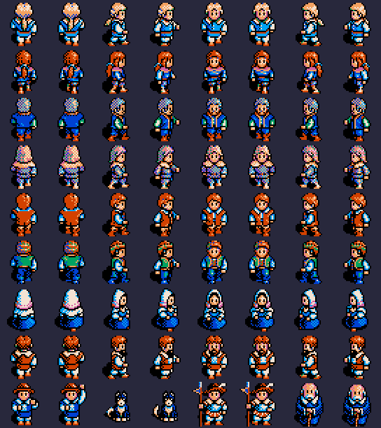 |
| `Opgraph.lzw` — 事件 CG | 🟥 卡住（内层压缩） | — |
| `Data1.lzw` — 25 船 stats + 32 船 sprite | ✅ | 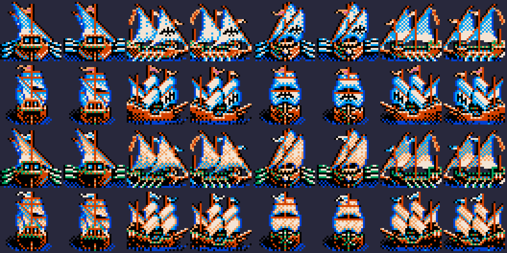 |
| `Message.dat` — 1022 条对话/UI 消息 | ✅ 字节抽完 / 字符映射 TODO | `output/messages.json` + `messages.txt` |
| `2.pat` — 繁体中文字体（6800 个 16×16 字模）| ✅ | 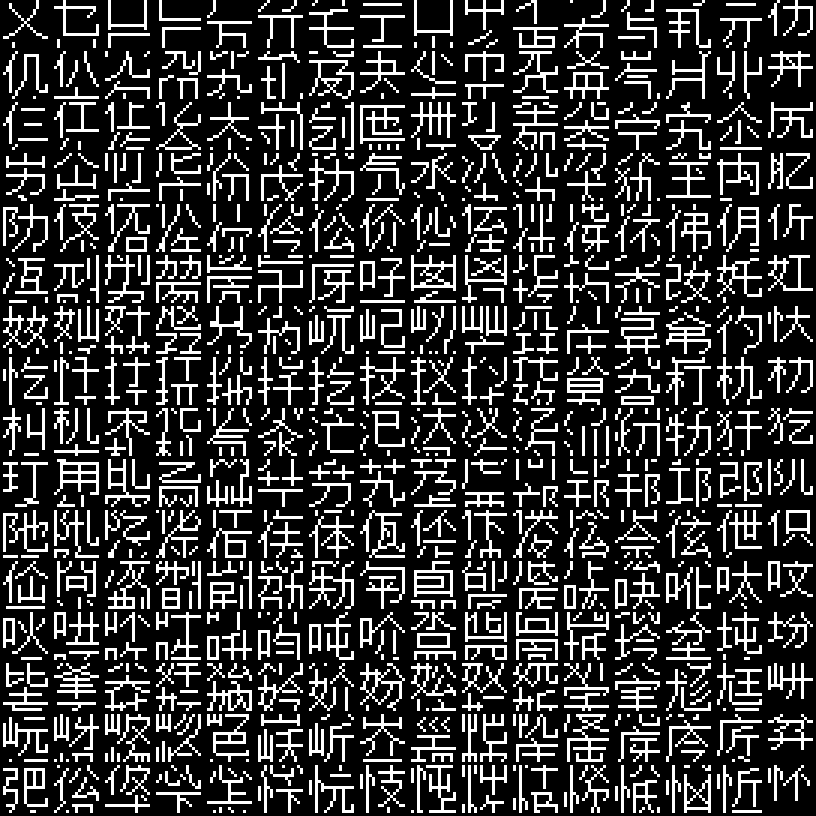 |
| **100 港口数据**（名称/经纬度/特产，来自攻略）| ✅ | 见游戏截图 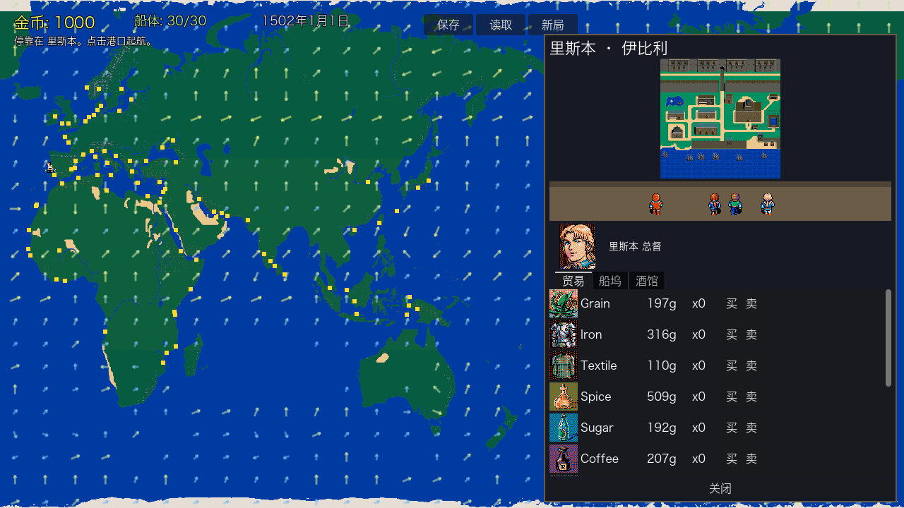 |

## 逆向拓扑

这部分是后面补进来的新内容，和上面的资源逆向表并列，不替换原来的进度表。

### 总图


六条主人公线的总关系图，重点看人物、目标和剧情线之间的交叉。

### 补充图

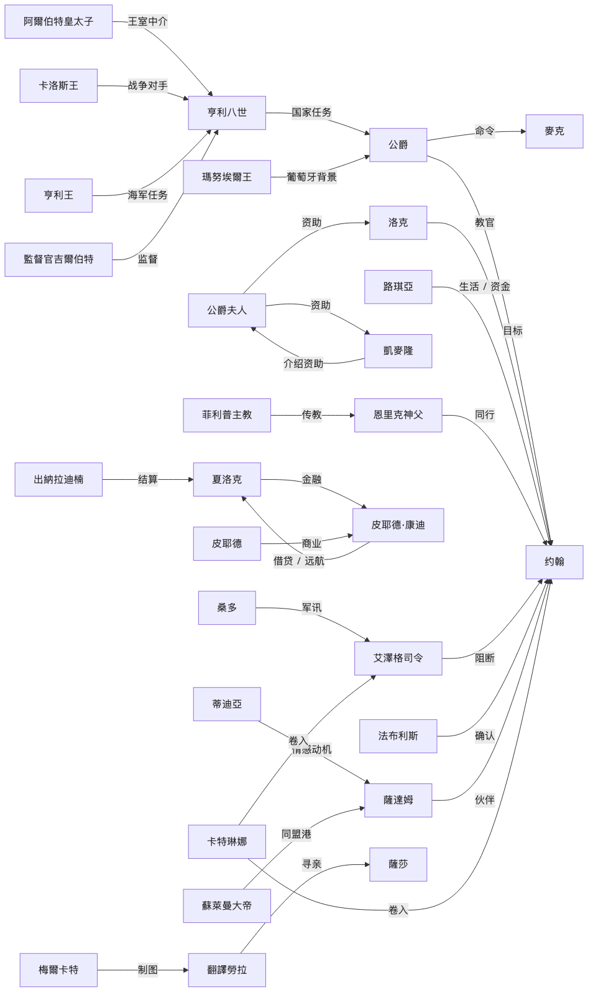
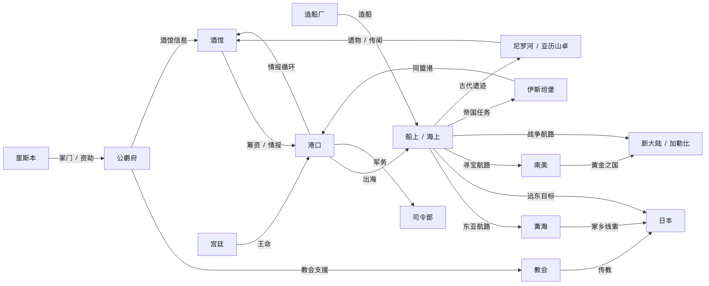
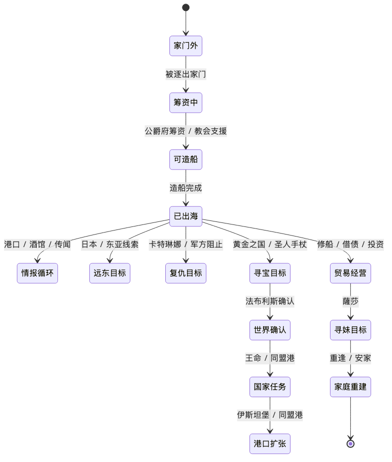
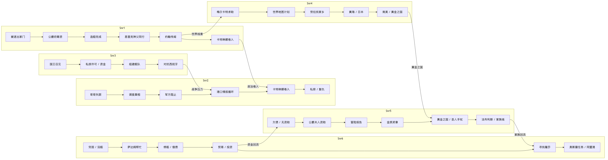

人物关系、地点网络、状态机和事件主链分别拆开看，方便从不同角度检查拓扑。

### 继续读

- [docs/游戏逻辑说明.md](docs/游戏逻辑说明.md) - 主文档，里面是拓扑、事件、原文附录
- [docs/PHASE3_DESIGN_DOC.md](docs/PHASE3_DESIGN_DOC.md) - 从逆向结果压出的设计稿
- [docs/PHASE4_MVP_SPEC.md](docs/PHASE4_MVP_SPEC.md) - 下一步实现用的最小规格

完整计划见 **[ROADMAP.md](ROADMAP.md)**。技术细节见 **[CLAUDE.md](CLAUDE.md)**。

**Phase 1 数据表** → [`output/game_data/`](output/game_data/)：港口 stats、风/洋流网格、海怪、25 船 stats、128 人物目录、**100 港口完整数据库**（`ports_full.json`，名称+经纬度+坐标）。港口对照表见 [`docs/PORTS_CATALOG.md`](docs/PORTS_CATALOG.md)。

**Phase 2 RE 进度** → [`docs/archive/PHASE2_PROGRESS.md`](docs/archive/PHASE2_PROGRESS.md)（找到文件 wrapper + KOUKAI2.DAT 主数据文件）。

**Phase 3 新游戏设计 spec** → [`docs/PHASE3_DESIGN_DOC.md`](docs/PHASE3_DESIGN_DOC.md)（含 MVP→Beta→v1 roadmap）。

**Phase 4 新游戏 MVP** → [`game/`](game) — Godot 4 项目。已实现：世界地图 + 10 港口（真实经纬度定位）+ 交易（12 商品带图标）+ 风向洋流 + 船导航 + 航行事件（海盗/风暴/商队等 8 种）+ 海战 + 港口买船（25 船型）+ 存档。用上了 RE 出来的头像/道具图标/港口大图/船 sprite。

## 跑一遍

```bash
pip install Pillow numpy

# 1. 解压所有 .lzw → output/lzw_parts/{Kao,Portchip,...}/
python3 scripts/inventory_lzw.py

# 2. 渲染所有解出来的资源
python3 scripts/render_kao_v4.py        # 128 头像
python3 scripts/render_disc_v1.py       # 128 发现物
python3 scripts/render_portchip_v2.py   # 7 套 atlas
python3 scripts/render_portmap_v2.py    # 101 港口
python3 scripts/render_worldmap_v2.py   # 3 张世界图（含后处理）
```

## 目录

```
scripts/
  ls11_decode.py              — LS10/LS11/Ls12 解压器
  inventory_lzw.py            — 批量解压所有 .lzw
  render_kao_v4.py            — 80×64 / 3-plane / 8 色头像
  render_disc_v1.py           — 48×48 / 3-plane / 8 色发现物
  render_portchip_v2.py       — 16×16 / 4bpp / 16 色港口 atlas
  render_portmap_v2.py        — Portmap × Portchip × Chip_no.dat
  render_worldmap_v1.py       — 块解码 + tile 拼图（基础版）
  render_worldmap_v2.py       — v1 + 沙漠/海岸/极地后处理
  experiments/                — 失败的尝试，保留作历史记录

output/
  contact_*.png               — 各资源的总览图
  kao_png_v4/ disc_png_v1/    — 单图（128 张）
  portchip_v2/ portmap_v2/    — 全部 atlas / 港口图
  worldmap_v2/                — 世界图缩略 PNG + 4×tile JPG
  ships/                      — 32 张船 sprite
  game_data/                  — Phase 1 数据 JSON（港口/船/风/人物等）
  lzw_parts/                  — LS11 解压出的原始 part（gitignore）

game/                         — Phase 4 Godot 4 游戏项目
  scenes/ scripts/            — 游戏代码
  data/                       — 从 output/game_data/ 衍生的游戏数据
  assets/                     — 从 output/ 复制的素材
  screenshots/                — MVP 进度截图
```

## 关键参考

- [JohanLi/uncharted-waters-2-research](https://github.com/JohanLi/uncharted-waters-2-research) — 救命级参考：tile 编码、large tileset、worldmap 后处理、决斗 UI
- [tzengyuxio/kaodata](https://github.com/tzengyuxio/kaodata) — LS11 解压算法

## 技术细节

参见 [CLAUDE.md](CLAUDE.md)：LS11 位流规范、各 `.lzw` 的位图编码、Worldmap 块编码 + 后处理 pipeline。
