# Demo: 大航海 II 资源浏览表
> 人读版数据展示。不需要打开 JSON——直接看图看表。

## 1. 128 个发现物 / 道具图标（48×48）

Kao.lzw 后 128 个 part 解出来的精灵图。包含**地理发现物**（宝藏、遗迹、瀑布等）和**贸易道具**（武器、香料、宝石等）。

| 000 | 001 | 002 | 003 | 004 | 005 | 006 | 007 | 008 | 009 | 010 | 011 | 012 | 013 | 014 | 015 |
|----|----|----|----|----|----|----|----|----|----|----|----|----|----|----|----|
| 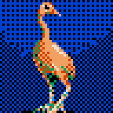<br>0 | 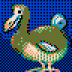<br>1 | 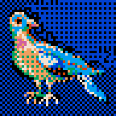<br>2 | <br>3 | <br>4 | 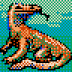<br>5 | 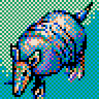<br>6 | 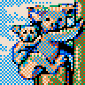<br>7 | <br>8 | <br>9 | 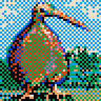<br>10 | <br>11 | 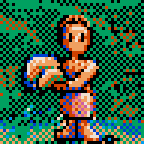<br>12 | 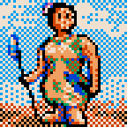<br>13 | <br>14 | 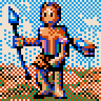<br>15 |
| 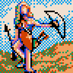<br>16 | 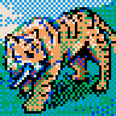<br>17 | 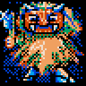<br>18 | 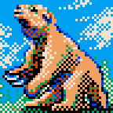<br>19 | 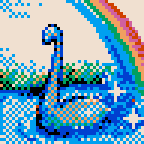<br>20 | 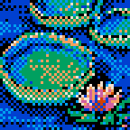<br>21 | <br>22 | 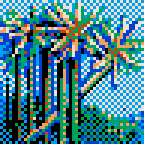<br>23 | 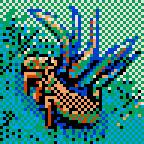<br>24 | 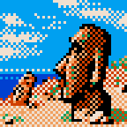<br>25 | 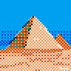<br>26 | 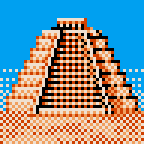<br>27 | 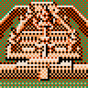<br>28 | <br>29 | 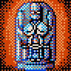<br>30 | <br>31 |
| 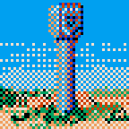<br>32 | 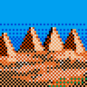<br>33 | <br>34 | <br>35 | <br>36 | 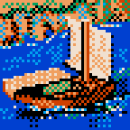<br>37 | <br>38 | 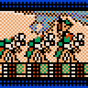<br>39 | 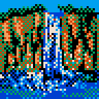<br>40 | 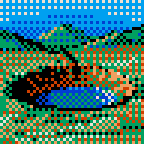<br>41 | 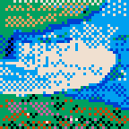<br>42 | 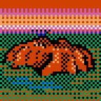<br>43 | <br>44 | 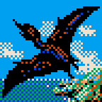<br>45 | 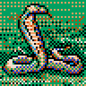<br>46 | 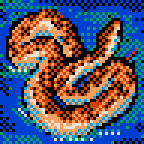<br>47 |
| 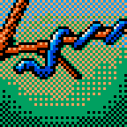<br>48 | 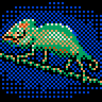<br>49 | 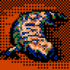<br>50 | 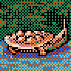<br>51 | 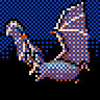<br>52 | <br>53 | 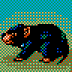<br>54 | 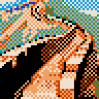<br>55 | 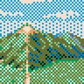<br>56 | 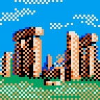<br>57 | 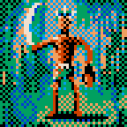<br>58 | 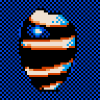<br>59 | 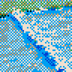<br>60 | <br>61 | 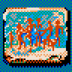<br>62 | 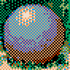<br>63 |
| 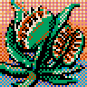<br>64 | 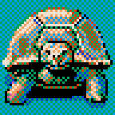<br>65 | <br>66 | <br>67 | <br>68 | <br>69 | <br>70 | <br>71 | <br>72 | <br>73 | <br>74 | <br>75 | <br>76 | <br>77 | <br>78 | <br>79 |
| <br>80 | <br>81 | <br>82 | <br>83 | <br>84 | <br>85 | <br>86 | <br>87 | <br>88 | <br>89 | <br>90 | <br>91 | <br>92 | <br>93 | <br>94 | <br>95 |
| <br>96 | <br>97 | <br>98 | <br>99 | <br>100 | <br>101 | <br>102 | <br>103 | <br>104 | <br>105 | <br>106 | <br>107 | <br>108 | <br>109 | <br>110 | <br>111 |
| <br>112 | <br>113 | <br>114 | <br>115 | <br>116 | <br>117 | <br>118 | <br>119 | <br>120 | <br>121 | <br>122 | <br>123 | <br>124 | <br>125 | <br>126 | <br>127 |

## 2. 港口数据表（101 个港口的核心 stats）

每条记录的 12 字段（5 必备 + 7 可选商品 slot）。FFFF = 该港口不交易此商品。每港口图标来自 portmap_v2（缩小）。

| ID | 区域 | atlas | F0 | F1 | F2 | F3 | F4 | F5 | F6 | F7 | F8 | F9 | F10 | F11 |
|----|------|-------|-----|-----|-----|-----|-----|-----|-----|-----|-----|-----|------|------|
| **000** | 🇪🇺 西欧/地中海 | 0 | 15145 | 8758 | 16463 | 17206 | 11812 | 1840 | 8998 | 12613 | 15135 | 12046 | 15884 | — |
| **001** | 🇪🇺 西欧/地中海 | 0 | 14401 | 14609 | 17224 | 17194 | 14619 | 2096 | 14633 | 2131 | 11033 | 11020 | 11068 | 14415 |
| **002** | 🌅 地中海东岸 | 2 | 11839 | 14908 | 17728 | 13387 | 17964 | 3872 | 11822 | 11787 | 14860 | 17934 | 16924 | 12575 |
| **003** | 🇪🇺 西欧/地中海 | 0 | 12600 | 9762 | 15655 | 14916 | 6672 | — | 9747 | 7740 | 13090 | 6693 | 3344 | — |
| **004** | 🌅 地中海东岸 | 2 | 22066 | 19781 | 17691 | 18985 | 22805 | — | 22054 | — | — | 19727 | — | 22855 |
| **005** | 🌅 地中海东岸 | 2 | 22820 | 22544 | 17943 | 20253 | 18695 | — | 22836 | — | — | — | — | — |
| **006** | 🇪🇺 西欧/地中海 | 0 | 4655 | 6947 | 11832 | 5952 | 13860 | — | 10022 | — | 8207 | 15925 | 16144 | 1809 |
| **007** | 🇪🇺 西欧/地中海 | 0 | 13129 | 9543 | 16194 | 16442 | 13107 | — | 9559 | — | 13093 | 5175 | 5650 | 10022 |
| **008** | 🇪🇺 西欧/地中海 | 0 | 14635 | 13128 | 17464 | 17443 | 14650 | 2352 | 10783 | — | 10818 | 13337 | 12117 | 12040 |
| **009** | 🇪🇺 西欧/地中海 | 0 | 11066 | 14392 | 16422 | 10019 | 16975 | — | 3642 | 17976 | 7736 | 16476 | 10060 | 20051 |
| **010** | 🇪🇺 西欧/地中海 | 0 | 16172 | 5935 | 18982 | 16159 | 13107 | — | 5662 | 5708 | 13086 | 16214 | 19774 | — |
| **011** | 🇪🇺 西欧/地中海 | 0 | 9000 | 4637 | 16682 | 10288 | 13863 | — | 17953 | — | — | 4903 | 7440 | 19979 |
| **012** | 🇪🇺 西欧/地中海 | 0 | 5173 | 3355 | 10538 | 8250 | 6683 | — | 10269 | 2110 | — | — | — | 6982 |
| **013** | 🇪🇺 西欧/地中海 | 0 | 7243 | 7738 | 14672 | 10318 | 9771 | — | 6445 | 23059 | 19010 | 14119 | 12606 | 20268 |
| **014** | 🇪🇺 西欧/地中海 | 0 | 12854 | 10034 | 15401 | 18236 | 9798 | — | 12577 | — | — | 15176 | 6202 | — |
| **015** | 🇪🇺 西欧/地中海 | 0 | 18969 | 17960 | 14669 | 14894 | 17975 | — | 19788 | — | — | — | 22835 | — |
| **016** | 🇪🇺 西欧/地中海 | 0 | 6697 | 9025 | 11843 | 11828 | 4627 | — | 10001 | — | 5437 | 3111 | 5456 | 8017 |
| **017** | 🇪🇺 西欧/地中海 | 0 | 12875 | 4931 | 11556 | 12851 | 8775 | — | 8750 | — | — | 5421 | — | — |
| **018** | 🌅 地中海东岸 | 2 | 16464 | 22839 | 16409 | 15173 | 19795 | — | 22854 | 20761 | 22867 | 21257 | 17930 | 21801 |
| **019** | 🌅 地中海东岸 | 2 | 19797 | 12890 | 19275 | 14161 | 16729 | — | 22873 | — | — | — | — | 22858 |
| **020** | 🌅 地中海东岸 | 2 | 12359 | 12342 | 8499 | 9029 | 15686 | — | 22866 | — | 19542 | 16213 | 12886 | 19268 |
| **021** | 🌅 地中海东岸 | 2 | 21305 | 22099 | 17988 | 17972 | 20776 | — | 22091 | — | — | — | — | — |
| **022** | 🌅 地中海东岸 | 2 | 21056 | 20787 | 18218 | 18237 | 22296 | — | 23345 | — | — | 23050 | 22610 | — |
| **023** | 🇪🇺 西欧/地中海 | 0 | 12605 | 13839 | 15670 | 16419 | 12323 | — | 16715 | — | — | — | 8750 | 9746 |
| **024** | 🇪🇺 西欧/地中海 | 0 | 11838 | 19775 | 20781 | 15910 | 11859 | — | 16183 | — | 7739 | 3641 | — | 8791 |
| **025** | 🌅 地中海东岸 | 2 | 18483 | 22083 | 15683 | 15155 | 22357 | — | 18717 | — | — | 18770 | 19978 | 22050 |
| **026** | 🇪🇺 西欧/地中海 | 0 | 16177 | 17690 | 11066 | 11809 | 16710 | — | 16907 | — | — | — | — | — |
| **027** | 🇸🇪 北欧 | 1 | 19490 | 22824 | 16690 | 16410 | 22817 | — | 18961 | 22549 | 21049 | 21824 | 18691 | — |
| **028** | 🇸🇪 北欧 | 1 | 10289 | 3125 | 11046 | 11333 | 6705 | — | 6693 | — | — | 7498 | 4421 | 8725 |
| **029** | 🇸🇪 北欧 | 1 | 17970 | 21291 | 11832 | 15930 | 17953 | 4128 | 11049 | — | 17939 | 10760 | 11542 | 21281 |
| **030** | 🇸🇪 北欧 | 1 | 19496 | 13893 | 10566 | 16430 | 19769 | — | 22823 | — | — | 18005 | 17991 | — |
| **031** | 🇸🇪 北欧 | 1 | 17948 | 9231 | 10525 | 14369 | 21509 | — | 21015 | — | — | 7456 | 14608 | 21027 |
| **032** | 🇸🇪 北欧 | 1 | 21794 | 18195 | 16686 | 14871 | 18205 | — | 21779 | 21766 | 21546 | 18180 | 23367 | 21562 |
| **033** | 🇸🇪 北欧 | 1 | 17199 | 15137 | 17984 | 18211 | 11059 | 3640 | 14127 | 11071 | 11045 | 15184 | 11599 | — |
| **034** | 🇸🇪 北欧 | 1 | 7970 | 11536 | 12593 | 7982 | 7951 | — | 4117 | 4128 | 11552 | 15394 | 19745 | 15120 |
| **035** | 🇸🇪 北欧 | 1 | 8765 | 5169 | 12359 | 11313 | 5182 | — | 8753 | 10323 | 8731 | 6741 | 4894 | — |
| **036** | 🇸🇪 北欧 | 1 | 13893 | 16977 | 16964 | 13116 | 20567 | — | 20039 | — | — | — | — | — |
| **037** | 🇸🇪 北欧 | 1 | 11319 | 7734 | 8256 | 14637 | 20533 | — | 22564 | — | 4153 | 22077 | 18724 | 4676 |
| **038** | 🇸🇪 北欧 | 1 | 8992 | 7469 | 10799 | 11813 | 3885 | — | 5406 | — | 8974 | 1820 | 5387 | — |
| **039** | 🇸🇪 北欧 | 1 | 16411 | 16399 | 15156 | 13078 | 22816 | — | 22539 | — | 19467 | 22831 | 19247 | 19484 |
| **040** | 🇸🇪 北欧 | 1 | 19007 | 18977 | 15650 | 15674 | 18995 | — | 22559 | — | — | — | 22849 | 22579 |
| **041** | 🇸🇪 北欧 | 1 | 16470 | 22871 | 13630 | 16700 | 19791 | — | 22857 | — | — | — | — | 16455 |
| **042** | 🌏 亚洲/印度 | 3 | 19496 | 18242 | 16680 | 16181 | 18746 | — | 19999 | — | 21305 | 21315 | — | — |
| **043** | 🌏 亚洲/印度 | 3 | 9025 | 12626 | 14912 | 11839 | 15705 | — | 12122 | — | — | 18257 | 17985 | 9043 |
| **044** | 🌏 亚洲/印度 | 3 | 22827 | 21559 | 19234 | 19249 | 21275 | — | 22342 | — | 21778 | — | — | 21838 |
| **045** | 🌏 亚洲/印度 | 3 | 12084 | 12604 | 9535 | 9513 | 10314 | — | 15158 | — | — | 13387 | 13095 | — |
| **046** | 🌏 亚洲/印度 | 3 | 4903 | 5896 | 7974 | 5940 | 9995 | — | 4383 | — | 7960 | 1843 | — | — |
| **047** | 🌏 亚洲/印度 | 3 | 21280 | 19279 | 17696 | 17203 | 20802 | — | 22575 | — | — | — | — | 22862 |
| **048** | 🌏 亚洲/印度 | 3 | 18481 | 15432 | 18759 | 18748 | 7996 | — | 15919 | — | 15673 | 12086 | 13864 | 6166 |
| **049** | 🌏 亚洲/印度 | 3 | 7213 | 10295 | 7234 | 7223 | 13105 | — | 10283 | — | — | — | 11072 | — |
| **050** | 🌏 亚洲/印度 | 3 | 18234 | 11315 | 17229 | 18244 | 11325 | — | 14906 | — | 14164 | 11558 | 14152 | 8246 |
| **051** | 🌏 亚洲/印度 | 3 | 13118 | 10303 | 16189 | 13618 | 13614 | — | 10544 | — | — | — | 5926 | 4155 |
| **052** | 🌏 亚洲/印度 | 3 | 13875 | 14918 | 18506 | 16699 | 22294 | — | 11034 | — | 12607 | 20775 | 19222 | — |
| **053** | 🌏 亚洲/印度 | 3 | 15658 | 12329 | 18744 | 18730 | 12346 | — | 15675 | — | — | 12574 | 7985 | 12359 |
| **054** | 🌏 亚洲/印度 | 3 | 11571 | 12583 | 14138 | 11065 | 9248 | — | 9260 | — | — | — | — | 12575 |
| **055** | 🌏 亚洲/印度 | 3 | 13872 | 10533 | 17469 | 16944 | 14116 | — | 10547 | — | — | 10301 | 14141 | 9289 |
| **056** | 🌏 亚洲/印度 | 3 | 8236 | 8222 | 11575 | 8247 | 5411 | — | 11563 | — | — | — | — | — |
| **057** | 🌏 亚洲/印度 | 3 | 12839 | 15399 | 16411 | 13592 | 12336 | — | 14898 | — | — | — | 17980 | 9262 |
| **058** | 🌏 亚洲/印度 | 3 | 17450 | 15670 | 17470 | 17438 | 14377 | — | 14366 | — | — | — | 11066 | 10277 |
| **059** | 🌏 亚洲/印度 | 3 | 11055 | 9761 | 18742 | 18732 | 13882 | — | 13891 | — | 9540 | 13352 | 9528 | — |
| **060** | 🌏 亚洲/印度 | 3 | 13361 | 13344 | 16687 | 16676 | 13373 | — | 10279 | — | — | — | — | 10290 |
| **061** | 🌏 亚洲/印度 | 3 | 10814 | 13655 | 9558 | 10827 | 13887 | — | 13899 | — | — | — | 17994 | 17209 |
| **062** | 🌏 亚洲/印度 | 3 | 10805 | 11329 | 18742 | 18732 | 13370 | — | 13343 | — | 13612 | 10271 | 10536 | — |
| **063** | 🌏 亚洲/印度 | 3 | 16421 | 18986 | 21799 | 18976 | 16436 | — | 19001 | — | — | — | — | 19013 |
| **064** | 🌏 亚洲/印度 | 3 | 15693 | 12851 | 17725 | 17737 | 15919 | — | 15447 | 2627 | — | 22361 | — | 17949 |
| **065** | 🌏 亚洲/印度 | 3 | 15392 | 15378 | 17451 | 17461 | 11317 | — | 12833 | — | — | — | — | 2111 |
| **066** | 🌏 亚洲/印度 | 3 | 12322 | 12334 | 9273 | 12348 | 9248 | — | 9260 | — | — | — | 16438 | 6183 |
| **067** | 🌏 亚洲/印度 | 3 | 14643 | 11583 | 14661 | 14651 | 12369 | — | 11568 | — | — | — | — | 8265 |
| **068** | 🌏 亚洲/印度 | 3 | 15671 | 15936 | 18731 | 18744 | 16174 | — | 16973 | — | — | — | — | — |
| **069** | 🌏 亚洲/印度 | 3 | 12338 | 12311 | 9527 | 12346 | 15406 | — | 15384 | — | 8740 | 8471 | 15393 | 11811 |
| **070** | 🌏 亚洲/印度 | 3 | 11579 | 13606 | 10316 | 10308 | 8250 | — | 13597 | — | 15159 | 8726 | 8740 | — |
| **071** | 🌏 亚洲/印度 | 3 | 12339 | 15668 | 18731 | 18744 | 15399 | — | 15681 | — | — | — | — | 15690 |
| **072** | 🌅 地中海东岸 | 2 | 14396 | 11062 | 17713 | 17723 | 14382 | — | 14371 | — | 14414 | — | — | — |
| **073** | 🌅 地中海东岸 | 2 | 16724 | 13635 | 16180 | 16959 | 13651 | — | 20057 | — | — | — | 8754 | 12858 |
| **074** | 🌅 地中海东岸 | 2 | 13105 | 13092 | 9789 | 13117 | 13082 | — | 18982 | 22026 | — | 16168 | 9772 | 16177 |
| **075** | 🌅 地中海东岸 | 2 | 9767 | 6696 | 12856 | 9783 | 6687 | — | 12825 | 2579 | 12838 | 9750 | 9478 | 12808 |
| **076** | 🌅 地中海东岸 | 2 | 13101 | 16177 | 16188 | 13116 | 13088 | — | 16164 | — | — | — | 9772 | 16153 |
| **077** | 🌅 地中海东岸 | 2 | 15408 | 12325 | 15389 | 15397 | 15424 | — | 12337 | 9514 | 12350 | 12361 | 20024 | 15442 |
| **078** | 🌅 地中海东岸 | 2 | 14898 | 17714 | 17724 | 14908 | 17706 | — | 14886 | — | — | — | 14874 | — |
| **079** | 🌅 地中海东岸 | 2 | 13629 | 13639 | 13607 | 13616 | 10544 | — | 10535 | — | 16700 | — | 19022 | 10560 |
| **080** | 🌅 地中海东岸 | 2 | 12842 | 9524 | 16188 | 13116 | 18980 | — | 12824 | — | — | — | 9252 | 18962 |
| **081** | 🇲🇦 北非 | 6 | 13616 | 13625 | 11550 | 13607 | 10544 | — | 10535 | — | — | — | — | — |
| **082** | 🇲🇦 北非 | 6 | 14378 | 13882 | 11544 | 14365 | 11557 | — | 17457 | — | 14407 | — | 8757 | 8484 |
| **083** | 🇲🇦 北非 | 6 | 15410 | 15420 | 18207 | 15396 | 12612 | — | 15430 | — | 15448 | 11825 | 11813 | 12629 |
| **084** | 🌏 亚洲/印度 | 3 | 16960 | 14668 | 16934 | 16946 | 9255 | — | 13377 | — | — | — | — | 13362 |
| **085** | 🇲🇦 北非 | 6 | 14896 | 14915 | 17466 | 14906 | 10535 | — | 10539 | 2613 | 7721 | 10557 | 7238 | — |
| **086** | 🌏 亚洲/印度 | 3 | 13107 | 10560 | 17702 | 17713 | 13125 | — | 13116 | — | — | — | — | 13096 |
| **087** | 🌏 亚洲/印度 | 3 | 14387 | 11319 | 17451 | 17463 | 14398 | — | 14373 | — | — | — | — | 11306 |
| **088** | 🌏 亚洲/印度 | 3 | 16427 | 13376 | 17734 | 17725 | 13364 | — | 13352 | — | — | — | — | 9515 |
| **089** | 🌏 亚洲/印度 | 3 | 13363 | 10275 | 10797 | 11578 | 13351 | — | 11587 | — | — | — | — | — |
| **090** | 🌏 亚洲/印度 | 3 | 13886 | 10279 | 13867 | 13873 | 10301 | — | 10288 | — | — | — | — | — |
| **091** | 🌏 亚洲/印度 | 3 | 15923 | 10797 | 10568 | 11320 | 14882 | — | 15931 | — | — | — | — | 10786 |
| **092** | 🇲🇦 北非 | 6 | 11579 | 11561 | 9490 | 11551 | 11592 | — | 8261 | 2624 | 8249 | 22615 | 15434 | — |
| **093** | 🌏 亚洲/印度 | 3 | 11310 | 12312 | 13880 | 11320 | 17954 | — | 11299 | — | — | — | — | 18453 |
| **094** | 🏝 非洲西岸 | 4 | 17709 | 17950 | 18741 | 20523 | 13340 | — | 13357 | — | 13374 | 13318 | 9764 | 13327 |
| **095** | 🏝 非洲西岸 | 4 | 7206 | 10290 | 7224 | 7218 | 10790 | — | 10299 | — | 13108 | 16428 | 13857 | 13120 |
| **096** | 🏝 非洲西岸 | 4 | 19282 | 15703 | 19290 | 19273 | 13886 | — | 11861 | — | — | 10310 | — | — |
| **097** | 🏝 非洲西岸 | 4 | 9032 | 8994 | 5467 | 5457 | 11827 | — | 11838 | 3887 | 9005 | 8980 | — | 11846 |
| **098** | 🌴 特殊区域 | 5 | 18208 | 18234 | 20505 | 18198 | 18222 | — | 18243 | 23107 | 18254 | 20777 | — | — |
| **099** | 🌴 特殊区域 | 5 | 15657 | 15669 | 19034 | 17717 | 9015 | — | 15678 | 2096 | — | 12599 | — | — |
| **100** | 🇪🇺 西欧/地中海 | 0 | 0 | 0 | 0 | 13886 | 0 | 0 | 0 | 0 | 0 | 0 | 0 | 0 |

## 3. 海怪表（Monster.dat）

`Monster.dat` 大小 200 字节。结构待精修，下面是几种 stride 尝试。

### Stride 8（25 条记录）

| ID | b0 | b1 | b2 | b3 | b4 | b5 | b6 | b7 | u16 LE pairs |
|----|----|----|----|----|----|----|----|----|--------------|
| 00 | 235 | 6 | 1 | 2 | 6 | 113 | 7 | 26 | `1771, 513, 28934, 6663` |
| 01 | 2 | 9 | 161 | 7 | 172 | 2 | 5 | 202 | `2306, 1953, 684, 51717` |
| 02 | 2 | 228 | 1 | 6 | 105 | 7 | 243 | 3 | `58370, 1537, 1897, 1011` |
| 03 | 4 | 113 | 3 | 135 | 2 | 2 | 51 | 7 | `28932, 34563, 514, 1843` |
| 04 | 247 | 2 | 2 | 64 | 4 | 40 | 3 | 3 | `759, 16386, 10244, 771` |
| 05 | 211 | 4 | 123 | 3 | 8 | 225 | 3 | 115 | `1235, 891, 57608, 29443` |
| 06 | 2 | 1 | 12 | 3 | 21 | 0 | 4 | 78 | `258, 780, 21, 19972` |
| 07 | 5 | 205 | 0 | 8 | 115 | 5 | 236 | 1 | `52485, 2048, 1395, 492` |
| 08 | 4 | 18 | 4 | 25 | 2 | 6 | 182 | 3 | `4612, 6404, 1538, 950` |
| 09 | 184 | 1 | 3 | 111 | 6 | 81 | 0 | 4 | `440, 28419, 20742, 1024` |
| 10 | 179 | 7 | 92 | 0 | 1 | 163 | 7 | 60 | `1971, 92, 41729, 15367` |
| 11 | 1 | 0 | 208 | 6 | 36 | 4 | 9 | 154 | `1, 1744, 1060, 39433` |
| 12 | 2 | 154 | 2 | 8 | 51 | 2 | 207 | 1 | `39426, 2050, 563, 463` |
| 13 | 5 | 232 | 1 | 56 | 2 | 4 | 197 | 4 | `59397, 14337, 1026, 1221` |
| 14 | 95 | 0 | 8 | 159 | 4 | 43 | 4 | 8 | `95, 40712, 11012, 2052` |
| 15 | 46 | 7 | 225 | 1 | 6 | 52 | 7 | 85 | `1838, 481, 13318, 21767` |
| 16 | 2 | 3 | 40 | 4 | 68 | 1 | 2 | 47 | `770, 1064, 324, 12034` |
| 17 | 5 | 142 | 0 | 1 | 98 | 6 | 228 | 1 | `36357, 256, 1634, 484` |
| 18 | 0 | 222 | 5 | 108 | 2 | 9 | 0 | 0 | `56832, 27653, 2306, 0` |
| 19 | 0 | 0 | 0 | 0 | 0 | 0 | 0 | 0 | `0, 0, 0, 0` |
| 20 | 0 | 0 | 0 | 0 | 0 | 0 | 0 | 0 | `0, 0, 0, 0` |
| 21 | 0 | 0 | 0 | 0 | 0 | 0 | 0 | 0 | `0, 0, 0, 0` |
| 22 | 0 | 0 | 0 | 0 | 0 | 0 | 0 | 0 | `0, 0, 0, 0` |
| 23 | 0 | 0 | 0 | 0 | 0 | 0 | 0 | 0 | `0, 0, 0, 0` |
| 24 | 0 | 0 | 0 | 0 | 0 | 0 | 0 | 0 | `0, 0, 0, 0` |

## 4. 全球风向/洋流网格（Windcur.dat）

30 cols × 45 rows，完美对齐 Worldmap 的 block 网格。每字节 = 该海域的风/流编码。

数字越小越是陆地/无数据，常见值如 0x0a / 0x15 / 0x22 / 0x2a 是主要海域风向。

```
++++++++++++++++++**+++++*#*++
+++#+:++++++++++::#***+**+#*++
#####++·:·++++++++#*#*+*####*#
###~#~~~++++++-++--#~~++######
%+++++++++++++#+++++~~+++*####
+++++~~++++:-##+++++#~~~:#####
+++++~~~%#+::##+++##~~~~-##***
##*+~*%%%%**:##+++##+++~-##+++
###:::**###****+++++++++:+++++
=====-++##++++++++++=====+++++
##==-+++##++++++++++++++++-+++
====-++++++++++--+++++++===+++
~~~~~+++~~~#-+######++----:++-
~~~~~~~~~~~~~~~~~~~~~~~~~#~+++
~~~~~~~~~~~~~~~~~~~~~~~~~##~~#
++********+****~~~~~~~+~+*++++
+**#******+*****~+#+++~~~~*+++
+####*****+++***++#+++*~##~~++
#####*+++++++++~~~~**+++##~:+*
%#++**+++++++~#~~~~***++~~##~#
++++++++++++~##~~~****+++~~~**
+++++++++++++##+++##+++++##+++
##+++++++++++##+++##+++++##+++
###+++++##~~~+++++++++++++++++
+==%*++~##~~*+++++++++===-++++
##%=++++##+%%+++++++++==++++++
++==-+++++==--+++++++++===++++
~~##~~~~~~-#--++++++++++·-+++~
~~~~~~~~~~~~~~~~~~~~++~~~#+~~#
~~~~~~~~~~~~~~~~~~~~~~~~~##~~#
++++~~~   ~~~~~     ~~        
++:#~~+        ~~~#~~~     +  
++:##         ~~++#::   ## ::+
*##+#        ++::~~+~+  ##*~++
*+++++     ~ :#~~~~~++  + ##**
++:::::    ~+##~~~~~+++++*#**#
++  ::++~*~*:##~~+##+++:~##+++
##~+  +*~:++:##+++##:::~+##+++
###:+ ++##++++++++++++++~+++++
++++++++##+~~*~~+++++++++~~+++
##++ +++##:*: :+++++++++++:+++
++++::::::::++ +:++++++++:::++
****~#~~~~#**+++*+++~~~~::~++:
**********~~~~~~~~~~~~~~~:#:::
++++++++++:++++++++++++++##+++
```

## 5. 港口类别分布（Chip_no.dat）

| Atlas | 区域 | 港口数 |
|---|---|---|
| 0 | 🇪🇺 西欧/地中海 | 19 |
| 1 | 🇸🇪 北欧 | 15 |
| 2 | 🌅 地中海东岸 | 18 |
| 3 | 🌏 亚洲/印度 | 38 |
| 4 | 🏝 非洲西岸 | 4 |
| 5 | 🌴 特殊区域 | 2 |
| 6 | 🇲🇦 北非 | 5 |
