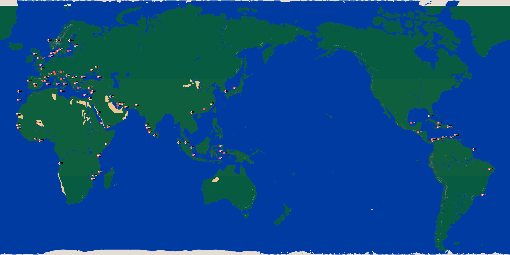

# 大航海时代II 港口对照表（100 港口）

> 数据来源：新浪游戏《大航海时代2》港口一览攻略。
> 投影：`x = ((lon+30)%360)/360*2160`, `y = (85-lat)/145*1080`（99/100 港口落在海岸线，已校准）。

## 伊比利（4 港）

| 序号 | 港口名 | 纬度 | 经度 | worldmap (x,y) | viewport (x,y) |
|---|---|---|---|---|---|
| 1 | **里斯本(P)** | N39 | W10 | (120, 342) | (71, 228) |
| 2 | **塞维尔(S)** | N37 | W6 | (144, 357) | (85, 238) |
| 4 | **巴塞隆纳** | N41 | E2 | (192, 327) | (113, 218) |
| 7 | **瓦伦西亚** | N39 | E0 | (180, 342) | (106, 228) |

## 地中海（11 港）

| 序号 | 港口名 | 纬度 | 经度 | worldmap (x,y) | viewport (x,y) |
|---|---|---|---|---|---|
| 8 | **马赛** | N43 | E5 | (210, 312) | (124, 208) |
| 9 | **热那亚(I)** | N44 | E8 | (228, 305) | (135, 203) |
| 10 | **比萨** | N43 | E9 | (234, 312) | (138, 208) |
| 11 | **那不勒斯** | N40 | E13 | (258, 335) | (152, 223) |
| 12 | **锡腊库扎** | N37 | E15 | (270, 357) | (160, 238) |
| 13 | **帕尔巴** | N39 | E2 | (192, 342) | (113, 228) |
| 14 | **威尼斯** | N44 | E13 | (258, 305) | (152, 203) |
| 15 | **拉古扎** | N42 | E17 | (282, 320) | (167, 213) |
| 16 | **干地亚** | N35 | E25 | (330, 372) | (195, 248) |
| 17 | **雅典** | N38 | E23 | (318, 350) | (188, 233) |
| 22 | **尼古西亚** | N35 | E33 | (378, 372) | (224, 248) |

## 伊斯兰（8 港）

| 序号 | 港口名 | 纬度 | 经度 | worldmap (x,y) | viewport (x,y) |
|---|---|---|---|---|---|
| 3 | **伊斯坦堡(O)** | N41 | E28 | (348, 327) | (206, 218) |
| 18 | **萨罗尼加** | N41 | E22 | (311, 327) | (184, 218) |
| 19 | **亚力山卓** | N31 | E29 | (354, 402) | (209, 268) |
| 20 | **雅法** | N32 | E34 | (384, 394) | (227, 262) |
| 21 | **贝鲁特** | N33 | E35 | (390, 387) | (231, 258) |
| 24 | **卡法** | N45 | E34 | (384, 297) | (227, 198) |
| 25 | **特纳** | N47 | E38 | (408, 283) | (241, 188) |
| 26 | **特拉比松** | N41 | E39 | (414, 327) | (245, 218) |

## 北非（4 港）

| 序号 | 港口名 | 纬度 | 经度 | worldmap (x,y) | viewport (x,y) |
|---|---|---|---|---|---|
| 5 | **阿尔及耳** | N37 | E3 | (198, 357) | (117, 238) |
| 6 | **突尼斯** | N37 | E10 | (240, 357) | (142, 238) |
| 23 | **的黎波里** | N33 | E13 | (258, 387) | (152, 258) |
| 27 | **休达** | N36 | W5 | (150, 364) | (88, 242) |

## 北欧（15 港）

| 序号 | 港口名 | 纬度 | 经度 | worldmap (x,y) | viewport (x,y) |
|---|---|---|---|---|---|
| 28 | **波尔多** | N46 | W1 | (174, 290) | (103, 193) |
| 29 | **南特** | N48 | W2 | (168, 275) | (99, 183) |
| 30 | **伦敦(E)** | N52 | E0 | (180, 245) | (106, 163) |
| 31 | **布里斯托尔** | N52 | W3 | (162, 245) | (96, 163) |
| 32 | **都柏林** | N54 | W6 | (144, 230) | (85, 153) |
| 33 | **安特卫普** | N53 | E5 | (210, 238) | (124, 158) |
| 34 | **阿母斯特丹(H)** | N55 | E6 | (216, 223) | (128, 148) |
| 35 | **哥本哈根** | N57 | E12 | (252, 208) | (149, 138) |
| 36 | **汉堡** | N55 | E9 | (234, 223) | (138, 148) |
| 37 | **奥斯陆** | N62 | E10 | (240, 171) | (142, 114) |
| 38 | **斯德哥尔摩** | N62 | E19 | (294, 171) | (174, 114) |
| 39 | **卢卑克** | N56 | E10 | (240, 216) | (142, 144) |
| 40 | **格但斯克** | N56 | E18 | (288, 216) | (170, 144) |
| 41 | **里加** | N59 | E23 | (318, 193) | (188, 128) |
| 42 | **卑尔根** | N62 | E4 | (204, 171) | (120, 114) |

## 西非（9 港）

| 序号 | 港口名 | 纬度 | 经度 | worldmap (x,y) | viewport (x,y) |
|---|---|---|---|---|---|
| 58 | **马德拉韦** | N33 | W17 | (77, 387) | (45, 258) |
| 59 | **圣克鲁斯** | N28 | W17 | (77, 424) | (45, 282) |
| 60 | **圣约鲁吉** | N5 | W2 | (168, 595) | (99, 396) |
| 61 | **毕绍** | N12 | W17 | (77, 543) | (45, 362) |
| 62 | **罗安达** | S8 | E12 | (252, 692) | (149, 461) |
| 63 | **阿尔金岛** | N20 | W18 | (72, 484) | (42, 322) |
| 64 | **巴得斯特** | N14 | W18 | (72, 528) | (42, 352) |
| 65 | **廷巴克图** | N15 | W4 | (155, 521) | (91, 347) |
| 66 | **阿必尚** | N6 | W5 | (150, 588) | (88, 392) |

## 东非（6 港）

| 序号 | 港口名 | 纬度 | 经度 | worldmap (x,y) | viewport (x,y) |
|---|---|---|---|---|---|
| 67 | **索法拉** | S17 | E35 | (390, 759) | (231, 506) |
| 68 | **马林迪** | S3 | E39 | (414, 655) | (245, 436) |
| 69 | **摩加迪休** | N3 | E45 | (450, 610) | (266, 406) |
| 70 | **蒙巴萨** | S4 | E39 | (414, 662) | (245, 441) |
| 71 | **莫三比克** | S13 | E40 | (420, 729) | (249, 486) |
| 72 | **刻里马纳** | S15 | E36 | (396, 744) | (234, 496) |

## 中东（9 港）

| 序号 | 港口名 | 纬度 | 经度 | worldmap (x,y) | viewport (x,y) |
|---|---|---|---|---|---|
| 73 | **亚丁** | N13 | E46 | (456, 536) | (270, 357) |
| 74 | **根布龙** | N26 | E56 | (516, 439) | (305, 292) |
| 75 | **马沙华** | N15 | E41 | (426, 521) | (252, 347) |
| 76 | **开罗** | N29 | E33 | (378, 417) | (224, 278) |
| 77 | **巴斯拉** | N30 | E48 | (468, 409) | (277, 272) |
| 78 | **麦加** | N21 | E39 | (414, 476) | (245, 317) |
| 79 | **卡塔尔** | N25 | E53 | (498, 446) | (295, 297) |
| 80 | **设拉福** | N26 | E53 | (498, 439) | (295, 292) |
| 81 | **马斯开特** | N24 | E58 | (528, 454) | (313, 302) |

## 印度（5 港）

| 序号 | 港口名 | 纬度 | 经度 | worldmap (x,y) | viewport (x,y) |
|---|---|---|---|---|---|
| 82 | **迪普** | N25 | E66 | (576, 446) | (341, 297) |
| 83 | **柯钦** | N10 | E75 | (630, 558) | (373, 372) |
| 84 | **锡兰** | N8 | E79 | (654, 573) | (387, 382) |
| 86 | **果阿** | N14 | E73 | (618, 528) | (366, 352) |
| 93 | **科泽科德** | N12 | E74 | (623, 543) | (369, 362) |

## 东南亚（8 港）

| 序号 | 港口名 | 纬度 | 经度 | worldmap (x,y) | viewport (x,y) |
|---|---|---|---|---|---|
| 85 | **安波那** | S1 | E125 | (930, 640) | (551, 426) |
| 87 | **麻六甲** | N4 | E101 | (786, 603) | (466, 402) |
| 88 | **德那第** | N2 | E125 | (930, 618) | (551, 412) |
| 89 | **班达** | S2 | E128 | (948, 648) | (562, 432) |
| 90 | **德利** | S5 | E125 | (930, 670) | (551, 446) |
| 91 | **帕塞** | N4 | E96 | (756, 603) | (448, 402) |
| 92 | **巽他** | S3 | E106 | (816, 655) | (483, 436) |
| 94 | **邦加** | N1 | E105 | (810, 625) | (480, 416) |

## 东亚（6 港）

| 序号 | 港口名 | 纬度 | 经度 | worldmap (x,y) | viewport (x,y) |
|---|---|---|---|---|---|
| 95 | **泉州** | N26 | E119 | (893, 439) | (529, 292) |
| 96 | **澳门** | N23 | E114 | (864, 461) | (512, 307) |
| 97 | **河内** | N21 | E105 | (810, 476) | (480, 317) |
| 98 | **长安** | N35 | E110 | (840, 372) | (498, 248) |
| 99 | **界** | N35 | E135 | (990, 372) | (587, 248) |
| 100 | **长崎** | N33 | E129 | (954, 387) | (565, 258) |

## 亚美利加（15 港）

| 序号 | 港口名 | 纬度 | 经度 | worldmap (x,y) | viewport (x,y) |
|---|---|---|---|---|---|
| 43 | **加拉卡斯** | N7 | W72 | (1908, 580) | (1131, 386) |
| 44 | **喀他基那** | N6 | W81 | (1854, 588) | (1099, 392) |
| 45 | **哈瓦那** | N19 | W87 | (1818, 491) | (1078, 327) |
| 46 | **马加里塔** | N8 | W69 | (1926, 573) | (1142, 382) |
| 47 | **巴拿马城** | N5 | W85 | (1830, 595) | (1085, 396) |
| 48 | **波鲁特内罗** | N6 | W85 | (1830, 588) | (1085, 392) |
| 49 | **圣多明尼各** | N13 | W74 | (1896, 536) | (1124, 357) |
| 50 | **委拉克路斯** | N15 | W100 | (1740, 521) | (1031, 347) |
| 51 | **牙买加** | N13 | W81 | (1854, 536) | (1099, 357) |
| 52 | **瓜地马拉** | N10 | W95 | (1770, 558) | (1049, 372) |
| 53 | **伯南布哥** | S11 | W45 | (2070, 715) | (1227, 476) |
| 54 | **里约热内卢** | S26 | W50 | (2040, 826) | (1209, 550) |
| 55 | **马拉开波** | N7 | W77 | (1878, 580) | (1113, 386) |
| 56 | **圣地亚哥** | N15 | W81 | (1854, 521) | (1099, 347) |
| 57 | **开云** | N0 | W56 | (2004, 633) | (1188, 422) |
