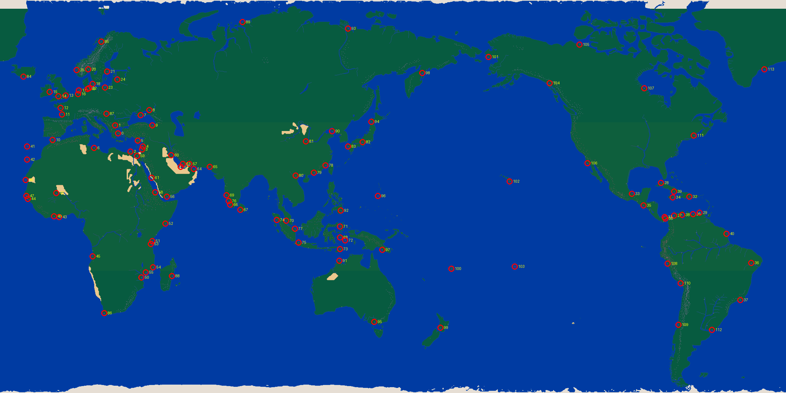

# 大航海 II 港口对照表 (114 ports)

> 从 `Data1.015` offset `0x5410` 提取的 KOEI 原始港口坐标表。
> Storage 坐标是游戏内 tile 坐标（worldmap 2160×1080）。
> 区域和城市猜测基于地理位置（无官方 port_id → name 映射）。

## 🇪🇺 Northern Europe (19 ports)

| Port ID | Storage (x, y) | Viewport (x, y) | Guessed city |
|---|---|---|---|
| **7** | (386, 316) | (228, 210) | ? |
| **11** | (170, 314) | (100, 209) | London / Plymouth area |
| **12** | (166, 296) | (98, 197) | London / Plymouth area |
| **13** | (180, 262) | (106, 174) | London / Plymouth area |
| **14** | (160, 264) | (94, 176) | London / Plymouth area |
| **15** | (136, 252) | (80, 168) | London / Plymouth area |
| **16** | (214, 258) | (126, 172) | London / Plymouth area |
| **17** | (216, 248) | (128, 165) | London / Plymouth area |
| **18** | (254, 230) | (150, 153) | ? |
| **19** | (240, 244) | (142, 162) | ? |
| **20** | (242, 190) | (143, 126) | ? |
| **21** | (294, 196) | (174, 130) | ? |
| **22** | (244, 242) | (144, 161) | ? |
| **23** | (288, 240) | (170, 160) | ? |
| **24** | (322, 218) | (190, 145) | ? |
| **25** | (210, 192) | (124, 128) | ? |
| **84** | (64, 210) | (37, 140) | ? |
| **85** | (278, 114) | (164, 76) | ? |
| **87** | (292, 312) | (173, 208) | ? |

## 🇪🇺 Western Europe / Mediterranean (11 ports)

| Port ID | Storage (x, y) | Viewport (x, y) | Guessed city |
|---|---|---|---|
| **0** | (324, 366) | (192, 244) | Northern Europe (Hamburg/Antwerp/Lubeck) |
| **1** | (316, 344) | (187, 229) | Northern Europe (Hamburg/Antwerp/Lubeck) |
| **2** | (358, 416) | (212, 277) | Istanbul / Black Sea |
| **3** | (390, 410) | (231, 273) | Istanbul / Black Sea |
| **4** | (392, 402) | (232, 268) | Istanbul / Black Sea |
| **5** | (378, 386) | (224, 257) | Istanbul / Black Sea |
| **6** | (258, 406) | (152, 270) | Italian / French Med (Genoa/Marseille/Naples) |
| **10** | (144, 384) | (85, 256) | Italian / French Med (Genoa/Marseille/Naples) |
| **41** | (74, 402) | (43, 268) | ? |
| **42** | (74, 438) | (43, 292) | Lisbon / Porto area |
| **59** | (376, 428) | (222, 285) | Alexandria / Beirut / Tripoli |

## 🇮🇩 Indonesia (3 ports)

| Port ID | Storage (x, y) | Viewport (x, y) | Guessed city |
|---|---|---|---|
| **95** | (1028, 884) | (609, 589) | ? |
| **99** | (1210, 900) | (717, 600) | ? |
| **100** | (1240, 738) | (735, 492) | ? |

## 🇮🇳 India (10 ports)

| Port ID | Storage (x, y) | Viewport (x, y) | Guessed city |
|---|---|---|---|
| **68** | (934, 652) | (553, 434) | Madras / Calcutta |
| **70** | (786, 606) | (466, 404) | Calicut / Goa / Bombay |
| **71** | (934, 622) | (553, 414) | Madras / Calcutta |
| **72** | (948, 660) | (562, 440) | Madras / Calcutta |
| **73** | (934, 684) | (553, 456) | Madras / Calcutta |
| **74** | (760, 604) | (450, 402) | Calicut / Goa / Bombay |
| **75** | (820, 666) | (486, 444) | Calicut / Goa / Bombay |
| **77** | (810, 628) | (480, 418) | Calicut / Goa / Bombay |
| **80** | (812, 482) | (481, 321) | ? |
| **92** | (936, 578) | (555, 385) | ? |

## 🇯🇵 East Asia / Japan (2 ports)

| Port ID | Storage (x, y) | Viewport (x, y) | Guessed city |
|---|---|---|---|
| **94** | (1020, 334) | (604, 222) | Korea / China NE |
| **98** | (1160, 200) | (687, 133) | ? |

## 🇷🇺 Eastern Europe / Russia (3 ports)

| Port ID | Storage (x, y) | Viewport (x, y) | Guessed city |
|---|---|---|---|
| **8** | (410, 302) | (243, 201) | ? |
| **9** | (418, 344) | (247, 229) | ? |
| **89** | (666, 60) | (394, 40) | ? |

## 🌊 Pacific (5 ports)

| Port ID | Storage (x, y) | Viewport (x, y) | Guessed city |
|---|---|---|---|
| **101** | (1342, 156) | (795, 104) | ? |
| **102** | (1400, 498) | (830, 332) | ? |
| **103** | (1414, 732) | (838, 488) | ? |
| **104** | (1510, 228) | (895, 152) | ? |
| **105** | (1592, 122) | (944, 81) | ? |

## 🌍 East Africa (12 ports)

| Port ID | Storage (x, y) | Viewport (x, y) | Guessed city |
|---|---|---|---|
| **51** | (418, 662) | (247, 441) | ? |
| **52** | (454, 614) | (269, 409) | ? |
| **53** | (414, 670) | (245, 446) | ? |
| **54** | (420, 734) | (249, 489) | ? |
| **55** | (400, 748) | (237, 498) | ? |
| **56** | (458, 540) | (271, 360) | ? |
| **58** | (426, 528) | (252, 352) | ? |
| **66** | (632, 562) | (374, 374) | Mecca / Aden / Hormuz |
| **67** | (660, 576) | (391, 384) | Mecca / Aden / Hormuz |
| **69** | (622, 536) | (368, 357) | Mecca / Aden / Hormuz |
| **76** | (628, 552) | (372, 368) | Mecca / Aden / Hormuz |
| **88** | (472, 758) | (279, 505) | ? |

## 🌍 North Africa / Middle East (7 ports)

| Port ID | Storage (x, y) | Viewport (x, y) | Guessed city |
|---|---|---|---|
| **57** | (520, 450) | (308, 300) | ? |
| **60** | (470, 426) | (278, 284) | Alexandria / Beirut / Tripoli |
| **61** | (416, 488) | (246, 325) | Alexandria / Beirut / Tripoli |
| **62** | (496, 458) | (294, 305) | ? |
| **63** | (502, 450) | (297, 300) | ? |
| **64** | (532, 464) | (315, 309) | ? |
| **65** | (576, 458) | (341, 305) | ? |

## 🌍 West Africa (9 ports)

| Port ID | Storage (x, y) | Viewport (x, y) | Guessed city |
|---|---|---|---|
| **43** | (162, 596) | (96, 397) | ? |
| **44** | (76, 546) | (45, 364) | ? |
| **45** | (254, 704) | (150, 469) | Lagos / Accra / Sao Tome |
| **46** | (70, 494) | (41, 329) | Seville / Cadiz area |
| **47** | (72, 538) | (42, 358) | ? |
| **48** | (154, 530) | (91, 353) | ? |
| **49** | (148, 594) | (87, 396) | ? |
| **50** | (388, 762) | (230, 508) | ? |
| **86** | (286, 860) | (169, 573) | ? |

## 🌎 Caribbean / Central America (2 ports)

| Port ID | Storage (x, y) | Viewport (x, y) | Guessed city |
|---|---|---|---|
| **106** | (1614, 448) | (957, 298) | ? |
| **107** | (1770, 242) | (1049, 161) | ? |

## 🌎 South America East (13 ports)

| Port ID | Storage (x, y) | Viewport (x, y) | Guessed city |
|---|---|---|---|
| **27** | (1852, 592) | (1098, 394) | ? |
| **28** | (1816, 502) | (1076, 334) | Caribbean (Havana/Santo Domingo/San Juan) |
| **30** | (1828, 600) | (1084, 400) | Caribbean (Havana/Santo Domingo/San Juan) |
| **31** | (1826, 596) | (1082, 397) | Caribbean (Havana/Santo Domingo/San Juan) |
| **32** | (1894, 540) | (1123, 360) | ? |
| **33** | (1736, 532) | (1029, 354) | Caribbean (Havana/Santo Domingo/San Juan) |
| **34** | (1848, 542) | (1095, 361) | Caribbean (Havana/Santo Domingo/San Juan) |
| **35** | (1768, 564) | (1048, 376) | Caribbean (Havana/Santo Domingo/San Juan) |
| **38** | (1874, 590) | (1111, 393) | ? |
| **39** | (1852, 526) | (1098, 350) | ? |
| **108** | (1834, 724) | (1087, 482) | Brazil east coast |
| **109** | (1864, 892) | (1105, 594) | ? |
| **110** | (1870, 778) | (1108, 518) | Brazil east coast |

## 🌎 South America West (8 ports)

| Port ID | Storage (x, y) | Viewport (x, y) | Guessed city |
|---|---|---|---|
| **26** | (1904, 588) | (1129, 392) | ? |
| **29** | (1922, 584) | (1139, 389) | ? |
| **36** | (2064, 722) | (1223, 481) | ? |
| **37** | (2034, 824) | (1206, 549) | ? |
| **40** | (1996, 642) | (1183, 428) | Brazil east coast |
| **111** | (1906, 372) | (1130, 248) | ? |
| **112** | (1956, 906) | (1159, 604) | ? |
| **113** | (2100, 190) | (1245, 126) | ? |

## 🌏 Central Asia / Persia (7 ports)

| Port ID | Storage (x, y) | Viewport (x, y) | Guessed city |
|---|---|---|---|
| **78** | (894, 454) | (530, 302) | ? |
| **79** | (862, 474) | (511, 316) | ? |
| **81** | (840, 388) | (498, 258) | ? |
| **82** | (996, 390) | (590, 260) | ? |
| **83** | (956, 402) | (566, 268) | Canton / Macao / Quanzhou |
| **90** | (912, 360) | (540, 240) | ? |
| **93** | (956, 78) | (566, 52) | ? |

## 🌏 SE Asia (2 ports)

| Port ID | Storage (x, y) | Viewport (x, y) | Guessed city |
|---|---|---|---|
| **96** | (1038, 538) | (615, 358) | Canton / Macao / Quanzhou |
| **97** | (1050, 686) | (622, 457) | Malacca / Bangkok / Java |

## 🌏 South Indian Ocean (1 ports)

| Port ID | Storage (x, y) | Viewport (x, y) | Guessed city |
|---|---|---|---|
| **91** | (932, 716) | (552, 477) | Madras / Calcutta |
