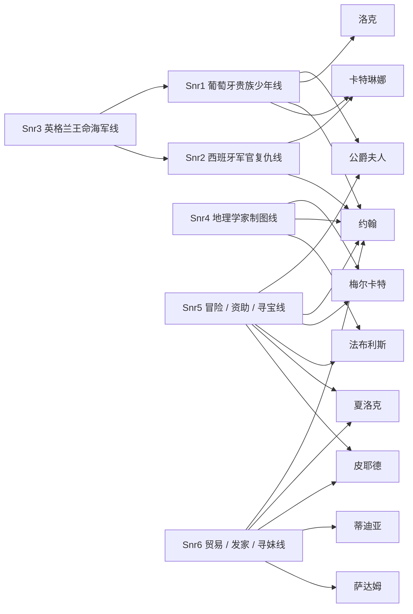
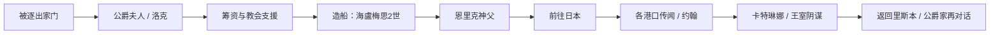
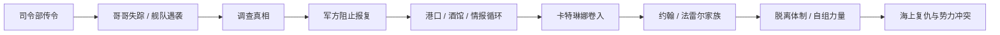
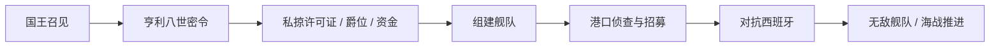
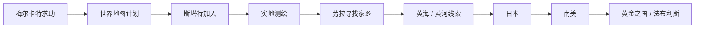
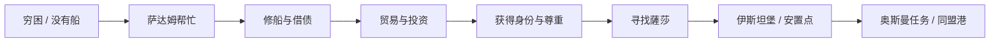

# 大航海 II 游戏逻辑说明

这是一份面向“游戏本身”的报告，不是逆向过程日志。

它回答的是：

1. 这个游戏到底讲什么。
2. 剧情是怎么分支的。
3. 每条主人公线具体走了什么流程。
4. 我们现在已经恢复出哪些东西。

---

## 1. 当前已确认的数量

这部分先把“你要我列出来的东西”直接摆出来，避免只讲抽象判断。

- 已确认的静态容器结构：**48 个 chunk、186 个 subscript、745 条 dispatch edge**
- 你说的“彩蛋命令 / 菜单命令”：**61 条**
- 角色名单：**192 个角色**
- 主人公剧情文本：**Snr1-6 合计 4000+ 条**
- 已恢复的文本规模：**约 5800 条**，其中 `.mes` 文本约 **4303 条**
- João 开场局部拓扑：**87 个 timeline item、142 个节点、208 条边**
- João 开场局部拓扑中的非顺序控制边：**67 条**
- João 开场文本覆盖：**187 / 189**，缺失的 text id 是 **97** 和 **132**

如果你之前记得我提过 “112 个节点”，那是旧口径或中间统计；现在这版能稳定落在 **142 个节点**。

### 1.1 一眼看懂的总表

| 项目 | 当前数值 | 说明 |
|---|---:|---|
| `Menu.dat` | 61 | 菜单命令 / 你说的彩蛋命令口径 |
| `Name.tbl` | 192 | 角色名表 |
| `Snr1-6.mes` | 4000+ | 六条主人公剧情文本 |
| 全部 `.mes` / 文本 | 5800+ | 当前已恢复文本总量 |
| 静态脚本结构 | 48 / 186 / 745 | chunk / subscript / dispatch edge |
| João 开场拓扑 | 87 / 142 / 208 | timeline / node / edge |
| João 控制边 | 67 | 非顺序控制边 |

### 1.2 交叉关系示意图

下面这张图不是最终全局图，只是把现在已经确认的交叉点先摆出来，方便你看“哪几条线真的互相碰上了”。



这张图表达的是：

- `约翰` 是最核心的跨线节点。
- `公爵夫人` 把 Snr1 和 Snr5 连起来。
- `卡特琳娜` 把 Snr1 和 Snr2 连起来。
- `梅尔卡特` 把 Snr4 和 Snr5 连起来。
- `夏洛克 / 皮耶德` 把 Snr5 和 Snr6 连起来。
- `蒂迪亚 / 萨达姆` 把 Snr6 的爱情、伙伴和贸易线固定住。

---

## 2. 总体结论

《大航海时代 II》不是一条直线剧情，而是一个状态驱动的分支网络。

游戏的逻辑核心可以直接概括成：

```text
主人公身份 + 地点 + 时间 + 任务状态 + 资金 + 船只 + 旗标
-> 决定下一段剧情、对话和事件
```

所以它不是“看完一段故事”，而是“不断在世界状态里推进剧情”。

---

## 3. 已恢复出的内容

目前已经从文本和结构里恢复出这些内容：

- 6 条主人公故事线
- 通用任务系统
- 港口交互系统
- 发现物图鉴
- 道具说明
- 角色名单
- 事件脚本的分支结构
- João 开场的一段局部执行拓扑

已恢复的文本规模大约是 **5800 条**。其中比较重要的内容是：

- `Message.dat`：1022 条通用 UI / 港口对话
- `Menu.dat`：61 条菜单命令
- `Snr0.mes`：192 条通用任务文本
- `Snr1-6.mes`：6 条主人公剧情文本，共 4000+ 条
- `Name.tbl`：192 个角色名
- `Colony.dat`：约 200 条发现物说明
- `Item.mes`：约 100 条道具说明

另外，脚本结构已经能稳定看出：

```text
文件 -> chunk -> 子脚本 -> 派发表 -> 字节码
```

这说明事件不是单段文本，而是按结构跳转的。

### 3.1 `Menu.dat` 的 61 条命令具体覆盖什么

这 61 条不是 61 个完全独立功能，而是 UI、港口、舰队、贸易、战斗、设置等界面项的混合。

按内容看，大致分成几层：

- 金融与贸易：`存款`、`买进`、`交易`、`市集`、`商品运输`
- 港口信息：`航海者情報`、`與航海者閒聊`、`工作的情報`、`航海見聞`
- 船务与舰队：`艦隊`、`出航`、`船長變更`、`偵察`、`委任`、`商船`、`艦船名`、`耐久度`、`造新船`、`船首像`
- 社交与职业：`工作介紹`、`請客喝酒`、`水手僱用`、`商人`、`人生運`、`合約`
- 战争与战略：`交戰`、`勢力狀況`、`最後獲勝`、`加勒比海盜`
- UI 和设置：`環境設定`、`背景音樂`、`普通顯示器`、`動畫效果`、`結束`
- 其他工具项：`禮拜`、`保管`、`晉見國王`、`探索`、`移動`、`東經`、`北`、`水`、`佩戴`

这里还有一个重要点：这些菜单项里有一部分是重复显示、不同上下文复用，不能简单理解成“61 种唯一功能”。更准确地说，它们是 61 个 UI 入口点，背后对应更少的系统功能模块。

### 3.2 `Name.tbl` 的 192 个角色到底是什么

`Name.tbl` 不是空白名字表，它支撑的是整套人物关系网。现在能稳定看见的角色层大致包括：

- 6 个主人公本人
- 王室与贵族：`公爵`、`公爵夫人`、`瑪努埃爾王`、`卡洛斯王`、`亨利王`、`蘇萊曼大帝`
- 船员与亲属：`洛克`、`麦克`、`路琪亞`、`恩里克神父`、`菲利普主教`、`卡蕾珞娃`
- 海上人物：`卡特琳娜`、`法布利斯`、`夏洛克`、`皮耶德`、`薩達姆`
- 旅行与知识节点：`梅尔卡特`、`約翰`、`蒂迪亞`、`薩莎`
- 其他国家与港口人物：西班牙、英格兰、奥斯曼、荷兰、义大利各地的军官、商人、港口长官和中介人物

所以这 192 个名字不是“随机 NPC 集合”，而是把六条主线、港口系统、王国政治和海上势力连起来的支撑层。也正因为名字层已经恢复，很多剧情节点现在不是模糊代称，而是已经能精确落到人名。

### 3.3 4000+ 条剧情文本到底在讲什么

这 4000+ 条不是散乱对白，而是六条主线加通用任务脚本的总和。现在能直接读出来的内容骨架是：

- Snr1：贵族继承人被逐出家门，靠公爵夫人、洛克、教会和酒馆筹到出海条件，造船后去找普莱斯特·约翰国，并被推向日本、卡特琳娜和王室阴谋。
- Snr2：西班牙军官追查哥哥和恋人失踪真相，卡在军方和葡萄牙冲突之间，最后走向私掠式、半脱离体制的海上复仇。
- Snr3：英国王命线，亨利八世授命，核心是组舰队、拿私掠许可、对抗西班牙无敌舰队和海上势力。
- Snr4：梅尔卡特的世界地图线，靠航海者去实地测绘，途中把劳拉的家乡线、黄海线、日本线和南美线串起来。
- Snr5：冒险家资助线，从债务和公爵夫人资助开始，最终走向金质奖章、黄金之国、圣人手杖、艾克斯王国复兴和法布利斯的确认。
- Snr6：贸易与发家线，从穷光蛋、修船、借债、投资、贸易、港口身份变化，走到寻妹、家庭重建和奥斯曼帝国港口同盟任务。

换句话说，你要看的不是“有多少条文本”，而是这些文本已经恢复出了哪些剧情模块、哪些角色、哪些任务结构。现在这部分已经能按内容读，不只是按数量读。

---

## 4. 六条主人公线

下面是按文本内容整理出来的 6 条主线。

### 4.1 Snr1：葡萄牙贵族少年线

这条线的开头非常明确：

- 主人公被管家麦克挡在家门外。
- 公爵夫人同情他，但现实上还是要他离开家。
- 公爵解释：这是为了让他真正成长。
- 公爵和洛克决定让他去航海。
- 公爵明确给出任务：去寻找“普莱斯特·约翰国”。
- 公爵还要求全城把他当平民对待，逼他离开安逸环境。
- 公爵府安排了船和教官洛克。
- 后来又安排恩里克神父同行，要把他送去日本传教。

这条线的前半段非常像“被迫成长”的贵族继承人故事。

中段出现几条重要推进：

- 公爵夫人通过酒馆老板娘卡蕾珞娃秘密资助资金。
- 公爵府、酒馆、教会之间形成资金和情报网络。
- 主人公被要求一边航海，一边完成父亲和国家的使命。
- 船造好后，船名是“海卢梅思2世”。

后面剧情开始分叉和扩大：

- 主人公不断被要求去各港口、听各种传闻。
- 会遇到女海盗卡特琳娜。
- 会遇到关于葡萄牙皇太子失踪的阴谋。
- 会回里斯本和公爵家重新对话，确认父亲、王室和马丁内斯侯爵的冲突。
- 后段还能继续接到新的航海任务、探索任务和与人物重逢相关的推进。

这条线的核心不是单纯“出海”，而是：

1. 从贵族少爷变成真正的航海者。
2. 从私事扩展到王国使命。
3. 从个人成长扩展到国际阴谋和家族政治。

交叉关系上，这条线是整个网的起点之一，和以下几条线最明显地交叉：

- `公爵夫人` / `洛克`：资助、训练、身份转换这三个节点都在 Snr1 里先定下来，后面又会反向影响 Snr5 的资金线。
- `约翰`：这是整部游戏里最典型的“远方目标”节点，Snr1 的找人、传闻、航线推进都会回到这个轴。
- `卡特琳娜`：她把 Snr1 从家族成长线拉到海盗和海上政治线，和 Snr2 的军方冲突轴形成交叉。

情节线示意图：



---

### 4.2 Snr2：西班牙军官复仇线

这条线一开始就是军事和复仇味道：

- 主人公被叫去司令部。
- 话题围绕失踪的哥哥米珈罗准将。
- 传闻说哥哥的舰队在圣多明尼各附近遭到袭击。
- 也有人说袭击者可能是葡萄牙人。
- 主人公决定调查真相，并申请讨伐。

司令部那一段很关键：

- 司令告诉他，真相不明。
- 但如果他要报复，很可能会引发西班牙和葡萄牙之间的全面战争。
- 他被要求不要乱来。
- 他开始在港口、酒馆、司令部之间反复打听消息。

这条线的转折点是：

- 主人公开始不再满足于海军体制内的调查。
- 他逐渐意识到自己无法靠正常军规复仇。
- 后面出现“从西班牙海军那弄一条船”的思路。
- 他开始采取更激烈、更越界的行动。

后续剧情里，这条线有几个明显层次：

1. 复仇目标是哥哥和恋人失踪的真相。
2. 军方不肯直接批准报复。
3. 他选择脱离原有秩序，自己组织力量。
4. 女海盗卡特琳娜、约翰、法雷尔家族等势力陆续卷入。
5. 这条线最终不是单纯报仇，而是把个人仇怨卷进了更大的海上政治和家族阴谋里。

这条线的气质是：

- 起点是军官。
- 中段是反叛。
- 终点变成海上复仇与势力冲突。

交叉关系上，Snr2 和 Snr1 的交叉最明显，因为它们共享了海上政治、葡萄牙/西班牙冲突、`卡特琳娜` 和 `约翰` 这些节点。换句话说，Snr2 不是单纯“军官复仇”，而是把 Snr1 的世界观往战争和私掠方向继续展开。

情节线示意图：



---

### 4.3 Snr3：英格兰王命海军线

这条线从一开始就带有国家任务：

- 国王召见主人公。
- 亨利八世要求他承担任务。
- 任务内容是对抗西班牙势力。
- 他被任命去指挥舰队。
- 同时授予武器、私掠许可证和爵位。
- 还给了一笔资金，并安排吉尔巴特爵士相关的人物协助。

这条线的主干很清楚：

1. 先拿到王命。
2. 再接受训练与出航准备。
3. 然后去海上累积经验。
4. 之后要对抗西班牙无敌舰队。

中间的事件很像“海军任务线”的结构化流程：

- 去公会找船员。
- 去港口观察敌情。
- 观察西班牙最新式战舰下水。
- 在港口和酒馆之间积累情报。
- 通过马休等人组织队伍。

这条线的分支重点不在“找宝”，而在“国家战争”：

- 什么时候出击。
- 什么时候观察敌情。
- 什么时候和西班牙舰队开战。
- 什么时候被包围、撤退、再战。

从文本上看，它的核心是：

1. 王命任务。
2. 舰队建设。
3. 抗西班牙战争。
4. 海军荣誉与国家命运绑定。

交叉关系上，Snr3 和别的线没有那么多人物重叠，但它提供了另一种很关键的世界层：国家战争、舰队、私掠、军令。这个层一旦和 Snr1 / Snr2 的港口与西班牙线接上，就会变成同一个世界里的不同推进方式。

情节线示意图：



---

### 4.4 Snr4：地理学家制图线

这条线非常明确地围绕“世界地图”展开：

- 地理学家梅尔卡特来找主人公帮忙。
- 他想编制真正准确的世界地图。
- 但他没有钱，也身体不好，还晕船。
- 所以由主人公替他出海调查地形和海岸。
- 船名直接叫“梅尔卡特”。
- 随后请来斯塔特作为伙伴。

这条线的剧情目标很清楚：

1. 先做北欧地形调查，特别是峡湾和复杂海岸线。
2. 再随着航行收集各地地理信息。
3. 旅途中遇到孤儿少女劳拉，她在找自己的家乡。
4. 世界地图和找家乡这两条线并行推进。

这条线里很重要的一段是劳拉的加入：

- 她是塞维尔市场上被收养的孤儿。
- 现在要找自己的亲生家乡。
- 她记不清家乡具体样子，只记得“有海，而且是黄色的海”。

于是整个路线开始转成“找线索式探索”：

- 先问黄海、黄河。
- 再追到日本。
- 再往南美大大陆方向推理。
- 最后引出埃尔·德·拉德（黄金之国）相关线索。

这条线的本质是：

1. 地图编制。
2. 旅行中的地理判断。
3. 劳拉家乡的寻找。
4. 由线索推动的全球探索。

交叉关系上，Snr4 和 Snr5 的交叉很强，因为两条线都要去追世界级传说目标，而且都把“南美 / 日本 / 世界地图 / 黄金之国”当成可联通的线索。Snr4 负责把空间轮廓画出来，Snr5 负责把传说和目标压到具体任务上。

情节线示意图：



---

### 4.5 Snr5：冒险 / 资助 / 寻宝线

这条线的前半段是“欠债”和“冒险资助”：

- 主人公身上没钱。
- 凱麥隆替他找到法雷尔公爵夫人做资助人。
- 公爵夫人愿意出资，还会替他还债。
- 作为交换，他要报告自己的冒险见闻。
- 公爵夫人还给他望远镜和六分仪。

这条线不是单纯做任务，而是明显的“冒险家经营线”：

- 先背债。
- 再拿资助。
- 再用冒险报告换钱和资源。

后面这条线迅速变成“寻宝与传说主线”：

- 先去找金质奖章。
- 再由金质奖章引出埃尔·德·拉德（黄金之国）。
- 然后又接到“圣人手杖”的任务。
- 圣人手杖对应艾克斯王国复兴。
- 任务把主人公带去阿拉伯、酒馆、占卜师、马沙华王等一串线索。

这条线的剧情推进很典型：

1. 先解决债务和资金。
2. 再靠资助人开始远航。
3. 再从传说宝物一路追到世界级秘宝。
4. 再和国家复兴、宗教传说、王国政治绑定。
5. 再从阿拉伯、马沙华、日本、南美一路延伸。

后段还有一个很重要的情节：

- 主人公在南美遇到法布利斯老人。
- 老人确认真的见过埃尔·德·拉德。
- 还牵出法雷尔家族、里斯本、公爵、洛克等关系。

这条线最后形成的是：

- 冒险家叙事。
- 传说宝物叙事。
- 国家复兴叙事。
- 家族和继承关系叙事。

交叉关系上，Snr5 是全局交叉最密的线之一：

- `公爵夫人` 把 Snr1 的贵族资助结构和 Snr5 的冒险家资助结构连在一起。
- `约翰`、`法布利斯`、`埃尔·德·拉德` 把 Snr4 的地理线和 Snr5 的寻宝线扣在一起。
- `夏洛克` / `皮耶德` / `投资` 这组商业节点，又把 Snr5 拉回 Snr6 的资金循环与身份循环。

情节线示意图：


---

### 4.6 Snr6：贸易 / 发家 / 寻妹线

这条线的内容最完整，也最像一个完整的成长系统。

一开始就是：

- 主人公一分钱没有。
- 他喜欢蒂迪亚。
- 但蒂迪亚并不看得上他这个穷光蛋。
- 同伴萨达姆帮他跑前跑后。

这条线的真正起点是“修船 + 借债 + 贸易”：

- 萨达姆找回父亲留下的船。
- 船需要修理。
- 修理费要 1000 金币。
- 他们决定把这条船用来做买卖。
- 目标是赚 1 万金币还债。

然后这条线开始转成贸易教学和资金循环：

- 去港口找人投资。
- 口头承诺“低价买高价卖”。
- 用投资和借贷滚出贸易资本。
- 银行职员、资助者、酒馆大婶都会参与。

这条线的很大一部分就是“从穷光蛋变成商人”：

1. 从修船开始。
2. 借钱筹资本。
3. 做贸易赚十倍。
4. 逐步得到别人尊重。
5. 拿到士族身份后，港口 NPC 对他的态度明显改变。

这条线的第二条主线是“找妹妹薩莎”：

- 他从小和妹妹分开。
- 一直在找她。
- 后面终于打听到消息。
- 最终在伊斯坦堡建立了安置点 / 房子 / 孤儿相关安排。
- 薩莎终于和他重逢，还带来孩子和家庭新成员。

这条线的第三条主线是奥斯曼帝国的大任务：

- 苏莱曼大帝找他。
- 要他把伊斯兰教影响扩展到世界。
- 具体手段是扩大全世界的同盟港。
- 还给了 50 个金块和免税证。
- 要他用商业能力控制港口。

所以这条线非常清晰地分成三块：

1. 生存与借债。
2. 贸易致富。
3. 家庭重建与国家任务。

交叉关系上，Snr6 把“钱、身份、港口、家人、国家任务”全部揉在一起，所以它是另一条很强的汇合线：

- 和 Snr1 的交叉在于 `约翰`、`卡特琳娜`、港口身份变化、以及从贫穷到可行动的成长过程。
- 和 Snr5 的交叉在于 `投资`、`借债`、`贸易`、`房子`、`家庭重建` 这些状态变化。
- 和 Snr2 的交叉在于海上冲突、港口情报和外部势力影响。

情节线示意图：



---

## 5. 交叉人物网

你说“拓扑没有展开”，核心问题就在这里：这些主线不是平行摆着，而是被一组共享人物和共享状态串起来的。

### 5.1 关键交叉节点

- `公爵夫人`：连接 Snr1 和 Snr5，是“资助 / 身份 / 资源”的起点。
- `洛克`：连接 Snr1 的训练线和 Snr5 的远航线，是“教官 / 领航 / 经验传递”节点。
- `约翰`：连接 Snr1、Snr4、Snr5、Snr6，是全局最像“远方目标 / 传说坐标”的节点。
- `卡特琳娜`：连接 Snr1 和 Snr2，是海盗线、私人情感线和海战线的交叉点。
- `梅尔卡特`：连接 Snr4 的制图线和 Snr5 的探索线，是“地理知识”节点。
- `法布利斯`：连接 Snr5 的寻宝线和南美线，是“世界尽头 / 传说老人”节点。
- `夏洛克`、`皮耶德`：连接 Snr5 和 Snr6 的商业线，是“钱、货、港口”节点。
- `蒂迪亚`、`萨达姆`、`薩莎`：主要落在 Snr6，但它们把爱情、伙伴、家庭重建和财富线绑在一起。

### 5.2 不是“人物重复”，而是“状态重复”

这套拓扑真正重复的，不只是人名，而是几类状态：

- `资助` 状态：公爵夫人、冒险资助、投资、借债。
- `航行资格` 状态：有船、修船、训练、拿到出海条件。
- `身份状态`：平民、士族、军官、冒险家、商人。
- `目标状态`：找人、找国、找宝、找家乡、找地图。

所以这 6 条线能互相交叉，不是因为它们讲的是同一件事，而是因为它们共享同一套世界状态机。

---

## 6. 这些剧情线的共同逻辑

虽然 6 条线内容不同，但它们共用一套逻辑：

### 6.1 先给一个目标

每条线都先告诉你要做什么：

- 找普莱斯特·约翰国
- 查哥哥的失踪
- 服从王命打西班牙
- 编世界地图
- 找传说宝物
- 赚钱、找妹妹、扩张同盟港

### 6.2 再给一个缺口

目标都不是立刻能完成的，总会卡一个缺口：

- 没钱
- 没船
- 没伙伴
- 没线索
- 没地理知识
- 没资格

### 6.3 再让玩家去港口循环

玩家必须反复在这些地方来回：

- 酒馆
- 造船厂
- 银行
- 教会
- 公会
- 王宫

### 6.4 再通过信息更新推进剧情

每次去一个地方，都会更新一个状态：

- 新船
- 新同伴
- 新任务
- 新情报
- 新资金
- 新身份

所以这个游戏的剧情不是“看剧情”，而是“状态推进”。

---

## 7. 分支到底是什么

这个游戏里的分支不是只有对话选项，而是至少有四种。

### 7.1 身份分支

同一个 NPC 会因为你身份不同而变脸。

例子：

- 还是平民时，很多人对你很不客气。
- 一旦升成士族，态度会变得尊敬。
- 在奥斯曼帝国，士族和平民的差别尤为明显。

### 7.2 资金分支

没钱和有钱，剧情会完全不同。

例子：

- 没钱时，船修不了。
- 有钱后，才能雇人、投港、买船、继续主线。
- 借债、投资、还款都会触发不同台词。

### 7.3 船只分支

有船和没船是两种世界。

例子：

- 没船时，NPC 直接叫你回去。
- 船修好了，才能正式出海。
- 船坏了，就要修理或换船。

### 7.4 地点分支

不同港口触发不同情报。

例子：

- 里斯本讲公爵家与约翰。
- 日本讲黄金之国。
- 马沙华讲圣人手杖。
- 巴斯拉、伊斯坦堡、南美等地都会触发专属线索。

### 7.5 时间分支

有些剧情是按时间或时段触发的。

例子：

- 晚上 10 点到 12 点去公爵府。
- 某些港口人物会在特定时段出现。

### 7.6 合约分支

这是很重要的一条。

例子：

- 主人公和公爵夫人签了冒险合约。
- 如果又和别人签了别的合约，NPC 会提醒甚至不信任你。
- 这说明游戏会记录任务绑定关系。

---

## 8. 现在已经看见的剧情流程形态

从文本里已经能看见几种非常明显的流程模式：

### 8.1 起始线

给主人公一个出发目标。

### 8.2 资金线

解决“没钱怎么办”。

### 8.3 船线

解决“没船怎么办”。

### 8.4 同伴线

安排教官、伙伴、翻译、商人、亲友同行。

### 8.5 传闻线

不断从酒馆、港口、商队、教会、宫廷获取线索。

### 8.6 大目标线

把单次旅行扩展成世界级任务：

- 找宝物
- 找国家
- 找家乡
- 建地图
- 控港口
- 报仇

---

## 9. 目前最清楚的一段局部图

目前最清楚的局部图是 João 开场。

它已经整理出：

- 87 个 timeline item
- 142 个节点
- 208 条边
- 其中 67 条是非顺序控制边

这说明它不是纯文本顺序表，而是带跳转和候选控制边的局部剧情图。

这张图的意义在于：

- 能把对话、场景、控制块放在一起看。
- 能看出某些操作数很像跳转目标。
- 能把“剧情流程”变成“可阅读的结构图”。

---

## 10. 现在到底已经恢复到什么程度

可以直接这样说：

- 内容层：基本已经恢复。
- 剧情主干：已经能读出来。
- 分支形态：已经能看出规律。
- 局部拓扑：已经有图。
- 全局执行规则：还没完全验明。

所以现在不是“还没搞懂游戏”，而是：

> 已经把游戏的故事和分支结构读出来了，正在把它的执行规则进一步确认。

---

## 11. 结论

这游戏的逻辑不是线性文本，而是一个由主人公、身份、资金、船只、地点、时间和旗标共同控制的分支网络。

我们现在已经恢复出来的，不只是零散对话，而是：

- 6 条主人公线的主干流程
- 通用任务的完整步骤
- 港口日常循环
- 贸易、投资、借贷、还款的循环
- 找宝、找家乡、找妹妹、找国家、找地图的流程
- 局部控制边和剧情拓扑

下一步要做的，不是再重复讲“我做了什么”，而是继续把这些分支规则逐条验成真规则。
