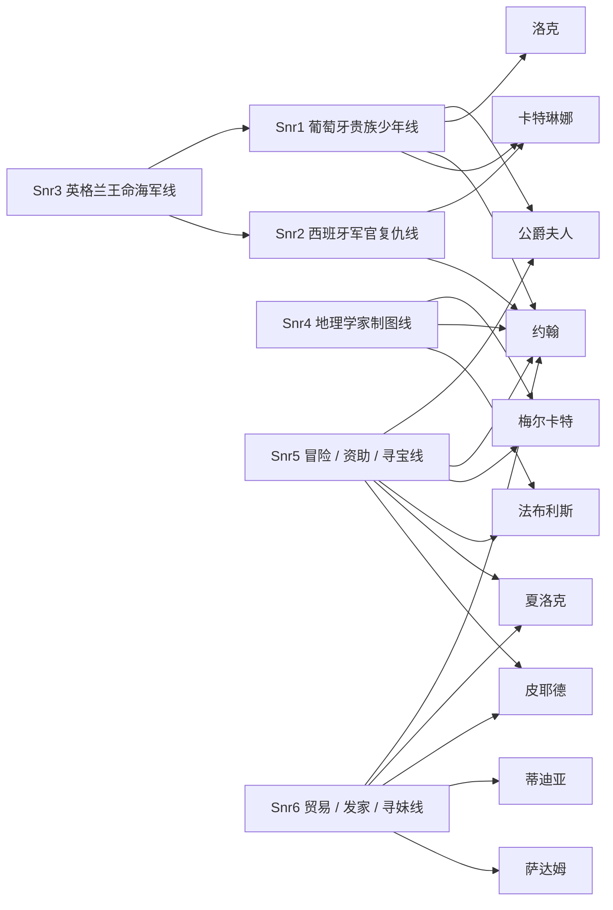
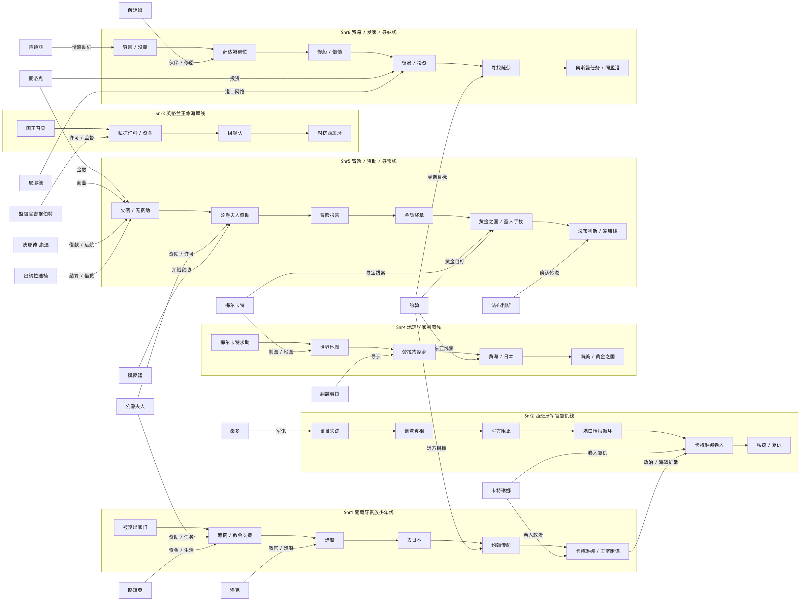
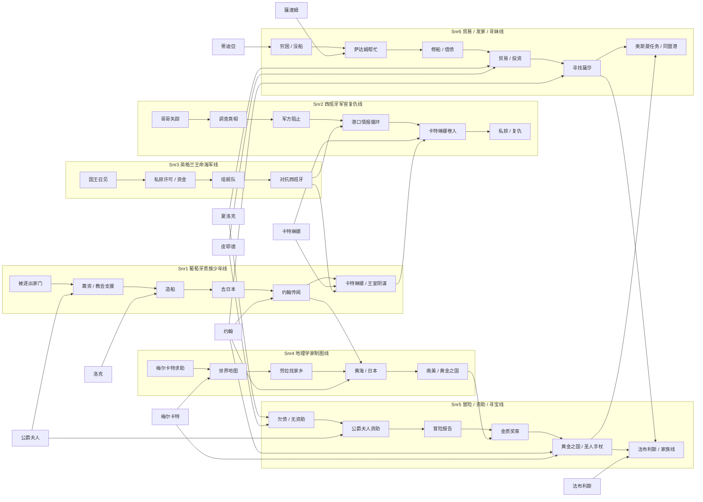

# 大航海 II 游戏逻辑说明

这是一份面向“游戏本身”的报告，不是逆向过程日志。

它回答的是：

1. 这个游戏到底讲什么。
2. 剧情是怎么分支的。
3. 每条主人公线具体走了什么流程。
4. 我们现在已经恢复出哪些东西。

---

## 1. 当前已确认的数量

这部分先把“你要我列出来的东西”直接摆出来，避免只讲抽象判断。

- 已确认的静态容器结构：**48 个 chunk、186 个 subscript、745 条 dispatch edge**
- 你说的“彩蛋命令 / 菜单命令”：**61 条**
- 角色名单：**192 个角色**
- 主人公剧情文本：**Snr1-6 合计 4000+ 条**
- 已恢复的文本规模：**约 5800 条**，其中 `.mes` 文本约 **4303 条**
- João 开场局部拓扑：**87 个 timeline item、142 个节点、208 条边**
- João 开场局部拓扑中的非顺序控制边：**67 条**
- João 开场文本覆盖：**187 / 189**，缺失的 text id 是 **97** 和 **132**

如果你之前记得我提过 “112 个节点”，那是旧口径或中间统计；现在这版能稳定落在 **142 个节点**。

### 1.1 一眼看懂的总表

| 项目 | 当前数值 | 说明 |
|---|---:|---|
| `Menu.dat` | 61 | 菜单命令 / 你说的彩蛋命令口径 |
| `Name.tbl` | 192 | 角色名表 |
| `Snr1-6.mes` | 4000+ | 六条主人公剧情文本 |
| 全部 `.mes` / 文本 | 5800+ | 当前已恢复文本总量 |
| 静态脚本结构 | 48 / 186 / 745 | chunk / subscript / dispatch edge |
| João 开场拓扑 | 87 / 142 / 208 | timeline / node / edge |
| João 控制边 | 67 | 非顺序控制边 |

### 1.2 交叉关系示意图

下面这张图不是最终全局图，只是把现在已经确认的交叉点先摆出来，方便你看“哪几条线真的互相碰上了”。



这张图表达的是：

- `约翰` 是最核心的跨线节点。
- `公爵夫人` 把 Snr1 和 Snr5 连起来。
- `卡特琳娜` 把 Snr1 和 Snr2 连起来。
- `梅尔卡特` 把 Snr4 和 Snr5 连起来。
- `夏洛克 / 皮耶德` 把 Snr5 和 Snr6 连起来。
- `蒂迪亚 / 萨达姆` 把 Snr6 的爱情、伙伴和贸易线固定住。

---

## 2. 总体结论

《大航海时代 II》不是一条直线剧情，而是一个状态驱动的分支网络。

游戏的逻辑核心可以直接概括成：

```text
主人公身份 + 地点 + 时间 + 任务状态 + 资金 + 船只 + 旗标
-> 决定下一段剧情、对话和事件
```

所以它不是“看完一段故事”，而是“不断在世界状态里推进剧情”。

---

## 3. 已恢复出的内容

目前已经从文本和结构里恢复出这些内容：

- 6 条主人公故事线
- 通用任务系统
- 港口交互系统
- 发现物图鉴
- 道具说明
- 角色名单
- 事件脚本的分支结构
- João 开场的一段局部执行拓扑

已恢复的文本规模大约是 **5800 条**。其中比较重要的内容是：

- `Message.dat`：1022 条通用 UI / 港口对话
- `Menu.dat`：61 条菜单命令
- `Snr0.mes`：192 条通用任务文本
- `Snr1-6.mes`：6 条主人公剧情文本，共 4000+ 条
- `Name.tbl`：192 个角色名
- `Colony.dat`：约 200 条发现物说明
- `Item.mes`：约 100 条道具说明

另外，脚本结构已经能稳定看出：

```text
文件 -> chunk -> 子脚本 -> 派发表 -> 字节码
```

这说明事件不是单段文本，而是按结构跳转的。

### 3.1 `Menu.dat` 的 61 条命令具体覆盖什么

这 61 条不是 61 个完全独立功能，而是 UI、港口、舰队、贸易、战斗、设置等界面项的混合。

按内容看，大致分成几层：

- 金融与贸易：`存款`、`买进`、`交易`、`市集`、`商品运输`
- 港口信息：`航海者情報`、`與航海者閒聊`、`工作的情報`、`航海見聞`
- 船务与舰队：`艦隊`、`出航`、`船長變更`、`偵察`、`委任`、`商船`、`艦船名`、`耐久度`、`造新船`、`船首像`
- 社交与职业：`工作介紹`、`請客喝酒`、`水手僱用`、`商人`、`人生運`、`合約`
- 战争与战略：`交戰`、`勢力狀況`、`最後獲勝`、`加勒比海盜`
- UI 和设置：`環境設定`、`背景音樂`、`普通顯示器`、`動畫效果`、`結束`
- 其他工具项：`禮拜`、`保管`、`晉見國王`、`探索`、`移動`、`東經`、`北`、`水`、`佩戴`

这里还有一个重要点：这些菜单项里有一部分是重复显示、不同上下文复用，不能简单理解成“61 种唯一功能”。更准确地说，它们是 61 个 UI 入口点，背后对应更少的系统功能模块。

### 3.2 `Name.tbl` 的 192 个角色到底是什么

`Name.tbl` 不是空白名字表，它支撑的是整套人物关系网。现在能稳定看见的角色层大致包括：

- 6 个主人公本人
- 王室与贵族：`公爵`、`公爵夫人`、`瑪努埃爾王`、`卡洛斯王`、`亨利王`、`蘇萊曼大帝`
- 船员与亲属：`洛克`、`麦克`、`路琪亞`、`恩里克神父`、`菲利普主教`、`卡蕾珞娃`
- 海上人物：`卡特琳娜`、`法布利斯`、`夏洛克`、`皮耶德`、`薩達姆`
- 旅行与知识节点：`梅尔卡特`、`約翰`、`蒂迪亞`、`薩莎`
- 其他国家与港口人物：西班牙、英格兰、奥斯曼、荷兰、义大利各地的军官、商人、港口长官和中介人物

所以这 192 个名字不是“随机 NPC 集合”，而是把六条主线、港口系统、王国政治和海上势力连起来的支撑层。也正因为名字层已经恢复，很多剧情节点现在不是模糊代称，而是已经能精确落到人名。

### 3.3 4000+ 条剧情文本到底在讲什么

这 4000+ 条不是散乱对白，而是六条主线加通用任务脚本的总和。现在能直接读出来的内容骨架是：

- Snr1：贵族继承人被逐出家门，靠公爵夫人、洛克、教会和酒馆筹到出海条件，造船后去找普莱斯特·约翰国，并被推向日本、卡特琳娜和王室阴谋。
- Snr2：西班牙军官追查哥哥和恋人失踪真相，卡在军方和葡萄牙冲突之间，最后走向私掠式、半脱离体制的海上复仇。
- Snr3：英国王命线，亨利八世授命，核心是组舰队、拿私掠许可、对抗西班牙无敌舰队和海上势力。
- Snr4：梅尔卡特的世界地图线，靠航海者去实地测绘，途中把劳拉的家乡线、黄海线、日本线和南美线串起来。
- Snr5：冒险家资助线，从债务和公爵夫人资助开始，最终走向金质奖章、黄金之国、圣人手杖、艾克斯王国复兴和法布利斯的确认。
- Snr6：贸易与发家线，从穷光蛋、修船、借债、投资、贸易、港口身份变化，走到寻妹、家庭重建和奥斯曼帝国港口同盟任务。

换句话说，你要看的不是“有多少条文本”，而是这些文本已经恢复出了哪些剧情模块、哪些角色、哪些任务结构。现在这部分已经能按内容读，不只是按数量读。

---

## 4. 六条主人公线

下面是按文本内容整理出来的 6 条主线。

### 4.0 六条线总图

这张图把六条主人公线放在一张图里，重点不是每条线内部的细节，而是它们之间怎么互相借人、借目标、借状态。





这张总图要表达的是：

- `公爵夫人` 把 Snr1 的出海起点和 Snr5 的资助起点连起来。
- `约翰` 是六条线里最强的跨线目标。
- `卡特琳娜` 把 Snr1 的家族线和 Snr2 的复仇线接起来。
- `梅尔卡特` 把 Snr4 的地图线和 Snr5 的寻宝线接起来。
- `夏洛克 / 皮耶德` 把 Snr5 的财富循环和 Snr6 的贸易循环接起来。
- `萨达姆`、`蒂迪亞`、`薩莎` 把 Snr6 的生存、情感、家庭线固定住。
- `Snr3` 的国家战争线会反向影响 Snr1、Snr2 的海上冲突环境。

### 4.1 Snr1：葡萄牙贵族少年线

这条线的开头非常明确：

- 主人公被管家麦克挡在家门外。
- 公爵夫人同情他，但现实上还是要他离开家。
- 公爵解释：这是为了让他真正成长。
- 公爵和洛克决定让他去航海。
- 公爵明确给出任务：去寻找“普莱斯特·约翰国”。
- 公爵还要求全城把他当平民对待，逼他离开安逸环境。
- 公爵府安排了船和教官洛克。
- 后来又安排恩里克神父同行，要把他送去日本传教。

这条线的前半段非常像“被迫成长”的贵族继承人故事。

中段出现几条重要推进：

- 公爵夫人通过酒馆老板娘卡蕾珞娃秘密资助资金。
- 公爵府、酒馆、教会之间形成资金和情报网络。
- 主人公被要求一边航海，一边完成父亲和国家的使命。
- 船造好后，船名是“海卢梅思2世”。

后面剧情开始分叉和扩大：

- 主人公不断被要求去各港口、听各种传闻。
- 会遇到女海盗卡特琳娜。
- 会遇到关于葡萄牙皇太子失踪的阴谋。
- 会回里斯本和公爵家重新对话，确认父亲、王室和马丁内斯侯爵的冲突。
- 后段还能继续接到新的航海任务、探索任务和与人物重逢相关的推进。

这条线的核心不是单纯“出海”，而是：

1. 从贵族少爷变成真正的航海者。
2. 从私事扩展到王国使命。
3. 从个人成长扩展到国际阴谋和家族政治。

交叉关系上，这条线是整个网的起点之一，和以下几条线最明显地交叉：

- `公爵夫人` / `洛克`：资助、训练、身份转换这三个节点都在 Snr1 里先定下来，后面又会反向影响 Snr5 的资金线。
- `约翰`：这是整部游戏里最典型的“远方目标”节点，Snr1 的找人、传闻、航线推进都会回到这个轴。
- `卡特琳娜`：她把 Snr1 从家族成长线拉到海盗和海上政治线，和 Snr2 的军方冲突轴形成交叉。

情节线示意图：


---

### 4.2 Snr2：西班牙军官复仇线

这条线一开始就是军事和复仇味道：

- 主人公被叫去司令部。
- 话题围绕失踪的哥哥米珈罗准将。
- 传闻说哥哥的舰队在圣多明尼各附近遭到袭击。
- 也有人说袭击者可能是葡萄牙人。
- 主人公决定调查真相，并申请讨伐。

司令部那一段很关键：

- 司令告诉他，真相不明。
- 但如果他要报复，很可能会引发西班牙和葡萄牙之间的全面战争。
- 他被要求不要乱来。
- 他开始在港口、酒馆、司令部之间反复打听消息。

这条线的转折点是：

- 主人公开始不再满足于海军体制内的调查。
- 他逐渐意识到自己无法靠正常军规复仇。
- 后面出现“从西班牙海军那弄一条船”的思路。
- 他开始采取更激烈、更越界的行动。

后续剧情里，这条线有几个明显层次：

1. 复仇目标是哥哥和恋人失踪的真相。
2. 军方不肯直接批准报复。
3. 他选择脱离原有秩序，自己组织力量。
4. 女海盗卡特琳娜、约翰、法雷尔家族等势力陆续卷入。
5. 这条线最终不是单纯报仇，而是把个人仇怨卷进了更大的海上政治和家族阴谋里。

这条线的气质是：

- 起点是军官。
- 中段是反叛。
- 终点变成海上复仇与势力冲突。

交叉关系上，Snr2 和 Snr1 的交叉最明显，因为它们共享了海上政治、葡萄牙/西班牙冲突、`卡特琳娜` 和 `约翰` 这些节点。换句话说，Snr2 不是单纯“军官复仇”，而是把 Snr1 的世界观往战争和私掠方向继续展开。

情节线示意图：


---

### 4.3 Snr3：英格兰王命海军线

这条线从一开始就带有国家任务：

- 国王召见主人公。
- 亨利八世要求他承担任务。
- 任务内容是对抗西班牙势力。
- 他被任命去指挥舰队。
- 同时授予武器、私掠许可证和爵位。
- 还给了一笔资金，并安排吉尔巴特爵士相关的人物协助。

这条线的主干很清楚：

1. 先拿到王命。
2. 再接受训练与出航准备。
3. 然后去海上累积经验。
4. 之后要对抗西班牙无敌舰队。

中间的事件很像“海军任务线”的结构化流程：

- 去公会找船员。
- 去港口观察敌情。
- 观察西班牙最新式战舰下水。
- 在港口和酒馆之间积累情报。
- 通过马休等人组织队伍。

这条线的分支重点不在“找宝”，而在“国家战争”：

- 什么时候出击。
- 什么时候观察敌情。
- 什么时候和西班牙舰队开战。
- 什么时候被包围、撤退、再战。

从文本上看，它的核心是：

1. 王命任务。
2. 舰队建设。
3. 抗西班牙战争。
4. 海军荣誉与国家命运绑定。

交叉关系上，Snr3 和别的线没有那么多人物重叠，但它提供了另一种很关键的世界层：国家战争、舰队、私掠、军令。这个层一旦和 Snr1 / Snr2 的港口与西班牙线接上，就会变成同一个世界里的不同推进方式。

情节线示意图：


---

### 4.4 Snr4：地理学家制图线

这条线非常明确地围绕“世界地图”展开：

- 地理学家梅尔卡特来找主人公帮忙。
- 他想编制真正准确的世界地图。
- 但他没有钱，也身体不好，还晕船。
- 所以由主人公替他出海调查地形和海岸。
- 船名直接叫“梅尔卡特”。
- 随后请来斯塔特作为伙伴。

这条线的剧情目标很清楚：

1. 先做北欧地形调查，特别是峡湾和复杂海岸线。
2. 再随着航行收集各地地理信息。
3. 旅途中遇到孤儿少女劳拉，她在找自己的家乡。
4. 世界地图和找家乡这两条线并行推进。

这条线里很重要的一段是劳拉的加入：

- 她是塞维尔市场上被收养的孤儿。
- 现在要找自己的亲生家乡。
- 她记不清家乡具体样子，只记得“有海，而且是黄色的海”。

于是整个路线开始转成“找线索式探索”：

- 先问黄海、黄河。
- 再追到日本。
- 再往南美大大陆方向推理。
- 最后引出埃尔·德·拉德（黄金之国）相关线索。

这条线的本质是：

1. 地图编制。
2. 旅行中的地理判断。
3. 劳拉家乡的寻找。
4. 由线索推动的全球探索。

交叉关系上，Snr4 和 Snr5 的交叉很强，因为两条线都要去追世界级传说目标，而且都把“南美 / 日本 / 世界地图 / 黄金之国”当成可联通的线索。Snr4 负责把空间轮廓画出来，Snr5 负责把传说和目标压到具体任务上。

情节线示意图：


---

### 4.5 Snr5：冒险 / 资助 / 寻宝线

这条线的前半段是“欠债”和“冒险资助”：

- 主人公身上没钱。
- 凱麥隆替他找到法雷尔公爵夫人做资助人。
- 公爵夫人愿意出资，还会替他还债。
- 作为交换，他要报告自己的冒险见闻。
- 公爵夫人还给他望远镜和六分仪。

这条线不是单纯做任务，而是明显的“冒险家经营线”：

- 先背债。
- 再拿资助。
- 再用冒险报告换钱和资源。

后面这条线迅速变成“寻宝与传说主线”：

- 先去找金质奖章。
- 再由金质奖章引出埃尔·德·拉德（黄金之国）。
- 然后又接到“圣人手杖”的任务。
- 圣人手杖对应艾克斯王国复兴。
- 任务把主人公带去阿拉伯、酒馆、占卜师、马沙华王等一串线索。

这条线的剧情推进很典型：

1. 先解决债务和资金。
2. 再靠资助人开始远航。
3. 再从传说宝物一路追到世界级秘宝。
4. 再和国家复兴、宗教传说、王国政治绑定。
5. 再从阿拉伯、马沙华、日本、南美一路延伸。

后段还有一个很重要的情节：

- 主人公在南美遇到法布利斯老人。
- 老人确认真的见过埃尔·德·拉德。
- 还牵出法雷尔家族、里斯本、公爵、洛克等关系。

这条线最后形成的是：

- 冒险家叙事。
- 传说宝物叙事。
- 国家复兴叙事。
- 家族和继承关系叙事。

交叉关系上，Snr5 是全局交叉最密的线之一：

- `公爵夫人` 把 Snr1 的贵族资助结构和 Snr5 的冒险家资助结构连在一起。
- `约翰`、`法布利斯`、`埃尔·德·拉德` 把 Snr4 的地理线和 Snr5 的寻宝线扣在一起。
- `夏洛克` / `皮耶德` / `投资` 这组商业节点，又把 Snr5 拉回 Snr6 的资金循环与身份循环。

情节线示意图：


---

### 4.6 Snr6：贸易 / 发家 / 寻妹线

这条线的内容最完整，也最像一个完整的成长系统。

一开始就是：

- 主人公一分钱没有。
- 他喜欢蒂迪亚。
- 但蒂迪亚并不看得上他这个穷光蛋。
- 同伴萨达姆帮他跑前跑后。

这条线的真正起点是“修船 + 借债 + 贸易”：

- 萨达姆找回父亲留下的船。
- 船需要修理。
- 修理费要 1000 金币。
- 他们决定把这条船用来做买卖。
- 目标是赚 1 万金币还债。

然后这条线开始转成贸易教学和资金循环：

- 去港口找人投资。
- 口头承诺“低价买高价卖”。
- 用投资和借贷滚出贸易资本。
- 银行职员、资助者、酒馆大婶都会参与。

这条线的很大一部分就是“从穷光蛋变成商人”：

1. 从修船开始。
2. 借钱筹资本。
3. 做贸易赚十倍。
4. 逐步得到别人尊重。
5. 拿到士族身份后，港口 NPC 对他的态度明显改变。

这条线的第二条主线是“找妹妹薩莎”：

- 他从小和妹妹分开。
- 一直在找她。
- 后面终于打听到消息。
- 最终在伊斯坦堡建立了安置点 / 房子 / 孤儿相关安排。
- 薩莎终于和他重逢，还带来孩子和家庭新成员。

这条线的第三条主线是奥斯曼帝国的大任务：

- 苏莱曼大帝找他。
- 要他把伊斯兰教影响扩展到世界。
- 具体手段是扩大全世界的同盟港。
- 还给了 50 个金块和免税证。
- 要他用商业能力控制港口。

所以这条线非常清晰地分成三块：

1. 生存与借债。
2. 贸易致富。
3. 家庭重建与国家任务。

交叉关系上，Snr6 把“钱、身份、港口、家人、国家任务”全部揉在一起，所以它是另一条很强的汇合线：

- 和 Snr1 的交叉在于 `约翰`、`卡特琳娜`、港口身份变化、以及从贫穷到可行动的成长过程。
- 和 Snr5 的交叉在于 `投资`、`借债`、`贸易`、`房子`、`家庭重建` 这些状态变化。
- 和 Snr2 的交叉在于海上冲突、港口情报和外部势力影响。

情节线示意图：


---

## 5. 交叉人物网

你说“拓扑没有展开”，核心问题就在这里：这些主线不是平行摆着，而是被一组共享人物和共享状态串起来的。

### 5.1 关键交叉节点

- `公爵夫人`：连接 Snr1 和 Snr5，是“资助 / 身份 / 资源”的起点。
- `洛克`：连接 Snr1 的训练线和 Snr5 的远航线，是“教官 / 领航 / 经验传递”节点。
- `约翰`：连接 Snr1、Snr4、Snr5、Snr6，是全局最像“远方目标 / 传说坐标”的节点。
- `卡特琳娜`：连接 Snr1 和 Snr2，是海盗线、私人情感线和海战线的交叉点。
- `梅尔卡特`：连接 Snr4 的制图线和 Snr5 的探索线，是“地理知识”节点。
- `法布利斯`：连接 Snr5 的寻宝线和南美线，是“世界尽头 / 传说老人”节点。
- `夏洛克`、`皮耶德`：连接 Snr5 和 Snr6 的商业线，是“钱、货、港口”节点。
- `蒂迪亚`、`萨达姆`、`薩莎`：主要落在 Snr6，但它们把爱情、伙伴、家庭重建和财富线绑在一起。

### 5.2 不是“人物重复”，而是“状态重复”

这套拓扑真正重复的，不只是人名，而是几类状态：

- `资助` 状态：公爵夫人、冒险资助、投资、借债。
- `航行资格` 状态：有船、修船、训练、拿到出海条件。
- `身份状态`：平民、士族、军官、冒险家、商人。
- `目标状态`：找人、找国、找宝、找家乡、找地图。

所以这 6 条线能互相交叉，不是因为它们讲的是同一件事，而是因为它们共享同一套世界状态机。

---

## 6. 这些剧情线的共同逻辑

虽然 6 条线内容不同，但它们共用一套逻辑：

### 6.1 先给一个目标

每条线都先告诉你要做什么：

- 找普莱斯特·约翰国
- 查哥哥的失踪
- 服从王命打西班牙
- 编世界地图
- 找传说宝物
- 赚钱、找妹妹、扩张同盟港

### 6.2 再给一个缺口

目标都不是立刻能完成的，总会卡一个缺口：

- 没钱
- 没船
- 没伙伴
- 没线索
- 没地理知识
- 没资格

### 6.3 再让玩家去港口循环

玩家必须反复在这些地方来回：

- 酒馆
- 造船厂
- 银行
- 教会
- 公会
- 王宫

### 6.4 再通过信息更新推进剧情

每次去一个地方，都会更新一个状态：

- 新船
- 新同伴
- 新任务
- 新情报
- 新资金
- 新身份

所以这个游戏的剧情不是“看剧情”，而是“状态推进”。

---

## 7. 分支到底是什么

这个游戏里的分支不是只有对话选项，而是至少有四种。

### 7.1 身份分支

同一个 NPC 会因为你身份不同而变脸。

例子：

- 还是平民时，很多人对你很不客气。
- 一旦升成士族，态度会变得尊敬。
- 在奥斯曼帝国，士族和平民的差别尤为明显。

### 7.2 资金分支

没钱和有钱，剧情会完全不同。

例子：

- 没钱时，船修不了。
- 有钱后，才能雇人、投港、买船、继续主线。
- 借债、投资、还款都会触发不同台词。

### 7.3 船只分支

有船和没船是两种世界。

例子：

- 没船时，NPC 直接叫你回去。
- 船修好了，才能正式出海。
- 船坏了，就要修理或换船。

### 7.4 地点分支

不同港口触发不同情报。

例子：

- 里斯本讲公爵家与约翰。
- 日本讲黄金之国。
- 马沙华讲圣人手杖。
- 巴斯拉、伊斯坦堡、南美等地都会触发专属线索。

### 7.5 时间分支

有些剧情是按时间或时段触发的。

例子：

- 晚上 10 点到 12 点去公爵府。
- 某些港口人物会在特定时段出现。

### 7.6 合约分支

这是很重要的一条。

例子：

- 主人公和公爵夫人签了冒险合约。
- 如果又和别人签了别的合约，NPC 会提醒甚至不信任你。
- 这说明游戏会记录任务绑定关系。

---

## 8. 现在已经看见的剧情流程形态

从文本里已经能看见几种非常明显的流程模式：

### 8.1 起始线

给主人公一个出发目标。

### 8.2 资金线

解决“没钱怎么办”。

### 8.3 船线

解决“没船怎么办”。

### 8.4 同伴线

安排教官、伙伴、翻译、商人、亲友同行。

### 8.5 传闻线

不断从酒馆、港口、商队、教会、宫廷获取线索。

### 8.6 大目标线

把单次旅行扩展成世界级任务：

- 找宝物
- 找国家
- 找家乡
- 建地图
- 控港口
- 报仇

---

## 9. 目前最清楚的一段局部图

目前最清楚的局部图是 João 开场。

它已经整理出：

- 87 个 timeline item
- 142 个节点
- 208 条边
- 其中 67 条是非顺序控制边

这说明它不是纯文本顺序表，而是带跳转和候选控制边的局部剧情图。

这张图的意义在于：

- 能把对话、场景、控制块放在一起看。
- 能看出某些操作数很像跳转目标。
- 能把“剧情流程”变成“可阅读的结构图”。

---

## 10. 现在到底已经恢复到什么程度

可以直接这样说：

- 内容层：基本已经恢复。
- 剧情主干：已经能读出来。
- 分支形态：已经能看出规律。
- 局部拓扑：已经有图。
- 全局执行规则：还没完全验明。

所以现在不是“还没搞懂游戏”，而是：

> 已经把游戏的故事和分支结构读出来了，正在把它的执行规则进一步确认。

---

## 11. 结论

这游戏的逻辑不是线性文本，而是一个由主人公、身份、资金、船只、地点、时间和旗标共同控制的分支网络。

我们现在已经恢复出来的，不只是零散对话，而是：

- 6 条主人公线的主干流程
- 通用任务的完整步骤
- 港口日常循环
- 贸易、投资、借贷、还款的循环
- 找宝、找家乡、找妹妹、找国家、找地图的流程
- 局部控制边和剧情拓扑

下一步要做的，不是再重复讲“我做了什么”，而是继续把这些分支规则逐条验成真规则。

## 12. 事件索引

这一节不是原文，而是把六条线拆成可检索的事件节点。目的只有一个：让你一眼看出每条线的事件链，以及它们是怎么互相接上的。

### 12.1 Snr1 事件索引

| 顺序 | 事件节点 | 关键人物 | 作用 |
|---|---|---|---|
| 1 | 被逐出家门 | 麥克 / 公爵 / 公爵夫人 | 线的起点，把主人公从贵族身份推向外部世界。 |
| 2 | 公爵府筹资 | 公爵夫人 / 洛克 / 路琪亞 | 解决出海资金与出发条件。 |
| 3 | 造船完成 | 洛克 / 造船厂 | 把“出海”变成可执行状态。 |
| 4 | 恩里克神父同行 | 菲利普主教 / 恩里克神父 | 把航海目标从私事扩展到传教与日本。 |
| 5 | 约翰传闻 | 酒馆 / 港口 NPC / 约翰 | 推动地理探索和远方目标。 |
| 6 | 卡特琳娜卷入 | 卡特琳娜 | 把家族线拉进海盗和海上政治。 |
| 7 | 返回里斯本再对话 | 公爵 / 王室 / 马丁内斯侯爵 | 把个人成长接回王国和家族阴谋。 |

### 12.2 Snr2 事件索引

| 顺序 | 事件节点 | 关键人物 | 作用 |
|---|---|---|---|
| 1 | 哥哥失踪 | 哥哥 / 司令部 | 把复仇线立起来。 |
| 2 | 调查真相 | 司令 / 港口 NPC | 让玩家反复在军方与港口之间打听消息。 |
| 3 | 军方阻止 | 军官体系 | 把“报复”压成“体制冲突”。 |
| 4 | 卡特琳娜卷入 | 卡特琳娜 | 让私人情感和海盗势力进入主线。 |
| 5 | 约翰 / 法雷尔家族 | 约翰 / 法雷尔家族 | 把个人复仇转成更大的关系网。 |
| 6 | 私掠 / 复仇 | 船队 / 海战 | 从军官线转向越界行动。 |

### 12.3 Snr3 事件索引

| 顺序 | 事件节点 | 关键人物 | 作用 |
|---|---|---|---|
| 1 | 国王召见 | 亨利八世 | 线的起点，国家命令直接下达。 |
| 2 | 私掠许可 / 资金 | 王室 / 监督官 | 给出资源和合法性。 |
| 3 | 组建舰队 | 船员 / 港口 | 把王命变成军力。 |
| 4 | 对抗西班牙 | 西班牙舰队 | 把国家冲突具体化。 |
| 5 | 无敌舰队推进 | 海战 | 让线进入战争主阶段。 |

### 12.4 Snr4 事件索引

| 顺序 | 事件节点 | 关键人物 | 作用 |
|---|---|---|---|
| 1 | 梅尔卡特求助 | 梅尔卡特 | 线的起点，是制图任务。 |
| 2 | 世界地图计划 | 世界地图 | 把探索变成知识工程。 |
| 3 | 劳拉找家乡 | 劳拉 | 把抽象地图线和个人故事绑在一起。 |
| 4 | 黄海 / 日本 | 黄海 / 日本 | 把线索推动到东亚。 |
| 5 | 南美 / 黄金之国 | 南美 / 黄金之国 | 把线推到世界级目标。 |

### 12.5 Snr5 事件索引

| 顺序 | 事件节点 | 关键人物 | 作用 |
|---|---|---|---|
| 1 | 欠债 / 无资助 | 主人公 | 线的起点，先把生存问题摆出来。 |
| 2 | 公爵夫人资助 | 公爵夫人 | 让冒险线获得行动资本。 |
| 3 | 冒险报告 | 公爵夫人 / 航海经历 | 用见闻换资源。 |
| 4 | 金质奖章 | 金质奖章 | 把线转向寻宝。 |
| 5 | 黄金之国 / 圣人手杖 | 埃爾·德·拉德 / 圣人手杖 | 把传说宝物变成主任务。 |
| 6 | 法布利斯 / 家族线 | 法布利斯 | 把寻宝和家族叙事接回里斯本。 |

### 12.6 Snr6 事件索引

| 顺序 | 事件节点 | 关键人物 | 作用 |
|---|---|---|---|
| 1 | 穷困 / 没船 | 主人公 | 线的起点，是最完整的成长线。 |
| 2 | 萨达姆帮忙 | 薩達姆 | 伙伴出场，推进修船与行动。 |
| 3 | 修船 / 借债 | 父船 / 银行 | 让贸易系统启动。 |
| 4 | 贸易 / 投资 | 夏洛克 / 皮耶德 | 进入资金循环与港口经营。 |
| 5 | 寻找薩莎 | 薩莎 | 把商业线转成家庭线。 |
| 6 | 奥斯曼任务 / 同盟港 | 蘇萊曼大帝 | 把个人发家线接到帝国任务。 |

### 12.7 交叉事件矩阵

下面这张表不是人名清单，而是“哪个共享节点把哪些线绑在一起”。

| 共享节点 | 连接的线 | 影响方式 |
|---|---|---|
| 公爵夫人 | Snr1 / Snr5 | 资助、身份、出海条件。 |
| 洛克 | Snr1 / Snr5 | 训练、航行经验、出发能力。 |
| 约翰 | Snr1 / Snr4 / Snr5 / Snr6 | 远方目标、传闻坐标、世界探索主轴。 |
| 卡特琳娜 | Snr1 / Snr2 | 海盗线、私人情感线、海上冲突线。 |
| 梅尔卡特 | Snr4 / Snr5 | 地图知识和寻宝目标互相推进。 |
| 法布利斯 | Snr5 / Snr4 | 黄金之国的实地确认者。 |
| 夏洛克 | Snr5 / Snr6 | 资金、银行、投资、借贷循环。 |
| 皮耶德 | Snr5 / Snr6 | 商业与港口网络。 |
| 蒂迪亞 | Snr6 | 爱情线和身份线的起点。 |
| 薩達姆 | Snr6 | 伙伴线、修船线、生存线。 |
| 薩莎 | Snr6 | 家庭重建、重逢线。 |

### 12.8 这一层的意义

到这里，剧情已经不是“六条线各讲各的”了，而是：

- 每条线都有自己的事件链。
- 这些事件链会被共享人物和共享目标反复拉到一起。
- 你要的“拓扑”，其实就是这些事件链的交叉结构。

### 12.9 关键节点拓扑表

这一张表更接近你要的“拓扑”。它写的是：某个节点在什么前提下出现，在哪个地点，解决了什么问题，下一跳往哪走。

| 线 | 节点 | 前提 / 触发 | 地点 | 结果 | 下一跳 |
|---|---|---|---|---|---|
| Snr1 | 被逐出家门 | 公爵下令不许回家 | 里斯本 / 公爵府 | 从贵族身份掉到外部世界 | 公爵府筹资 |
| Snr1 | 公爵府筹资 | 与公爵夫人、洛克、路琪亞对话 | 公爵府 / 酒馆 / 教会 | 得到 1000 金和银髮飾、教会资助 | 造船完成 |
| Snr1 | 造船完成 | 造船厂造好船 | 造船厂 | 得到“海盧梅思2世” | 恩里克神父同行 / 出海 |
| Snr1 | 恩里克神父同行 | 主教请求送神父去日本 | 教会 / 港口 | 航海目标从个人成长扩展到传教 | 日本线 / 约翰传闻 |
| Snr1 | 约翰传闻 | 在港口、酒馆听传闻 | 各港口 | “普萊斯特·約翰國”成为远方目标 | 卡特琳娜 / 王室阴谋 |
| Snr2 | 哥哥失踪 | 桑多传令去司令部 | 司令部 / 城堡 | 复仇线启动 | 港口情报循环 |
| Snr2 | 港口情报循环 | 各港口收集线索 | 港口 / 酒馆 | 得到“葡萄牙舰队 / 火攻 / 新大陆”传闻 | 军方阻止 |
| Snr2 | 军方阻止 | 司令判断会引发全面战争 | 司令部 | 报复被压住 | 私掠 / 复仇 |
| Snr2 | 卡特琳娜卷入 | 海上势力与私人情感交叉 | 港口 / 海上 | 复仇线被拉进海盗和家族冲突 | 约翰 / 法雷尔家族 |
| Snr3 | 国王召见 | 王室直接下令 | 宫廷 | 获得合法任务 | 私掠许可 / 资金 |
| Snr3 | 组建舰队 | 拿到资金与许可后招募 | 港口 / 船坞 | 舰队成形 | 对抗西班牙 |
| Snr3 | 对抗西班牙 | 进入海战阶段 | 海上 / 战场 | 国家战争进入主阶段 | 无敌舰队推进 |
| Snr4 | 梅尔卡特求助 | 学术与冒险目标同时成立 | 大学 / 城里 | 得到世界地图项目 | 世界地图计划 |
| Snr4 | 劳拉找家乡 | 航海途中遇到孤儿少女 | 港口 / 船上 | 世界地图与个人寻亲绑定 | 黄海 / 日本 |
| Snr4 | 南美 / 黄金之国 | 通过线索链推到终点 | 南美 | 拉到全球级目标 | 法布利斯 / Snr5 |
| Snr5 | 欠债 / 无资助 | 主人公没钱、要还债 | 酒馆 / 债主 / 造船厂 | 资金危机被摆上台面 | 公爵夫人资助 |
| Snr5 | 公爵夫人资助 | 凱麥隆介绍，夫人同意资助 | 里斯本 / 公爵夫人宅邸 | 拿到船资与观察器材 | 冒险报告 |
| Snr5 | 金质奖章 | 听到埃爾·德·拉德和奖章传闻 | 港口 / 酒馆 | 寻宝主线启动 | 黄金之国 / 圣人手杖 |
| Snr5 | 法布利斯确认 | 南美老人确认见过埃尔·德·拉德 | 南美 | 黄金之国从传闻转成半确认事实 | 家族线 / 里斯本 |
| Snr6 | 穷困 / 没船 | 因贫穷无法推进关系 | 港口 / 酒馆 | 戏剧起点成立 | 薩達姆帮忙 |
| Snr6 | 修船 / 借债 | 父船需要修理 | 造船厂 | 把“生存问题”变成“经营问题” | 贸易 / 投资 |
| Snr6 | 贸易 / 投资 | 去港口募资，找人投资 | 港口 / 银行 / 酒馆 | 资本循环开始 | 寻找薩莎 |
| Snr6 | 寻找薩莎 | 想起妹妹并四处打听 | 全世界港口 | 家庭线启动 | 奥斯曼任务 / 同盟港 |
| Snr6 | 奥斯曼任务 | 苏萊曼大帝下达任务 | 伊斯坦堡 / 宫廷 | 商业和国家目标合流 | 同盟港扩张 |

这张表的作用是把“故事简介”变成“可沿着跳转的事件链”。它不是机器级的 opcode 拓扑，但已经是剧情层能直接读的结构图。

### 12.10 状态推进表

这一层再往下压一格，写的是“状态是怎么变的”。同一个节点不只推进剧情，还会改变人物身份、资金、船只、地点权限或关系网。

| 线 | 节点 | 状态前提 | 状态变化 | 触发地点 | 下游影响 |
|---|---|---|---|---|---|
| Snr1 | 被逐出家门 | 仍在公爵家内部 | 从贵族继承人变成需要自己行动的人 | 里斯本 / 公爵府 | 资金、航海、传教三个支线同时打开 |
| Snr1 | 公爵府筹资 | 缺少航海资金 | 得到启动资金与教会支援 | 公爵府 / 酒馆 / 教会 | 可以造船并开始正式出海 |
| Snr1 | 造船完成 | 还没有船 | 有了可行动船只 | 造船厂 | 航海权限从“准备”变成“执行” |
| Snr1 | 恩里克神父同行 | 只有私人的出海目标 | 任务叠加为“传教 / 日本” | 教会 | 航海路线被扩展到远东 |
| Snr2 | 哥哥失踪 | 军官身份仍在体制内 | 个人复仇目标浮上来 | 司令部 / 城堡 | 军职和复仇开始冲突 |
| Snr2 | 军方阻止 | 想借军舰报复 | 从正规军转向体制外行动 | 司令部 | 未来的私掠/越界行动被铺垫 |
| Snr3 | 国王召见 | 仍是受命者 | 获得王命、资金与私掠资格 | 宫廷 | 身份从普通海军人变成国家工具 |
| Snr3 | 组建舰队 | 只有命令没有船队 | 舰队实体化 | 港口 / 船坞 | 可以进入真正的海战阶段 |
| Snr4 | 梅尔卡特求助 | 只有学术愿望 | 探险目标和学术项目绑定 | 大学 / 城里 | 世界地图成为主任务 |
| Snr4 | 劳拉找家乡 | 地理调查没有个人动机 | 探索线转成寻亲线 | 船上 / 港口 | 让黄海、日本、南美都变成可追的线索 |
| Snr5 | 公爵夫人资助 | 负债、缺资本 | 拿到持续资助与器材 | 里斯本公爵夫人宅邸 | 冒险可以持续推进，不再卡死在资金 |
| Snr5 | 金质奖章 | 只知道传闻 | 传说宝物变成具体物件 | 港口 / 酒馆 | 寻宝线从“听说”变成“找图找物” |
| Snr5 | 法布利斯确认 | 黄金之国只是传说 | 获得半确认的世界级线索 | 南美 | 黄金之国与家族线合流 |
| Snr6 | 修船 / 借债 | 没船、没钱 | 拥有可经营的船与债务目标 | 造船厂 | 贸易线被正式启动 |
| Snr6 | 贸易 / 投资 | 还没有资本循环 | 资金开始滚动，身份开始变化 | 港口 / 银行 / 酒馆 | 可继续找妹并拉同盟港 |
| Snr6 | 寻找薩莎 | 只有赚钱目标 | 家庭重建变成另一个主目标 | 全世界港口 | 港口信息网络被激活 |
| Snr6 | 奥斯曼任务 | 仍是个人商人 | 个人财富被国家任务吸收 | 伊斯坦堡 | 商业与政治合流，进入同盟港扩张 |

这张表的重点是：每个剧情节点都不只是“发生了什么”，而是“玩家状态怎么变了”。这才是后面真正要画成全局拓扑图的骨架。

### 12.11 交叉节点流转表

这一张表写的是共享节点怎么把一条线推到另一条线。它比“共享节点矩阵”更接近你说的“相互影响”。

| 交叉节点 | 从哪条线来 | 带到哪条线去 | 流转含义 |
|---|---|---|---|
| 公爵夫人 | Snr1 的出海资助 | Snr5 的冒险资助 | 同一个资助人，把“贵族出海”与“冒险寻宝”连成一条钱线。 |
| 洛克 | Snr1 的教官 | Snr5 的航海经验背景 | 训练与经验让主角能从开局出海，过渡到更复杂的远航任务。 |
| 约翰 | Snr1 的远方目标 | Snr4 的寻地理线、Snr5 的寻宝线、Snr6 的寻亲/目标线 | 约翰是“远方坐标”，能把不同主线的终点拉到同一世界目标上。 |
| 卡特琳娜 | Snr1 的王室阴谋侧线 | Snr2 的复仇侧线 | 她把贵族家族故事和西班牙海军复仇搅在一起。 |
| 梅尔卡特 | Snr4 的制图线 | Snr5 的寻宝线 | 地图不是纯学术产物，而是寻宝、寻地、世界探索的通道。 |
| 法布利斯 | Snr5 的黄金之国确认 | Snr4 的南美推断 | 老人证词把“传闻”压成半确认，让地理线和寻宝线互相补证。 |
| 夏洛克 | Snr5 的银行/投资逻辑 | Snr6 的贸易/借贷逻辑 | 金融节点把冒险线变成可持续经营线。 |
| 皮耶德 | Snr5 的商业环节 | Snr6 的港口网络 | 港口商业把“找宝”拉回“怎么赚钱、怎么跑港口”。 |
| 蒂迪亞 | Snr6 的情感起点 | Snr6 的身份/财富成长 | 她是“为什么要变强”的动机源。 |
| 薩達姆 | Snr6 的伙伴线 | Snr6 的修船/贸易线 | 没有他的推动，Snr6 不会从情感戏转成经营戏。 |
| 薩莎 | Snr6 的家庭线 | Snr6 的世界港口线 | 寻妹不是单点任务，而是把整个港口网络串起来。 |

### 12.12 拓扑读法

把上面三层合在一起，就能把剧情看成三种互补结构：

- `事件索引` 解决“发生了什么”
- `状态推进表` 解决“状态怎么变”
- `交叉节点流转表` 解决“哪条线把哪条线带过去”

所以现在这份文档已经不是单纯剧情摘要，而是剧情层的拓扑底稿。接下来再补的，就是把它压成真正的全局图和字段化数据。

### 12.13 全局索引

为了方便检索，下面把现在已经成型的层次放成一个目录式索引：

| 层级 | 内容 | 作用 |
|---|---|---|
| 1 | 章节 1-11 | 总体数量、六线剧情摘要、分支规则、局部拓扑结论 |
| 2 | 12.1-12.6 | 六条主人公线的事件索引 |
| 3 | 12.7 | 共享节点矩阵 |
| 4 | 12.9 | 关键节点拓扑表 |
| 5 | 12.10 | 状态推进表 |
| 6 | 12.11 | 交叉节点流转表 |
| 7 | 13.x | 六条线的原文附录 |

如果你之后要查某个角色或某个剧情节点，优先顺序是：

1. 先看 12.7 / 12.11 找到它连着哪些线。
2. 再看 12.9 / 12.10 找到状态怎么变。
3. 最后去 13.x 找原文。

### 12.14 人物索引

下面这张表不是全 192 人名单，而是当前已经能稳定作为“拓扑枢纽”使用的人物。

| 人物 | 主要关联线 | 作用 |
|---|---|---|
| 公爵夫人 | Snr1 / Snr5 | 资助起点，连接贵族出海和冒险寻宝。 |
| 洛克 | Snr1 / Snr5 | 教官与航海经验节点。 |
| 约翰 | Snr1 / Snr4 / Snr5 / Snr6 | 全局远方目标，最重要的跨线坐标。 |
| 卡特琳娜 | Snr1 / Snr2 | 把家族线、海盗线和复仇线接起来。 |
| 梅尔卡特 | Snr4 / Snr5 | 制图与寻宝的连接点。 |
| 法布利斯 | Snr5 / Snr4 | 黄金之国的证言节点。 |
| 夏洛克 | Snr5 / Snr6 | 金融节点，把寻宝拉进贸易与借贷。 |
| 皮耶德 | Snr5 / Snr6 | 商业与港口网络节点。 |
| 蒂迪亞 | Snr6 | 情感线起点，驱动发家与身份变化。 |
| 薩達姆 | Snr6 | 伙伴节点，推动修船、贸易和行动能力。 |
| 薩莎 | Snr6 | 家庭线节点，把商业线转成寻亲线。 |
| 麥克 | Snr1 | 驱逐起点，负责把主人公推出家门。 |
| 公爵 | Snr1 | 设定成长目标，发出出海命令。 |
| 菲利普主教 | Snr1 | 把出海目标接到教会与传教任务。 |
| 恩里克神父 | Snr1 | 把日本线和宗教线实体化。 |
| 亨利八世 | Snr3 | 国家战争线的发令者。 |
| 艾澤格司令 | Snr2 | 军方阻断点，压住直接报复。 |
| 梅爾卡特 | Snr4 | 把地理探索变成世界地图任务。 |
| 蘇萊曼大帝 | Snr6 | 把商业成长接到帝国任务。 |

### 12.15 地点索引

下面这张表列的是当前最关键的地名，它们也是剧情跳转最频繁的坐标。

| 地点 | 主要关联线 | 作用 |
|---|---|---|
| 里斯本 | Snr1 / Snr5 / Snr6 | 贵族线、资助线、资金线的核心起点。 |
| 公爵府 | Snr1 / Snr5 | 资助、身份和家族关系的中心。 |
| 教会 | Snr1 | 传教线和捐款线的触发地。 |
| 造船厂 | Snr1 / Snr6 | 船只状态变化的起点。 |
| 司令部 | Snr2 | 军官线和复仇线的冲突点。 |
| 宫廷 | Snr3 / Snr6 | 王命与帝国任务的发令点。 |
| 港口 | Snr1 / Snr2 / Snr4 / Snr5 / Snr6 | 情报循环、投资、传闻、路线推进的通用地点。 |
| 酒馆 | Snr1 / Snr2 / Snr5 / Snr6 | 资金、人脉、传闻、招募的核心场所。 |
| 日本 | Snr1 / Snr4 | 传教与东亚线索的终点之一。 |
| 南美 | Snr4 / Snr5 | 黄金之国和法布利斯线索的汇聚点。 |
| 伊斯坦堡 | Snr6 | 奥斯曼任务、同盟港和家庭重建的关键地点。 |
| 新大陆 / 加勒比 | Snr2 | 失踪、遇袭和复仇线的重要战场。 |
| 黄海 | Snr4 | 劳拉寻亲线的中间跳板。 |
| 尼羅河 / 亚历山卓 | Snr5 | 冒险目标与资金支线的早期目标。 |

## 13. 剧情原文附录

### 13.1 Snr1.mes — 主人公剧情1 (1176 条)
0. 〔管家麥克〕\n$n，很對不起，公爵有令，不許您進家門．
1. 〔$s公爵夫人〕\n哎呀，$n，這事已聽你父親說了，突然要你走出家，真殘酷呀！
2. 請不要擔心，有那麼一天找到普萊斯特·約翰國後，一定回來的．
3. 太太，這是$s家人的呀！
4. 可是，船長，我聽說公爵是跟某個貴族之間有恩怨呀．
5. 是啊，聽說跟馬丁內斯侯爵意見不和．
6. 問題就在這裡，由於他的原因，公爵無法離開這個國家．
7. 所以，很可能想要一個能替代他的優秀的人才．
8. 哎呀，洛克，你雖然長相平凡，但頭腦卻很不錯呀！
9. 當然，因為長期跟隨過公爵嘛．
10. 噢，不管怎麼說，我對少爺出海是贊成的．
11. 因為沒有比航海更能鍛練男子漢的．
12. 好吧，我就把$n託給你了．
13. 另外，$n，聽路琪亞小姐說你現在還沒有多少航海的資金，是麼？
14. 由於事情很突然，所以沒有準備好金幣，把這個給你吧．
15. 這是以前我跟你父親要的銀髮飾．
16. 把它賣掉當作資金吧，但對你爸要保密．
17. $n，一定要多加小心，上帝保佑你．
18. 〔管家麥克〕\n$n，很對不起，公爵有令，不讓您進家門．
19. 〔管家麥克〕\n$n，很對不起，公爵有令，不讓您進家門．
20. 知道了，我只是想跟你告別呀．
21. 大海像瞬間即改變其表情的怪物一樣危險．$n先生，請您一定要多加小心啊．
22. 聽說父親叫我．
23. 〔$s公爵〕\n噢，是$n啊，你現在劍術練得如何了？
24. 還行，當然只是跟以前比較說的，若和父親比試的話，只能五場贏一場吧．
25. 是嗎，那麼航海術呢，學好啦？
26. 大致從理論上學了一些，但沒有實際經驗，只是紙上談兵呀！
27. 是嗎，那麼對地理學呢，擅長嗎？
28. 這個事嗎，由於不允許我離開里斯本，只能從書本上學了一些．
29. $n，不要小看書本呀．書是先人的智慧，能把你從困境中救出來．
30. 是．
31. $n，你彈琴怎麼樣？
32. 那是個人的愛好，沒法在人家的面前彈奏．
33. 是嗎？聽說你得到許多女孩子們的好感呀！
34. 請不要笑話我．
35. 哈哈哈，有機會讓我聽聽吧！
36. $n！
37. 是．
38. 今天有事告訴你．
39. 是什麼事啊？
40. 你也知道吧，當我在你那個年齡時，已率領艦隊去討伐海盜了．
41. 是，我明白．
42. 過去，不允許你從這個港口出航，是因為我擔心你不成熟，容易出事．
43. 可是$s家族的人，不能老在陸地上待著．
44. 你已經俱備了一定的知識，下一步是在海上實際鍛鍊．
45. 這次派你去探險是葡萄牙首相兼海軍大臣萊昂·$s下達的命令．
46. 是．
47. 去找出叫普萊斯特·約翰的國，也許你覺得這對你過於嚴厲．但是，除非你找到普萊斯特·約翰國，不然不許回家．
48. 另外，我要發出公告，讓全城的人把你當作平民對待，你要有心理準備．
49. 你的船已叫造船廠製造，在這期間作好出航前的準備吧．
50. 洛克，洛克在嗎？
51. 〔老水手洛克〕\n我在這裡．
52. 我任命你為$n的教官，希望你把他鍛鍊成好水手．
53. 知道了，船長，啊！不對，公爵閣下．
54. 不要因為他是我的兒子而客氣，要充分讓他鍛鍊啊！
55. $n，快回公爵府吧！
56. 〔紅鯨亭女老闆卡蕾珞娃〕\n哎喲，$n，真少見呀！
57. 〔歌女路琪亞〕\n喂，我來唱歌，你彈琴給我伴奏吧！
58. 喂，路琪亞，對公子怎能用這種口氣說話．
59. 哈哈哈，是路琪亞要我彈，我怎能不彈呀．
60. 想起來了，$n，你家洛克先生正找您呢，聽說公爵叫您去．
61. 是嘛，那我早點回去了．
62. 嘿，要回去了．
63. 太太要您晚上10點到12點之間去公爵府．
64. $n先生，到底發生什麼事啊？街坊都鬧翻天了！
65. 喂，您真要出海啊！
66. 是啊，這是$s家的啊．
67. 但不知資金辦得怎麼樣了．
68. 我們去當遊吟詩人吧，去唱歌賺錢．
69. 路琪亞，別說瞎話了．
70. $n，這裡有金幣1000枚，請您一定用上它．
71. 哎喲，想不到這生意不太興隆的酒館還有不少錢呢！
72. 我們的買賣是不太好，真有點對不起您了．
73. $n，您收下吧．
74. 不，這錢我不能收．我沒辦法還您呀．
75. 沒關係．說實話，這是$s公爵委託保管的錢，他要求保密．
76. 是交給您還是交給$n先生呢？
77. 是父親嗎？
78. 但是要作為資金，還得再弄一些．
79. 對了，跟太太商量一下好嗎？
80. 那辦不到，我已經不能再進家門了．
81. 沒關係，我去聯繫吧．
82. 喂，路琪亞！
83. 回來了．
84. 結果怎麼樣？
85. 她說要您晚上10點到12點之間去公爵府．
86. 謝謝你，路琪亞．
87. 哎呀，是$n先生呀，$s公爵正在找您呢．
88. $n先生，公爵閣下有令要把您當作平民對待，所以請您不要再來皇宮了．
89. $n先生，回公爵府了嗎？
90. 〔菲利普主教〕\n哎唷，$n先生，$s公爵家有人要去航海嗎？
91. 不，家父政務繁忙，我又沒有航海經驗．
92. 其實，我是來找有經驗的水手的．嘿，真難找．
93. 啊，想起來了，從公爵府來的洛克先生正找您呢！
94. 是嗎，主教大人，那我就回家了．
95. 噢，$n先生，恩里克神父的事就拜託您啦．
96. 另外，請把這些金幣作為資金的一部分使用吧．
97. 接　　受\n捐　　款\n拒　　絕
98. 謝謝，那我就不客氣了．
99. 不，我不能要主教大人的錢．
100. 把這些錢捐給教會吧．
101. 噢，您是虔誠的人．上帝會保佑您的！
102. 不，不能給主教大人添麻煩啊．
103. 噢，您真謙虛啊！
104. 〔菲利普主教〕\n噢，$n先生，感謝您光臨．
105. 聽說主教大人找我有事．
106. 是啊，我要拜託您辦點事．
107. 主教大人，據我所知，您是在找航海者吧？
108. 是啊，我聽說$n先生要出海，是嗎？
109. 尋找傳說中的普萊斯特·約翰王國是我們基督教徒的使命，祝您成功．
110. 還有一件事，我有個宿願，希望您能幫我實現．
111. 恩里克，恩里克神父，這邊來．
112. 〔恩里克神父〕\n是，主教大人．
113. 這是從弗朗西斯科會派遣來的傳教士，叫恩里克．
114. $n先生，您可能知道法王廳想向東方傳教吧．
115. 拜託您把他送到日本吧．
116. 什麼？要去日本！聽父親說，它在遙遠的東方，是個浮在大海上的美麗的島國．
117. 您說的事我現在無能為力．不要說印度洋，就連伊比利我還從未離開過．
118. 但那裡的人們還沒有受過神的教誨，有多少人在翹首以待我們的到來啊．
119. 不管怎麼說，法王廳已命令我去佈教．拜託您了，不論用多長時間都行．
120. 請帶我去日本吧．
121. 看你這麼懇切，我只好答應你了．可是說實話，不知道要多少年才能到那裡．
122. 少爺，您那麼輕易就答應下來，您真有把握嗎？
123. 日本確實非常遙遠，但千里之行始於足下，只要我們努力就一定會成功的．
124. 您說得有理．
125. 少爺，我是受$s公爵之命造船的，到底是哪位要用這條船呀？
126. 很可能是洛克吧．
127. 對了，想起來了．洛克正找您呢，說要您回公爵府．
128. 喂，船造好了嗎？
129. 原來是你呀，洛克，已經造好了．
130. 按照萊昂公爵的命令，要把它造成同公爵首次坐的船一樣的拉丁級船．
131. 船名是『海盧梅思2世』，是一種三角帆船，它易於操縱，適於初學者．
132. 海盧梅思2世
133. $n先生，你如果有什麼困難就去酒館吧．
134. 那家的老闆娘叫卡蕾珞娃，聽說令尊年輕時曾得到過她的幫助．
135. 少爺，沒有船怎能出海呀．去造船廠看看吧．
136. $n先生，菲利普主教正找您呢．
137. 噢，有什麼事嗎？
138. 對了，是想找個可靠的航海者吧．
139. 少爺，沒有資金就無法出航．那家酒店的老闆娘曾經照顧過公爵，找她商量一下不好嗎？
140. 少爺，您想弄出海的資金吧．那家酒店的老闆娘曾經照顧過公爵，找她商量一下不好嗎？
141. 少爺，資金還是不夠啊．
142. 少爺，目前準備做什麼？
143. 想先遊覽一下各地的港口．
144. 這個主意不太高明．
145. 為什麼？
146. 海上航行要花巨大的費用，而我們沒有足夠的資金啊．
147. 飲水不必花錢買，這暫且不提，但招募水手，買糧食等都是不小的開銷呀．
148. 你是說這些錢不夠用吧．
149. 是的，勉強夠用一個月的．但到那時候再想辦法就太晚了．
150. 遊覽各地港口，我贊成．
151. 洛克先生的意思是在沿途做生意吧？
152. 對對對，是這個意思．
153. 如果做生意，我們做什麼買賣呢？
154. 要是在里斯本的話，應該買它的特產岩鹽．
155. ……
156. 我以前在教會當過會計，對這些比較了解．
157. 在這個港口花大約40枚金幣買的岩鹽，能在地中海的其它港口賣到60枚以上．
158. 船長，看來恩里克神父精通會計，請他作我們的會計好不好？
159. 好吧，就這麼辦．
160. 另外，請洛克當助手．
161. 對了，我還記得些以前靠過的港口的物價．
162. 你通過積載一覽表，可以知道你的貨物在哪賣得最好．
163. 不，不好意思讓神父做這種工作．
164. 不，我不在乎．
165. 那，以後再拜託您吧．
166. 船長，請恩里克神父當會計，挺好的．
167. 經常受到$s公爵的關照．
168. 洛克先生從公爵府來找您了．
169. 說起做生意，從本港買的岩鹽能在地中海賣高價．
170. 和塞維爾的陶瓷器，可以在兩地之間做生意．
171. $n先生，對不起，好像您沒有船．
172. 請您有了船，再來吧！
173. $n先生，洛克先生從公爵府來找您了．
174. $n先生，有要代管的東西吧？
175. 代管的東西？
176. 公爵府管家的麥克先生，叫我等您來了，把花劍給您．
177. 費用已付，請拿走吧．
178. 對了，請注意，武器沒有裝佩是不能使用的．
179. 經常受到$s公爵的關照．
180. 洛克先生從公爵府來找您了．
181. $n先生，如有為難事，就去酒館．
182. 因為聽說，公爵年輕時也得到過那家酒館女老闆的照顧．
183. $n公子，真少見，穿著便服來的．
184. 您是$s家的人，快出海了吧？
185. $n先生，有公告說要把您當作平民對待，是真的嗎？
186. 啊，是的．從今以後，把我當作一個普通航海者好了．
187. $n先生，請您一定找到傳說中普萊斯特·約翰國．
188. $n先生，終於要出海了！
189. 先生，有一個想搭船的人．
190. 洛克，求你叫我船長好不好．竟然有人想上我的船．
191. 現在不是高興的時候，看，就是他．
192. 〔搭船者〕\n疼呀！幹什麼？這麼粗魯．
193. 說我粗魯，你這混蛋！
194. 好了，洛克停手，你叫什麼名字？
195. 今天星期幾？
196. 星期日．
197. 那，我就叫多明戈吧．
198. 不想說出名字，那好，想坐船就坐吧．
199. 少爺，不對，船長，真的要與來歷不明的傢伙同行嗎？
200. 沒關係，多一個同伴不是多些樂趣嗎？\n恩里克神父，你說呢？
201. 在上帝面前人人平等，這也許是上帝賜予我們的考驗．
202. 真沒辦法！喂，小子！船長答應了．
203. 太感謝了！
204. 沒有姓，不方便．對了，西班牙的明天叫瑪尼亞，就姓這個吧．
205. 行呀！
206. 〔管家麥克〕\n$n，很對不起，公爵有令，不許您進家門．
207. $n，你向麥克要了零花錢嗎？
208. 要了，謝謝！
209. 〔管家麥克〕\n$n，公爵夫人把本月的零花錢1000枚金幣放在我這了．
210. 啊，謝謝！
211. 〔管家麥克〕\n$n，很對不起，公爵有令，不許您進家門．
212. 〔管家麥克〕\n$n，很對不起，公爵有令，不許您進家門．
213. 我太緊張了，趕快離開這個港口．
214. 好吧．
215. 我太緊張了，趕快離開這個港口．
216. 好吧．
217. 我們還想在這裡再喝一點．
218. 如果不早一點去造船廠就……
219. 船長，我有一事放心不下．
220. 噢，麥克，什麼事？
221. 說實話，我在碼頭聽到了不好的傳聞．
222. 我不知真假，聽說最近葡萄牙的皇太子失蹤了．
223. 說什麼？阿爾伯特殿下失蹤啦！
224. 如果是真的，那可是大事呀！
225. 王室和$s公爵家敵人太多，外有西班牙及奧斯曼帝國，內有軍閥主義的馬丁內斯侯爵．
226. 船長，您一定見過阿爾伯特殿下吧？
227. 見是見過，但是很早以前的事了．
228. 他跟我不一樣，是個腳踏實地的人．
229. 可以說，他是認真考慮葡萄牙前途的高尚的人．呀，多明戈呢？
230. 不知道，是不是回旅店了？
231. 有點不放心，我先回旅店了．
232. 說實話，我對船長有點不放心，所以跟著他．
233. 沒想到，他正在和紅髮姑娘搏鬥，我一看不妙，叫出了那個姑娘最不想聽的名字．
234. 洛克，你知道那姑娘是誰？
235. 是最近有名的女海盜卡特琳娜．
236. 據說她原是西班牙海軍的軍官，竟然膽大包天地偷走了一艘艦隊的船．
237. 所以她一面躲避西班牙海軍追擊，一面進行她的海盜活動．但聽說她只襲擊葡萄牙的船隻．
238. 那姑娘雖然把我說成她的仇敵……
239. 在這個世界上，不知幾時會被人仇恨．
240. 船長，您到底不放心什麼？
241. 多明戈呢？多明戈，不對，也許是阿爾伯特殿下．
242. 嘿！終於讓你們認出來了．
243. 殿下，這可如何是好，皇宮裡已鬧哄哄了．
244. 有這事，我得趕快返回皇宮，由於我的緣故，好像給你的父親帶來了麻煩．
245. 有那麼愚蠢的事，$s公爵涉嫌謀殺我．
246. 我剛才接到海盜偽造的信件，說$n先生在造船廠受了重傷，所以我就來了．
247. 襲擊我之前跟我說，殺完我歸罪於你．
248. 這可不得了，少爺，不對，船長，立即返回里斯本．
249. 好吧．
250. 得趕在對$s公爵的審判會之前回去．
251. 您是葡萄牙人吧？您知道皇太子失蹤的事嗎？
252. 這事不要到處亂說．
253. 實際上不止這些，只跟你說，聽說是$s公爵在背後操縱的．
254. 你說什麼？
255. 我聽葡萄牙商船上的人說的，$s公爵為讓兒子$n繼承王位謀殺皇太子．
256. 不會有這種情況，希望你不要跟別人說．
257. 我知道．
258. 啊，太緊張了，趕快離開這個港吧！
259. 好吧．
260. 你的同伴和幾個人一起急急忙忙向造船廠的方向跑去了．
261. 多明戈在嗎？
262. 你的同伴和幾個人一起急急忙忙向造船廠的方向跑去了．
263. 啊，太緊張了，趕快離開這個港吧！
264. 好吧．
265. 多明戈，你在哪裡？
266. 不好，有人來了．
267. 船長，救救我．
268. 你想把多明戈怎樣？
269. 那我只好送你們倆一起去黃泉．
270. 你最好乖乖地把多明戈放了．
271. 我才不放呢，再見吧！
272. 草包，看我一刀宰了你．
273. 住手！
274. 你是誰？
275. 跟你是同行，那麼多人打一個，算好漢嗎？
276. 你，你是女的．對了，你就是那個叛逆的女海盜．
277. 拔出劍來，你的對手是我！
278. 畜生，我記住你了，後會有期．
279. 為什麼那些人說的都一樣？
280. 謝謝你救了我！
281. 不用謝!\n你是葡萄牙人吧？
282. 我是$n·$s．為表示謝意，為您彈上一曲．
283. 我真是瞎了眼！怎麼救了$s家的人．
284. 你怎麼啦？臉色都變了．
285. 我是西班牙船長米珈羅·艾蘭茨的妹妹卡特琳娜，我要為哥哥報仇．
286. 等等，我可沒有跟你決鬥的理由．
287. 快點，拔出劍！
288. 海盜卡特琳娜，我就知道你在這．
289. 我們是艾澤格手下的人，以背叛西班牙的罪名逮捕你．
290. 仇人就在眼前，但……\n聽著，$s，總有一天會把你打入地獄的．
291. 船長，趁著現在快走吧！不然會被那個可怕的女海盜殺了．
292. 多明戈也未受傷，多虧有你搭救，謝謝洛克！
293. 啊，太緊張了，趕快離開這個港．
294. 好吧．
295. 聽說，多明戈好像在旅店．
296. 如果不趕快去造船廠，就……
297. $n，祝願你一路平安．
298. $n，這次你救了他，辛苦了．
299. 不，我只是為公爵家做了應做的事．
300. 公爵，$n已能繼承$s家的家業了，您能不能讓他停止危險的航海？
301. 怎麼了？$n，你想幹什麼？你厭倦航海了嗎？
302. 父親，這次的事，好像是馬丁內斯侯爵設的圈套．
303. 我想留在這裡，幫助父親，但……
304. 想法很好，但你要明白，當我的左右手，你還差得很遠．
305. 是．
306. 另外，找到普萊斯特·約翰的國家，才是對我最大的幫助．
307. 放心吧，我一定會找到普萊斯特·約翰的國家．
308. 那就拜託你了．
309. 不，父親，我還沒找到普萊斯特·約翰的國家．
310. 另外，我離繼承父業還差得遠．
311. 不要惦記我，幹你想幹的事去吧．
312. 另外，給你一把寶劍，是對你這次功勞的獎勵．
313. 謝謝您．
314. $s公爵．
315. 是皇太子，歡迎光臨．
316. 這次的事給$s公爵添了麻煩，特來謝罪．
317. 對不起，你已知道，我不能再航海了吧．
318. 請你替我的船選一位新船長，或把船賣掉．
319. 好，知道了．
320. 真有點捨不得！我送你到港口．
321. 一起去吧．
322. $n，你要保護好殿下．
323. $n，你父親被以馬丁內斯為首的門閥貴族帶到皇宮去了．
324. 你在這裡不安全，趕快走吧．
325. 啊，母親平安無事．父親呢？
326. 很可能在審判會上．
327. 要趕快把他背的黑鍋摘掉．
328. $n先生，我做了對不起您的事．
329. 您不是阿爾伯特嗎？
330. 姊姊和外甥都沒認出我，可見我的改裝技術很高明．
331. 別管別的事，去皇宮要緊，快換衣服．
332. 不許你那樣做．
333. 你這傢伙……怎麼老纏著我！
334. 來，決一勝負吧，這次可不會有紅毛丫頭礙事．
335. 我也這麼想．
336. 哈哈，終於打敗了礙事的傢伙，先宰了你再說．
337. 啊，$n……
338. 怎能讓你這樣的壞蛋殺死船長！
339. 從背後刺殺，卑鄙的傢伙！\n啊……
340. 他死了，主啊！請你指引這隻迷途的羔羊吧．
341. 船長，殺人真不是滋味．
342. 對不起，你為了我……
343. 我們為他祈禱吧！
344. 可惡，被這傢伙打敗，太丢臉了．
345. 小傢伙，不簡單，但我也不能罷手．
346. 殿下，趕快去皇宮．
347. 〔阿爾伯特皇太子〕\n馬上就去．
348. 皇太子
349. 阿爾伯特
350. 請你為我保管的船選一位新船長，或把它賣掉．
351. 知道了．
352. 我就要回皇宮了，相處時間雖短，但很愉快．
353. 希望殿下平安無事．
354. 船長，趕快把皇太子送回皇宮吧．
355. 這是港口，不去皇宮嗎？
356. 真想看海啊！多麼……
357. 船長，現在不是悠閒自得的時候．
358. 船長，先回公爵府吧．
359. 嘿，$n，還未出海呀？
360. 路過里斯本時，來看我．
361. $n，萊昂公爵在公爵府等著您呢．
362. 什麼事？皇太子回來了，$n也一起來了．
363. 趕快進去吧．
364. 〔馬丁內斯侯爵〕\n陛下，這些理由說明，$s公爵的罪狀是成立的．
365. 不管什麼身分的人，反叛罪都要判極刑的．陛下，請下令處死謀反者$s．
366. ……
367. 卿之所言極是，但沒有確鑿的証據之前，不能問罪．
368. 另外，$s公爵不但是我乾兒子，而且是我國的第一功臣，沒必要急著下結論嘛．
369. 可是，$s有什麼可說的，我想聽聽．
370. 不，不必了．
371. 嗯，是誰？
372. 父親，是我回來了．
373. 是皇太子呀！這些日子到哪去啦？
374. 說來話長，我去了很多國家，開拓了視野．
375. 回頭再教訓你，先向$s公爵賠罪．
376. 陛下，請不要這樣．\n快起來．
377. 馬丁內斯，不管怎麼說，你還是太粗心大意了．
378. 哼！
379. $s公爵，趕快回去安慰你夫人吧．
380. 今天開審判會，覲見改在以後吧．
381. 等等，你還不知我是誰呢．
382. 這種裝束可不行，去我家把衣服換一下吧．
383. 殿下，趕快去皇宮吧．
384. 〔阿爾伯特皇太子〕\n好．
385. $n，真捨不得跟你分離，但我們都有很多事要做．
386. 走吧！我送你到港口．
387. 船長，公爵在公爵府等著你呢．
388. $n，公爵因叛國罪被捕了．
389. 您在這個城市有危險，趕快走吧．
390. 沒問題的，父親不會有罪的．
391. $n，可不要勉強行事，願上帝保佑你．
392. 〔管家麥克〕\n是$n啊！歡迎您歸來．
393. $n，你回來了，這次航海感覺如何？
394. 有一定收穫．
395. 關於普萊斯特·約翰的事，怎麼樣啦？
396. 還沒找到．
397. 我已估計到工作的難度，但還是要完成它．
398. 是．
399. 去見你母親吧．
400. $n，回來了？
401. 是，母親．
402. 你好像結實多了．
403. 但不要勉強行事，願上帝保佑你．
404. 〔管家麥克〕\n是$n呀，歡迎您歸來．
405. $n，不要太勉強行事，願上帝保佑你．
406. 洛克出事了嗎？
407. 沒事，那是洛克嗎？我有別的事，快點離開這個港口吧．
408. 船長，您別磨磨蹭蹭的，那個丫頭可在這個港．
409. 不會有事的．
410. 船長，請您小心，那個丫頭也許在這個港口．
411. 我想不會有問題的．
412. 不一定吧．
413. 不好，你看我不是早說了嘛！
414. 跟你決一勝負的時刻到了，讓我為哥哥和戀人報仇．
415. 船長，這裡的事交給我，你快回船上去．
416. 喂，你不是有名的航海家$n嗎？
417. 是不是有名，我不知道，但$n就是我．
418. 你可要小心，那個專門襲擊葡萄牙人的紅髮女海盜，剛才還在到處打聽你的情況呢．
419. 那太危險了，趕快離開這個港．
420. 洛克不會有事吧？
421. 不會有事的，那不是洛克嗎？
422. 那個丫頭真像隻山貓呀！
423. 沒出什麼事吧？
424. 什麼沒事，差點就完了．
425. 那卡特琳娜呢？
426. 她怎麼也不順從，就把她綁了起來，並用東西堵住她的嘴．
427. 幹得好！
428. 還是趕快離開這個港吧．
429. 洛克不會有事吧？
430. 沒事呀，那不是洛克嗎？還是趕快離開這個港吧．
431. 船長，別磨磨蹭蹭的，那丫頭可在這個港！
432. 不會有事的．
433. 船長，請您小心！那丫頭也許在這個港口．
434. 我想不會有事的．
435. 那可不一定．
436. 不好，你看我早已說過了．
437. 跟你決一勝負的時候到了，我要為哥哥和戀人報仇．
438. 船長，這裡的事交給我，你趕快回船上去．
439. 〔管家麥克〕\n是$n呀，回來了．
440. $n，不要勉強行事，願上帝保佑你．
441. 洛克不會有事吧？
442. 應該不會有問題．我們還是趕快離開這個港口吧．
443. 船長，我們趕快離開這個港吧，那個叫卡特琳娜的丫頭可不好對付．
444. 這個港口那麼大，不會輕易被發現的．
445. 船長，請您小心，那個丫頭也許在這港口．
446. 不會有事的．
447. 可找到你了，$n．
448. 啊，終於被發現了．
449. 今天讓我們決一勝負吧！
450. 船長，這裡的事交給我，您趕快回船上去．
451. 您是$n吧？
452. 是呀，找我有事嗎？
453. 您是不是和女海盜卡特琳娜有仇？
454. 我不知道．
455. 那個姑娘，說一定要殺掉您，剛才還在酒館裡大鬧一場．
456. 多危險呀！
457. 洛克不會有事吧？
458. 估計不會，總是這樣．
459. 那姑娘真不好對付．
460. 洛克，沒事吧？
461. 每次都這樣．差點被殺了．
462. 卡特琳娜呢？
463. 她總是反抗，就把她裝在米袋裡，關在市場了．
464. 太過分了．
465. 別管這些，還是趕快從這個港口逃跑吧！照這樣下去，我比船長還要遭到仇視．
466. 洛克不會有事吧．
467. 我估計不會的，那是常有的事，還是趕快離開這個港口．
468. 船長，趕快離港吧，那個叫卡特琳娜的丫頭可不好對付．
469. 這港口那麼大，不會輕易被發現的．
470. 船長，請你小心，那丫頭也許在這港口．
471. 不會有事的．
472. 可找到你啦，$n．
473. 終於被發現了．
474. 讓我們今天一決勝負吧．
475. 船長，這裡的事交給我，您趕快回船上去．
476. 〔管家麥克〕\n是$n呀，歡迎您歸來．
477. $n，不要太勉強行事，願上帝保佑你．
478. 您是$n吧？
479. 是呀，我想，你是要跟我說女海盜卡特琳娜的事吧．
480. 是的，如果您認識她，就幫著解決一下吧．
481. 我也不好辦呀．
482. 那個姑娘非常能幹．
483. 但我覺得她有點可憐．
484. 〔管家麥克〕\n是$n呀，歡迎您歸來．
485. $n，不要太勉強行事，願上帝保佑你．
486. $n，這次可不能饒了你，讓你跟那個可恨的老頭一起去死．
487. 我已不想跑來跑去，好，了結你的心願吧．
488. 船長，海盜可真喜歡你．
489. $n，記住，再見到你，就把你亂刀分屍．
490. 好厲害的女海盜．
491. $n，今天算你贏，但這次的恥辱，我會洗清的．
492. 你把女海盜氣急了．
493. 〔管家麥克〕\n是$n呀，歡迎光臨．
494. $n，不要太勉強行事，願上帝保佑你．
495. 船長，那個女海盜現在怎麼樣了？
496. 她是不會甘心的．
497. 但暫時不會追來的，聽說艾澤格司令正在追捕她．
498. 能打擾一下嗎？
499. 什麼事，你是……
500. 我是阿蘭·維斯特，商人，你們剛才說的是紅毛女海盜的事嗎？
501. 是呀，怎麼啦？
502. 她又來了，又盯上我們了？
503. 不是的．你是葡萄牙的$n吧？
504. 是呀．
505. 里斯本酒館的名叫路琪亞的姑娘失蹤了．
506. 你說什麼？
507. 聽說是被女海盜拐走了．
508. 這是我的夥伴薩達姆．
509. 我跟他一起去里斯本的酒館時，女老闆卡蕾珞娃託我們給你捎個口信．
510. 讓你去尋找路琪亞．
511. 這個女海盜太可惡了．
512. 你是叫阿蘭吧，謝謝你特意送來口信．
513. 你是不是忘了一件大事？
514. 什麼事？
515. 我們伊斯蘭商人只為利益而活動．
516. 原來是這個，想要金幣呀！
517. 當然，誰不想要金幣．
518. 我還有別的事想託你辦．其實，我有個妹妹，但失散了．
519. 名叫薩莎，如果還活著，也應十六七歲啦．
520. 如果在旅行中見到她，請你把她帶到伊斯坦堡的旅館，好嗎？
521. 知道了，如果找到她，一定給你帶回來．
522. 一定呀，那麼……
523. 再見！
524. 該怎麼辦呢？
525. 這還用說，找到那個女海盜，勒死她不就是了．
526. 不太好吧．
527. 你不同意我的想法？
528. 我總覺得背後有鬼，無法擺脫這種想法，另外，那個女海盜會做出那種卑鄙的事嗎？
529. 先回里斯本吧，以後再說．
530. 〔管家麥克〕\n是$n呀，歡迎您歸來．
531. 聽說酒館裡的路琪亞小姐被拐走了，你趕快去吧．
532. $n，你回來了．
533. 我見到了叫阿蘭的商人，路琪亞的事是真的嗎？
534. 是啊，但不知道被誰拐走的．
535. 只不過聽說，路琪亞失蹤的那天晚上，那隻海盜船出港了．
536. 原來那個女海盜是罪犯，她肯定是為了報復那件事．
537. 洛克，在沒有証據之前，不要下結論．
538. 不管怎麼說，都要先找到卡特琳娜．
539. 關鍵就是她．另外，順便辦阿蘭所託之事吧．
540. 好的．
541. 〔管家麥克〕\n是$n呀，歡迎您歸來．
542. $n，不要太勉強行事，願上帝保佑你．
543. $n，找到路琪亞了嗎？
544. 沒有，但一定會找到的，提起精神來．
545. 交給我們船長，你就放心吧．
546. 請你一定找到路琪亞．
547. 這是中東的港口，不知那姑娘在這嗎？
548. 向老闆打聽一下吧．
549. 老闆，這酒館裡有叫薩莎的姑娘嗎？
550. 這是中東的港口，不知那姑娘在這嗎？
551. 向老闆打聽一下吧．
552. 老闆，這酒館裡有叫薩莎的姑娘嗎？
553. 沒有．
554. 沒辦法，去別的港口看看吧．
555. 喂，老闆，你有沒有見過叫卡特琳娜的女海盜．
556. 是那個把葡萄牙人視做眼中釘的女海盜嗎？最近沒有聽到她的任何消息．
557. 那麼，你知道薩莎姑娘的事嗎？
558. 薩莎？對了，好像在哪裡聽說過，但在哪裡呢？
559. 求你好好想想！
560. 對啦，在中東一個蕭條港口的酒館中，有一個酒女好像叫這名字．
561. 謝謝你！你可幫了大忙．
562. 沒聽說過．
563. 沒辦法，去別的港口看看．
564. 薩莎就在我們這．
565. 終於找到你了．
566. 我想跟她說句話．
567. 客人是有什麼事吧，好吧，我叫她來．
568. 找我有事嗎？
569. 有，是關於你家的事．
570. 我的家？我沒有家，我一直孤苦一人．
571. 你真的沒有哥哥嗎？
572. 也許有，但起碼不是你這個異族人！
573. 你不會是用甜言蜜語，想把我騙到別的港口賣掉吧？
574. 小姐，對天發誓，我不會做那種事的．
575. 不能這樣下去．
576. 暫時先回伊斯坦堡，告訴阿蘭，他也是航海家，如果真是他妹妹的話，他會來接的．
577. 你知道叫阿蘭的商人嗎？
578. 請你等一下．
579. 薩達姆，阿蘭的朋友來了．
580. 是你們，很久沒見啦！阿蘭在旅館呢．
581. 謝謝，我們去看看．
582. 請問有個叫阿蘭的商人……
583. 他在房間裡，我去叫他．
584. $n，很久沒見，薩莎的事，怎麼樣啦？
585. 倒是找到一個叫薩莎的姑娘，但不知是不是你妹妹呀．
586. 我們見過她，她說自己沒有家人．
587. 知道了，我親自去看看．謝謝你們特意去調查．
588. 是在波斯灣最裡面的港口，叫巴斯拉．
589. 祝你找到妹妹．
590. 你也要保重呀！
591. 你知道叫阿蘭的商人嗎？
592. 如果他回到這個港口的話，可能在酒館或旅館．
593. 〔管家麥克〕\n是$n呀，找到薩莎小姐了嗎？
594. 還沒有找到．
595. 世界雖大，但只要努力找，總有一天會找到的．
596. $n，找到路琪亞了嗎？
597. 沒有，但總會找到的，提起精神來．
598. 是呀，託給我們船長，你就放心吧．
599. 請你一定找到她．
600. 〔管家麥克〕\n是$n呀，歡迎您歸來．
601. $n，不要太勉強行事，願上帝保佑你．
602. $n，找到路琪亞了嗎？
603. 沒有，但肯定會找到的，提起精神來！
604. 是呀，託給我們船長，你就放心吧．
605. 懇求你一定找到路琪亞．
606. 〔管家麥克〕\n是$n呀，歡迎您歸來．
607. $n，不要太勉強行事，願上帝保佑你．
608. $n，找到路琪亞了嗎？
609. 沒有，但一定會找到的，提起精神來．
610. 是呀，託給我們船長，你就可以放心了．
611. 懇求你一定找到路琪亞．
612. 那不是$n嗎？
613. 原來是阿蘭，很久沒見了．
614. 我正找你呢，是想向你道謝，託你的福，我找到妹妹了．
615. 那可好啦，我沒白費心血．
616. 你呢？找到那個里斯本的姑娘了嗎？
617. 還沒有消息，我都有點絕望了．
618. 從一直沒有聽到女海盜的消息來看，可能是遇難了．
619. 不會的，不要放棄希望，我找薩莎也花了10年的時間．
620. 有道理．\n阿蘭，今天你有什麼事？你好像說過你想找我．
621. 是呀，你記得我以前說過的話嗎？
622. 什麼話？
623. 伊斯蘭的商人是不會在沒有利益的地方活動的，但是你幫我找到了妹妹．
624. 可是我還沒給你錢，所以特來還帳的．
625. 你真講義氣，但我們並不缺錢用．
626. 別說蠢話，我們伊斯蘭商人不會白花一枚金幣的．
627. 奇妙的自尊心！
628. 基督教徒是不懂的．
629. $n，我聽義大利冒險家說，你正在找普萊斯特·約翰王國，是嗎？
630. 是的．
631. 你知道叫馬沙華的港口嗎？是在紅海靠非洲一側的港口．
632. 從薩莎所說的情況看，那個港口很早以前就住著我們所說的異教徒．
633. 我只是想也許會對你有幫助的．
634. 但是，請你保密，別說是從我這裡聽來的．
635. 因為我幫助異教徒，是觸犯蘇萊曼大帝的法令的．
636. 知道了，謝謝你特意來告訴我．
637. 你也加把勁吧！
638. 洛克，你怎麼想？
639. 不知情況怎樣，但值得去一趟．
640. 〔管家麥克〕\n是$n呀，歡迎您歸來．
641. $n，不要太勉強行事，願上帝保佑你．
642. $n，找到路琪亞了嗎？
643. 沒有，但一定會找到的，提起精神來．
644. 是呀，託給我們船長，你就可以放心了．
645. 懇求你一定找到路琪亞．
646. 船長，終於到達馬沙華了．
647. 唉，也不知會怎樣，一說起找普萊斯特·約翰國，就覺得無從下手．
648. 這種事應請教行家．
649. 行家？
650. 是神職人員吧？這城的西北有個寺院，去那打聽一下．
651. 有人嗎？有人在嗎？
652. 有什麼事？看樣子好像是葡萄牙人？
653. 我們是從遙遠的伊比利來的，有事想請教您．
654. 那可真辛苦了．請講吧，如果我知道，會告訴你的．
655. 我就直說了，您知道普萊斯特·約翰的傳說嗎？
656. 是強大的基督教國家．
657. 提這個問題的人可太多了！
658. 那都是幻想的東西，不管是普萊斯特·約翰，還是傳說中的基督教國．
659. 您說是幻想，這裡沒有這個國家嗎？
660. 是的，可以說不存在，但是……
661. 但是？
662. 本不應該告訴你，但看在你是從遙遠的地方特意來的份上，就講給你聽吧．
663. 你到這個城市西南方的公館看看，也許會找到答案．
664. 〔管家麥克〕\n是$n呀，歡迎您歸來．
665. $n，不要太勉強行事，願上帝保佑你．
666. $n，找到路琪亞了嗎？
667. 沒有，但一定會找到的，提起精神來．
668. 是呀，託給我們船長，你就可以放心了．
669. 懇求你一定要找到路琪亞．
670. 船長，奇怪呀，好像沒有人．
671. 不可能的．
672. 〔麥克白〕\n你們是誰？
673. 失禮了．
674. 我們是從葡萄牙來的航海家，您是這個館的主人嗎？
675. 不是．主人臥病在床，雖說你是從遠方來的，也不能見，趕快離去吧．
676. 請等一等，只有一件事想請教．
677. 普萊斯特·約翰王國在哪？
678. 哼，什麼普萊斯特·約翰王國，那只不過是幻想的東西．另外，已經太晚了！
679. 喂，趕快離開這個港口吧！
680. 〔塔法利一世〕\n等一下，麥克白，告訴他們實際的情況．
681. 老爺，那太……
682. 把所有的事實掩飾起來，那太殘酷了，這點對我們或對他們都一樣啊！
683. 是啊，普萊斯特·約翰王國嘛，可以說有，也可以說沒有．
684. 船長，這位老人說些什麼呀，我根本聽不懂！
685. 噓，洛克，別打岔！
686. 我是說，如果有普萊斯特·約翰這個國家，它可能就在這個地方．
687. 你說什麼？
688. 這個國家的人們從一千年以前就信仰了基督教．
689. 你們可能已經覺察到了，剛才你們見到的僧侶是30年前來訪這裡的葡萄牙人．
690. 你是說這裡就是普萊斯特·約翰王國！船長，太好了，我們可以揚眉吐氣地回公爵府啦！
691. 但這只不過是一些如煙往事罷了，對現在又有什麼意義呢？
692. ？？？？
693. 這個國家以前叫艾克斯，但很久以前發生了內亂，分裂成幾個小國．
694. 你們知道為什麼我們要建造一些伊斯蘭的寺院來掩人耳目嗎？
695. 是為了防止強大的伊斯蘭勢力與我們為敵，但現在這也行不通了．
696. 伊斯蘭已經明白了我們的用意，所以想消滅我國，我們的各個鄰國已經全被消滅了．
697. 過不了多久，可能會有成千上萬的軍隊來攻擊我們．
698. 那麼，就沒有辦法保衛這個國家嗎？
699. 不，不是沒有辦法．如果把留下來的王國統一起來，建立一個新的艾克斯王國的話，是可以對抗伊斯蘭勢力的．
700. 算了，麥克白，說了也沒用，除非有那個權杖．
701. 什麼權杖？
702. 那是隻象徵著皇權的“聖人寶杖”，內戰時不知丢失在哪裡了．
703. 那我們去找那隻權杖吧！
704. 你說什麼？
705. 我們不能抛棄同胞啊，恩里克、洛克，你們不會有異議吧？
706. 當然囉！如果抛棄基督教徒的話，上帝是不會饒恕我們的．
707. 對啦，不能從這裡逃跑．
708. 就按我們剛才說的，這件事交給我們去辦吧．
709. 〔管家麥克〕\n唷，是$n，歡迎您歸來．
710. $n，不要太勉強行事啊，願上帝保佑你．
711. $n，找到路琪亞了嗎？
712. 還沒有．但她肯定不會有事的，您放心吧．
713. 是啊，這事交給我們船長，沒有問題！
714. 拜託您了！
715. 說實話，船長，您有線索嗎？
716. 沒有．我雖然那麼說，但……
717. 船長，雖然算不上什麼線索，但我知道一個對這方面工作很在行的傢伙．
718. 噢，是誰？
719. 他叫皮耶德·康迪，是義大利人．
720. 其實我一直沒跟您講，公爵夫人覺得可能對船長有所幫助，所以就資助了這位熱衷於探寶的冒險家.
721. 那個人靠得住嗎？
722. 現在不是提過分要求的時候，我們先回里斯本吧．
723. 哎唷，$n，你怎麼突然回來啦？
724. 母親，我有事找您，所以就回來了．
725. 什麼事呀，我能辦到嗎？
726. 我正在尋找一件叫“聖人寶杖”的寶物，想借助一個名叫皮耶德的冒險家的力量．
727. 知道啦，那麼就傳話給皮耶德先生吧．他呀，現在可能……
728. 公爵夫人，我皮耶德·康迪從黃金之國日本回來了！
729. 唉唷，真是太巧了！
730. 康迪先生，我正有事找您．
731. 有事找我？只要是$s家的事，除了錢以外，我都願意效勞．
732. 你知道“聖人寶杖”的事嗎？這是個流傳在阿拉伯的傳說．
733. 啊，是很久以前滅亡的艾克斯王國的寶物吧，好像在非洲東北部的某個地方．
734. 噢，位置也跟那個城市完全一樣，那您對那件寶物有什麼線索嗎？
735. 你可能不懂得什麼叫真正的冒險家吧？
736. 對冒險家來說，探寶活動最大的樂趣在於尋找的過程，財寶的價值對我來說沒什麼意義．
737. 那怎麼辦呢？
738. 我不是說過嘛，我受過$s家的恩惠，我來把它找出來交給你吧．
739. 謝謝你！
740. 別客氣，這不過是我的愛好嘛，但如果找不到你也別埋怨我呀．
741. 我這就動身去找寶，寶物送到哪裡呢？
742. 麻煩你把它送到馬沙華港吧．
743. 好吧！
744. 這件事交給他你盡可放心，他是一個多困難的事也能辦成的人啊．
745. 是呀，我看他說話有點不中聽，但還是能信得過的．船長，快去馬沙華等消息吧．
746. $n，找到路琪亞了嗎？
747. 沒有，但肯定不會有問題，包在我身上．
748. 託給我們船長，你就可以放心了．
749. 希望您一定要找到路琪亞呀．
750. 〔管家麥克〕\n是$n呀，歡迎歸來．
751. 皮耶德有沒有聯繫呀？
752. 除非是找到某些線索，否則他不會在中途來聯繫．
753. $n，找到路琪亞了嗎？
754. 還沒有，但肯定不會有問題，提起精神吧．
755. 託給我們船長，你就可以放心了．
756. 拜託你了．
757. $n，找到那根寶杖了嗎？
758. 沒有，還得等些天．
759. 伊斯蘭就要進攻了．
760. 站在我的立場，是不能勉強你的，但還是請盡早找回來吧．
761. 找到聖人寶杖了嗎？
762. 沒有，現在只好等皮耶德啦．
763. 〔管家麥克〕\n是$n呀，歡迎歸來．
764. 皮耶德有沒有聯繫呀？
765. 沒有，除非是找到某些線索，否則他不會中途來聯繫．
766. $n，找到路琪亞了嗎？
767. 沒有，但肯定不會有問題的，提起精神吧．
768. 是呀．託給我們船長，你就放心吧．
769. 拜託您了．
770. $n先生，找到那根寶杖了嗎？
771. 對不起，還沒有找到．
772. 啊，難道這個國家注定要滅亡嗎？
773. 別這麼說，$n先生已為我國盡了全力了．
774. 這樣還會滅亡的話，那是上帝的旨意吧．
775. 陛下您可不能灰心呀，要跟伊斯蘭勢力鬥呀，我們會幫助您的．
776. 敵方是強大的，如果只是陸戰那還好說，萬一從海上受到攻擊，那可一點取勝的機會也沒有了．
777. 那麼我就負責對付艦隊吧．你們招集其餘的兵力，盡可能爭取時間吧．
778. 你為我們想了那麼多，$n先生，我真不知怎麼感謝你呀．
779. 沒有時間啦，去準備戰鬥吧！
780. 先生，您知道嗎？伊斯蘭勢力就要向馬沙華大舉進攻了！
781. 敵人終於行動了．
782. 船長，快回馬沙華的皇宮吧！
783. 〔管家麥克〕\n是$n呀，歡迎歸來．
784. 皮耶德有沒有聯繫？
785. 沒有，除非是找到某些線索，否則他不會中途來聯繫．
786. $n，找到路琪亞了嗎？
787. 沒有，但肯定不會有問題的，提起精神吧．
788. 是呀，託給我們船長，你就可以放心了．
789. 懇求你一定要找到路琪亞．
790. 我可找到你了，$n．
791. 不好，又來了，怎麼那麼巧，選這個時候來．
792. 你不是想知道路琪亞小姐的事嗎？
793. 路琪亞！是里斯本酒館裡的女孩吧．我對不起她．
794. 是你拐騙她了吧？
795. 是的，從結果來說是那樣的，我是上了那些被你殺害的海盜的餘黨的當．
796. 但比起你們做的事，就不值得大驚小怪了．
797. 哼！
798. 先別管這些，路琪亞沒事嗎？
799. 不知道，我殺了所有的海盜，但也沒找到她．
800. 不要再說了，拔起劍來．
801. 卡特琳娜，對不起，我現在沒功夫與你決鬥，我要去跟伊斯蘭的壞蛋們戰鬥．
802. 你說什麼？你想跟伊斯蘭艦隊作對．
803. 你看到啦，那幫伊斯蘭……
804. 停在紅海入口的亞丁港的海邊，是來偷襲這個港的吧？
805. 可能是，我要保衛這個港．
806. 讓我走吧，我不知道你為什麼盯著我，但我答應以後再跟你決一勝負．
807. 可以，今天就讓你走．
808. 但你要遵守跟我的約定．
809. 〔管家麥克〕\n是$n呀，歡迎您歸來．
810. 跟皮耶德有沒有聯繫？
811. 沒有，他不會半路來聯繫的，除非找到了什麼．
812. $n，找到路琪亞了嗎？
813. 沒有，但不會有問題的，提起精神來．
814. 是呀，託給我們船長，你就放心吧．
815. 拜託你一定找到路琪亞．
816. 不能讓那些傢伙去馬沙華，把所有的艦隻都擊沉．
817. 但是，船長，敵方的艦隻太多．
818. 上帝正注視著我們，要相信上帝的力量．
819. 〔管家麥克〕\n是$n呀，歡迎您歸來．
820. 跟皮耶德有沒有聯繫？
821. 沒有，他不會半路來聯繫的，除非找到了什麼．
822. $n，找到路琪亞了嗎？
823. 沒有，但不會有問題的，提起精神來．
824. 是呀，託給我們的船長，你就放心吧．
825. 拜託你一定找到路琪亞．
826. 嘿，敵人的艦隊到底有多少？
827. 皮耶德一定會為我們找到寶杖的，忍耐一點．
828. 船長，有其它的艦隊正靠近我們．
829. 呸，又來新的了．
830. 不，請等一下，那艘艦我好像見過，是西班牙最新最精銳的瑞貝爾艦．
831. 是那丫頭的船！
832. $n，怎麼這麼晚才來接我．
833. 卡特琳娜，你……
834. 不要誤解，我不是原諒你，只不過不想讓你死在他人手中．
835. 讓我來對付其他的艦隊，你收拾這個艦隊吧．
836. 〔管家麥克〕\n是$n啊！歡迎您歸來．
837. 皮耶德有沒有聯絡呀？
838. 沒有，他是不會在半途來聯絡的，只有在他發現某些東西之後才會來．
839. $n先生，找到路琪亞了嗎？
840. 沒有，但肯定不會有問題的，提起精神來．
841. 託給我們船長事，你就放心吧．
842. 懇切希望您找到路琪亞！
843. 噢，$n先生，你可好啊？
844. 戰況怎麼樣？
845. 目前尚可抵擋一陣，但那也只是時間問題．
846. 沒有〞聖人寶杖〞，就不太可能……
847. $n，我正等著你呢！
848. 皮耶德先生，幫我找到〞聖人寶杖〞了嗎？
849. 關於寶杖的事，聽說它是在十世紀的內亂中，跟皇宮一同燒毀的．
850. 說什麼？那樣的話，新皇朝的統一就不能……，唉，滅亡只是時間問題了．
851. 哈哈，我只不過開個玩笑，你看這就是〞聖人寶杖〞，如假包換．
852. 等等，作為報酬，我要$r03．
853. 別開這樣的玩笑，嚇了我一跳．
854. 世界上沒有我找不到的財寶．
855. 託你的福，這下可以拯救這個國家了．
856. 馬上去交給國王吧！
857. 船長，敵人艦隊基本上已經被消滅了．
858. 噢，去馬沙華皇宮報告吧！
859. 〔管家麥克〕\n噢，是$n啊，歡迎您歸來！
860. 哎喲，怎麼回到里斯本了呢？
861. 你終於完成了公爵的任務，恭喜你！作為獎勵給你一萬枚金幣．
862. 不管怎麼樣，請先回到馬沙華港吧！還有事等你處理呢．
863. $n先生，找到路琪亞了嗎？
864. 沒有，但肯定不會有問題的，提起精神吧．
865. 託付給我們船長的事，你就放心吧！
866. 懇切希望您找回路琪亞！
867. $n先生，你沒事吧？
868. 戰況怎麼樣？
869. 目前尚可抵擋一陣，但那也只是時間問題．
870. 請帶我去見陛下，我終於把〞聖人寶杖〞拿到手了．
871. 說什麼？噢，這杖就是傳說中的……
872. $n先生．
873. 陛下，請您看這、這個……
874. 這確是〞聖人寶杖〞呀，跟王室傳說的形狀一樣啊！
875. 這樣一來能統一鄰近各國了．
876. 噢，$n先生，給你添了不少麻煩，謝謝，衷心感謝！
877. 陛下，不必如此客氣．
878. 對了，說謝謝還不夠，我把王室家傳的皇冠給你吧．
879. 跟你的功勞相比值不得什麼，但願對你有所幫助．
880. 是，那麼我就不客氣了，多謝．
881. 本來應在這裡開個宴會，盛情款待你，但目前的情況不允許．
882. 等有那麼一天，戰況有了結局時，請再來一趟吧．
883. 是，我期望著這一天的到來，我現在必須去赴約，所以先走一步了．
884. 祝新艾克斯王國繁榮！
885. 祝你們健康！
886. 艾克斯
887. 我可等到你啦，$n．
888. 卡特琳娜，上次的事多謝你了．那麼該決勝負了吧？
889. 卡特琳娜小姐，我能問一個問題嗎？
890. 什麼？
891. 為什麼你以為$n先生是你的仇敵呀？
892. 有目擊者看見了你家所幹的壞事！
893. 1522年4月10日，西班牙的艦隊在聖多明尼各港補給時，受到葡萄牙艦隊的火攻．
894. 而且指揮這一火攻的就是$s家．
895. 旗艦的主桅杆上，據說掛著印有$s家的標誌的馬爾他騎士團的紅十字！
896. 那可奇怪了！
897. 什麼，你是……
898. 對了，忘了自我介紹，我是皮耶德·康迪，熱那亞冒險家．
899. 我奇怪的是，要說$s家的私設艦隊，$n，你講給他不好嗎？
900. 你也許不會相信，在1522年4月$s家沒有過私設艦隊呀！
901. 我父親萊昂·$s，以前有過強大的艦隊．
902. 但後來跟母親結婚後停止了航海，當時艦隊歸屬了葡萄牙王室．
903. 所以，在我組織艦隊之前，$s家是沒有艦隊的．
904. 那麼，你說誰殺了我哥哥米珈羅和副官埃魯南呢？
905. 那我可不知道，也許真是葡萄牙人呢？
906. 但起碼跟$s家沒有關係．
907. 不知道……
908. 你可以走了．
909. 我有機會也幫你查一下，因為他盜用$s家的名聲．
910. 趕快滾蛋吧．\n我不會接受葡萄牙人的恩惠的．
911. 〔管家麥克〕\n是$n呀，歡迎您歸來．
912. $n，不要太勉強行事，願上帝保佑你．
913. $n，找到路琪亞了嗎？
914. 還沒有，但肯定不會有問題的，提起精神吧．
915. 託給我們船長，那你就可以放心啦．
916. 懇切希望您找回路琪亞呀！
917. 船長，對不起，我有一個請求．
918. 怎麼啦，恩里克，突然一本正經的．
919. 不是作為水手，而是作為傳教士的恩里克，有個請求．
920. 以前的航海確實很有意義．
921. 親眼看到了中東以及非洲，也在各地的港口開拓了視野．
922. 但是忘了大事，我得去日本傳教．
923. 說實話，我因為不想離開大家所以一直未能開口，但我們終須一別．
924. 船長，懇切希望你把我帶到日本去．
925. 原來如此，那是我們約定的事嘛．跟你離別我覺得很難過，但沒有辦法！
926. 日本有個叫長崎的港口，我送你到那裡吧！
927. 請原諒．
928. 〔管家麥克〕\n是$n呀，歡迎您歸來．
929. 下次航海我要送恩里克到長崎，可能會有一段時間回不來．
930. 給麥克先生也添了麻煩．
931. 是嘛，要離別了．
932. $n先生，歡迎．
933. 能見阿爾伯特王子嗎？
934. 可以，請等一下．
935. $n，什麼風把你吹來了？
936. 其實我我來是想告訴你，下次航海我決定帶恩里克去長崎．
937. 能見王子的機會不多了，這可能是最後一次啦．
938. 是嘛，見不到你我會寂寞的．
939. 是$n呀．
940. 卡蕾珞娃女士，下次航海我帶恩里克去長崎．
941. 給您添了不少麻煩．
942. 哪裡的話．
943. 路琪亞的事嘛，我也會在日本收集一些情報．有點線索的話，就託人帶信來．
944. 謝謝，讓您費心了．
945. 船長，離別之前，請您幫我保管的船選個船長，或者把它賣掉吧．
946. 啊，那好辦．
947. 船長，衷心感謝您．
948. 現在起我要做傳教旅行，我們可能長期不能見面，祝福您航海平安．
949. 啊，終於走啦．
950. 啊，他不在，我們可要寂寞啦．
951. 這就是長崎，一個風景秀麗的港口，我想住在這樣的地方．
952. 以前萊昂公爵像你這樣的年紀時，常來這裡．
953. 這有一種日本酒很好，在這裡還喝過朗姆酒呢．
954. 港口的人們看來都很親切，一定會很快就能接受上帝的教導吧．
955. 〔管家麥克〕\n是$n呀，歡迎您歸來．
956. $n，你已經是個優秀的男子漢啦．
957. 但不要自滿，繼續努力吧，上帝保佑你．
958. $n，找到路琪亞了嗎？
959. 還沒找到．\n與恩里克有沒有聯繫？
960. 不，不用啦．最近我對路琪亞的事，有點放棄啦．
961. 不要說這些蠢話，路琪亞小姐一定能回來的．
962. 〔管家麥克〕\n是$n呀，歡迎您歸來．
963. 聽說在事務所有封給$n的信．
964. $n，找到路琪亞了嗎？
965. 還沒有．\n與恩里克有沒有聯繫？
966. 對啦，聽說在事務所有封給$n的信．
967. 會不會是恩里克神父給您的信呀？
968. 船長，趕快去看看吧！
969. 噢，有封給您的信寄到了．
970. 噢，是誰寄來的呢？
971. 聽完不要嚇一跳，是以前跟你一起航海的那個傳教士恩里克來的．
972. 真沒想到，船長，快唸來聽聽看．
973. 噢，我來看看．\n”船長，我想您一定在遠洋探險方面大有作為，找到了那個國家．”
974. 一針見血說到我們的痛處呀，一定是指普萊斯特·約翰國吧？
975. ”如果還未找到的話，我有可靠的情報，所以很想見您，向您報告．”
976. 什麼事，真讓人焦慮不安呀，寫在信上不行嗎？
977. 等等，這裡寫著理由呢．\n”我本想寫在信上的，但因內容很微妙．”
978. ”如果洩漏了情報可能釀成大禍，所以麻煩您來我這一趟．”
979. ”我目前在叫界的港口．\n最後，祝福大家身體健康．收筆啦．”
980. 微妙的內容指的是什麼呢？
981. 是呀，是什麼呢，去了就知道了．
982. 說的也是．
983. $n先生，聽說有封給你的信在事務所．
984. 〔管家麥克〕\n是$n呀，歡迎您歸來．
985. 您去過事務所了嗎？
986. 啊，那是恩里克神父來的信，我想去日本見他．
987. 所以有一段時間不能回家啦．
988. 是嘛，我就轉達給公爵吧．
989. 請給恩里克神父帶個話，說麥克向他問候．
990. 好吧．
991. $n先生，找到路琪亞了嗎？
992. 很遺憾，還沒有．\n與恩里克有沒有聯繫？
993. 對了，聽說有一封您$n的信在事務所．
994. 會不會是恩里克神父寄來的信呢？
995. 船長，趕快去看看吧．
996. 恩里克，你現在定居在這個城市呀！
997. 是船長呀，真想念您呀，身體還好吧？
998. 還好，託您天天給我禱告的福，所以精神很好呀．
999. 你說的有關普萊斯特·約翰國的事是什麼呀？
1000. 你的信讓我覺得意味深遠呀．
1001. 對不起，寫了封含糊其詞的信．是因為不能讓別人知道這個秘密呀！
1002. 在我寄出信之前一個月左右我遇到了一位荷蘭人，名字叫恩斯特·洛佩斯．
1003. 恩斯特去世界各地航海，做著繪製地圖的工作．
1004. 所以我問了他．當問他有沒有見過叫普萊斯特·約翰的國家時，他就……
1005. 他就什麼？
1006. 他說聽過傳聞，然後據說這個傳聞，指的是在新大陸的大河上游．
1007. 不可能，不會在那樣的地方呀？
1008. 我也那樣說．但他思考片刻後嘟嘟囔囔地說”是呀，那是編造的東西，是葡萄牙人的陰謀．”
1009. 他是找到過，但是不知道是誰建立的普萊斯特·約翰國．
1010. 所以我才給船長去信的．\n因為怕在途中被別人看到信而出問題，所以詳細情況省略啦．
1011. 但是，如果只找到口頭傳聞的國家，公爵不會承認的呀．
1012. 不，不一定吧？
1013. 是呀．
1014. 我想$s公爵想尋找的國家，會不會是傳聞中的普萊斯特·約翰國呢？
1015. 是啊，父親很可能在某個地方聽到了那種傳聞，所以叫我去尋找它的吧．
1016. 那個叫什麼的地理學家說是在什麼地方？
1017. 雖然他沒有講出明確的地點，但指了一下地圖上的一個點．
1018. 那個地方是從新大陸的南方沿河溯航後到達的地方．
1019. 噢，是南美大陸呀，知道啦，先去看看吧！
1020. 好的，因為傳教的工作很忙，我不能跟隨你們一同去，請你們保重．
1021. 好的，謝謝你，你自己也保重吧．
1022. 啊，差點忘了，管家麥克要我替他問候你呢！
1023. 啊，是麥克先生呀，真想念他．\n請您轉告麥克先生，說我正在精力充沛地工作著．
1024. 知道啦，回去後就轉告他．
1025. 對不起，打擾一下．
1026. 是洋人呀，有什麼事呀？
1027. 我找叫恩里克的傳教士，你知道嗎？
1028. 船長，你不能正正規規說話嗎？
1029. 這位洋人真有意思，你們找的人可能就是那位傳教士吧，他住在這城市的東南角．
1030. 〔管家麥克〕\n是$n呀，歡迎您歸來．
1031. 恩里克神父精力充沛地工作著，他要我問候你．
1032. 是嘛，那很好．
1033. 這次我準備航海去新大陸，也許會找到普萊斯特·約翰國的線索．
1034. 那好呀，但沒想到是新大陸．
1035. 是$n呀，恩里克神父怎麼說？
1036. 很可惜，不是路琪亞的線索．
1037. 是嘛……
1038. 怎麼啦？提起精神來，這不像你呀．
1039. 也許斷了這個念頭會好一些．
1040. 死神
1041. 魯道夫
1042. 哎呀，別靠近我，再靠近我我就咬斷我的舌頭死給你看．
1043. 嘻嘻嘻，真有意思，你試試看．
1044. 我們接受了命令要殺死你．\n你在這裡咬舌頭也好，吊死也好，對我是沒有關係的！
1045. 那不是路琪亞嗎？
1046. 洛克來救你啦！
1047. 兄弟，別太得意啦！
1048. 哈哈，把你跟她一起殺死．
1049. 洛克，怎麼啦？
1050. 對不起，手下人把路琪亞當作人質了．
1051. $n先生，請您不要管我，趕快走吧！
1052. 那麼丢下劍，給我站到那裡．
1053. 沒辦法，只好聽你的了．
1054. 嘿嘿嘿，愚蠢的傢伙．
1055. 呀……
1056. $n，我來對付他，你趕緊帶著那個姑娘走吧！
1057. 卡特琳娜，謝謝你了．
1058. 船長，這裡不是酒館呀．
1059. 當然知道了．
1060. 看來勉強安全到達南美洲了．
1061. 但，以後怎麼辦呢？
1062. 噢，有人被追了，是打架嗎？
1063. 朝酒館方向去了，洛克，去看看吧．
1064. 弄不凊方向，轉轉看吧．
1065. 到這裡就不會有問題了．
1066. 路琪亞，你行嗎？
1067. 謝謝，$n．
1068. 路琪亞小姐，為什麼會來到這個偏僻的地方呀？
1069. 說起來話長，簡單地說一下吧．
1070. 已有相當長的時候了，我是被剛才那女人騙到船上的．
1071. 我聽說有一個貴族想要見我，我以為是您呢！
1072. 那個人好像沒有惡意，但他所到達的地方是馬丁內斯侯爵的地方．
1073. 我知道了神聖王國的秘密，為了監禁我，所以才拐騙我的．
1074. 我本來是不想打聽的，但聽到了他手下人所發的命令．
1075. 那些人企圖搞巨大的陰謀．把那些當地人當成奴隸，在密林深處還建了城市．
1076. 把那個地方謊稱為聖地來爭取狂熱的基督教徒，並創建軍隊，妄想支配伊斯蘭國，甚至整個世界．
1077. 想創建第二個十字軍呀，哪能讓他們這樣幹呀！
1078. 是的，船長，不能讓這樣的騙子統治了國家呀．
1079. 那麼，你是怎麼逃出來的？
1080. 有一天，有個奇怪的老人救了我．
1081. 那個老人也好像是囚犯，我跟他一起坐船逃跑的，但在途中被普萊斯特亞的同伙們發現．
1082. 跟老人失散後，我一個人逃到這個城市的．
1083. 是嘛，原來如此．\n喂，洛克，只要能打倒首領馬丁內斯侯爵就行了．那些叫普萊斯特亞的傢伙，也不過是烏合之眾罷了．
1084. 路琪亞，你知道馬丁內斯在哪裡嗎？
1085. 如果在的話，一定是那個城市．但我因慌忙逃跑，所以不認識在哪裡？
1086. 好吧，路琪亞，我的使命是找這個城市．
1087. 我一定要打倒馬丁內斯．
1088. 不，那是我的工作．
1089. 卡特琳娜，你平安無事呀．你為什麼到這裡來呀？
1090. 我知道哥哥的仇敵，是馬丁內斯侯爵下令殺死哥哥的．
1091. 說什麼？
1092. 我哥哥接受命令去新大陸探險，在探索的過程中知道了葡萄牙人建造神聖王國的陰謀．
1093. 根據托雷戴西里亞思條約，西經46度以西應屬於我們西班牙的領地，神聖王國是對條約的重大違約行為！
1094. 搶在彙報這一情況之前，他們想用火攻船隻來滅口的呀．
1095. 馬丁內斯的住處嘛我知道，但那個地方是要塞，用普通的手段是行不通的．
1096. 同時我還有一個麻煩的敵手．
1097. 是艾澤格司令和無敵艦隊吧？
1098. 是呀，現在還在跟蹤我，正在這一帶進行搜索吧．
1099. 用正規的方法確實沒有作戰的機會，但還有一個手段．
1100. 是什麼，你說的手段？
1101. 跟艾澤格司令說神聖王國的事，借用他的力量？
1102. 哈哈，我以為你會說什麼呢，那樣的事是不可能的．我是被西班牙追趕的海盜，並且你是敵國的人呀．
1103. 不幹怎麼知道呀，反正已沒有手段了．
1104. 是呀，跟祖國的海軍作戰，我已覺得很累了，那我就去投降吧．
1105. 出港時間訂為明早吧，路琪亞也很累了吧．
1106. 好的，我同意那樣做．
1107. 約定是明早呀，今天我們住旅館吧．
1108. 有點早呀，在旅館再休息一下吧．
1109. $n，已經晚了，出港延期到明早吧．
1110. 〔艾澤格〕\n那裡的艦隊停下來，不然攻擊啦．
1111. 請等一等，我想跟艾澤格司令談話．
1112. 我是司令官艾澤格．
1113. 我是葡萄牙的$n·$s，是$s公爵家的人．
1114. 我們沒有交戰的意圖，只是有事請求，所以來找您．
1115. 我們也沒有跟您交戰的意圖，但我們有緊急任務，是要討伐那個海盜．
1116. 你要談的事，放在以後再說．
1117. 請等等，司令，我現在投降．
1118. 你說什麼！？
1119. 所以，請您聽一下那個葡萄牙人說的事情，我請求您啦，司令！
1120. 如果是那樣的話，以騎士的禮節聽你說，那你說吧！
1121. 說實話是恥於開口的事，但不能不把葡萄牙的內情說出來．
1122. 葡萄牙內部分裂成以自由化為宗旨的$s家和代表門閥貴族勢力的馬丁內斯侯爵的兩派．
1123. $s家是由貧苦的貴族起家的，但得到國王陛下的深深信賴，在國民中也得到支持的．
1124. 馬丁內斯派對此感到不愉快，所以籌劃了一個大陰謀．
1125. 在南美的密林中建造了叫普萊斯特·約翰的國家，爭取基督教徒，妄想向全世界送出第二個十字軍！
1126. 他們把它叫做神聖王國，他們的目的是想把全世界置於他們的支配之下．
1127. 神聖王國在亞馬遜河的上游建築了要塞．
1128. 我哥哥米珈羅發現了它，但在回去報告的途中被馬丁內斯派殺害了．
1129. 噢，其實我們也從偵察隊得到報告說，在亞馬遜河的上游有可疑的要塞．
1130. 很可能是你們所說的神聖王國吧．
1131. 如果真是那樣，可不能放過它．\n這次就給你們提供援助吧，作為同一個伊比利的民眾，共同戰鬥．
1132. 謝謝您，那麼我們作先導，請你們跟著來．
1133. 要跑到幾時呀？
1134. 不是想殺死我吧？
1135. 馬丁內斯，你的陰謀已敗露啦！
1136. 那怎麼樣，在這裡把你們埋葬掉的話，還不是一樣嗎！
1137. 我們的軍隊去奔襲敵人的要塞，這裡託你們對付吧！
1138. 馬丁內斯嘛，你來幹掉他吧．我負責對付剩下的艦隊，請你一定要殺死他．
1139. 說定啦，幫我報仇呀！
1140. 船長，對手是卡特琳娜，真要攻擊嗎？
1141. 真不是東西，你怎麼能這樣做了！
1142. 從現在起讓我把船長叫作〞混蛋〞吧．
1143. 你真不是人呀，作為對攻擊我的懲罰，讓你失去所有的能力！
1144. 該那樣，你已經看不到結局啦！
1145. 嗯，得重新開始．
1146. 混蛋
1147. 啊，可鬆了一口氣了！
1148. 喂，$n怎麼啦？
1149. 不，沒什麼．
1150. 船長的對手是艾澤格司令的西班牙艦隊呀，真要攻擊嗎？
1151. 你還算人呀，怎麼作出這等事！
1152. 從現在起，讓我把船長叫做〞混蛋〞吧．
1153. 你這個傢伙真不是東西，作為對攻擊我們艦隊的懲罰，降低你的能力．
1154. 你是人間的渣滓，你已經看不到結局了．
1155. 唉，我要重新開始．
1156. 混蛋
1157. 啊，終於鬆了一口氣了．
1158. 喂，$n怎麼啦？
1159. 沒什麼．
1160. 噢，我的艦隊，我的夢，我的野心就……
1161. 你的野心已崩潰了，到地獄去彌補你犯過的罪行吧！
1162. 船長……
1163. 什麼事？洛克．
1164. 沒什麼，只是好像看到公爵年輕時的樣子．
1165. 是嘛，那回里斯本去！
1166. $n．
1167. 卡特琳娜，你們的戰況如何？
1168. 馬丁內斯一死，他們就變成烏合之眾了，不堪一擊就逃走了．
1169. 另外，艾澤格司令也成功地破壞了敵方要塞．
1170. 船長，看準了艾澤格司令的艦隊，升起信號旗．
1171. 是什麼意思？
1172. 〞祝賀貴艦隊的勝利的同時宣誓，與你再會並再次戰鬥．”\n船長，就那麼多？
1173. 噢，再會再戰呀，下次能夠作為我的同盟者來見面就好啦！
1174. 船長，怎麼回信呀？
1175. 不回啦．\n我們回里斯本吧！

### 13.2 Snr2.mes — 主人公剧情2 (917 条)
0. $s中尉，你好，剛才桑多中尉來找你了．
1. 他要你馬上去司令部．
2. 船隊剛從新大陸回來，可能和這件事有關係．
3. 噢，是$s中尉，今天一個人來的啊！
4. 對了，剛才桑多中尉來過這裡，是來找你的．
5. 後來，他往城堡那邊去了，一定是去城堡右側的司令部了．
6. 艾澤格司令會批准討伐嗎？
7. 那、那不清楚．
8. 去酒館看一看，也許能得到$n的一些線索．
9. 嗨，老闆，還那麼忙！
10. 哎呀，桑多先生，少見呀．
11. 要兩杯馬德拉韋產的葡萄酒嗎？
12. 我總覺得哥哥不是因暴風雨而遇難的．
13. 是啊，我也那麼想．
14. 聽說是遭葡萄牙艦隊的襲擊，但也不可信．
15. 敵人一定是海盜．只要我在海軍服役，就一定會碰上！
16. 以後怎麼辦？
17. 我們是海軍軍官， 出海的機會很多，只要每次靠港都收集一些情報，就肯定會找到．
18. 噢，$n，那些男人好像在傳聞什麼．
19. 喂，你聽說過那件事嗎？
20. 啊，是在海王立艦隊失蹤的事件嗎？
21. 傳說是海盜“黑鬍子”做的．
22. 不對！但也不能肯定，聽說不是那麼回事．
23. 我聽朋友的船長說的，好像是葡萄牙的傢伙也插了一腳．
24. 他說，好像是在聖多明尼各的港口補給時遭到火攻的．
25. 當時敵軍的主桅杆上掛有馬爾他騎士團的紅十字旗．
26. 什麼？！那不是公爵家私有的戰艦嗎？
27. 是呀，葡萄牙的傢伙不可靠．
28. 喂，能告訴我你們剛才說的事嗎？
29. 你是誰呀？
30. 我是西班牙海軍的人．你們剛才說的是真的嗎？
31. 我們怎麼知道真假，但在船員中都這麼傳說．
32. 中尉，我向司令彙報剛才聽到的情況，然後……
33. 然後？
34. 想提出討伐的申請．
35. 司令，我有事找您．
36. 什麼事啊，中尉？
37. 我知道是誰用詭計攻擊我哥哥的艦隊了．
38. 噢……
39. 葡萄牙首相和他的兒子是一股龐大的黑暗勢力．
40. 請借給屬下一隻軍艦和幾個士兵，我想為我哥哥和戀人報仇．請批准吧，司令．
41. $s中尉，你知道你在說什麼嗎？
42. 那、那是．
43. 我不知道你的論調是什麼，但有一點很清楚．
44. 你的提案會在西班牙和葡萄牙之間引起全面戰爭．
45. 別胡思亂想了，回到自己的崗位上去吧．
46. $n，不要洩氣！
47. 另外，這一寶劍是米珈羅准將的遺物，你收下吧．
48. 〔桑多中尉〕\n$n，我可找到你了，艾澤格司令在叫你呀．
49. 司令麼，不會是為失蹤的哥哥的事吧？
50. 那……，你最好自己親自問問司令吧．
51. $s中尉來向您報到！
52. 〔艾澤格司令〕\n啊，中尉，請坐！
53. 找你是為你哥哥米珈羅的事．
54. 1522年4月10日，他的艦隊在聖多明尼各的海岸斷絕了消息．
55. 不會吧，我哥哥絕不會……，他絕不會是海盜們所能殺害的人．
56. 另外，哥哥的艦隊中還有埃魯南呀！
57. 確實，米珈羅是個能幹的男子漢．你的戀人，副官埃魯南也很勇敢．
58. 但是今早來了報告，是從派遣到新大陸的調查隊發來的．
59. 據說在加勒比海發現了遇難船，船上無人，船體受到很大的破壞，很可能是已經完全無法使用了．
60. 遇難的原因不明，是被捲進暴風雨中呢，還是受到某方面的攻擊呢，還不清楚．
61. 但在現場發現了將軍旗……，是米珈羅的東西呀．
62. 也許這樣說是很殘酷，但事實上恐怕他們無法生還了．
63. ……
64. 你也不比他們落後，是優秀的人啊．現在也許做不到，但我相信你一定會振作來的！
65. 桑多中尉，你送$s中尉回去吧．
66. 是，遵命！
67. $n，打起精神來！你的哥哥是我的長官，我一定會找出遇難原因的．
68. 喂，艾澤格司令說什麼了？
69. ……
70. 老闆，你現在不要提米珈羅准將的事好不好！
71. 是嘛，對不起．
72. 快點去司令部吧，在城堡的右側．
73. 喲，$s中尉，你失蹤的哥哥後來有消息嗎？
74. 不要擔心，我不相信米珈羅會那麼簡簡單單地垮掉的．
75. 記起來了，剛才桑多來找你了，說叫你到司令部報到．
76. 喲，$s中尉，你失蹤的哥哥後來有消息嗎？
77. ……
78. 老闆，你現在不要提米珈羅准將的事好不好！
79. 是嘛，對不起！
80. 哎唷，$s中尉，對不起，今天要打烊了．
81. 哎唷，$s中尉，你見到艾澤格司令了嗎？
82. ……
83. 老闆，你現在不要提米珈羅准將的事好不好？
84. 是嘛，對不起！
85. 快點去司令部吧，在城堡的右側．
86. 哎唷，$s中尉，來得正好，剛才調查隊從新大陸回來了．
87. 為了這個事，艾澤格司令想跟你談話，叫你去城堡右側的司令部報到．
88. 喲，$s中尉，聽說剛才調查隊從新大陸回來了，您的哥哥怎樣了？
89. ……
90. 老闆，你現在不要提米珈羅准將的事好不好！
91. 是嘛，對不起！
92. 喲，$s中尉，剛才我從意歐尼亞航線的商船隊聽來的．
93. 聽說襲擊西班牙艦隊的好像是葡萄牙人．
94. 哎唷，是$s中尉，歡迎光臨！
95. 剛才桑多中尉來過這裡，他正找您呢！
96. 很可能去城堡右側的司令部了．
97. 哎唷，$s中尉，有您哥哥米珈羅准將的消息嗎？
98. 另外，剛才桑多中尉來過這裡，他正找您呢！
99. 很可能去城堡右側的司令部了．
100. 喂，$n，去酒館看看吧，也許能得到一些情報．
101. $n，不要洩氣！
102. 我並沒有洩氣，只是恨我自己．
103. 聽到哥哥死去的消息，你想些什麼呢？
104. 喂，$n，去酒館看看吧，也許能得到一些情報．
105. 哎唷，$s中尉，對不起，今天要打烊了！
106. $n，已沒有辦法可想了．
107. 不，我絕不會放棄的！
108. 你冷靜一點．對了，我們一面喝酒一面想好不好？
109. 桑多，我也許成為背叛者．
110. 什麼？！你要背叛，為什麼？
111. 不，沒什麼．趕快去港口吧．
112. $n，你以後準備幹什麼呢？
113. 我想離開海軍．
114. 你說什麼？！
115. 只要在海軍，我就無法報仇呀．
116. 但是，法雷爾公爵家族太強大了，靠民間的力量是不可能打倒一個國家的首相的．
117. 呸，說廢話！
118. 你想幹什麼？
119. 我是有點醉，不過你的解釋不能令我滿意！
120. 不去努力就放棄，打不贏就投降，這還算具有聲譽的西班牙海軍軍官嗎？
121. 呸，不知內情瞎說什麼！$n，我們走吧．
122. 等等，桑多，我剛剛才下了決心．
123. 噢，你說什麼？
124. 桑多，請幫我一下．
125. 好哇，如果我能行的話．
126. 那好，趕快去港口．
127. 桑多，請幫我一下．
128. 好哇，如果我能行的話．
129. 那好，趕快去港口．
130. $n，你準備幹什麼？
131. 不管是什麼樣的船，只要我有船就……
132. 冷靜一點，$n，我們邊喝酒邊談好不好？
133. 你到底想幹什麼？
134. 我想從西班牙海軍那裡弄一條船．
135. $n，你真想那樣做呀？！
136. 是的，據我所知那裡有你指揮的船，是那條從新大陸運黃金的船吧．
137. 這可是叛國罪呀！艾澤格司令是不會放過我們的．
138. 你怕啦？那就不麻煩你了．
139. $n，你想幹什麼？
140. 別動，不然我宰了你！
141. 不會把你怎麼樣的，只不過請你假扮人質嘛．
142. 請你在某個中立港下船吧，在此以前請忍受一下吧．
143. 桑多，我對不起你呀！但……
144. 知道啦，$n．
145. 什麼？
146. 讓我入伙吧，但這條船要由你指揮啊．
147. 叛國罪的主犯肯定要處以絞刑的，從犯嘛，可能只判勞役刑吧．
148. 謝謝，感謝你收留我！
149. 好啦，你是船長啦，給你的旗艦起個名吧．
150. 我想想……，瑞貝爾！這個名字怎麼樣？
151. 瑞貝爾……，是反叛的意思吧，對女海盜的旗艦很合適呀！
152. 瑞貝爾
153. $n，艾澤格司令的想法是理所當然的．
154. 那──我怎麼辦好啊？
155. 我不知道，但我也不能說放棄呀．
156. $n，我們沒有其它的辦法了．
157. 不，我不會放棄的！
158. 冷靜一點，對了，我們邊喝酒邊談怎麼樣？
159. $n，你在想什麼？
160. 我需要力量，對抗法雷爾家族的力量．
161. 力量？
162. 桑多，請幫我一下．
163. 好哇，如果我能行的話．
164. 那好，趕快去港口．
165. 船長，這是法雷爾的公爵府，這種鬼地方進去就沒法活著出來了．
166. $n船長，我在港口聽到不好的傳聞．
167. 什麼傳聞？
168. 聽說艾澤格司令已接到國王的敕令，準備逮捕你！
169. 是嘛？我不太想和他作對．
170. 那怎麼辦呢？
171. 如果那意味著要我自首，那我的回答是免談！
172. 我明白了，你是下決心要戰鬥到底啦．
173. 你要是不願幹就走吧，我不想強迫你背叛祖國．
174. 不，軍人一旦宣誓效忠就不會因私而易主！
175. 是啊，你不是那種易變的人嘛！
176. 船長，這是法雷爾的公爵府，這種鬼地方進去就沒法活著出來了．
177. 幾位來此有何貴幹？
178. 不不，沒什麼事．
179. 好像是艾澤格司令親自出馬了．
180. 哇，好壯觀！西班牙的無敵艦隊全出動了．
181. 也就是說，這次戰鬥是一場前哨戰．
182. 船長，這是法雷爾的公爵府，這種鬼地方進去就沒法活著出來了．
183. 船長，有別的艦隊靠近我們．\n啊，那是……
184. 是艾澤格司令的旗艦『聖·酷雷殺』號．等我看看它的信號旗，向您報告．
185. “你們雖然打得很勇敢，但你們只不過是叛軍．投降吧！現在投降可以得到大赦．”
186. “如果膽敢繼續抵抗，你們將不僅沒有前途，沒有光榮，甚至沒有生命！”
187. 叛軍……
188. 滿舵！\n船長，現在只有逃跑這一條路啦．
189. 船長，這是法雷爾的公爵府，這種鬼地方進去就沒法活著出來了！
190. 又跟西班牙無敵艦隊交戰了！
191. 我還不能死，兄長米珈羅和埃魯南的血仇未報呀！
192. 船長，這是法雷爾的公爵府，這種鬼地方進去就沒法活著出來了！
193. 船長，我們被敵艦包圍了，我們逃不掉啦！
194. 這裡也許就是我們的葬身之地了．
195. 對不起，桑多，為了我自己的事把你也連累了．
196. 這沒關係，我始終贊同你的觀點並忠誠於你．讓我們英勇地迎接最後的戰鬥吧！
197. 全體官兵各就各位，防備敵艦偷襲！
198. 船長，敵人的艦隊有點怪呀，好像有點亂了陣腳．
199. 瞧，敵人的戰船起火了！好像他們的密集陣形遭到了火攻．
200. 敵人逃跑了！
201. 哈哈，我們得救了！\n瞧，那兒漂著個東西．
202. 是個敵方的軍官，抓著塊木頭．
203. 趕快把他拉上來！
204. 哎，總算得救了！
205. 你被俘了，快報上你的姓名與官職！
206. 呸，你不就是海盜嘛，擺什麼臭架子！\n我叫安德魯·紀德，是西班牙的海軍大尉．
207. 我還是你們的救命恩人呢，剛才放火燒船的就是我．
208. 你別胡說八道了！我們素不相識，你為什麼救我們？
209. 呸，你忘了嗎？還記得那個在酒店喝醉的人嗎？
210. 你就是那個喝醉酒的人呀！
211. 告訴你為什麼要救你們吧，我跟你的戀人埃魯南·奧布雷格是同班同學．
212. 埃魯南雖是貴族，但對人很好，對出生在熱那亞貧民窟的我，也給予親切的照顧．
213. 所以我救了你們．另外，我也想加入你們的隊伍．
214. 噯，收留我吧，我能做很多事的，我是……
215. 船長，怎麼辦？
216. 好啦，你就參加我們的隊伍吧．
217. 謝謝您收留我！
218. 但你別想錯了，我並不完全相信你，只是看你能做些事才留下你．
219. 如果你背叛我們的話，我可對你不客氣，我會殺了你的！
220. 船長，這是法雷爾的公爵府，這種鬼地方進去就沒法活著出來了！
221. 幾位來此有何貴幹？
222. 不不，沒什麼事．
223. $n船長，我剛才聽到了奇怪的傳聞．
224. 什麼傳聞？又是艾澤格司令的事嗎？
225. 不，是我們的仇人的事．
226. 據說法雷爾的兒子被趕出家門，後來當了水手，他叫約翰·法雷爾．
227. 是嘛？如果這個傳聞是真的話，我們就太幸運了．
228. 如果他退縮在里斯本的話，我們是無從下手的，但只要他在那一帶航海，我們肯定會有許多機會殺掉他的．
229. 安德魯·紀德！
230. 是，有什麼事呀？
231. 法雷爾家的人讓我來殺，不許你們隨便下手，懂嗎？
232. 是，船長！
233. 船長，這就是法雷爾那個混蛋的公爵府，我們進去把他宰了．
234. 別衝動，在這裡鬧事會把整個城市推向敵方的．
235. 幾位來此有何貴幹？
236. 不不，沒什麼事．
237. 喂，老闆，有沒有叫約翰的水手來這裡呀？
238. 不，沒來過．
239. 你不會騙我吧？
240. 哎呀！我沒騙你呀．
241. 別逗了，紀德！\n走啦，打擾你了．
242. 有沒有看到過叫約翰的男人？
243. 不，沒見過．
244. 是嘛，打擾了．
245. 船長，這就是法雷爾那個混蛋的公爵府，我們進去把他宰了．
246. 別衝動，在這裡鬧事會把整個城市推向敵方的．
247. 幾位來此有何貴幹？
248. 不不，沒什麼事．
249. 船長，這是法雷爾的公爵府，這種鬼地方進去就沒法活著出來了！
250. 船長，約翰這小子真難找哇！
251. 簡直是大海撈針嘛！
252. 但我相信總有一天我們會找到他的．
253. 船長，這是法雷爾的公爵府，這種鬼地方進去就沒法活著出來了！
254. 船長，我聽到些有價值的情報．
255. 是法雷爾家的事，還是艾澤格司令的事呢？
256. 是法雷爾家的事，聽說葡萄牙的王子現在去向不明．
257. 據說這都是法雷爾公爵在幕後策劃的．
258. 很有趣，就這些嗎？
259. 還有呢，聽說法雷爾公爵想讓他的兒子約翰繼承王位，他們謀殺了王子．
260. 如果真是這樣，那法雷爾那幫傢伙們真是罪大惡極呀！
261. 是啊，簡直比海盜還惡毒呀！
262. 船長，這是法雷爾的公爵府，這種鬼地方進去就沒法活著出來了！
263. 哎，船長，瞧那邊，有個人慌慌張張地跑進來了．
264. 別大驚小怪的，不就是打架嘛．
265. 看，他們跑進造船廠了．
266. 唷，是要在這兒決鬥吧．
267. 不對，有很多人圍著兩個人打呢．
268. 紀德、桑多，我們去幫他倆一把．
269. 好小子，還真有兩下子！伙計們，給這小子點顏色看看！
270. 恐怕沒那麼容易吧！
271. 你是誰？
272. 跟你是同行啊，你們那麼多人打兩個人不覺得可恥嗎？
273. 你、你是女的呀！對，你是那個背叛西班牙的女海盜吧？
274. 你的同夥全完蛋了．你拔劍吧，咱們較量較量！
275. 好小子，你等著！
276. 嗨，這幫傢伙就這兩下子．
277. 多謝幾位大俠相救之恩！
278. 壯士免禮！\n噢，你們是西班牙人吧？
279. 我叫約翰·法雷爾．作為謝禮，讓我為您彈奏一曲吧．
280. ……\n我都幹了些什麼？怎麼會救法雷爾家的人呢！
281. 嘿，你怎麼了？你的臉色怎麼變了？
282. 我是西班牙船長米珈羅·$s的妹妹$n，我要為哥哥報仇．
283. 且慢！你為何要跟我決鬥？
284. 你少廢話，快拔劍吧！
285. 船長，請等一下，外面有動靜．
286. 海盜$n聽著，我知道你在哪裡，我們奉西班牙國王卡洛斯一世之命來捉拿你！
287. 聽著！再讓你小子多活幾天，但是你記住了，總有一天我會把你們法雷爾家的人斬盡殺絕的！
288. 對不起，客倌，今天不開店了．剛才有夥人在這打架，把小店弄得亂七八糟．
289. 喂，你有沒有聽見剛才的慘叫聲呀？
290. 聽見了，是從造船廠那邊傳來的．
291. 去看看吧．
292. 船長，這兒不是造船廠，是港口．
293. 哎，船長，快看那邊的艦隊．
294. 那艘船的主桅杆上掛著馬爾他騎士團的紅十字旗！
295. 有人過來了．
296. 洛克還那麼厲害呀，但也……
297. 勞駕，打聽一下．您是那艘船的船主嗎？
298. 正是，我叫約翰·法雷爾，是那條船的船長．
299. 法、法雷爾？！
300. 我是西班牙船長米珈羅·$s的妹妹$n，我要為哥哥報仇！
301. 且慢！你為何要跟我決鬥？
302. 你少廢話，快拔劍吧！
303. 船長，請等一下，外面有動靜．
304. 海盜$n聽著，我知道你在哪裡，我們奉西班牙國王卡洛斯一世之命來捉拿你！
305. 聽著！再讓你小子多活幾天，但是你記住了，總有一天我會把你們法雷爾家的人斬盡殺絕的！
306. 喂，你有沒有聽見剛才的慘叫聲呀？
307. 聽見了，是從造船廠那邊傳來的．
308. 去看看吧．
309. 船長，您不是要去造船廠嗎？
310. 船長，您沒去造船廠吧？
311. 船長，我們偷偷摸進公爵府，打他個措手不及怎麼樣？
312. 這樣做不太光明正大吧．
313. 喂，幾位來此有何貴幹？
314. 不，沒什麼事．既然不想奇襲，那麼我們走吧．
315. 哦，這三個傢伙好可疑啊！
316. 船長，有個傢伙說他知道約翰那小子的情報．
317. 真的嗎？鬼才相信他說些什麼！
318. 你放屁！你正經事不辦，就會胡說八道！
319. 你敢罵我！有本事咱倆比劃比劃，哥們兒隨時奉陪！
320. 好了好了，都是哥們，吵什麼！
321. 紀德，你說的人是誰？
322. 是個叫普雷多·佩羅的海盜．
323. 知道了，去看看吧．
324. 船長，佩羅在酒館等您呢，快點去吧．
325. 喂！佩羅，我帶船長來了．
326. 你知道我的為人，要是你給我們假情報，我可不饒你！
327. 我要你的腦袋搬家，讓你嘗嘗被砍頭的滋味．
328. 我明白，紀德大哥，我絕不會騙你們的！
329. 兩天前我們在這港口外碰上了葡萄牙的艦隊．
330. 那時我們偽裝成葡萄牙商船混過去了，沒露出破綻．
331. 這就叫“出其不意、攻其不備”嘛！
332. 行了，廢話少說，快把你知道的統統說出來！
333. 知道了，說話別那麼生硬好不好？\n後來我壯著膽子跟那個艦隊進行交涉．
334. 我問他們去哪裡．
335. 他們出面的是個叫洛克的老頭，是約翰的隨從．
336. 那老頭說他們要去$r17港口．
337. 我本想說聲謝謝的，可是你的話囉囉唆唆太長了．
338. 你說的是真的嗎？
339. 你們疑心太重了！我可以拿我的船打賭，我說的是真的．
340. 桑多、紀德，我們走吧．\n你是叫佩羅吧？謝謝你！
341. 船長，佩羅在酒館等您呢，快點去吧！
342. 這位是約翰先生的朋友．
343. 我剛好路過這裡，順便跟您打個招呼．
344. 哎，桑多，你怎麼跟法雷爾家的人混到一塊去了？
345. 我也不知道為什麼，可能是有點意氣相投吧．
346. 行啦！甭解釋了．這個遊戲的玩家都是內行．
347. 你們幾位是不是約翰先生的朋友呀？
348. 還算不上什麼朋友．
349. 是嘛，您有他什麼消息嗎？
350. 嗯，他好像是去了$r17港口．
351. 噢，謝謝您提供了消息．這幾個金幣請您收下．
352. 哇！1000枚金幣．那我就不客氣了．
353. 船長，您得向我道喜──我發大財了！
354. 唉，你這小子，真不知該說你什麼好！
355. 喂，老闆．有沒有叫約翰的傢伙來過這裡呀？
356. 不，沒來過．
357. 你不會騙我吧？！
358. 哎唷！我怎麼會騙你．
359. 紀德，快住手．
360. 原來那個傢伙在吹牛啊！
361. 我們走吧，打攪了．
362. 船長，我們先去酒館打聽一下約翰的事吧．
363. 船長，這是法雷爾的公爵府，我們趕快撤退吧．
364. 這個混蛋，下次見到他，我饒不了他！
365. 船長，約翰的艦隊是不是還沒到這個港口呀！
366. 也許他沒去那個酒館．
367. 說的有理！那我們在這個港口再多等一會兒吧．
368. 船長，這是法雷爾的公爵府，我們趕快撤退吧．
369. 喂，老闆，約翰那小子真沒來過嗎？
370. 嘿，又來了．
371. 你小子說什麼？！
372. 哎呀，疼死我了！我全告訴你，你趕快放手！
373. 紀德，放開他．
374. 嘶……，唉唷．
375. 好啦，快點說！
376. 我沒撒謊啊！
377. 剛才你們要找的那個男人來過這兒，他們向我打聽你們的消息，我就告訴他們了．
378. 你說什麼！
379. 我宰了你！
380. 算了，別跟他費話了．他們肯定不會走遠的，我們分頭去找吧．
381. 好像不在這裡．
382. 好像不在這裡．
383. 船長，這是法雷爾的公爵府．
384. 不像在這裡．\n聽，那是什麼聲音．
385. 喂，藏在那裡的傢伙，趕快出來吧！
386. 船長，救救我呀！
387. 桑多，是桑多呀！你怎麼了，怎麼被綁起來了？
388. 啊，得救了！
389. 船長，太丢人了！
390. 是誰把你弄成這樣的？是不是約翰幹的？
391. 不，不是約翰．是水手洛克幹的．
392. 我一直把那些傢伙追趕到這所房子，可被那個老頭擋住了．
393. 那老傢伙可真厲害．我根本不是他的對手．
394. 對啦，我聽到些傳聞．據說那老頭以前被稱作『大俠洛克』．
395. 這事你為什麼不早說呢？
396. 我有什麼辦法！我也沒想到他這麼厲害嘛．
397. 行了，快點站起來．約翰去哪裡啦？
398. 是，他說在港口集合．
399. 這裡也沒有他呀．
400. 船長，這是法雷爾的公爵府．這種鬼地方進去就沒法活著出來了．
401. 喂，剛才有沒有船出港呀？
402. 有，剛才約翰船長的艦隊出港了．
403. 小子，還記得那個叫約翰的傢伙嗎？
404. 那些傢伙怎麼樣了？
405. 不知為什麼，他們都在大笑．
406. 混蛋，下次再見到你我宰了你．
407. 船長，這是法雷爾的公爵府，我們趕快撤退吧．
408. 唷，$n，可找到你了！
409. 噢，是你呀！
410. 喂，約翰在那個港口吧，跟我說的一樣．
411. 可以後就不好了．
412. 這不是我的責任．讓約翰逃跑也好，他們被人綁著也好，都與我無關．
413. 說什麼？你這個傢伙！
414. 你倒是挺出名的，欺善怕惡，來不及反抗就被人家綁起來，這都是你老兄做的吧？
415. 這個傢伙，我要教訓教訓你這個野狗，看你還敢不敢對我亂吠！
416. 唉唷，痛死我了！趕快放手吧！
417. 如果你是來取笑我們的話，那我就不管了，乾脆讓紀德掐死你算了！
418. 不是不是，我並不是故意取笑你們，其實我帶來好消息．
419. 什麼好消息？是約翰的事嗎？
420. 好、好難受呀！放、放開手好嗎？
421. 紀德，放開他．
422. 啊……，啊……，我快被弄死了．
423. 少廢話！快點說！
424. 我可以說，但是有個條件……
425. 紀德，動手！
426. 我說、我說．我認識個人，他知道約翰的艦隊在哪．
427. 他是誰？
428. 他是個葡萄牙的貴族，是個地位顯赫的大人物．他要我保密，所以我不能說出他的姓名．
429. 奇怪！如果是有身分的人，應該光明正大地說出他的名字啊．
430. 行啦，你聽我說完再講．據說此人跟法雷爾家族還很有緣份呢，他們兩家有仇．
431. 所以他也在私下調查著法雷爾的兒子的行蹤．
432. 他說只要你們同意，他可以做你們的後盾．
433. 說的有點太容易了，我看其中有詐．
434. 不，談不上什麼陰謀．只是有一個請求．
435. 說實話，那家的少爺痴愛著里斯本一個叫路琪亞的酒吧姑娘．
436. 他說一定要跟那個姑娘約會．
437. 但他的身分不允許他們在城裡公開約會．
438. 所以他想拜託你把她帶到其他港口．
439. 只要你辦成這件事，他就把約翰的所在地告訴你．
440. 原來就這點事啊！拐走這麼一個小姑娘容易的很．
441. 不是拐騙，是秘密帶走．
442. 這我不太感興趣．但能知道約翰的所在地，這倒蠻有趣的．
443. 哈哈！是嘛．這麼好的事，機會可不多呀．我想你會接受吧？
444. 噢，知道了．要把那姑娘送到哪裡去呢？
445. 在地中海的入口有個叫休達的港口，從里斯本稍向南行就到了．
446. 就把她送到那裡的旅館吧．
447. 那麼我就回去向那位貴族報告去了，祝你馬到成功！
448. 哈哈！這下可要讓約翰這小子大吃一驚了．
449. 是呀，看來這件事不錯，反正有這麼個後台不是壞事．
450. 船長，趕快去把那個姑娘找來吧．
451. 想想看，是不是帶走這個酒館的姑娘就行了？
452. 瞧，那邊有個女人．
453. 唷，幾位客倌喝酒嗎？
454. 確實是個美人，只是年紀有點大了．
455. 是啊，不會是這個老太婆吧．
456. 誰是老太婆？你這個無禮的傢伙！
457. 不好，好像被聽見了．
458. 哪有像傻子一樣大聲嚷嚷的呢，聽不見才怪呢！
459. 你這個渾小子，趕快滾出去！
460. 不好，快跑！
461. 嗨！對老頭老太太真沒辦法．
462. 喂，你是路琪亞嗎？
463. 哎呀，哪裡的話！你認錯人了，路琪亞是我的女兒．
464. 我想跟她講幾句話行嗎？
465. 你經常旅行吧？給她講點有意思的見聞，她一定會高興的．
466. 路琪亞，有客人呀，路琪亞！
467. 喔，媽媽．
468. 這位客人說有事找你．
469. 唉唷，你也是航海家呀！我好羨慕你，我也想去旅行．
470. 旅行嘛，誰都能去，只要有船和勇氣就行．
471. 但我要在這個店裡呀．
472. 是嘛．聽說你認識這個國家某位貴族的兒子，是不是呀？
473. 是的，他常來我們店裡．他穿著隨意，待人親切、誠實，而且非常英俊．
474. 其實我是受他委託來這的，他讓我帶你一起出海．
475. 哇！是真的嗎？
476. 怎麼樣，跟我出去看看吧．我們去休達，是個靠里斯本南面的港口．
477. 是休達呀，聽說那裡的街道很漂亮．
478. 我一定去．不光能旅行，更重要的是能見到他嘛．
479. 那我在別的地方等你，你去準備吧．
480. 好吧，請你在旅館等我，過兩個小時我就到那裡．
481. 一定要跟你媽媽說好了再來，不然她會擔心的．
482. 好的，知道了！
483. 今日店內裝修，停業一天，請原諒！
484. 什麼店內裝修，我可是特意來的，我要放把火燒了它！
485. 別那麼大火氣嘛，紀德．\n船長，我們明天再來好不好？
486. 船長，盡早把事辦完吧！
487. 船長，目前最重要的是帶路琪亞去休達．
488. 路琪亞小姐，還沒準備好呀？
489. 請再等一下．
490. 路琪亞小姐，還沒準備好呀？
491. 怎麼，又是你們呀！路琪亞已經去旅館了．
492. 路琪亞小姐，還沒準備好呀？
493. 她早就去旅館啦．
494. 快到時間了！
495. 是啊．
496. 對不起，讓你們久等了！
497. 沒關係，我們也剛到．
498. 嘿，你們可真慢！
499. 對不起，我有點事．
500. 沒關係，我不會怪你的．
501. 那麼，去我的船吧．
502. 太棒了！
503. 船長，工作順利嗎？
504. 那個姑娘可高興啦，她說兩個小時後來這裡．
505. 還有一個小時左右吧．
506. 是的．
507. 嘿，你們可真慢！
508. 對不起，沒遵守約定的兩個小時．
509. 我以為你們已經去休達了呢！
510. 請原諒．去我的船吧．
511. 太棒了！
512. 船長，工作順利嗎？
513. 那個姑娘可高興啦．她說兩個小時後來這裡．
514. 還有一個小時左右吧．
515. 是的．
516. 快到時間了．
517. 好吧，去旅館看看吧．
518. 船長，讓她等太久了可不好．
519. 是呀，去旅館看看吧．
520. 船長，路琪亞會不會生氣呀．
521. 是啊，我到底在做些什麼？！
522. 船長，趕快送路琪亞去休達港吧！
523. 喂，有沒有葡萄牙的貴族住在這裡？
524. 是有一位，他正在房間裡等著您呢．
525. 另外，有位叫佩羅的先生讓我給您帶個口信，他說如果您把路琪亞帶來的話，請您到酒館去．
526. 知道了．
527. $n，我衷心感謝您，您的恩情我永遠不會忘記！
528. 好的，我祝你們幸福美滿！我還有點事，告辭了．
529. 哇！這裡就是休達呀，好漂亮的港口！
530. 是啊！
531. 船長，該去旅館了吧？
532. 我們得趕快去，如果她等得不耐煩了，有可能就回去了．
533. 船長，那個姑娘看起來很高興嘛．做了件好事，心裡好痛快呀！
534. 那個小妞可真是個美人！怪不得那個貴族看上了她．
535. 那個貴族也很出眾，跟法雷爾家的那些鼠輩們大不一樣啊．
536. 聽說他親切誠實又英俊，都是同一國家的貴族，法雷爾卻是既狡猾卑鄙又軟弱．
537. 唷，是$n小姐，聽說你已經把路琪亞小姐平安送到了．
538. 佩羅，按我們的約定，你該把約翰的地址告訴我了吧！
539. 當然，約翰目前在亞力山卓港．
540. 紀德，桑多，我們走吧！
541. 祝你們成功！
542. 船長，快點去酒館吧！
543. 船長，現在不是去這種地方的時候，趕緊去亞力山卓吧！
544. 船長，我們從哪裡下手呢？
545. 今天一定要決一勝負，為此我們要慎重行動．
546. 喂，你們……
547. 你是……
548. 我叫奧托·斯賓諾拉，是英國私掠船隊的代管人．
549. 這位船長叫我們有什麼事嗎？
550. 在休達見到你們後，我一直跟蹤你們到這裡．你們在酒館裡說的是海盜普雷多·佩羅吧？
551. 這關你什麼事？
552. 你知道他的底細嗎？那傢伙是馬丁內斯侯爵的爪牙．
553. 哦，那個貴族是馬丁內斯侯爵呀！那又有什麼關係呢？
554. 那就是說，你們成了拐騙犯啦．路琪亞在哪裡？乖乖把人交出來我就饒你們一命！
555. 你這個混蛋，放肆！如果你再敢胡說八道的話，我擰斷你的脖子餵鯊魚！
556. 喂，你對我們船長說些什麼？
557. 閉嘴！你這無禮放肆的傢伙．
558. 喂，紀德，冷靜點！
559. 你是叫奧托吧？為什麼我們成了拐騙犯呢？
560. 我只不過是受馬丁內斯侯爵之託，把那個姑娘送到休達的呀！
561. 那你們是在不知道內情的情況下行動的囉？
562. 我知道這只是個偶然的錯誤．馬休，你跟他們說說這件事吧！
563. 是，船長．前些天，我去熱那亞的酒館喝酒．
564. 當時，我聽到馬丁內斯侯爵和佩羅正在密談．
565. 他們認為那個姑娘聽到了他們的陰謀，所以他們策劃了這次拐騙行動．
566. 沒想到他們安排得那麼巧妙周到．由你這樣的女人出面，那個女孩的母親肯定會解除疑心的．
567. 你說的是真的嗎？
568. 欺騙你對我有什麼好處？！
569. 呸！佩羅這個傢伙把我們騙得好苦！
570. 糟了！要真是這樣的話，那路琪亞有危險呀！
571. 奧托7先生，這件事是由我引起的，讓我們自己解決吧．
572. 嗯……，你覺得怎麼好就怎麼幹吧．
573. 另外，聽說海盜佩羅往黑海方向去了，我是從酒館得到這個情報的．
574. 知道了，謝謝你特意告訴我．
575. 佩羅
576. 普雷多
577. 船長，要是我們不趕快追，佩羅就……
578. 船長，這個酒館是黑店，別進去！
579. 嘿嘿嘿，我們之間的事該有個了斷了！
580. 佩羅，你以為你騙了我就算完了嗎？！
581. 嘿，你不覺得你知道得早一點嗎？
582. 好啦，反正你們都得死！
583. 船長，所有敵人的船都查過了，沒發現路琪亞小姐．
584. 普雷多·佩羅，你把那姑娘帶到哪去了？
585. 哇哈哈哈哈！那個姑娘在世界上最美好的地方．你猜她在哪？她在天國呢！
586. 怎麼回事？那個傢伙把姑娘殺死了．
587. 即使我死了，我的靈魂也會在天堂裡永生的．
588. 做夢！你的靈魂會被打入萬劫不復的地獄，受鬼火的煎熬，永世不得超生！
589. 沒想到他的信心還挺堅定．
590. 呸，你少廢話！$n大姊一定會把你殺掉的！
591. 船長，這個公爵府不進為妙．
592. 船長，這個酒館是黑店，別進去！
593. 船長，這個公爵府不進為妙．
594. 船長，這個酒館是黑店，別進去！
595. 嘿，真不過癮，對付這些飯桶簡直不費吹灰之力！
596. 別吹牛，小心人家絆你的腿！
597. 恐怕他們沒這個本事！
598. 是嗎．
599. 先別說別的，裝完戰利品了嗎？
600. 沒問題！
601. 報告船長，在敵艦的船艙裡發現一名海員．
602. 把他交給你處置啦．
603. 可他說有重要情報要對您講．
604. 是嗎，有意思，把他帶來吧．
605. 人帶來了．
606. 你、你就是女海盜$n呀！
607. 你找我有什麼事？
608. 我知道些對你有用的消息，咱們做筆交易怎麼樣？
609. 我不想做什麼交易．
610. 紀德，這個人交給你處理吧！
611. 好，那我就……
612. 喂，等一等，留我一條命吧！
613. 那你就講吧，如果你說實話我就放了你．
614. 我知道你在找一個叫約翰的傢伙．
615. 他在中東一個叫馬沙華的港口．另外，聽說伊斯蘭勢力正想攻擊那個港口．
616. 他想單獨一個人跟伊斯蘭勢力戰鬥，有人說他是個白癡，可是我認為他夠勇敢的．
617. 這就是我所知道的一切．
618. 紀德，你把他……
619. 是，殺掉他嗎？
620. 要是看見陸地，就讓他下船吧．他運氣好的話，會活下去的．
621. 呸！你小子運氣不錯，我還是頭一回看到我們船長放走俘虜呢．
622. 桑多，轉舵向中東．
623. 是！
624. 我並不是相信那個人的話，只是去馬沙華港打探一下．
625. 船長，這個公爵府不進為妙．
626. 船長，這個酒館是黑店，別進去！
627. 給我滾開！
628. 海盜嘛，還有什麼事？
629. 只有一句話．
630. 是什麼？
631. 你的臉比我們的還凶惡！
632. 給我滾開！
633. 船長，好奇怪啊，偌大的公爵府，好像空無一人啊！
634. 可能藏起來了，咱們放把火，把他們燒出來吧．
635. 你就喜歡放火．
636. 〔麥克白〕\n你們是誰呀？
637. 對不起，我們決不是壞人啊．
638. 對對，我們不是壞人，我們是無處不在的海盜．
639. ……
640. 給我滾開！
641. 嘿，你真放肆！
642. 船長，早點找約翰吧！
643. 船長，您看，約翰那小子在那！
644. 那些混蛋想逃跑．
645. 我可找到你了，約翰．
646. 哇，又來了，怎麼偏選這麼個時候來呢．
647. 你不是要問路琪亞小姐的事嗎？
648. 路琪亞……，啊！是那個里斯本酒館的女孩呀，我做了對不起她的事．
649. 她是被你們拐騙的吧？
650. 是的，目前來說是這樣，我們受了被你殺死的那些海盜的欺騙．
651. 但這比起你們的所作所為來算不了什麼．
652. 你這個混蛋！
653. 先甭管這些，路琪亞有事嗎？
654. 我不知道．我把所有的海盜們都殺了，但找遍了所有的船艙都沒找到她．
655. 別再廢話了！你拔劍吧！
656. $n，對不起，我沒時間與你決鬥．
657. 請放我過去吧．我不知道你為什麼老盯著我，等這次戰鬥結束後我們再一決雌雄！
658. 好吧，今天且放你一馬．
659. 船長，你還真相信這傢伙的話呀？！
660. 這個人現在被人奉為救世主．我想親眼看看他被剝去偽善的外皮後是個什麼樣子！
661. 看看這個港口會不會被他“拯救”．
662. 我們下次再見之時，就是你的狗命命絕之日！
663. 當然這樣的事是不會有萬分之一的機會的．
664. 呸，這個臭娘們竟敢如此放肆！
665. 算了吧，洛克，現在跟她說什麼都沒用．
666. 可能是復仇的烈火燃燒了她的美麗．
667. 喂，約翰船長，別理這女人，我們走吧！
668. 我們一定會回來的，到那時後悔的是你，而不是我們！
669. 喂，你認識一個叫約翰的葡萄牙人嗎？
670. 當然認識啦，他是我們的救星啊！
671. 他現在在哪裡？
672. 他剛才去了港口．
673. 喂，你認識一個叫約翰的葡萄牙人嗎？
674. 當然認識啦，他是我們的救星啊！
675. 你說那個人是你們的救星嗎？
676. 是的，他敢單獨一人對付伊斯蘭派的強大惡勢力，來保衛這個城市，我們不稱他為救星，那該稱呼什麼好呢？
677. 喔……，這真難以相信！
678. 船長，這個公爵府不進為妙．
679. 船長，這個酒館是黑店，別進去！
680. 但最後您還是相信了我的話呀．
681. 不對，我相信的是路琪亞．
682. ……
683. 那姑娘說過，約翰既親切又誠實．
684. 所以我想確認一下他的真假．
685. 船長，我們出發得稍微晚了一點，但還來得及．
686. 什麼？
687. 我不想在這地方痴痴地等．
688. 聽說敵人來了一大票．喂，我們放個大煙花，嚇唬他們一下怎麼樣？
689. 船長，這個公爵府不進為妙．
690. 船長，這個酒館是黑店，別進去！
691. 船長，除了伊斯蘭艦隊外，還發現了其他艦隊的蹤影．
692. 是葡萄牙艦隊！可能是約翰的旗艦，它正向我們靠近．
693. $n，是你呀！
694. 你來得太晚了，所以我特意來接你．
695. 你別誤會，我並不是原諒了你，只是在我殺你之前，不想讓你死在別人手下！
696. 這支艦隊交給我來對付，你只要擊沈敵人的旗艦就行了．
697. 船長，這個公爵府不進為妙．
698. 船長，這個酒館是黑店，別進去！
699. 桑多、紀德，我的事由我自己了斷，你們在船上等著．
700. 那太危險了！好漢難敵四手，餓虎還怕群狼呢．
701. 等等，紀德，讓船長照她自己的想法去做吧．
702. 她現在一定很煩惱．
703. 約翰，看來你運氣不錯！這次你贏了，我收回剛才說的話．
704. $n小姐，海上的事，我很感謝！按我們的約定，我們該一決勝負了．
705. $n小姐，我有一事不明，不知當講否？
706. 請講！
707. 你憑什麼認定約翰先生是你的仇人呢？
708. 有一個見證人，他看到了你們的卑鄙行徑．
709. 1522年4月1日，西班牙皇家艦隊在聖多明尼各港停泊補給時，遭到葡萄牙艦隊的火攻．
710. 指揮火攻的是法雷爾家的人．
711. 聽說旗艦的主桅杆上有法雷爾家族統領的馬爾他騎士團的紅十字徽記．
712. 那就怪啦！
713. 怎麼怪了？你是誰？
714. 噢！忘了自我介紹，我叫皮耶德·康迪，是出生在熱那亞的冒險家．
715. 我覺得奇怪的是你說法雷爾家的艦隊的事．\n約翰，你跟她說吧．
716. 也許你不會相信，在1522年時法雷爾家還沒有私家艦隊呀！
717. 確實，我父親萊昂·法雷爾曾經擁有強大的艦隊．
718. 可是自從與母親結婚後，他就把艦隊交給葡萄牙皇室，自己不再出海了．
719. 所以在我創建這支艦隊以前，法雷爾家是沒有艦隊的．
720. 那你說究竟是誰殺了我大哥米珈羅和副官埃魯南呢？
721. 這我不太清楚，也許真是葡萄牙人幹的．
722. 但這事跟法雷爾家族沒有直接關係是無庸置疑的．
723. 我不清楚，……，你也拿不準，是吧？
724. 你可以走了．
725. 我有機會一定要查個水落石出，因為你的仇人損害了我們家族的名譽．
726. 你快給我滾！我不要你們的恩惠！
727. 你知道一個叫約翰的男人嗎？就是被你們推崇為救世主的那個傢伙．
728. 噢，你是說約翰先生啊！他在皇宮呢．
729. 船長，約翰怎麼樣了？
730. 我們回馬沙華港吧！
731. 船長，這個酒館是黑店，別進去！
732. 船長，這個酒館是黑店，別進去！
733. 你是不是叫$n·$s？
734. 有什麼事嗎？
735. 我叫阿蘭·維斯特，是伊斯蘭的商人．
736. 你找我有什麼事？
737. 我是受人之託來找你的，你大概知道皮耶德·康迪這個人吧．
738. 是的，我們有過一面之交．
739. 他說有急事想見你，但他太忙，脫不開身，所以想請你去一趟．
740. 知道了，等我有空就去．
741. 他在里斯本，我已經把話帶到了，你要是見到他的話，請跟他說一下．
742. 里斯本，令人傷感的城市！
743. 你是$n小姐吧？
744. 是的．
745. 有個叫阿蘭·維斯特的伊斯蘭商人正在找你．
746. 我不認識這個人啊．
747. 聽說他當了奧斯曼帝國的蘇萊曼的爪牙，正為增加同盟國四處活動．
748. 伊斯蘭人是忌酒的，所以他請你到旅館去．
749. 是伊斯蘭商人呀，大概賺了幾個小錢，這個討厭的傢伙！
750. 行了，先去看看吧．
751. 您是哪位？
752. 我叫$n·$s，是皮耶德·康迪先生叫我來的．
753. 噢，您就是$n小姐呀，我兒子約翰早就提起過您．
754. 聽說您救過他一命，真不知怎樣感謝您才好！
755. 皮耶德是在這個公爵府嗎？
756. 是的，請您稍等．
757. 噢，$n，你可來啦！
758. 你叫我來有什麼事嗎？
759. 別用這種口氣對我說話好嗎？我想告訴你一些你最想知道的事．
760. 我已經沒什麼想知道的了！
761. 怎麼？你不想報仇啦？
762. 不是！但是我不知道仇人是誰．
763. 我來告訴你．
764. 怎麼，你真知道嗎？
765. 他叫馬丁內斯，是這個國家的侯爵．
766. 你不會是在信口開河吧？
767. 我有證人呀．
768. 是啊，我可以作證！
769. 你是……
770. 我叫法布利斯·法雷爾，是萊昂·法雷爾的父親，也就是約翰的祖父．
771. 但我聽說你已經在二十年前去世了．
772. 不，我沒死．只是被人抓起來了，關在神聖王國的地牢裡．
773. 神聖王國？
774. 對，神聖王國．
775. 世上總有一些愛異想天開的人，你聽說過一個叫普萊斯特·約翰的國家嗎？
776. 知道，是傳說中的基督教王國吧？可那只是個夢想中的天國啊．
777. 所以我說他們是異想天開嘛！有幾個傢伙想把這個夢想中的世界變成現實．
778. 當然那是偽造的．那個秘密團體叫普萊斯特，偽造的國家叫“神聖王國”．
779. 另外，主宰“神聖王國”的就是馬丁內斯！
780. 他們把無辜的土著人當作奴隸，在南美的森林裡建造要塞，把它謊稱為聖地，妄圖把基督教徒處於他的支配之下．
781. 他們野心勃勃，想創建軍隊，不僅要支配伊斯蘭教徒，甚至想支配整個世界！
782. 真是一幫喪心病狂的傢伙！
783. 這是個狂熱信徒的集團．
784. 你哥哥運氣不好，他在探險中找到了神聖王國的要塞．
785. 那是對【托雷戴西里亞思條約】公然的違約行為．米珈羅決心揭露他們的陰謀，但不幸在途中遭到了他們的火攻．
786. 我知道了，那馬丁內斯目前在哪裡？
787. 很可能在神聖王國的要塞裡．你千萬要小心，那個要塞很難攻克啊！
788. 另外，據說西班牙的艾澤格司令還在追捕你呢．
789. 沒問題！艾澤格司令嘛，我有辦法對付他．
790. 謝謝你告訴我！我要出海了．
791. 努力奮鬥吧！
792. 祝你好運！
793. 啊，你就是……
794. 求求你，把路琪亞還給我吧！
795. 你忘了那個姑娘吧．我找了很多地方，都沒發現她．
796. 啊，我可憐的路琪亞！
797. 你是$n小姐吧？皮耶德先生在公爵府等你呢．
798. 是我國首相萊昂·法雷爾先生的公爵府．
799. 到底是公爵府，瞧，多氣派！
800. 我擔心艾澤格司令會襲擊．你們在船上等著，我一個人進去．
801. 是！
802. 船長，這個酒館是黑店，別進去！
803. 雖然知道他在南美，可是那麼大的地方，到哪裡去找他呢！
804. 真是，連個目標都沒有！我們到各處轉轉吧．
805. 瞧，有人被追趕，是打架嗎？
806. 往酒館去了．
807. 看那個女孩，那不是路琪亞嗎！
808. 跟海盜交手的人是約翰和洛克．
809. 是他們呀，不用擔心．
810. 我們藏在這裡，等他們有危險時再出去救他們．
811. 這些傢伙怎麼殺不完呢？好像人越來越多啦！
812. 噢，不好！
813. 洛克，怎麼了？
814. 他們把路琪亞當作人質了！
815. 約翰先生，別管我，你們快走吧！
816. 放下劍，站在那別動！
817. 沒辦法，你們要怎麼辦就怎麼辦吧！
818. 嘿嘿，你這愚蠢的傢伙！
819. 先別高興得太早了！
820. 約翰，我來對付他們，你帶那位姑娘先走．
821. $n，多謝你啦！
822. 死神
823. 魯道夫
824. 哼，光說不練的傢伙！
825. 船長，危險！
826. 啊！
827. 哈哈，紀德，你也有幫我的時候啊！
828. 快，我們去跟約翰他們會合吧．
829. 他們往港口方向去了．
830. 船長，早點去酒館吧！
831. 船長，約翰他們在裡面．
832. 我一定要打垮馬丁內斯！
833. 不，這件事應該由我來做！
834. $n，你還活著啊！到這來有什麼事嗎？
835. 我找到了殺害哥哥的仇人，是馬丁內斯侯爵下的密令！
836. 你說什麼？
837. 我哥哥奉命探尋新大陸，在探測途中發現了葡萄牙人建造神聖王國的陰謀．
838. 根據【托雷戴西里亞思條約】，西經46度以西屬於我們西班牙的領地，神聖王國是對條約的重大違約行為．
839. 所以他們就殺人滅口啊！
840. 我已經了解到馬丁內斯的老窩所在地，但那地方易守難攻，用平常的手段難以奏效．
841. 另外，我還有另一個麻煩的對手．
842. 是艾澤格司令的無敵艦隊吧？
843. 是啊．他現在還在跟蹤我們，在這一帶到處搜索．
844. 用尋常的手段確實沒有機會作戰，但我有一個辦法也許行．
845. 什麼辦法？
846. 向艾澤格司令報告神聖王國的事，然後借用他的力量……
847. 哈哈！我以為你有什麼高招呢，這絕對不可能！我是被西班牙海軍追擊的海盜，而你又是西班牙敵對國的人．
848. 你不做怎麼知道不行呢！反正也沒有別的辦法了．
849. 是啊，跟祖國的海軍作戰，我早覺得厭倦了，讓我去投降吧！
850. 喂，對面的艦隊，立即停止前進，否則我們要開砲了！
851. 請等一等，我要跟艾澤格司令談話．
852. 我就是艾澤格，你有什麼事？
853. 我叫約翰·法雷爾，是葡萄牙法雷爾家族的人．
854. 我們並不想跟您作戰，只是找您有事相求．
855. 我們也不想跟你們作戰，我有緊急的任務，要討伐那個海盜．
856. 你的事我們以後再談吧．
857. 司令，且慢，我現在就投降．
858. 你說什麼？
859. 請您先聽聽那個葡萄牙人說的事，我求您啦，司令！
860. 既然這樣，出於騎士的禮貌我就聽他說些什麼．\n你講吧！
861. 說實話，這是件恥於開口的事，但我不得不把葡萄牙的內情說出來．
862. 葡萄牙內部分裂成以自由化改革為宗旨的法雷爾家族，和代表門閥貴族勢力的馬丁內斯侯爵兩派．
863. 法雷爾家是沒落貴族起家的，但得到國王陛下的深深信賴和人民的廣泛支持．
864. 馬丁內斯派對此極為不滿，所以就策劃了一個極其惡毒的陰謀．
865. 他們在南美的密林中建造了一個所謂“普萊斯特·約翰王國”，欺騙基督教徒，妄圖建立第二支十字軍．
866. 他們把它叫做神聖王國，目的是征服全世界．
867. 神聖王國在亞馬遜河的上游修築要塞．
868. 我哥哥米珈羅發現了那地方，但在回去報告的途中被馬丁內斯一伙殺害了．
869. 噢，其實我們的偵查隊也發來報告，說在亞馬遜河的上游發現有可疑的要塞．
870. 很可能就是你們說的神聖王國吧．
871. 要果真如此，我們絕不能放過他們，所以我決定借兵給你們，作為同一個伊比利的民眾，我們共同戰鬥吧！
872. 謝謝您！那我們做先導，請您跟我們走吧．
873. 船長，對手是約翰那傢伙，真要攻擊他嗎？
874. 噢，沒想到要在這裡跟約翰打仗……，看來我們的帳該算清楚了！
875. 對方肯定毫無戒備．可是船長鬼點子特別多──這也許是對她的最高評價了．
876. 我可不管他防備不防備．我們先進攻，看約翰有什麼反應．
877. 我能插一句話嗎？
878. 請講！
879. 反正也看不到結局畫面了，不如重新開始遊戲吧！
880. 呼，可算鬆一口氣啦！
881. $n，快點去要塞吧！
882. 好吧，我們走！
883. 你到底想幹什麼呀？你把攻擊的對手弄錯了！
884. 開個玩笑嘛．
885. 船長，對方是艾澤格司令的西班牙無敵艦隊，真要攻擊嗎？
886. 噢，沒想到攻擊的是艾澤格司令．
887. 行啦，不是可以嗎！
888. 但這樣會改變故事的內容吧？
889. 當然啦！
890. 那樣太可惜了，會看不到結局的．
891. 呼，可算鬆一口氣啦！
892. $n，快點去要塞吧！
893. 好吧，我們走！
894. 你到底想幹什麼呀？你把攻擊的對手弄錯了！
895. 開個玩笑嘛．
896. 呼呼呼…，我們還要跑多遠啊，不如在這等死算了！
897. 呼呼呼…，怎麼啦？你不是要殺我嗎？
898. 馬丁內斯，你的陰謀已經暴露啦！
899. 哼，那又怎麼樣？在這裡把你們埋葬掉，還不是一樣嗎！
900. 我們的艦隊去襲擊敵人的要塞，這裡由你們對付吧！
901. 約翰，讓我來收拾馬丁內斯吧！
902. 是啊，那傢伙應該由你親手殺死．我來引誘殘餘的艦隊，你趁機殺掉他！
903. 噢，我的艦隊，我的夢，我的野心就……
904. 米珈羅，埃魯南……，你們看，我替你們報仇啦！
905. $n，你終於達到目的了！
906. 艾澤格把要塞炸上了天，不愧是西班牙無敵艦隊呀！
907. 船長，發現艾澤格司令的艦隊，他們升起了信號旗．
908. 他們說什麼？
909. “祝賀貴艦隊取得勝利，下次再會、再戰！”．\n船長，就這些．
910. 再會、再戰……，也就是說，下次遇見時還是敵人啊！
911. 船長，怎麼回信呢？
912. 我有幾句好詞，把它發出去吧．
913. “現在殺你們個雞犬不留是件容易的事，但是念在我們長期交往的份上，暫且饒你們一死！”
914. “想要活命的話，把金幣和貨物留下來！”，這樣行嗎？
915. 發是可以發，但我想還是等船離遠一點再發吧．
916. 是嘛，哈哈哈！

### 13.3 Snr3.mes — 主人公剧情3 (532 条)
0. 國王正找您呢！\n快請進！
1. 〔監督官吉爾伯特〕\n陛下召見還這麼磨蹭，真是大膽！
2. 對不起，我這不趕來了嗎？\n你有話等我見過陛下後再談．
3. 哼，小子！牛脾氣，看我以後怎麼收拾你！
4. 啊！早呀！
5. 〔亨利8世〕\n你可來了．今天，召你來此是因為我相信你的能力，要交給你一項任務．
6. 不知您有何吩咐？
7. 嗯，想讓你指揮艦隊．
8. 艦隊？您是說艦隊？
9. 現在，有一個威脅我們國家的大國．
10. 您是指西班牙嗎？
11. 完全正確．西班牙把從新大陸獲取的財富作為後盾，想要席捲整個歐洲．
12. 做為我們大英帝國絕不能等閒視之，我們要為我們王國的發展組織建立強大的艦隊！
13. 現在讓你當皇家艦隊總司令如何？
14. 為此我想現在派你到大海上去鍛鍊鍛鍊．
15. 這對我來說是無上光榮，我願意接受．
16. 那麼，發給你武器和私掠許可証．
17. 另外，為了你執行任務方便，授予你爵位．
18. 從今天起封你為士爵．
19. 承蒙您栽培，我接受．
20. 你想要多少資金申請好了，剩下的事交給吉爾巴特就行了．
21. 陛下對你寄予厚望啊！
22. 是．
23. $s閣下，吉爾巴特爵士正等著拜見您呢．
24. 嗯．
25. 造船廠已經準備好船了，對你來說那船有點太高級了．\n除此之外，再給你配備一名優秀人才．
26. 有什麼問題嗎？
27. 希望能給我準備點資金．
28. 你是個人才，有三百枚金幣足夠了吧．
29. 就這麼點兒夠幹什麼的？！我聽說陛下準備了寬裕的資金．
30. 別嘟嘟囔囔嘮叨個沒完，這已經夠多了．
31. 喂，快拿著！
32. 陛下不是相信你的本事嗎，你一定會做出很了不起的成績！
33. 盡力而為吧，別丢人現眼就行了．
34. 陛下剛剛出去，你看不見他了．
35. $s，剛才來了個討厭的傢伙，說要是碰見你的話，讓你到皇宮去一趟．
36. 那傢伙可能是檢察官吉爾巴特爵士．\n就算是吧，那找我會什麼事呢？
37. 這麼晚才來，我以為你又逃到哪兒去了呢．
38. 我的歡迎會什麼時候開始？
39. 喂，大家聽見了嗎？\n這傢伙想要我們給他開歡迎會？
40. 你有沒有弄錯？\n我什麼時候承認你是船長了？
41. 那麼現在就讓你承認．
42. 啊，你可真夠厲害的．
43. 你也是．
44. 我叫馬休，今後就叫您船長．
45. 就是說我已經被承認了，是吧！
46. 當然，還沒見過這麼棒的船長呢！\n來，一起去喝一杯吧！
47. 哼，沒什麼了不起，但總算沒有夾著尾巴逃跑，總算可以給各位一個交待．
48. ……
49. 不對！在你之前我曾經跟好幾位船長提出決鬥的挑戰．
50. 但是和我正面交手的，你還是第一個．
51. 還有什麼？
52. 那我們就承認你作船長．但是，跟西班牙的那幫傢伙交手時，你還要加把勁呀．
53. 你可真能幹！
54. 你也一樣．
55. 我叫馬休，我承認你作船長．
56. 要是那樣的話，從今天起你做我的助手，怎麼樣？
57. 當然可以．
58. $s，剛才來了個討厭的傢伙，說要是看到你的話，讓你到皇宮去一下．
59. 那傢伙是檢察官吉爾巴特爵士吧．\n就算是的話，那找我會什麼事呢？
60. 這裡是海員們的公會，如果你帶著船加入公會的話，我們將很高興為你介紹工作．
61. 頭兒，如果不去造船廠買船……
62. 〔海員馬休·路易〕\n是你啊？你就是那位要僱用我的、勇氣非凡的人嗎？
63. 你就是吉爾巴特爵士說的那個海員嗎？
64. 噢噢，你把我說的還真了不起的呢．
65. 怎麼樣，給你開個歡迎會，在酒館等你喲．
66.  馬休說在酒館等你．
67. 對不起，皇宮那邊有點兒急事，你過會兒再來．
68. 我是來取船的……
69. 是$n先生吧，讓你久等了，在這邊．
70. 可是，這樣的船，究竟是幹什麼的呢？
71. 用它和西班牙打一仗，你覺得怎麼樣？
72. 真是笑話！現在要說拿它做商船還好點兒．
73. 還有，讓我給船起個名，叫它二百五，怎麼樣？
74. 二百五！
75. 二百五
76. 把船停在港口裡啦．
77. 船長，我們現在可以出海了，但是您到底打算去哪兒呢？
78. 啊，我現在也正在考慮呢．
79. 怎麼樣，先做一次敵情偵察如何？
80. 好主意！那先找找賽維爾的航線，賽維爾在西南偏南方向．
81. 要是往賽維爾去的航線，你就交給我吧！（如果使用“委任”命令是很方便的）
82. 怎麼，今天不營業嗎？
83. 不是，開門了，但是沒有客人來．
84. 為什麼客人們不來呢？
85. 因為在造船廠備有給西班牙無敵艦隊配備最新式戰艦的下水典禮．
86. 整個城裡的人，都想一睹那條船，所以很熱鬧呢．
87. 最新式軍艦，好在那<d8>蜦擸8
88. 是，採用現代技術，再沒有船能比過它了．
89. 你看過最新式軍艦了嗎？
90. 不不，還沒有．
91. 只要看過一回，就想坐坐那條船．
92. 你看過最新式軍艦了嗎？
93. 啊，真是條好船哪．
94. 有了這樣的船，西班牙也就穩如泰山啦．
95. 嘿，知道醉鬼集團嗎？
96. 啊，那個集團大概在港口那邊．
97. 船長，是這啊，是這！
98. 你的情緒滿不錯的嗎，馬休！
99. 這酒好久沒喝到啦……嘿嘿．
100. 船長也來喝點兒．
101. …數小時以後…
102. 船長，我想問問，以船長您這樣身份的人，怎麼坐這麼一條破船？
103. 啊，這大概是出於吉爾巴特的嫉妒．
104. 在那傢伙看來，我是在想法子巴結國王．
105. 哼，那全是吉爾巴特那傢伙幹的，那傢伙和他的外表一樣陰險．
106. 又過了數小時以後……
107. 嘿，大家都好好聽著．
108. 有誰願意上這位$n船長的船？
109. 噢！噢！
110. 聲音太小了！再說一遍．
111. 噢！噢！
112. 馬休，你的幹勁很好，這麼多人那小小的船可裝不下．
113. 那就請再弄條大船．
114. 等等，馬休，這些人很需要一條卡列翁級的船．
115. 好！那就弄條最新式戰艦吧．
116. 最新式戰艦？
117. 哎，你沒看見戰艦的下水典禮嗎？那可是很大很大的戰艦呢，有那樣的戰艦的話，那一帶的海盜就不是對手了．
118. 喂，你沒看到在港口停著的那條戰艦嗎？是很了不起的戰艦呢！
119. 有了它，那一帶的海盜就會不堪一擊了．
120. 有意思，就是說用西班牙的船打西班牙嗎？
121. 是，正是如此！
122. 雖然確實是很有意思的想法，但是不太可能．
123. 嘿，弟兄們，做吧！
124. 噢噢！！
125. 喂，你們晃晃悠悠地上哪兒去呀？
126. 嘿，沒看到我的同伴嗎？
127. 頭兒，大伙兒都往港口那邊去了．
128. 怎麼啦，這麼吵有什麼事嗎？
129. 西班牙無敵艦隊最新式戰艦的下水典禮開始啦．
130. 呵，那去看看吧．
131. 嗯，下水典禮好像開始啦．
132. 卡列翁級的70門大砲的戰艦，什麼時候能有一條那樣的船呢．
133. 最新式戰艦好像駛向港口啦．
134. 馬休！見鬼，那傢伙又大撒酒瘋啦．
135. 離天亮還早呢，不在旅店住下嗎？
136. 還是先在大街上轉轉再說吧．
137. 最新式戰艦好像還沒到港口呢．
138. 到近處一看，可真是條了不起的船啊！
139. 啊，馬休那傢伙不在港口，大概還在酒館裡喝呢．
140. 天都黑了，明天再觀察吧．
141. 呼呼，$n船長，不知什麼時候你就不見了，太驚擾人了．
142. 喝成這樣，我們正找你呢！
143. 呼呼，我們大家還伸長脖子等你呢．\n船長，這就是我捫的新旗艦嗎？
144. 最新式戰艦……你們，船上不是有衛兵嗎？
145. 剛才這個國家的女軍官偷了一條船，衛兵們全體出動不知去哪兒了，剩下的都被我綁了送進船塢啦．
146. 這可真是個傻女人，都是偷，為什麼不偷新的呢？
147. 嗯，我雖然討厭醉鬼，但是你能抓住這麼好的機會，馬休你辛苦啦．
148. 嗝……全、全體上、上船！
149. 好，馬上離港！
150. 巴克斯
151. 我們正要看下水典禮，你也一起去吧．
152. 看過下水典禮了嗎？很壯觀吧？
153. 啊，西班牙的造船技術真是了不起！
154. 喂，醉鬼沒來過這兒嗎？
155. 啊，還真沒看到呢．
156. 船長，不是說要觀察敵情嗎？
157. 啊，頭痛得很．
158. 馬休，你終於醒了！
159. 哎，怎麼轉眼沒見，這船變得這麼漂亮啦！
160. 怎麼不記得了，這船還是你弄到手的呢．
161. 嘿，是真的？
162. 而且從船長密室找到一萬枚金幣，這回終於可以開始行動啦．
163. 那可要讓吉爾巴特丢丢臉，從很早我就看他不順眼．
164. 挺有趣兒！
165. 船長，有件有點兒讓人擔心的事……
166. 什麼，馬休？
167. 實際上，在進入這個港口之前的航海途中，有一條商船始終跟著我捫．
168. 嗯，沒注意．是不是完全是偶然？
169. 我開始也這麼想，看清我們的船駛進港口以後，就返回去了．
170. 是跟蹤！如果是的話，那一定是西班牙的人．
171. 也有可能發生意料之外的事，我們還是盡可能地加強裝備為好．
172. 船長，是西班牙的追趕者，他們大概想讓我們把船開回去．
173. 那傢伙也要面子呢，他們大概想在這兒把我們殲滅．
174. 真洩氣，為一條船就翻臉．
175. 全員準備，向西班牙艦隊開火．
176. 船長，趕快找個地方歇會兒吧！
177. 船長，不覺得口渴嗎？
178. 是不是想喝點酒什麼的是吧，你真是個酒鬼呀．
179. 船長，盡管如此，那些人也夠愚惷的了．
180. 要那樣說的話，你連口袋都害怕，還不是和他們一樣．
181. 別再提他了．
182. 船長，差不多該到時間啦．
183. 啊，該去酒館了是吧．
184. 船長，他們大概已經走了吧．
185. 啊，還是去酒館看看吧．
186. 船長，你想讓人空等一場是嗎？
187. 是啊，不趕快去的話還真把他們擱下了呢．
188. 船長，怎麼啦？趕快進店裡去吧！
189. 不，等一下．
190. ……倉庫方向有聲音．
191. 船長，你別說啦，我可最不善於做這種事了．
192. 還是有點放心不下，你還是去查看一下．
193. 還是那麼好管事的人！
194. 馬休，到這邊來看一下，那有個大口袋在動呢．
195. 啊，怪、怪物．
196. 冷靜，馬休．\n好像有東西在袋子裡蠕動似．
197. 別亂鬧，我現在就把它們取出來．
198. 什麼，有兩個傢伙被捆著放在裡面．
199. 看像是船員．
200. 快救救我！
201. 喂，你們，快把繩子給我解開！
202. 這個傢伙，想讓人救還這麼蠻橫，再把他們塞回口袋裡去．
203. 〔女海盜卡特琳娜〕\n你們在那兒幹什麼呢？
204. 嗯？你是誰？
205. 那兩個人是我的同伴，你是約翰的爪牙吧！
206. 拔劍吧，我要和你較量較量！
207. 等等，你搞錯了．
208. 我們只是從這裡路過，你可以問那兩個人．
209. 桑多，是真的？
210. 〔桑多〕\n是、是的．
211. 〔紀德〕\n船長，實在慚愧．
212. 是誰做的，弄成這樣，是約翰做的嗎？
213. 準確地說不是約翰，是海員洛克幹的．
214. 洛克比約翰厲害得多，我們簡直不是對手．
215. 原來如此！我聽別人說過，那老頭兒以前被大家叫做大俠洛克．
216. 像這種事你以後早點說．
217. 那沒辦法，就連我也沒想到會有這麼強．
218. 真是沒辦法，快站起來．現在就是追也是白費力氣．
219. 我叫卡特琳娜·艾蘭茨，請原諒我剛才的無禮．
220. 我叫$n·$s，英國人，私掠船的指揮者．
221. 好像有什麼更深的緣由，能不能講給我聽聽？
222. 嗯……明白了，那你兩個小時以後到酒館來吧．
223. 那位大姐還沒來是嗎？
224. 在哪兒消磨時間呢？
225. 都遲到很久了．
226. 大概已經回去了吧．
227. 老闆，那個性情剛強的美人沒到店裡來嗎？
228. 來了，和同伴在這裡待了兩個小時左右，已經回去啦．
229. 沒辦法，真沒有緣份呀．
230. 怎麼還沒來呢．
231. 確實在追一個叫約翰的男子了．
232. 船長，如果我沒記錯的話，那個叫約翰的傢伙是葡萄牙最興盛的貴族，法雷爾家的兒子．
233. 是法雷爾家……\n萊昂·法雷爾是優秀的航海家，是個很難對付的對手．
234. 讓你久等了．
235. 不，我們也是剛來，那個叫約翰的男子怎麼樣了？
236. 讓他逃掉了，早晚我要親手殺了那傢伙！
237. 卡特琳娜小姐……
238. 叫卡特琳娜就行了．
239. 那麼卡特琳娜，為什麼要追他們呢？
240. 報仇．
241. 是仇人？
242. 是哥哥和朋友的仇人，那幫傢伙用卑劣的手段殺了他們．
243. 所以我要復仇，不管用什麼手段，我要把法雷爾家的人殺光．
244. 真是令人洩氣！但是，我想不出那麼有名望的法雷爾家族會做那種事．
245. 你信不信沒關係，對我來說，事實只有一個．
246. 我為了復仇背叛了祖國，現在已經沒有退路了．
247. 而且還有發誓忠誠於我的伙伴們，現在還在船上等著我回去呢．
248. 我對你說的太多了，就此告辭了．
249. 卡特琳娜！
250. 什麼？
251. 復仇成功之後你打算怎麼辦？
252. 那麼遙遠的未來我也不知道．再見，將來有機會再見面就好了．
253. 這樣的女人，我絕對不會娶她做老婆．
254. 那女人如果知道對方是你，她就會先拒絕的．
255. 老大，知道嗎？聽說這個港的集市附近出現了幽靈．
256. 老大，你也挺有勁兒的，能不能稍微去看一下．
257. 船長，你泡妞也有一套呀．
258. 不，我可沒那個打算．
259. 船長，差不多該到時間啦．
260. 啊，差不多該去酒館了．
261. 船長他們大概不會等我們了．
262. 啊，還是去酒館看看吧．
263. 船長，你打算讓人空等一場嗎？
264. 是啊，不馬上去酒館的話就來不及了．
265. 船長，這是剛才那個小姐……
266. 啊，好像有什麼難言之隱似的．
267. 船長，差不多該到時間了吧．
268. 啊，差不多該去酒館了．
269. 船長，他們大概不會等我們了．
270. 啊，還是去酒館看看吧．
271. 船長，你打算讓人空等一場嗎？
272. 是啊，不馬上去的話就來不及了．
273. 船長，這是剛才那位小姐……
274. 啊，好像有什麼難言之隱似的．
275. 船長，差不多該時間到啦．
276. 啊，該去酒館了吧．
277. 船長，他們大概不會等我們了．
278. 啊，還是去酒館看看吧．
279. 船長，你想讓人空等一場是嗎？
280. 是啊，不馬上去酒館的話就來不及了．
281. 哎，這位客官，我們的威士忌可是最好的．
282. 老闆，給我們來點兒上好的蘇格蘭威士忌．
283. 我也來點兒．
284. 哎，船長，有沒有什麼有趣的話題？
285. 〔皮耶德·康迪〕\n有趣的話題？有啊！
286. 你是誰？
287. 我叫皮耶德·康迪，是個冒險家．\n要說起寶島獵人，可相當有名呢．
288. 是個形跡可疑的傢伙．
289. 嘿，不要那麼不理不睬的．
290. 你這個挖寶賊，找我有什麼事？
291. 叫我挖寶賊可不好啊，是你們剛才說要找點有意思的話題，我才特意跟你們搭腔的．
292. 怎麼樣，你不重視我的話嗎？實際上我借了一個伊斯蘭教的人的錢，被逼得沒有辦法了．
293. 那個傢伙是個不講人情的惡商，我太為難了．
294. 船長，怎麼辦？
295. 那得看什麼條件嘍．
296. 沒有什麼大不了的條件，金幣，一萬枚金幣，你付嗎？
297. 不行，手頭沒有那麼多現錢．
298. 什麼，是個窮鬼．\n啊，算了，那就把剛才提的告訴約翰，打擾了．
299. 走啦，奇怪的傢伙．
300. 還是不敢相信那？對不起，你再找別人吧．
301. 什麼呀，疑心那麼重！\n算了，那就回頭找約翰，打擾啦！
302. 可算走了，奇怪的傢伙．
303. 聽聽，你說說看．
304. 還是得聽聽吧！實際上，西班牙有一條滿載黃金的貨船從南美大陸正在開向賽維爾．
305. 之後呢？
306. 要聽下面的話可要付錢．
307. 付款\n殺價\n不付
308. 啊，付吧．
309. 是從委拉克路斯來的運金船，指揮是$r04·$r03那個傢伙．
310. 我的話到這兒就完了．
311. 可算走了，奇怪的傢伙．
312. 這個話題一萬枚金幣的價格太高了，減半吧．
313. "哼，算了．\n指揮是$r04·$r03，我的話說完了．
314. 可算走了，奇怪的傢伙．
315. 這種空口無憑的情報不能付錢．
316. 哼，你這個小氣鬼．\n我要把你的事在各個港口宣揚，告訴大傢你是個小氣鬼．
317. 可算走了，奇怪的傢伙．
318. 小氣鬼
319. 啊，您就是有名的$n閣下吧，亨利8世正要召見您，請您馬上回倫敦去．
320. 請為祖國努力吧！
321. 國王召見你，請到貴賓室去．
322. 你去哪閒聊去啦，給王國丢臉的傢伙．
323. 你還沒有資格對我說這種話．
324. 你這傢伙，別以為你的爵位比我高就神氣了．
325. ……
326. 噢，你來啦，我正等你呢．
327. 說是急事，究竟是什麼事呀？
328. 嗯，你還記得吧，我對你說過，讓你做皇室海軍總司令去擊破西班牙無敵艦隊．
329. 是，時刻銘記在心！
330. 而且，還說過做為準備讓你出海去積累一下經驗．
331. 正像您所說的，確實如此．
332. 但是，使人洩氣的是，我們的海軍前些日子跟西班牙艦隊發生全面戰爭時，損失了近半數戰艦．
333. 他們還正準備大舉進攻，現在好像正在集結全部艦隊．
334. 如果照這樣下去的話，西班牙艦隊全殲我們的海軍只是時間的問題．
335. 我們神聖的大英帝國的海域就要被占領．
336. 我知道這很困難，但是還想拜託你．
337. 不管是什麼盡管吩咐．
338. 指揮這個艦隊去討伐西班牙艦隊．
339. 我們海軍的殘存艦隊守衛我們的國家還可以．
340. 而且這個艦隊是我們帝國目前最大的兵力集團．
341. 是，豁出我這條命也要殲滅西班牙艦隊給您看看．
342. 你是靠得住的．
343. 以前也曾經給過你很多任務，但這次可是最重要，你要牢牢記住！
344. 是，那我就出擊了．
345. 啊、啊，亨利8世可翹首以待啊．
346. 可有關於西班牙艦隊的情報嗎？
347. 啊，$n，這是有關無敵艦隊的情報．
348. 這一次戰鬥可能關係到祖國的存亡，我只希望通過贏得這場戰爭的勝利來換取永久的和平．
349. 是和平世界，那就好了．
350. 那我告訴你最新情報，那幫傢伙正在討伐對國家利益不利的海盜呢．
351. 據說好像有一個叫卡特琳娜的女海盜．
352. 卡特琳娜？使人難以忘掉的名字．
353. 西班牙艦隊全軍分成三個艦隊，打算從三個方向進行包圍作戰．
354. 根據三天前得到的情報，今天他們在南特港、波爾多港、還有賽維爾港補給．
355. 集結點大概是南美大陸．
356. 總司令是艾澤格，被譽為常勝將軍，是很有名的人物．
357. 如果被三個艦隊包圍，就占不了優勢了．
358. 船長，怎麼辦，和三個艦隊作戰等於自殺．
359. 雖然那個女海盜挺可憐的，但是我們還是在這裡靜觀才是上策．
360. 不，要出擊！
361. 怎麼能……我不想幫那個女人．
362. 不對，馬休．我們的艦隊現在處於絕對有利地位．
363. …………
364. 被三個艦隊包圍的確是很不利的，但是包圍網還沒有形成呢．
365. 我不想等他們集結完了，而是在他們集結前，一個艦隊一個艦隊地將他們擊潰．
366. 這麼大膽……那從哪個艦隊開始攻擊呢？
367. 當然，要從最近的南特港開始．
368. 啊，$n，你來了，亨利8世正翹首以待呢．
369. 西班牙無敵艦隊？那還是去海員公會問問最好．
370. 船長，趕快到南特港去擊毀那些艦隊吧．
371. 船長，這邊正打著的時候，其他艦隊不知跑到哪裡去了．
372. 啊，已經消失在遙遠的西面了．在那幫傢伙集結之前，我們能各個擊破嗎？
373. 目的地是南美大陸，快追上去．
374. 在這一帶海域有沒有發現西班牙艦隊？
375. 西班牙艦隊在這兒的幾個港口補充物質之後，往亞馬遜河方向去了．
376. 但是，晚到的那個艦隊可能還在聖多明尼各港呢．
377. 亞馬遜？這幫傢伙為什麼要往那兒去呢？
378. 船長，我們快把在聖多明尼各港的那個艦隊收拾了算了．
379. 船長，這邊正打著的時候，其他艦隊不知跑到哪裡去了．
380. 弄不清這幫傢伙想幹什麼，為什麼不和我們交戰呢．
381. 怎麼辦？
382. 亞馬遜河周圍一定有什麼情況，搜搜看．
383. 船長，調查一下亞馬遜河周圍這一帶的情況吧．
384. 總覺得挺怪的，不論哪條船好像都該扔了似的．
385. 報告船長，有艦隊在向我們靠近！\n啊，那不是卡特琳娜的艦隊嗎！
386. $n，我們又見面啦．
387. 真是巧遇，沒想到會在這兒見面．你能不能稍等我一會兒，我先把我的事辦完．
388. 等等，我知道跟你提這個要求是不盡情理的，但是我希望你不要同艾澤格作戰．
389. 不行！就跟你不放過艾澤格一樣，我們也要窮追艾澤格艦隊．
390. 而且艾澤格也是你的對手．
391. 對，但是現在不同了．
392. ………
393. 艾澤格和約翰跟我為了制服我們共同的敵人已經聯合起來啦．
394. 那個企圖稱霸世界的惡棍馬丁內斯侯爵，是殺死我哥哥和朋友的罪魁禍首．
395. 多虧了他們我才得以報仇，但是他們都受傷了．
396. （真幸運，可以輕而易舉地戰勝他們嘍．）
397. 你也是個很重視名譽的武將，不會效仿那些人同已受了傷的敵人作戰吧．
398. （沒那回事！）
399. 馬休，撤！
400. 嘿，你說什麼？
401. 沒聽見是嗎？我說撤退．
402. 嘿、嘿，全明白了，你就這麼容易上當．
403. 你說什麼！
404. 沒有，什麼也沒說．
405. 你真讓人惱火！你是不是喜歡欺侮弱小者？好了，你愛怎麼做就怎麼做吧！
406. 但是，做為對你的懲罰，我要降低對你全部能力的評價．
407. 船長，靠這樣的力量可回不了倫敦呀！而且好像也看不到結局，不如重新開始為好．
408. $n，我求你了，千萬別毀約！
409. 啊，一到酒館我就覺得輕鬆了很多．
410. 你可真是喜歡酒呢．
411. 唉，今天這個店人滿多的嗎？不知道哪個艦隊中途停泊了．
412. 先生，對不起．能不能你們同桌就餐？
413. 啊，請吧！
414. 對不起，我是要等個人．
415. 沒關係，你不用在意．
416. 嗯，看樣子你們好像也是海員，是英國人嗎．
417. 是的，在這有點工作要做．\n你們是哪兒的？
418. 塞維爾，我也是因為有工作才到這裡來的，但是還沒辦完．
419. 作為允許我和你同桌吃飯的回敬，讓我請你喝杯酒好嗎？
420. 那傢伙挺高興，能說得來是吧，老頭子．
421. 馬休，對長輩說話不得無禮！
422. 我的人太失禮了，實在對不起．
423. 不，你不用在意．我也是長年在海上生活的，了解海上的男人是什麼樣．
424. 老闆，給這些人來點甜朗姆酒．
425. 是，馬上就來．
426. 謝謝，那就不客氣啦．
427. 哈哈哈，這酒可真是好酒．
428. 馬休，你也是武士當中的無名之輩吧？多少要記住點什麼是不好意思．
429. 武士？對不起，你是……
430. 我自我介紹，我叫艾澤格，西班牙海軍的人．
431. 啊，好酒！！！
432. 你是艾澤格司令官……
433. 我是$n·$s，奉亨利8世陛下之命擔任艦隊的指揮．
434. 噢，你就是前些天那個艦隊的指揮官嗎？
435. 我想問個問題，那時，你們為什麼不攻擊我們？
436. 那時，我們已經消耗殆盡，你們要想打垮我們是輕而易舉的事．
437. 那可是武士的榮譽．
438. 哼！
439. 我不想趁敵方變弱時打垮對方，給後世留下壞名聲．
440. 而且我想從正面交戰，看看你這位西班牙鼎鼎大名的將軍．
441. 哼，好像你這個船長還挺有本事的嗎！
442. 那我就滿足你和無敵艦隊正面交戰的願望．
443. 從現在起一個月以後，帶艦隊到大約在賽維爾和倫敦中間地帶的波爾多海面．
444. 我的艦隊要往賽維爾移動，你的艦隊可以隨時向我的艦隊提出挑戰．
445. 你接受我的提議，是吧．
446. 知道了，那我接受你的挑戰．
447. 是嗎？那我就高興地等著一個月以後的挑戰．
448. 船長，不要緊吧．
449. 勝敗也要看運氣，但是能和艾澤格司令作戰是很幸運的，是件值得高興的事．
450. 艾澤格
451. 羅伯托烏斯
452. 遺憾的是，現在我連擊垮你的力氣都沒有了．
453. 是嗎，你就這麼膽怯嗎？我算看錯你了！
454. 英國人就連這麼一點點勇氣都沒有．我可沒有和膽小鬼同桌吃飯的習慣，對不起，我先走了．
455. 船長，這真是太丢人了，趕快從這個酒館溜走算了．
456. 船長，我們今後怎麼辦？
457. 你不是知道嗎，我的使命殲滅無敵艦隊．
458. 我問個問題可以嗎？
459. 什麼問題？
460. 你當時為什麼不殺了艾澤格呢？
461. 啊，是啊．為什麼不呢？
462. 是因為卡特琳娜嗎？
463. 不是．\n有朝一日你也指揮一個艦隊時，你也許就會明白了．
464. 恐怕艾澤格已經回到本國了，我們去追那傢伙！
465. 哼，是打敗了的狗還厚著臉皮不知恥地逃回來了嗎？
466. 你憑什麼叫我打敗了的狗．
467. 不，你是我們英國的恥辱！人們都要叫你戰敗狗$s．
468. 戰敗狗
469. 啊，算了．陛下焦急地等著你的回音呢，盡可能向陛下解釋清楚．
470. 你到底是怎麼啦，吉爾巴特說你在和西班牙艦隊交鋒中臨陣脫逃了是嗎？
471. 你非常讓我失望啊．
472. 你要是還有點武士的氣魄的話，就要接受那個叫艾澤格的男人的挑戰．
473. 你趕快奔赴西班牙首都賽維爾．
474. 陛下不應該見戰敗狗，戰敗狗就應該趴在狗窩裡．
475. 哼，這裡沒有給戰敗狗喝的酒，你趁早快回去吧．
476. $n，我對你可是太失望了！
477. 什麼事？
478. 聽吉爾巴特爵士講，你是從西班牙的艾澤格司令那裡逃出來的是吧？
479. 這可惡的傢伙，你是從哪兒知道的？
480. 吉爾巴特爵士挺高興，好像立了大功似的到處吹噓．
481. 這是、這是，英國的膽小怕事者能幹得了什麼？
482. 直截了當地說吧，能不能給我挽回名譽的機會．
483. 哼，還是不能完全忍受恥辱吧．\n好，那就給你一次機會．
484. 從現在起一個月以後，地點在上次提到的波爾多海面．
485. 我們艦隊從那兒往賽維爾移動，在此期間，你可以隨時向我艦隊提出挑戰．
486. 羅伯托烏斯
487. 艾澤格
488. 您有什麼事？
489. 你知道艾澤格司令在哪兒嗎？
490. 嗯，知道是知道，但是你是……
491. $n！
492. 啊，挺怪的名字．
493. 艾澤格司令一般在司令室裡，從皇宮一直往前走的右側．
494. 你這條戰敗狗，沒有給你喝的酒．
495. 這一天終於要到啦．
496. 啊，向波爾多海面前進嗎？
497. 離和艾澤格的約定還有最後$d12天．
498. 啊，這可能會成為最後的決戰．
499. 和艾澤格約定的日期已經過去啦．
500. 嗯，很輕鬆地就過去啦．
501. 那就暫且回倫敦吧．
502. 啊，必須把實際情況向陛下報告．
503. 船長，終於到了約定的日子啦．
504. 馬休，向波爾多前進！
505. 船長，終於到了約定的日子啦．
506. 馬休，向波爾多前進！
507. 和艾澤格約定的日子已經過去啦．
508. 嗯，知道．
509. 肯定是不能交鋒啦，國王陛下給我們的命令也無法完成了．
510. 那只能認命，和艾澤格司令沒有緣了．
511. 離和艾澤格的約定還有最後$d12天．
512. 艾澤格司令，我們倆不知誰要葬身在這大海裡呢．
513. 啊，那我們就拼盡全力大戰一場吧．
514. 這一戰關係到我們兩個國家的命運．
515. 唉，我全敗了，你真厲害呀！
516. 不，是幸運女神在向我微笑．
517. 來呀，給其最後一擊．
518. ……………
519. 馬休，準備運輸用的船隻．
520. 哎，幹什麼用？
521. 把艾澤格司令送到僚艦上去．
522. 不是開玩笑吧？為什麼非要救敵人的司令官呢？
523. 無敵艦隊被殲滅了，我的任務完成了．
524. 確實，難怪我們船長這麼有人緣呢．
525. 在戰場上在會．
526. 不，今天的戰爭是最後一戰．我已經老了，一切都成為過去了．
527. 艾澤格司令……
528. 現在誰也不會再叫你戰敗狗啦．
529. 從今天起大家該叫你“西方不敗大俠”！
530. 西方不敗大俠
531. 那麼，再見！

### 13.4 Snr4.mes — 主人公剧情4 (234 条)
0. 〔地理學家梅爾卡特〕\n啊！$n，正好，我正找你呢．
1. 實際上我有事求你幫忙．
2. 求我？只要是你的事，我會盡力而為的．
3. 我能夠在這個大學裡當講師，也多虧了你的推薦．
4. 你既然是地理學家，對世界各地的地理一定有興趣吧．
5. 啊，新大陸、中東、亞洲，有可能的話，真想親眼去看一看．
6. 可是，沒有資金呀．當講師薪水太低了．
7. 可能的話，我也想親自去轉轉看．
8. 但是我身體不好，更糟的是暈船．
9. 在這方面，你身體強壯，而且喜歡冒險．
10. 啊，我確實很不情願在大學裡工作，且性格不合．我更喜歡波瀾壯闊的生活方式．
11. 嗯，我想也是如此．\n怎麼樣？我出錢，你航海出去看看，如何？
12. 真的嗎？如果是真的，那可沒有比這更讓人高興的事了．
13. 是真的，請你替我調查一下世界各地的地形．
14. 我很想根據調查結果完成一份真實完美的世界地圖．
15. 編製世界地圖？可是件大工程，全世界的地理學家、地圖出版商、冒險家，都會成為你的競爭對手．
16. 是的．要幹的話就要比他們快，比他們準確，不然的話，毫無意義．
17. 這次要以咱倆的名義，在全世界發表．
18. 好，我接受了．
19. 給，這是冒險的費用．
20. 實際上，我早把船準備好了．
21. 你動手真快．\n噢，對了，船名定了嗎？
22. 沒有．我想讓你給它取個名字，所以還沒定．
23. 那就定了吧．這船是會將你和我一起搭去航海的，就叫”梅爾卡特”吧．
24. 謝謝，$n．\n啊，還有個伙伴，我必須介紹給你．
25. 我想你還不習慣航海，所以事先找好了一位優秀水手，名叫斯塔特．
26. 〔水手斯塔特〕\n初次見面，你好．我叫斯塔特．
27. 我叫$n．\n這是一次很長的航海，會有很多困難，能幫助我嗎？
28. 一定．以前我曾受到$n您令尊的多方照顧．
29. 為了少爺，做什麼都行．
30. 謝謝．不過，別叫我少爺好嗎？像水手們那樣，叫我船長，好嗎？
31. 叫船長？是，少爺．
32. ……\n行了嗎？梅爾卡特，我們走了．
33. 別忘了寫調查報告，祝你們一路順風．
34. 梅爾卡特
35. 啊，$s老師，歡迎，歡迎．
36. 別叫老師，挺不好意思的．
37. 是，是，老師的朋友梅爾卡特來找過您．
38. 梅爾卡特嗎？有什麼事？
39. 不知道，好像在家等著您呢．
40. 請不要忘了寫調查報告，祝你們一路順風．
41. 知道了，梅爾卡特，那我們走了．
42. 少爺，噢，不，船長，我們先去哪呢？
43. 先去北歐轉轉看吧，知道什麼叫峽彎嗎？
44. 我知道，峽彎就是巨大的冰川從山上滑下時，把大地削出的山谷．
45. 真在行呀，正是因為峽彎的原因，北歐的地形相當複雜．
46. 當然，那是想看看複雜的海岸線．
47. 是啊，想親眼看一看．
48. 但是往北走得太遠會很危險呀！如果撞上冰山，一眨眼的工夫就會沈入海底．
49. 所以現在經驗不足，還是不要走得太遠．
50. 我會注意的．
51. $n，習慣航海了吧，把你的航海成果告訴我．
52. $n，我很想相信這只是傳聞……\n聽說你又和其他的地圖出版商簽了合約．
53. 那是真的嗎？你就這麼毫不在乎地背棄我們的友情．
54. 我們再重簽一次合約．
55. 但是以後請不要背棄我，那樣你會失去朋友和信用的．
56. $n，你知道嗎？梅爾卡特繪製的地圖最近出了名．
57. 把梅爾卡特和$s作為編製人清楚的寫在上面．
58. 是嗎？今後要付出比以前更大的努力了．
59. 我也這麼想．\n我們開船吧．
60. 請等一下，能讓我搭船嗎？
61. 什麼，我們不許小孩搭船．\n快回去，快回去．
62. 大叔，這位大哥是船長嗎？求求您了，請讓我搭船吧．
63. 我會對你們有用的，我會講世界各國的語言．
64. 我是船長，你是誰？
65. 〔翻譯勞拉〕\n我叫勞拉，求求您了．我想搭船去找家鄉．
66. 家鄉，好像有其他什麼內情吧．
67. 我是冒險家$s．\n為了編製世界地圖去週遊世界．
68. 那，你是那個寫在地圖上的”梅爾卡特和$s”的$s先生嗎？
69. 是的，如果可以的話，能不能聽我說說搭船的原因．
70. 我父親在前些日子死了．臨死之前，他對我說，你不是我的親女兒．
71. 十年前，我才四歲，他在塞維爾的市場上發現了一個迷路的孩子，那就是我，他一直把我撫養大．
72. 父親，不，養父是貿易商，曾週遊世界，想找到我的親生父母．
73. 但是最後也沒有找到，他自己把我撫養到現在．
74. 養父臨終時說：”家鄉…找家鄉…”．
75. 求求你，讓我搭船吧．決不會給你添麻煩．
76. 可是……
77. 少爺，這孩子挺堅強的，一個人去找家鄉．我也求求您了．
78. 斯塔特，你改變態度了．\n好，上船吧．
79. 太謝謝了．
80. 啊，$n，習慣航海了嗎？請告訴我你的航海成績．
81. 啊，$n，那小姑娘是……
82. 認識你很高興，我叫勞拉．你是有名的地理學家梅爾卡特吧．
83. 我曾看過您編的地圖，是很出色的地圖．
84. 謝謝，小姐．
85. 這小姑娘是個孤兒，為了要尋找家鄉而環遊世界，所以搭我的船一起旅行．
86. 是嗎？要是能找到家鄉的話太好了．\n能不能告訴我你的航海成績？
87. $n，我很想那只是傳聞，聽說你又和另外的地圖出版商簽了合約．
88. 是真的嗎？你就這麼毫不在乎地背叛了我們的友情．
89. 那麼我們再重新簽一次合約．
90. 今後，請不要背棄我．不然的話，你會失去朋友和信用的．
91. 對梅爾卡特的地圖的評價最進直接上升，你聽說了沒有？
92. 因為那是最新的，準確的地圖，理所當然評價高．
93. 越來越有幹勁了．\n好，要努力喲．
94. 這港口也不像我的家鄉．
95. 別灰心喪氣呀，一定會找到的．
96. 是呀，沒去的地方還很多很多呢．
97. 謝謝，$n．\n謝謝，斯塔特．
98. 斯塔特，大海真有意思．早晨的海，夜晚的海，都很美麗．出來航海真是太好了．
99. 寬闊的大海延展到彼岸，真是羅曼蒂克呢．
100. 你們倆知道的還只是平靜的大海，風暴的大海那真是可怕．
101. 啊，$n，勞拉很漂亮呀．\n快告訴我你的航海成績．
102. $n，我很想認為那是傳聞，聽說你又和另外的地圖出版商簽定了合約．
103. 那是真的嗎？你就這麼毫不在乎地背叛我們的友情．
104. 那我們再重簽一次合約．
105. 今後請不要背棄我，不然你就會失去朋友和信用的．
106. 梅爾卡特的地圖好像在各國出版了．
107. 那一定賺了不少錢吧．
108. 好像光是著作權每月就有20萬枚金幣以上的收入．
109. 嗯，讓人有點難以相信．
110. 不是正好嗎？我喜歡航海，能這樣和大家旅行也多虧了他．
111. 勞拉的家鄉真難找啊．
112. 可已走過不少港口了．
113. 對不起，我總是給你添痲煩．
114. 我們可沒認為這是痲煩，只想幫你盡快找到家鄉．
115. 對，不要客氣．船長也想永遠和勞拉在一起．
116. 不要這樣胡說，勞拉會誤解的．
117. 哎，$n，你不認為大海是不可思議的嗎？
118. 是啊，因為緯度、氣候的關係，大海變得千姿百態．但是，要是總有風暴可受不了．
119. 地中海的翠綠色，愛琴海的綠色，印度洋的藍色，真是太美了．
120. 是啊，我從小就看慣了．
121. 沒有夢想的傢伙．
122. 啊，$n，是不是給我帶來了新消息？
123. $n，我很想相信那只是傳聞，聽說你又和另外的地圖出版商簽了合約．
124. 那是真的嗎？你就毫不在乎地背棄了我們的友情．
125. 那麼，我們再重新簽一次合約．
126. 今後請不要背棄我，不然你就要失去朋友和信用．
127. 船長，你的夢想是什麼？實際上，我很早就有夢想．
128. 斯塔特的夢想是什麼？可以的話，很想聽聽．
129. 是啊，你們知道不知道黃金之國日本．
130. 黃金之國，是遙遠的東方的那個馬可·波羅所寫的日本嗎？
131. 是的，是那個日本．我自從小時候讀了馬可·波羅的書以後，就想一定要去看看．
132. 黃金之國日本嗎？如果真的有的話，必須要收進我的地圖裡去．
133. 哎，去找找看．
134. 哎，梅爾卡特的地圖得到公認，聽說被推薦為皇家學會的會員了．
135. 實際上，那個人是不是個老奸巨滑的傢伙，我總覺得他搶走了船長的功績．
136. 算了吧．我認為編出地圖是件愉快的事，同時對航海家們又是有用的．
137. 對了，你們倆差不多該說清楚了吧．
138. 說明什麼事呀？
139. 不是已經決定了嗎？結婚的事，結婚喲．
140. 快別說了，斯塔特，多難為情呀．
141. 哎呀，斯塔特，我們可不是那種關係，對吧？$n．
142. 對………
143. …………嗐．
144. 勞拉的家鄉真是不好找呢．
145. 的確已經走過了不少港口呢．
146. 對不起，我光是給你們添麻煩．
147. 我們可沒有認為這是麻煩，只是想幫你盡快找到家鄉．
148. 對，對，不要和我們客氣．船長也是想可能的話，永遠和勞拉在一起．
149. 不要這樣，別瞎說，勞拉會誤解的．
150. 啊！$n，你也漸漸變成海上男子漢了．
151. 可是，給我帶來了什麼新消息嗎？
152. $n，我很想相信那只是傳問………聽說你又和另外的地圖出版商簽了合約，是真的嗎？
153. 那是真的吧，你就這麼毫不在意地背棄我們的友情嗎？
154. 那麼我們再重新簽一次合約．
155. 今後請不要再背棄我，不然的話，你會失去朋友和信用的．
156. 這塊土地或許就是日本吧？
157. 不，不對．什麼？你說什麼日本？
158. 不，不是．日本要再往東北方向走一點．
159. 什麼？日本就在這附近嗎？船長，去看看．
160. 啊，$n，還沒有找到勞拉的故鄉啊？
161. 可是，你給我帶來了什麼新消息嗎？
162. $n，我很想相信那只是傳聞，但是………聽說你又和另外的地圖出版商簽了合約，那是真的嗎？
163. 那是真的吧，你就這麼毫不在乎地背棄我們的友情嗎？
164. 那麼我們再重新簽一次合約．
165. 今後請不要再背棄我．不然的話，你會失去朋友和信用的．
166. 這塊土地也許就是日本．
167. 不，不是．日本還要再往東北方向走一點．
168. 什麼？日本就在這附近嗎？船長，去看看．
169. 嗯，西洋人把這個國家叫做日本．
170. 什麼？那麼那裡就是日本嗎？
171. 這裡真是黃金之國嗎？
172. 怎麼也感覺不到這是黃金之國呀？再稍微往港口裡邊去轉轉看看．
173. 喂，斯塔特，真讓人有點嘀咕呢．
174. 是什麼讓人嘀咕？
175. 這個港口的人的長像，總覺得跟勞拉很相像．
176. 這麼一說，皮膚的顏色也差不多呢．
177. 那麼，這裡或許就是我的家鄉．
178. 喂，勞拉．以前總不好意思問，能不能說說你的身世？
179. 說不定也許從中會找到你家鄉的線索呢？
180. 話雖如此，但差不多都記不得了．父母的情形也忘了，為什麼分離的也記不凊了．
181. 別著急，慢慢想想看．
182. 比如說，家鄉的風景啦，還記得什麼嗎？
183. 或許周圍都是山，還有大河流過什麼的．
184. 山呀、河呀的全想不起來．啊，等一下．
185. 對了，海，有海，啊！但是很奇怪呀，海不是藍色的．
186. 你說不是藍色的，那是什麼顏色呀．
187. 很混濁，對，是黃色，黃色的海．
188. 黃色的海，斯塔特，你聽說過沒有．
189. 別說傻話啦，黃色的海，不會有這種事．
190. 不是瞎說，我記得很清楚．
191. 勞拉說的可能是真的，她不會說謊．
192. 你不用那麼費勁地解釋，我知道．
193. 不管怎麼說，先問問大家知道不知道黃色的海．
194. 啊，$n，你和勞拉很合得來吧？
195. 你大概給我帶來了什麼新消息吧．
196. $n，我很想相信那只是傳聞………聽說你又和另外的地圖出版商簽了合約，是真的嗎？
197. 那是真的嘍．你就這麼毫不在乎地背棄了我們的友情嗎？
198. 那麼我們再重新簽一次合約．
199. 今後請不要再背棄我，不然的話，你要失去朋友和信用的．
200. 麻煩您，請問一下．
201. 好，有什麼事？
202. 您知道黃色的大海嗎？
203. 黃色的大海，還真沒聽說過．
204. 要是黃色的河的話，那是黃河．
205. 黃河？
206. 啊，是條特別寬的河．入海口在北緯37度、東經120度附近．
207. 您知道黃色的河嗎？
208. 是不是指那黃色的入海口一帶呢？
209. 也許是吧．
210. 等一下，黃河？剛才說的特別特別的河吧．
211. 是呀，怎麼啦？
212. 我記憶中的黃色的海，好像總是流向一個方向．
213. 而且我覺著好像既沒有漲潮落潮，也沒有海水味．
214. 那麼，或許是河，而且那河像海那樣寬闊．
215. 那麼，我們到黃河那兒去看看．
216. 麻煩您，有點事請問一下．
217. 好，什麼事呀？
218. 您知道黃色的大海嗎？
219. 黃色的大海，還真沒聽說過．
220. 要是黃色的河的話，那是黃河．
221. 黃河？
222. 啊，是條特別寬的河．入海口在北緯37度、東經120度附近．
223. 喂，$n，我們的世界地圖接近完成了，再加把勁啊．
224. 你大概給我帶來了什麼新消息吧．
225. $n，我很想相信這只是傳聞………但是聽說你又和其他的地圖出版商簽了合約，那是真的嗎？
226. 那是真的嗎？你就這麼毫不在乎地背棄我們的友情………
227. 那麼我們再重簽一次合約．
228. 今後請不要背棄我，那樣你會失去朋友和信用的．
229. 這個建築是……
230. 勞拉，對這裡有什麼記憶嗎？
231. 也許就是這裡！
232. 哎，雖然記不太清．但是，一定是……
233. 啊，各位是勞拉的……

### 13.5 Snr5.mes — 主人公剧情5 (326 条)
0. 啊，歡迎光臨，我們這<d8>蜱荃歪駎I辣椒的啤酒可是最棒的喲．
1. 啊，明白了．再等等，借的錢我一定還．
2. 〔朋友凱麥隆〕\n是$n嗎？
3. 回來啦，凱麥隆．我直講正題啦.
4. 錢我可沒有．
5. 這麼絕情也算朋友？
6. 作為補償，我找到了位資助人．
7. 呵，是哪個好事者？
8. 是我的僱主里斯本的法雷爾公爵夫人，聽我講了你的事之後，答應做資助人．
9. 是嗎，這可幫了我，這樣我就能開始我喜歡的冒險了．
10. 我們倆就可以環遊世界，看大海了！
11. 等一下，好不容易有人贊助我們，如果都還債了，可不好辦呀！到底給咱多少錢？
12. 不清楚，但她說還要替我們還債呢！多好的人呀！
13. 真有點擔心，是不是好得過分了．
14. 怎麼樣，去還是不去？
15. 是啊，也沒有別的指望……\n好，做吧！
16. 那，我來準備船，路上可沒有多餘的時間．
17. 法爾孔
18. 你見到凱麥隆了嗎？
19. 沒有，還沒有．
20. 一定在酒館裡，快找到他，談談還錢的事．
21. 嘿，$n，該還我錢了吧！
22. 我很想還你錢，就是沒錢．
23. 唉，雖然是你父親欠下的帳，作為債主，也只能讓你還了．
24. 知道啦，等我和凱麥隆聯係上了，一定會有辦法的，你再等等．
25. 前些天，我發了一封磋商信，也該回信了．
26. 凱麥隆，是那個參加了里斯本的法雷爾公爵家商船隊的人嗎？那傢伙剛才回來了．
27. 真的嗎？
28. 朝酒館方向去了．
29. 是嗎？這樣的話，借錢的事可能有著落了．
30. 你來啦，$n．\n今天是要還錢嗎？
31. 誰也沒說要還錢呀．
32. 是嗎，真要還錢，是全部都還嗎？
33. 這樣下去可不行，還是逃吧．
34. 這不是$n嗎？\n是來向教會捐錢的，還是借錢的？
35. 不，不是．\n啊，想起點事，回頭見．
36. 啊，$n，又是從債主那跑出來的，是吧？
37. 沒關係，我收留你，先歇會．
38. 嘿，$n，你這傢伙快還錢！
39. 啊，大事不好．
40. 〔管家麥克〕\n是凱麥隆來啦，夫人正等著你呢，來，裡邊請！
41. 啊，歡迎光臨！\n我從凱麥隆那聽說了，是$n吧．
42. 你大概聽凱麥隆說了吧，我要資助你的冒險活動．
43. 而且聽說您還要替我們還賬，是嗎？
44. 就是說，我去冒險，然後向您彙報看到的結果，是嗎？
45. 跟我想的條件一樣．你說的是真的，沒有什麼瞞著我吧？
46. ……
47. 唉，這樣對公爵夫人講話太失禮啦．
48. 不要緊，凱麥隆，你是個聰明人，實際上我有件事要拜託你．
49. 前些天，我的丈夫萊昂讓我們的獨子約翰去航海，這不和解除父子關係一樣嗎？
50. 我丈夫也許別有用意，但我就是不放心我的兒子．
51. 你是讓我做你兒子的保鏢？我可不願專門保護小孩．
52. 不，不是，只要你能隨時告訴我我兒子是否平安……
53. 我只要向你報告你兒子的消息，是嗎？
54. 是的．
55. 那麼，我做了．
56. 這是你冒險用的資金，你的欠款我會派人去還的．
57. 以後，等你送來冒險報告時，根據情況，再給你相應的報酬．
58. 另外，這個望遠鏡和六分儀也給你，這是我丈夫萊昂以前用過的．
59. 太感謝了！我收下了，這兩件東西都是冒險中必不可少的．
60. 有了望遠鏡就能在大海上看到港口和村落，有了六分儀就能求出經度和緯度，真是幫了大忙呀！
61. 那就拜託你了．
62. 唉，$n，還沒見到你的資助人呢，這是上哪去？
63. 是啊，那位資助人的家在哪？
64. 是這個港口最大的住宅，一所帶游泳池、狗舍和馬棚的宅子．
65. $n，你對公爵夫人那麼直言不諱地講話，我都替你捏把汗．
66. 我裝不出文雅的樣子，對了，那個叫約翰的小子現在在哪？
67. 你問我，我問誰？！
68. 算了，反正也見不到他，弄點傳聞告訴公爵夫人不就行了．
69. 唉，你怎麼這麼不負責任！
70. 行了，行了，先開始冒險旅行吧．
71. 說是去冒險，有目標嗎？
72. 是啊……，到尼羅河去探險吧．
73. 尼羅河，在地中海的盡頭，出發港是亞歷山卓港．
74. 好，我們就到亞力山卓港去看看吧．
75. 唉，$n，快去見法雷爾公爵夫人．
76. 歡迎光臨，我們這<d8>蜱荃歪駎I辣油的啤酒可是最棒的喲．
77. 知，知道了．\n再等等，我一定會還你錢的．
78. 唉，$n，得趕緊去里斯本，飲水和乾糧都不太充足了．
79. 你來啦，$n，今天是要還錢嗎？
80. 誰也沒說要還錢呀！
81. 是嗎？真要還錢，當然是把錢都還清，對吧？
82. 這樣下去可不行，還是逃吧．
83. 這不是$n嗎？\n你是向教會捐錢的，還是來借錢的？
84. 不，不是．\n我想起點事，回頭見．
85. 啊，$n，你又是從債主那跑出來的吧．
86. 沒關係，我收留你，先歇會．
87. 嘿，$n，你這傢伙，快還錢！
88. 啊，大事不好．
89. 唉，$n，我們得趕快去里斯本，飲水和乾糧都不太充足了．
90. $n，除了夫人之外你又和別人簽了冒險合約嗎？
91. 我不否認．
92. 你和夫人簽的合約怎麼辦？再和我家主人簽一次合約吧．
93. 今後，請不要做這樣的事，否則我們就不再相信你了．
94. 哼，這點小事也值得一提．
95. 你就是冒險家$n吧？
96. 是的．
97. 既然是冒險家，你知道金質獎章嗎？
98. 金質獎章？不知道，是什麼呀？
99. 不知道嗎？\n你聽說過黃金之國埃爾·德·拉德嗎？
100. 也沒聽說過．
101. 就是傳說中的全部用黃金做成的城市埃爾·德·拉德，從房子到餐具都是黃金做的．
102. 真沒聽說過？
103. 沒有，埃爾·德·拉德和金質獎章怎麼啦？
104. 有張畫有藏金質獎章地方的地圖，我從水手那當酒錢給搶來了．
105. 2000枚金幣賣你，怎麼樣？
106. 能有這種事？
107. 這張圖對我來說沒有什麼用．
108. 好吧，你就給我1000枚金幣，這點錢對你來說算不了什麼．
109. 萬一要是埋著什麼的話，你可就賺大錢啦．
110. 真是沒辦法，給，這是金幣．
111. 嘿嘿，謝謝．\n為了謝你，我就把這地圖的來歷講給你聽聽吧．
112. 首先，那金質獎章，好像是被一個海盜收藏著．
113. 據傳說講，葡萄牙的一個冒險家發現了埃爾·德·拉德之後，把一部分財寶運走了．
114. 那個冒險家把金質獎章作為酬謝送給了土著之後就去向不明了．
115. 海盜從土著那搶走之後，就不知藏在哪兒了．
116. 這話最早是從一個連酒錢都付不起的，喝醉了的海員那兒聽說的，並不可信．
117. 那我只當是上當受騙買了算啦．給，這是2000枚金幣．
118. 那麼在地圖指示的這個地方旁邊就是埃爾·德·拉德嘍？
119. 哎？啊，對了，我忘了說了．最早那個金質獎章好像是被一個海盜收藏著．
120. 據傳說，葡萄牙的一個冒險家發現了埃爾·德·拉德之後，把一部分財寶運走了．
121. 那個冒險家把金質獎章作為酬謝送給了土著之後，就不知去向了．
122. 那個海盜從土著居民那兒搶走金質獎章之後，就不知把它藏在哪兒了？
123. 那麼，這張地圖指示的地方只藏著那枚金質獎章，是嗎？
124. 啊，大概是吧．但是如果真的找到了的話，2000金幣也是便宜的，只是你先得找到它．
125. 哼，我還是被引上鉤了．啊，你等著瞧吧，我一定找出來給你看看．
126. $n，除了夫人之外，你又和別人簽了冒險合約，是真的嗎？
127. 啊，我不否認．
128. 那，你和夫人的約定怎麼辦，請和我家主人再簽一次合約．
129. 今後請不要再做這樣的事情，否則的話，我們就不再相信你了．
130. 唭，這麼點兒小事還值得一提．
131. 哎，$n，能不能給我看看那金質獎章？
132. 看，就是這個．不管怎麼說，這加工真精巧啊！
133. 瞧這光澤！\n哎，要是在埃爾·德·拉德，像這樣的財寶，還不得堆得像山似的？
134. $n，我們來一次埃爾·德·拉德探險吧．
135. 我們絕對能找到點兒什麼，我們去追尋一下傳說中的黃金之國，這才是冒險！
136. $n，除了夫人之外，你又和別人簽了冒險合約，是真的嗎？
137. 啊，我不否認．
138. 那麼，你和夫人的約定你打算怎麼辦？請你和我主人再簽一次合約．
139. 今後請不要再做這樣的事情，否則的話，我們將不再相信你．
140. 唭，這麼點兒小事還值得一提．
141. 啊，是$n來了，現在夫人正在接待客人．
142. 我通報一下，請你稍等一會兒．
143. 讓你久等了，裡面請！
144. 啊，你來的正好，這真是太巧了．
145. 介紹一下，我兒子約翰．\n約翰，這位就是冒險家$n．
146. $n，實際上，我有事要請求你．
147. 請求？那該是法雷爾家的請求嘍，如果不是金錢方面的事的話，我們就談談吧．
148. 你知道不知道有關聖人手杖的事？據流傳於阿拉伯一帶的傳說上講，那是滅亡於19世紀的艾克斯王國的秘寶．
149. 不，沒聽說過．
150. 我想請你無論如何要把它找回來．
151. 找那根聖人手杖有什麼用？
152. 從前有個叫艾克斯的王國，那根“聖人手杖”好像就是統治王國的權力的象徵．
153. 昔日顯赫一時的艾克斯王國，現在分裂成許多小國，正在奧斯曼帝國的強權政治之下，倍受煎熬．
154. 為了同奧斯曼帝國抗爭，想以馬沙華王為中心，把各個小國聚集成一個大國．
155. 因此，要想把各個小國聚集成一個大國的話，無論如何得要有“聖人手杖”．
156. 如果是法雷爾家的請求的話，沒辦法只好答應嘍．好，我接受尋找聖人手杖這項任務．
157. 謝謝，我們將感恩於你．如果找到了的話，請你把它送到馬沙華港口．
158. 哎，$n，怎麼說那也是公爵家的請求呀，這麼輕易就答應下來，沒事兒吧？
159. 可一點兒線索也沒有呀？
160. 啊，大概能行吧！
161. 你就這麼不負責任哪……
162. 那我們就先往阿拉伯去，到那兒之後總會有辦法的．
163. $n，除了夫人之外，你又和別人簽定了冒險合約，是嗎？
164. 那麼，你和夫人的約定你打算怎麼辦？\n請你和我家主人再簽一次合約．
165. 今後請不要再做這樣的事，否則的話，我們將不再相信你！
166. 你知道聖人手杖這回事嗎？
167. 啊，你是說聖人手杖！？\n啊，太可怕了！
168. 手握聖人手杖的人，能把自己的靈魂做為交換代價，而獲得很大的力量．
169. 罪惡的靈魂將擁有惡魔的力量，善良的靈魂則擁有神的力量，畏懼力量的人們就把手杖獻給神．
170. 隨著時光的流逝，畏懼力量的人消失．當取而代之的意欲獲得力量的人出現時，手杖就需要很多血，而且終究要消失在血海裡．
171. 這就是有關聖人手杖的傳說，正像你剛才聽到的那樣，那手杖已經消失了很久了，你卻還要尋找手杖？
172. 我是受人之託尋找手杖來獻給一位叫馬沙華的國王，是為了復興艾克斯王國．
173. 復興艾克斯王國………，\n傳說還有下文．
174. 當畏懼力量的人再次出現，欲將手杖獻給神時，手杖會再次顯形．
175. 請你到$r19港的酒館去，如果你說是我叫你去的話，那肯定會有人告訴你有關聖人手杖的事．
176. 你知道聖人手杖嗎？
177. 知道呀，那是流傳在這一帶的傳說中的寶物．
178. 在哪兒？
179. 我不知道，但是$r19港的占卜師可能知道．
180. 謝謝．
181. 哎，你呀，不是說是傳說嗎，所以不可能真會有那東西．
182. 別人告訴我到$r19港找占卜師，如此這般討教的話，一定會指教我．
183. ………是嗎？\n你是從妹妹那裡聽來的嗎？\n這麼說，艾克斯王國還能復興啦？
184. 為了復興艾克斯王國，好像得需要聖人手杖，我只是受人之託來找那手杖．
185. 是受誰之託？
186. 委託人是馬沙華王．
187. 是嗎？如果是馬沙華王的話，他是艾克斯王國的繼承人，我相信你．
188. 我們家族，輩輩都是在艾克斯王國守護聖人的手杖的神官．
189. 王國的權威逐漸衰弱分裂成許多小國，大家都圍繞著聖人手杖進行爭鬥時，我的祖先就秘密地把手杖藏了起來．
190. 從那以後，我們家族祖祖輩輩就保護著畫有隱藏地點的地圖，等待著艾克斯王國復興那一天的到來………
191. 我也拜託你，用這地圖找到聖人手杖，為艾克斯王國的復興出力．
192. 知道了，有了地圖找起來就簡單了，你就交給我辦吧．
193. 這是畫著聖人手杖地點的地圖．
194. 拜託你啦，\n一定要找到它．
195. 唉呀，你怎麼這麼有多行孪呢，快整理一下行孪之後再來吧．
196. 謝謝．
197. 在這個港口的酒館裡打聽一下就可以了，我們趕快去看看吧．
198. 這個港口的占卜師是不是真的知道聖人手杖呢？不管怎麼說先去看看吧．
199. 這個港口大概有人知道聖人手杖的傳說．
200. 去酒館之類的地方問問看看吧．
201. 哎，$n，快到阿拉伯去看看吧．
202. $n，除了夫人以外，你又和別人簽定的冒險合約是嗎？
203. 那麼，你和夫人的約定怎麼辦？\n請你和我家主人再簽一次合約．
204. 今後，請不要再做出類似的事情，否則的話，我們將不再相信你．
205. 哎約翰，我終於找到聖人手杖了．
206. 謝謝，這可真得感謝你呀，你想要什麼？
207. 是啊，你知道不知道黃金之國埃爾·德·拉德？
208. 沒聽說過．如果我得到什麼情報的話，我會通知你．
209. 那就拜託了．
210. 你知道不知道一個叫約翰的傢伙？
211. 約翰先生可能在酒館裡……\n哎，你們是什麼人？
212. 對不起，我們有急事．\n回頭見，大叔．
213. 哎，知道一個叫約翰的人嗎？
214. 約翰在酒館裡呢．
215. 找到聖人手杖了嗎？
216. 找到了，你看．
217. 這就是聖人手杖，快送到馬沙華那兒去．
218. 還沒找著？\n請你快點兒找．
219. 找到聖人的手杖了嗎？
220. 找到了，你看．
221. 哦，這就是聖人的手杖，快送到馬沙華那兒去．
222. 還沒找到？\n請你快點兒找．
223. 我可想盡快把聖人手杖送到馬沙華港的約翰那兒去．
224. $n，除了夫人以外，你又和別人簽定了冒險合約，是真的嗎？
225. 啊，我不否認．
226. 那麼，你和夫人的約定呢你打算怎麼辦？\n請你和我家夫人再簽一次合約．
227. 今後，請不要做這樣的事，否則我們就不再相信你了！
228. 呵！這麼點兒小事不值得一提！
229. 你是冒險家$n嗎？
230. 你是誰？
231. 我是貿易商阿蘭·維斯特，是受約翰之託來找你的．
232. 受約翰之託？
233. 是的，找人也是買賣範圍之內的事嘛！\n約翰有話叫我轉告你．
234. 雖然不是埃爾·德·拉德，但是在北緯36度、東經135度附近有一個黃金之國叫日本．
235. 就這些，再見．
236. 黃金之國日本，去看看嗎？
237. 好像挺有意思的呢，去看看吧．
238. $n，除了夫人之外，你又和別人簽了冒險合約，是真的嗎？
239. 那麼，你和夫人的約定呢，你打算怎麼辦？\n請和我家主人再簽一次合約．
240. 今後，請不要再做這樣的事，否則我們就不再相信你了！
241. 哎$n，這是日本，但好像不是黃金之國埃爾·德·拉德．
242. 再在這周圍的島上查查看看．
243. 哎$n，這個港口大概是日本．但是，好像還不是黃金之國埃爾·德·拉德．
244. 埃爾·德·拉德到底在哪兒呢？
245. 你們是不是在找一個叫埃爾·德·拉德的地方？
246. 你是誰？
247. 我叫恩斯特，正週遊世界，打算作一份正確的世界地圖．
248. 那你知道不知道一個叫埃爾·德·拉德的地方．
249. 都沒聽說過．光有名字當然不會知道．嗯，還是得早日編好準確的地圖呀．
250. 是啊，那地方一定還是個人煙稀少的地方．
251. 如果是人煙稀少的地方，那該是南美大陸了．
252. 南美大陸好像是指從西經50度開始到70度那一帶．
253. 那麼，我們去南美大陸看看吧，謝謝．
254. $n，除了夫人之外，你又和別人簽了冒險合約，是真的嗎？
255. 那麼，你和夫人簽的合約，怎麼辦？\n請你再和我家主人簽一次合約．
256. 今後，請不要再做這樣的事，否則的話，我們將不再相信你！
257. 哎，$n，這兒好像是南美大陸．在這麼廣闊的地方要找埃爾·德·拉德，可要下一番努力呀．
258. 啊，不容易呀．\n但是……看，凱麥隆，那兒有個人．
259. 真的，快救他．
260. 還活著呢．哎，撐著點．
261. 嗯？這是哪兒？我到底……
262. 這裡是$r01港口．你是漂流到這兒的，明白嗎？
263. 是嗎，是你們救了我？\n謝謝你們．
264. 到底是怎麼回事？我是冒險家$n·$s．
265. 是$n先生，我是法布利斯，葡萄牙的冒險家．\n不，是曾經是．
266. 法雷爾？\n這樣說，你和公爵家有什麼關係嗎？
267. 公爵？
268. 啊，公爵夫人是我冒險行動的資助人．
269. 我的祖先以前是貴族，但到我這一代只落得是個貧窮的商人，唉，那都是以前的事啦．
270. 而我呢，這10年來一直被關在監獄裡．
271. 監獄？\n能不能把詳情講給我聽聽，我會幫你的．
272. 那是20幾年以前的事了，我們遇到了暴風雨，只有我一個人漂流到一個村落．
273. 那些年一直在村裡生活，那可是悠閒寧靜的生活啊．
274. 但是，有一天不知是哪兒的軍隊打來了，我逃到了內陸的盡頭．
275. 那個時候，突然在面前出現了，那個……
276. 法布利斯爺爺，別讓人著急，快說呀！
277. 是傳說中的城市，黃金之國埃爾·德·拉德呀！
278. 哎，老爺爺，您看到埃爾·德·拉德了？
279. 啊，那可是確確實實的埃爾·德·拉德．
280. 燿眼的黃金，這兒，那兒，全部都是用黃金作成的．就算把眼睛閉上，也能感到金光耀眼．
281. 我只拿了幾件裝飾品，就離開了埃爾·德·拉德．
282. 繼續往裡走，在大陸的相反方向好容易才找到村落．
283. 在那個村子住了幾年．
284. 那時，聽說附近的葡萄牙人要建立一個城鎮，所以去看看．
285. 法布利斯爺爺，你記不記得這塊金質獎章？
286. 這、這是我為了報答村子裡照顧我的那個人，送給他的東西．
287. 哼，這是襲擊那個村子的海盜藏起來的東西，算是我的意外收獲．
288. 從此以後就相信埃爾·德·拉德確實存在，所以才找到這兒來．
289. 那麼，這塊金質獎章轉來轉去又救了我，這可真是不可思議的緣份呀．
290. 剛才說到哪了？對了對了，我去了葡萄牙人的城鎮．
291. 到了鎮上，我莫名其妙地被捕，被送入了監獄．
292. 後來才發覺到他們就是早先襲擊村落的軍隊．
293. 這幫傢伙，身為葡萄牙人卻背叛國王，要征服世界．
294. 我在監獄中度過了漫長的歲月．但是，前些日子，那幫傢伙突然慌張起來．
295. 不知是什麼原因，他們放鬆了戒備，所以我終於得以逃脫．
296. 老爺爺，能夠平安地逃出來真是太好了．
297. 啊，真想快點兒回到里斯本去，在獄中我每天只想著里斯本．
298. 美麗的里斯本港口，最得力的助手洛克．
299. 洛克？
300. 另外還有一個兒子叫萊昂．
301. 等，等一下．\n你是說你兒子叫萊昂嗎？
302. 叫萊昂·法雷爾．
303. 萊昂·法雷爾……，剛才說的法雷爾公爵的名字也叫萊昂．
304. 那是真的嗎？確實嗎？
305. 聽說法雷爾公爵以前確實是冒險家．
306. 葡萄牙公主被海盜綁架時，法雷爾出來相救，因此受到了國王的賞識，把女兒許配給他，並讓他做了公爵．
307. 是的，而且現在和公爵之子約翰一起航海的老海員確實叫洛克．
308. 萊昂公爵一定是您的兒子．
309. 是真的？\n萊昂做了公爵……
310. 那，我們走吧，我把你送到里斯本．
311. 但是，你不是要找埃爾·德·拉德嗎？
312. 算了，知道確實有這麼個地方就行了，你還記得那地方吧？
313. 也許能作出地圖來．
314. 那就足夠了．那埃爾·德·拉德是老爺爺您發現的，我不想奪取別人的成績．
315. 老爺爺是偉大的冒險家，很值得尊敬．
316. 謝謝，真是非常感謝．
317. 那麼我們趕快回里斯本吧，公爵見了老爺爺一定會很高興的．
318. 啊，不容易呀！\n但是，卻收到了意想不到的效果，勁沒白費．
319. 那麼，我們就在這附近一個港口一個港口地看看，找找線索．
320. 喂，你知道埃爾·德·拉德嗎？
321. 知道，是傳說中的黃金之國埃爾·德·拉德吧？
322. 在哪兒呢？
323. 在哪兒？你這個人哪，要是知道的話，我現在就是個大富翁了．\n是傳說，傳說懂嗎！
324. 喂，$n，快往法雷爾公爵府上去吧．
325. 快把法布利斯先生送到里斯本去吧．

### 13.6 Snr6.mes — 主人公剧情6 (926 条)
0. 你這個$n，一分錢沒有卻又跑來了，是衝著蒂迪亞來的吧？
1. 不管你對蒂迪亞多著迷也白費，那位小姐是不會看上你這個窮光蛋的．
2. 對了，剛才你的同伴薩達姆來過了，一副心事重重的樣子．
3. 喔，你來得正好，有好事呦．
4. 請等一下，你說的好事準不是什麼好事，前一陣不是又讓薩達姆吃虧了．
5. 對了，你一提我想起來了，薩達姆正在找你呢，心事重重地往造船廠方向走了．
6. 啊，$n，歡迎光臨！今天你是要存錢嗎？
7. 現在存款額正好是一千枚金幣，哎，你不是要存錢哪！
8. 對了，薩達姆正在找你呢，好像在造船廠等著你呢．
9. 唉，$n，你真是每天都很辛苦啊．
10. 當我還是小孩子時，就看到你吃了很多苦．
11. 累了的話，隨時都可以到我這個旅店來，不會收錢的．
12. 〔朋友薩達姆〕\n啊，$n，可見到你了，讓我好找啊！
13. 今天是怎麼了，一副心事重重的樣子，這可不是平常的你．
14. 昨天不是有只遇難船漂到海岸了嗎，那是我父親的船，聽說那是一條拉丁船，就想萬一要是呢．
15. 我是想幫我父親做買賣，才特意離開海軍到這裡來的．他為了賺錢，連命都軋進去了．
16. 我也成為孤零零的一個人了．噢，對不起！
17. 這倒用不著操心，小時候和雙親、妹妹分開以後，就習慣一個人生活了．
18. 其實我也不是真的孤獨，因為我有你這樣一個朋友．
19. 話說回來了，薩達姆，你為何在造船廠里待著呢？
20. 我是來取我父親的船的，因為沒找到$n，所以請這裡的老闆幫幫忙．
21. 老闆說“修理修理就能用，就交給我好了．”
22. 真、真的要修理嗎？哎，你知道得花多少錢？
23. 但是，我想只要和你商量，錢的事就能解決．
24. 別開玩笑．不錯，我是存了點錢，但是我吃了多少苦才存了這點錢，你最清楚了．
25. $n你來了是嗎？船還在修理，還得再等等．
26. 就那事兒，我有話要說，是……是那修理費．
27. 那給你便宜點，就給一千枚金幣吧．
28. 唉，價格還是太高了！
29. 嗯，你說什麼？
30. 沒有，什麼也沒說，實際上我們想用這條船做買賣．
31. 噢，做買賣．
32. 怎麼樣，等我們做買賣賺了錢，再還給你行不行？
33. 發財再還也行，不過要還修理費的十倍，1萬枚金幣．
34. 1萬枚？！知道了，那我們成交．
35. 你可要拼命幹，早點兒把錢還給我，那麼就可繼續修船．
36. 看，錢的事解決了吧，可是說是要開始做買賣，究竟做什麼買賣呢？
37. 真是個不中用的傢伙，說用船做買賣的話，當然就是搞貿易．
38. 做貿易，資金從那裡來呢？沒有錢是做不成貿易的對吧？
39. 從港口的各位籌錢，只要和大家說：“有能賺錢的好事．”就行了．
40. 只要對方稍微流露出對此感興趣，那以後的事全憑我的三寸不爛之舌讓他們拿出錢來．
41. 但是那樣不成了詐騙犯了嗎？
42. 不，是投資，待日後加上幾倍再還給他們．等籌到了本錢，我就做貿易賺錢給你看．
43. 你腦子真靈！是啊，有了船還可以找你的父母和妹妹．
44. 沒有父母在，我也活到今天，事已如此，更無所謂了．
45. 但是，是挺掛念我妹妹薩莎的，無論如何也要找到她，見她一面．
46. 一定能找到她！一邊做貿易，一邊在全世界所去的地方找找看．
47. 如果決定就這樣的話，我們就趕快去籌集錢吧．
48. 這裡不是你們這些人來的地方，回去，回去！
49. 哎，這房子好像沒人住呢，是所空房子吧．
50. 哎，$n，你又是來找事兒做的吧？我這裡不用人．
51. 你也該幹點兒正經的工作了吧？唉，像你這樣的就不像能幹正經工作的人．
52. 對了，薩達姆來找過你，一副心事重重的樣子，朝造船廠方向走了．
53. 有什麼難辦的事的話，就來找我商量，我可是消息靈通的人．
54. 我正盼著你掙好多錢來呢．
55. 喂，有好事嗎？
56. 好事？你的話誰信．
57. 嗯，人家特意來告訴你賺錢的方式，你卻不聽．那好，薩達姆，我們找別人去．
58. 唉，可惜，真可惜！
59. 〔酒館出納蒂迪亞〕\n等等，那話能不能說給我聽聽？
60. 噢，蒂迪亞，可以．
61. 實際上，我們弄到一條船，想用那條船開始做生意．
62. 對，做貿易，$n是會作買賣的．
63. 都是做貿易，不如盡最大可能籌集資金，做大買賣才能賺大錢．
64. 怎麼樣，不給我投點資嗎？如果現在給我投資一千枚金幣的話，將來一定還一萬枚金幣．
65. 是嗎？有這種好事？！\n我在餐館裡幹活，一點一滴存了點錢．
66. 如果將來真能以幾倍於現在金額還給我的話，那投點資也未償不可，要一千枚金幣是吧．
67. 那你就盼著，等著吧！
68. 如果不還，我可饒不了你！
69. 喂，你還不習慣航海，開始的時候，最好不要硬挺著去那麼遠．
70. 還有，出海之前，最好先到酒館裡去召集一些水手，否則船可開不起來．
71. 多裝一些水和食物比較好，根據潮流和風向的不同，到達目的地所需的時間也不一樣．
72. 啊、謝謝，等我們賺夠了一萬枚金幣，一定帶著來這裡．
73. 噢，來得真是時候，有好買賣呦．
74. 請等一下，你說的好買賣，準不是什麼好事兒．前一陣不是又讓薩達姆吃虧了嗎．
75. 比起那個，我的話更有來頭，不想聽聽嗎？
76. 真的，同意．
77. 喂喂，我還沒說呢．一句話，一千枚金幣變一萬枚金幣．
78. 一千枚金幣變成一萬枚金幣，變十倍．
79. 我和薩達姆倆個人幹貿易賺錢．
80. 貿易？你幹買賣是嗎？確實，你是個理財能手，包證賺錢．
81. 那當然，經我的手，資金翻成十倍很容易，不成問題！
82. 好，那麼給你，這是一千枚金幣．
83. 我祝你買賣成功，別忘了“低價買高價賣”！
84. 啊，你就高高興興地等著，收一萬枚金幣吧！
85. 〔出納拉迪楠〕\n啊，$n，歡迎光臨，是要存錢嗎？
86. 不，今天是來提錢的．
87. 是嗎，這是你存的一千枚金幣，請數一下．
88. 你突然來提錢，有什麼急用嗎？
89. 我想開始做貿易．
90. 做貿易？是啊，你一定可以成為一個了不起的貿易商．
91. 你知道貿易的要領是什麼嗎？“低價買高價賣”，這是貿易的要領．
92. 那是當然的嘍．
93. 是的，不過理所當然的事，恰恰是最難的事．
94. 嗯，也許是吧．
95. 這不過是學學銀行行長夏洛克先生的口頭禪．
96. 夏洛克先生也是從一個貿易商發跡的．
97. 另外，這是我個人的投資，金幣一千枚．
98. 個人的投資！喂喂，你不是銀行職員嗎？
99. 正因為我是銀行職員，對利益就更精明．有了資本，你就一定能成功．
100. 你說的話真叫我高興．那麼我會用十倍的錢，一萬枚金幣還你．
101. 十倍！？那我盼著你好消息．
102. 哎，不在家？那一定還在造船廠修那條船呢．
103. 不能再快點兒修好嗎？\n我們也快點兒去籌集資金吧！
104. 這裡不是你們這些人來的地方，快走開，快走開！
105. 有好事……
106. 行了，走吧！
107. 喂，大嬸，有好事兒．
108. 是啊，興許只是說說罷了……\n好，你講給我聽聽．
109. 偶然的機會，我得到了一條船，我想用這條船幹貿易．
110. 您不給我投點兒資嗎？別人都還十倍．對大嬸例外，以二十倍還給您．
111. 是嗎，你終於弄到一條船了，那太好了！
112. 那麼這些金幣給你用．不過不需要還，雖然不多，就作為給你的臨別紀念吧．
113. 收下\n謝絕
114. 那我就不客氣了．
115. 是啊，這才是一個伊斯蘭商人．把這作為本錢，好好賺錢！
116. 大嬸，我不能收這錢．
117. 是嗎？那沒辦法．\n要不就把這隻貓送給你，這小傢伙很聰明，很會逮老鼠．
118. 大嬸，謝謝您！
119. 哎，這房子裡面一個人也沒有啊！
120. 是所空房子，正要賣，好像還沒有找到買主．
121. 喂，有好事唷！
122. 好事？你說的話我才不信．
123. 哼，人家特意來告訴你賺錢的招，你卻不聽．算了，薩達姆我們去找別人吧！
124. 唉，可惜，真可惜！
125. 有什麼難辦的事兒，找我商量，我可是個消息靈通人士．
126. 那我就高高興興地，等著你們賺好多錢回來呦！
127. 出海之前，得先去酒館招集些水手，否則的話，船可開不動．
128. 多準備些水和糧食才好，因為根據潮水的流向和風向的不同，到達目的地所需要的時間也不同．
129. 謝謝！等我賺夠了一萬枚金幣，我一定帶來給你．
130. 我祝你買賣成功！請不要忘了”低價買進高價賣出”．
131. 你就高高興興地等著一萬枚金幣吧！
132. $n，這個港口的人，也許對你沒有什麼好感，請你不要見怪．
133. 有朝一日，成了有錢人回來，給他們看看！\n我會幫助你的．
134. 喂，你還不習慣航海，最好不要勉強去那麼遠．
135. 如果船的情況不太好，要儘快修理．
136. 另外，在港口買些材料預備下比較好．有了材料，可以靠岸做應急修理．
137. 噢，船開來了，現在終於修理完了．
138. 努力吧！儘快拿著一萬枚金幣回來還我．
139. 那麼該給船起個名字啦．
140. 叫“友誼號”怎麼樣？
141. 好名字，就這樣吧．薩達姆來，出航！
142. 友誼
143. 這裡不是你們這些人待的地方，回去，回去！
144. 如果投資以十倍……
145. 快回去！
146. 哎，這房子裡一個人也沒有哪！
147. 是空房子，正要賣呢．但是，好像還沒找到買主．
148. 喂，有好事喲！
149. 好事兒？是說你成了貿易商，能賺錢，讓我們給你投資的事兒吧？你說的話還值得一信．
150. 唉，努力幹吧，不過你是賺不來錢的．
151. 啊，$n，歡迎光臨！你又來了，我真高興．
152. 從那以後，我向許多人打聽過，可大家都說：“不知道有個叫薩莎的姑娘．”．
153. 對不起，沒能為你幫上忙．
154. 不，謝謝您，我很感激您！
155. 啊，$n，聽說你得到了士族的身份了，是真的嗎？
156. 是真的啊，太棒了！你成了士族後，我們也就不同於平民了，能享有特權是吧？
157. 對了，有關薩莎的下落……
158. 你聽說什麼了嗎？
159. 還沒有．大家都說：“誰也沒聽說過．”．
160. 是嗎，真對不起，總給你添麻煩．
161. 沒關係，如果我能為你做點兒什麼的話．
162. 啊，$n，你來了．怎麼樣，是不是賺了點兒錢？
163. 看樣子好像還沒有賺什麼錢，是吧？
164. 啊，賺了不少吧！那你能還給我一萬枚金幣了嗎？
165. 再等等兒，不久的將來，我會賺更多的錢的．
166. 真的？那我就再等等．
167. 給你錢．讓你等了那麼久，不好意思．
168. 真的？我太高興了．吻你！
169. 哎呀，別……
170. 我對你改變看法了，$n，你能賺這麼多錢回來．
171. 不過請不要誤解，並不是因為你成為大富豪才對你好．
172. 大家都說我只對大富翁感興趣，不對！
173. 我喜歡有才能的男人．再多有錢，卻都是拿著父母的錢到處揮霍的人，是最讓我討厭的了．
174. 在這一點上，你很有幹買賣的才能，做貿易商是你的天職．
175. 哎，只要你回到這個港口來，就一定要到我們店來，我一定等你！
176. 啊、啊，知道了．是的，你說過你是消息靈通人士．
177. 對酒館這地方，有些話就是你不想聽也能聽到．
178. 那你聽說過有個叫薩莎的姑娘嗎？
179. 薩莎？等、等一下．那位姑娘真的是你眷戀的一位姑娘嗎？
180. 不、不是，是我妹妹．小時候就分手了，我一直在找她．
181. 是、是這樣啊！知道了，那我向到這裡來的海員問問看．
182. 拜託你了！
183. 喂，$n有什麼好事兒嗎？
184. 那有那麼多好事．
185. 是嗎，再有什麼好事兒的話，一定跟我說一聲呦．
186. 嘿，你不是$n嗎？\n是$n先生，歡迎光臨！
187. 唉唉，怎麼了？說話的腔調都變了．
188. 聽說你當上了士族了，恭喜你！
189. 您成了士族，那我們也不同於平民了，而是特權階級了．
190. 那就不能用以前的說話方式了．啊，您說是不是？
191. 哈哈，不要客氣，還像以前一樣就行．
192. 是、是，那麼既然您這麼說．
193. 今後再有好事兒的話，我會來告訴你的．
194. 喂！$n，怎麼樣？賺了點兒錢了嗎？
195. 看來還沒有賺什麼錢似的啊．
196. 噢，掙了那麼多的錢，那一萬枚金幣，差不多該還給我了．
197. 你再等等！
198. 行啊，你努力吧！快點賺錢．
199. 給你錢！
200. 靠這點兒錢，能玩著過一段生活了．
201. 喂！你要是玩，誰來招待我？我是客人呀！
202. 客人？怎麼這個時候來．
203. 哎，帶什麼好東西來了？帶來一萬枚金幣！
204. 能不能借我用用，時間不會太長．
205. 呸，我才不借呢！
206. 喂！等等，你是誰？
207. 〔皮耶德·康迪〕\n嗯，我，我是皮耶德，稍微有點兒小名氣的冒險家．你呢？
208. 我是$n·$s，是貿易商．
209. 嘿，你是$n？我聽說過你．
210. 那麼我還是求求你，能不能借給我點兒錢？
211. 有沒有還債計劃？
212. 啊，我有資助人，只要稍發現一點兒俏活兒，就馬上能拿到巨款．
213. 是這樣的啊，聽說過里斯本的公爵，做了一個名叫皮耶德的冒險家的資助人了．
214. 怎麼樣，借不借給我？
215. 不行，我信不過你．你還是找別人借去吧！
216. 是嗎？你不得好死！再見．
217. 那麼借就借吧，給你．
218. 謝謝，我馬上還你！
219. 以防萬一，我想問問你的資助人的姓名？
220. 你做事可真夠嚴謹的啊！啊、算了，是里斯本的法雷爾公爵夫人．
221. 知道了，我會記著來還給你的．
222. 啊，$n，買賣做的還好吧？
223. 啊，$n，你做了士族了．恭喜你呀！
224. 好像做了士族之類的官以後，就能得到很多特權？
225. 是的，是的．做買賣也行，好像在同盟港可以大幅度減價．
226. 啊，$n，怎麼樣，賺到錢了嗎？
227. 唉、唉！看起來還沒怎麼賺到錢呢．
228. 噢，真不愧是$n，賺了這麼多錢！那麼是不是可以付給我一萬枚金幣了．
229. 請再等等．
230. 好吧，要加油呀！
231. 給你錢．
232. 那我就收下了，這說明我當初決定投資給你是正確的．
233. 是從你這兒聽說的，夏洛克行長的話起作用了．謝謝！
234. 那位夏洛克行長現在正好來了，你要不要見他？
235. 能見面嗎？如果是他的話，我一定見．
236. 那麼，請稍等．
237. 〔夏洛克行長〕\n我是夏洛克，你是貿易商$n先生吧？
238. 我是$n·$s，很高興見到您！
239. 我聽到過你的事情，修理了一條遇難船，然後成了貿易商，跟我的經歷很相似．
240. 是的，我想效仿你，早晚也要成為百萬富翁．
241. 通往百萬富翁的道路可是非常嚴峻的，而且成為百萬富翁之後再看自己，也就那麼回事．
242. ？！
243. 現在的你還不理解是吧？啊，好啦，努力幹吧！
244. 喂，$n，船的情況怎麼樣？哪兒有毛病的話，我給你修．
245. 或者你買條二手船怎麼樣？
246. 或者造一條新船？
247. 喂，$n！\n不、不，$n先生，歡迎光臨！
248. 喂，聽說你成了士族了，恭喜你呀！
249. 你成了士族了，和我們平民不一樣了，是特權階級了，對吧？
250. 怎麼樣，利用這個好機會造條新船如何？
251. 嘿，$n，怎麼樣，是不是賺了點兒錢了？
252. 啊，看起來還沒有賺到太多的錢吧．
253. 賺了不少錢吧！那一萬枚金幣差不多該還給我了吧？
254. 再等等．
255. 只要你沒忘就行了．
256. 給你錢！
257. 謝謝！對了，教你一個賺錢的好方法．
258. 你是貿易商，也許你早知道，手頭要是有富裕錢，就對港口投資．
259. 那個港口加入同盟的話，還有相當大的減價，而且爵位越高，優待幅度越大．
260. 投資到交易所或造船廠，你要好好考慮一下．
261. 如果在交易所投資的話，商業就會發展，那麼過去沒經營過的土特產品就會上市．
262. 如果在造船廠投資的話，工業就會發展，造新船、修船和買賣舊船等等，可以從中賺錢．
263. 但是，在其他國家的同盟港投資的時候，還是小心點兒好，不然得罪了人，人家找你算帳，你得躲他們．
264. 你能告訴我實話，真是謝謝了！
265. 怎麼啦，這個房子裡一個人也沒有哪？
266. 是所空房子，正在賣，好像還沒找到買主．
267. 啊，$n先生，買賣幹的怎麼樣了？
268. 有朝一日發大財，給這個港口的那幫傢伙看看．
269. $n先生，太好了，聽說你的身份成為士族啦．
270. 是啊，今後得稱呼您$n先生啦．
271. 得了吧，大嬸，就像以前一樣喊我$n就行了．
272. 那可絕對不行，真太好了！
273. 喂，$n，你還是什麼貿易商嗎？
274. 你根本不是作買賣的料，乾脆辭職別幹了！
275. 喂，$n，怎麼樣啦，賺了點兒了嗎？
276. 哼，好像賺了不少似的．哈，早晚還得身無分文！
277. 好像還是沒賺什麼似的，反正你不會賺錢，儘量努力吧！
278. 啊，$n先生，歡迎光臨！
279. 怎、怎麼了？和以前的態度完全不一樣．
280. 那當然，$n先生，您現在成了士族了．
281. 在奧斯曼帝國，士族和平民，這兩種身份可有天壤之別呀！
282. 士族在其他國家中也是貴族，而自由民是平民．
283. 怎麼樣，請您原諒我以前對您的不恭敬．
284. 啊，$n，剛才皇宮的使者來這裡找過你．
285. 据說是蘇萊曼大帝找你有事．
286. 啊，$n先生，您來了．
287. 剛才皇宮的使者來找過你．
288. 是不是趕快到皇宮去一趟才是？
289. 〔蘇萊曼大帝〕\n$n·$s，你來得正好．
290. 是的，陛下．
291. 你能不能幫我做件事？
292. 謹遵陛下的命令．
293. 好，我們伊斯蘭帝國信奉伊斯蘭教，我想把伊斯蘭教的教義傳到全世界．
294. 但是，歐洲各國信奉基督教，是我們傳教的障礙．
295. 要把那些國家合起來對付的話，就必須擴大我國的勢力．
296. 為了在擴大我國的勢力的同時，削弱別國的勢力，最好的辦法是把全世界的港口，控制在我的手下．
297. 現在，已經有16個港口和我國結盟，我還想增加．
298. 但是，增加同盟港是要花錢的，倒不是沒錢，只是錢得用來加強軍備．
299. 現在給你50個金塊做資金．
300. 用你的商業才能，把這些金塊變得更多，同時把全世界的港口變成同盟港，怎麼樣？
301. 遵命！
302. 嗯，這是資本．
303. 還有，給你件好東西，是免稅証．
304. 有了這個，在同盟港做交易時，可以免稅．
305. 但是要注意，4月和10月時，要換新証，否則作廢．
306. 謝謝！
307. 這房子裡一個人也沒有啊！
308. 是所空房子，正在拍賣，好像還沒找到買主．
309. $n先生，您來了．
310. 剛才我見到皇宮的使者，他正在找您．
311. $n，你又來了，我真高興．
312. 但是我還沒找到薩莎的線索，真對不起了！
313. 不用道歉，我會再耐心的找的．
314. 噢，$n，不！$n先生，歡迎光臨！
315. 你知道嗎？大帝正在做戰前準備呢，紅海靠近非洲一帶，好像有不安定的動態．
316. 据說，基督教徒要在馬沙華港，建立一個新國家．
317. 我是虔誠的伊斯蘭教徒，對攻擊異教徒是贊成的．
318. 前一陣子，說是為了籌募戰爭費用，臨時征收稅金，真受不了．
319. 你是說那件事啊，已經知道了，還嘮叨．
320. 真想發些牢騷，唉！有什麼賺錢的事？
321. 有沒有什麼賺錢的事？
322. 哎喲，$n先生，看樣子你的買賣幹的不錯．
323. 你有免稅証嗎？
324. 有其他國家的免稅証有許多好處，在其他國家的港口可以享受免稅．
325. 但是，4月和10月換新証，可別忘了．
326. $n先生，你來了．
327. 船的情況怎麼樣，不好用的話，我幫你修．
328. 對了要是錢有富裕的話，還是準備一條護衛船才好，可防止海盜偷襲．
329. $s先生，你一定累了吧，好好休息一下吧．
330. 這房子還空著，還沒找到買主．
331. 我們也想，什麼時候能住進這樣的房子．
332. 不要什麼房子，我們漂泊在大海上，船就是我們的家．
333. $n先生，你來了，你買賣幹得那麼興隆，真是太好了！
334. 早就認為$n先生是很有才幹的人，果然如今發跡了．
335. 真虛偽，以前對人家還說很刻薄的話．
336. 是啊是啊，但是請相信，那是對$n先生的激將法．
337. $n，你來了，我真高興．
338. 請稍等，現在正接待客人，介紹一下，這位是約翰．
339. 約翰，這是我以前對你提過的$n先生．
340. 〔約翰·法雷爾〕\n見到你很高興，我是葡萄牙的約翰·法雷爾．
341. 聽說你成了貿易商，我總聽蒂迪亞誇你.
342. 蒂迪亞對我非常好，遭到海盜襲擊，我受了傷，多虧蒂迪亞，我才傷愈．
343. 遭到過海盜襲擊，那可真是災難！
344. 是一個叫卡特琳娜的女海盜，把我當成她哥哥和戀人的仇人，跟在後面伺機報復，我倒問心無愧．
345. 大概還埋伏在什麼地方，我們恐怕出不了這個港口．
346. 但是還必須馬上找到普萊斯蒂·約翰的國家．
347. 普萊斯蒂·約翰的國家？怎麼回事．
348. 簡單地說，就是誰也不知道的基督教徒的國家．
349. 什麼呀，那個地方我知道．
350. 你說什麼？你知道普萊斯蒂·約翰的國家？
351. 知道，它在紅海靠近非洲那面的馬沙華港口附近．
352. 但是，不久也許就會消失，好像蘇萊曼大帝要消滅它．
353. 知道這一點，就更不能待在這裡，得馬上去馬沙華港．
354. 但是女海盜卡特琳娜，正在這個港口外面埋伏．你打算怎麼辦？
355. 那麼我替你做誘餌，如何？
356. 誘餌？就是趁你吸引她的注意力的時候，我逃出去，是吧？
357. 要是把帶有家徽的船帆，掛在你的船上的話，也就能引卡特琳娜上鉤．
358. 你真是聰明啊！
359. 你才是足智多謀呢！可這樣的話，你的處境會很危險啊．
360. 別擔心，這事我自有辦法．但是我有個條件，我有事要拜託你，想讓你幫我找個人．
361. 這事好辦，你想找誰？
362. 薩莎，是我失散的妹妹，現在有十六、七歲．
363. 還有沒有什麼別的線索？
364. 沒有．
365. 如果找到了，和這裡聯絡，可以嗎？
366. 告訴這裡的蒂迪亞就可以了．
367. $n，我請求你，別幹太危險的事．
368. 沒關係．
369. $n，不，$n先生，歡迎光臨！
370. 知道嗎？前幾天，有個被海盜襲擊的葡萄牙人，逃到這個港口來啦．
371. 是個儀表堂堂的年輕男子，在旅店裡靜養了數日，好像是酒館的蒂迪亞照顧他．
372. 蒂迪亞是不是對那個葡萄牙人有意，大家都這麼說．
373. $n，我很擔心啊，蒂迪亞是不是被那傢伙搶走了，我想去酒館看看．
374. 別開玩笑了，薩達姆．但是……好吧，去酒館看看．
375. 那麼就把我的船帆，掛在你的船上啦．
376. 好了，掛好了．那麼卡特琳娜就拜託你了，小心點兒！
377. 找薩莎的事也拜託你了．
378. $n先生，歡迎光臨！
379. 知道嗎？前幾天，有個被海盜襲擊的葡萄牙人，逃到這個港口來啦．
380. 是個儀表堂堂的年輕男子，在旅店裡靜養了數日，好像是酒館的蒂迪亞照顧他．
381. 蒂迪亞是不是對那個葡萄牙人有意，大家都這麼說．
382. $n，我很擔心啊，蒂迪亞是不是被那傢伙搶走了，我想去酒館看看．
383. 別開玩笑了，薩達姆．但是……好吧，去酒館看看．
384. $n，不，$s先生，不得了啦！
385. 怎麼啦？大嬸，臉色都變了．
386. 在這個旅店住宿的葡萄牙人，和蒂迪亞好像成了情侶了！
387. 好像被什麼海盜襲擊之後，受了重傷，是蒂迪亞形影不離地照顧他．
388. 那可真是不辭勞苦啊，他現在已經完全恢復健康了，但是這回是這男子泡在酒館裡了．
389. $s先生，要是您也看著不管的話，蒂迪亞就要被搶走了．
390. $n先生，歡迎光臨！
391. 知道嗎？前幾天，有個被海盜襲擊的葡萄牙人，逃到這個港口來啦．
392. 是個儀表堂堂的年輕男子，在旅店裡靜養了數日，好像是酒館的蒂迪亞照顧他．
393. 蒂迪亞是不是對那個葡萄牙人有意，大家都這麼說．
394. $n，我真擔心啊，蒂迪亞是不是被那傢伙搶走了，我想去酒館看看．
395. 別開玩笑了，薩達姆．但是……好吧，去酒館看看．
396. 咦，這房子還空著，還沒找到買主嗎？
397. 什麼時候我們也能住進這房子啊！
398. 不要什麼房子，我們漂泊在大海上，船不是很好的住處嗎！？
399. $n先生，歡迎光臨！你好像還是那麼活躍．
400. 對了，聽說了嗎？$n，那個臭名昭著的女海盜卡特琳娜，好像在附近出現了．
401. 好像在追趕一個葡萄牙人．
402. 站住，約翰，這次你逃不掉了，我要讓你葬身海底！\n……咦？！
403. 誰是約翰，你找誰？
404. 你是誰？為何在約翰的船上？
405. 你說什麼？這可是我的船，是我出力流汗勞動掙來的．
406. 噢，你對這條帆船感到奇怪吧？出港時，來了一個小伙子賣給我的．
407. 那傢伙死活讓我買，而且出價很低，你別吃驚，這帆只要了我十枚金幣．
408. 呸，約翰這混蛋，又讓他溜了．
409. 嗯，你可以走了．
410. 啊，得救了！不愧是$n，腦袋真機靈．
411. 哪裡，和做貿易比，這是小事一樁．以後就看約翰尋找薩莎事如何了．
412. 不過不可能馬上找到，當前還是集中精力幹貿易吧！
413. 啊，$n，沒事吧，我還擔心呢！
414. 約翰安全逃脫了．
415. 這次算平安無事了．
416. $n，歡迎光臨！你能再來，真讓我高興．
417. 但是約翰那什麼消息也沒有．
418. $n，你來了，有約翰的消息了．
419. 在巴斯拉港的酒館裡有個名叫薩莎的姑娘．
420. 年齡在十六、七歲，和你講的情況相符，但是她不願提及家裡的事．
421. 知道這些消息就足夠了，我們去看看．
422. $n，不，$n先生，歡迎光臨！
423. 最近沒有什麼事做，有好事的話，別把我忘了．
424. 腳踏實地一點一滴地賺錢，是最穩妥的辦法．
425. 話是這麼說，賺小錢，沒意思．\n啊嚏！！！……對不起！
426. $n，不，$n先生，歡迎光臨！
427. 蒂迪亞有事找你，好像是好事似的，可以的話，算我一份．
428. 是嗎？我想不會是賺錢的事．
429. 哎喲，$n先生，看樣子你的買賣幹的不錯．
430. 你有免稅証嗎？
431. 有其他國家的免稅証有許多好處，在其他國家的港口可以享受免稅．
432. 但是，4月和10月換新証，可別忘了．
433. $s，你累了吧，請好好休息一下．
434. $n先生，你來了．
435. 船的情況怎麼樣，不好用的話，我幫你修．
436. 對了要是錢有多餘的話，還是準備一條護衛船才好，可防止海盜偷襲．
437. 唉，這房子還空著，還沒找到買主．
438. 我們也想什麼時候，能住進這樣的房子．
439. 不要什麼房子，我們漂泊在大海上，船是我們的家．
440. $n先生，你來了，你買賣幹得那麼興隆，真是太好了！
441. 早就認為$n先生，是很有才幹的人，果然如今發跡了．
442. 真虛偽，以前對人家還說很刻薄的話．
443. 是啊是啊，但是請相信，那是對$n先生的激將法．
444. $n，你來了，和薩莎見面了嗎？
445. 太好了，肯定是個令人感動的場面．
446. 但是薩莎對我是否是她的哥哥還是半信半疑．
447. 沒關係，挺突然的，我想只是有點吃驚吧．
448. 薩莎會很快明白過來的，畢竟是你的親妹妹嗎．
449. 謝謝！蒂迪亞．
450. 那麼是個什麼樣的姑娘呢？
451. 非…非常…可…可愛的姑娘，甚至想像不出她和你$n是兄妹．
452. 你不是說和我長的一模一樣嗎？薩達姆說話沒準，對他真沒辦法．
453. 啊，很可愛吧，我也想見見她．
454. 有機會，一定！
455. $n，你來了，和薩莎見面了嗎？
456. 怎麼還沒見面，還磨蹭什麼呀，快點去巴斯拉港吧！
457. $n，不，$n先生，歡迎光臨！
458. 最近沒有什麼事做，有好事的話，別把我忘了．
459. 腳踏實地一點一滴地賺錢，是最穩妥的辦法．
460. 話是這麼說，賺小錢，沒意思．\n啊嚏！！！……對不起！
461. 哎喲，$n先生，看樣子你的買賣幹的不錯．
462. 你有免稅証嗎？
463. 有其他國家的免稅証有許多好處，在其他國家的港口可以享受免稅．
464. 但是，4月和10月換新証，可別忘了．
465. $s，你累了吧，請好好休息一下．
466. $n先生，你來了．
467. 船的情況怎麼樣，不好用的話，我幫你修．
468. 對了要是錢有富裕的話，還是準備一條護衛船才好，可防止海盜偷襲．
469. 咦，這房子還空著，還沒找到買主嗎？
470. 什麼時候我們也能住進這房子啊！
471. 不要什麼房子，我們漂泊在大海上，船不是很好的住處嗎！？
472. $n先生，你來了，你買賣幹得那麼興隆，真是太好了！
473. 早就認為$n先生，是很有才幹的人，果然如今發跡了．
474. 真虛偽，以前對人家還說很刻薄的話．
475. 是啊是啊，但是請相信，那是對$n先生的激將法．
476. 薩莎，我又來看你來了．
477. 對不起，我想如果你真是我哥哥的話，當然好．只是……
478. 好啦，薩莎．
479. 又、又來見、見你來了，薩…莎，你、你好嗎？
480. 謝謝，薩達姆．
481. 薩莎在嗎？
482. 是找薩莎嗎？等一下，薩莎，有客人來了．
483. 你就是要找我的那個人嗎？
484. 你是薩莎……是嗎？
485. 是，是的，你找我有什麼事嗎？
486. 你，你有沒有哥哥？
487. ……
488. ……
489. 也許有個哥哥，可是……
490. ……可是？
491. 小時候就分開了，那以後一直是我一個人……
492. 你哥哥的事，你一點也不記得了嗎？
493. 這以前，有個葡萄牙人也問過我同樣的問題，但是我記不得了．
494. 但是名字之類的總還記得吧．
495. 是啊，名字……
496. $n·$s
497. 嗯，你怎麼知道的？
498. 你就是薩莎啊！我是你哥哥$n·$s呀！
499. 可是怎麼突然地和我說這些．
500. 是啊，馬上讓你相信也許有點難為你，可是這是真的，我一直都在找你．
501. 你真的是哥哥？
502. 是真的，但是如果讓我証明的話，很遺憾，我沒有證據．
503. 沒錯，兩個人長的一模一樣．
504. 是嗎？
505. 是嗎？
506. 但，但是，薩、薩莎要可愛幾百倍，真是想不到會是兄妹啊！
507. 你啊，我求你了，別再跟我搗亂了！
508. 啊，真是個有意思的人．
509. 俺，不，我是加漢·薩達姆，是$n的伙伴，請、請多關照！
510. 彼此彼此，也許需要你多關照，薩達姆．
511. 薩莎，跟我到伊斯坦堡去吧，我們一起生活．
512. 但是突然提出這個問題，我還不能相信．
513. 是啊，在一起生活的事，以後再說吧，但是請你相信一件事，我是你哥哥．
514. 是啊，雖然現在馬上讓我相信，我做不到，但看你的眼睛就知道你沒說謊．
515. 謝謝，我會再來的．
516. 恭喜你，$n，終於找到薩莎了．
517. 但是她對我是不是她的哥哥，還是半信半疑．
518. 別擔心，既然是親兄妹，她會很快明白的，薩莎挺可愛啊！
519. 喂，薩達姆，你，對我妹妹……
520. 哎，我說什麼了？
521. 啊，算了，對方不會理你的．
522. 薩莎在的港口吧，快到酒館去看看．
523. 快去巴斯拉港見薩莎．
524. $n，趕快把找到薩莎的事告訴蒂迪亞．
525. $n，你能再來，我真高興！
526. 對了，銀行出納員拉迪楠很想見你.
527. $n，你能再來，我真高興！
528. 薩莎還不相信你是她的親哥哥嗎？
529. 沒關係，一定會很快認你哥哥的．
530. 噢，$n先生，你來了．
531. 銀行出納員拉迪楠說要見你，好像他要調動工作，想在調動前見見你．
532. 去見見他吧，以前不是關照過你嗎？
533. $n，不，$n先生，歡迎光臨！
534. 嗨，以前的叫法習慣了．
535. 沒關係，用以前的叫法就挺好．
536. 要是這樣的話可太好了．
537. $s先生，不得了！
538. 怎麼啦？大嬸．
539. 銀行出納員拉迪楠好像要調換工作了．
540. 非常想見你，你到銀行去一趟吧．
541. $s先生，你累了吧，好好休息一下．
542. $n先生，你來了．趕在走之前見到你，太好了．
543. 這次我要調到威尼斯的總行去工作，所以想在走之前，一定見你一面．
544. 調到總行去工作，是榮升啊，恭喜你！
545. 謝謝，而且我有件事要拜託你．
546. 你能不能把我帶到威尼斯去？我想搭乘你的船．
547. 那太方便了，我們走吧．
548. $n先生，歡迎光臨，看樣子你的買賣幹的不錯．
549. $n先生，你來了，船的情況怎麼樣，不好用的話，我給你修．
550. 唉，這房子還空著，還沒找到買主．
551. 我們也想什麼時候，能住進這樣的房子．
552. 不要什麼房子，我們漂泊在大海上，船是我們的家．
553. $n先生，你來了，你買賣幹得那麼興隆，真是太好了！
554. 薩莎，我又來看你來了．
555. 對不起，我想如果你真是我哥哥的話，當然好．只是……
556. 好啦，薩莎．
557. 又，又來見、見你來了，薩…莎，你、你好嗎？
558. 謝謝，薩達姆．
559. $n，你能再來，我真高興！
560. 薩莎還不相信你是她的親哥哥嗎？
561. 沒關係，一定會很快認你哥哥的．
562. $n，不，$n先生，歡迎光臨！
563. 嗨，以前的叫法習慣了．
564. 沒關係，用以前的叫法就挺好．
565. 要是這樣的話可太好了．
566. $n先生，你來了，船的情況怎麼樣，不好用的話，我幫你修．
567. $s，聽說你找到自己的妹妹啦．
568. 啊，是啊，可是她並不承認我是她的親哥哥．
569. 是嗎，那很自然，隔了十四、五年才又相見．
570. 努力看看，時間會解決問題的．
571. 唉，這房子還空著，還沒找到買主．
572. 我們也想什麼時候，能住進這樣的房子．
573. 不要什麼房子，我們漂泊在大海上，船是我們的家．
574. $n先生，你來了，你買賣幹得那麼興隆，真是太好了！
575. 薩莎，我又來看你來了．
576. 對不起，我想如果你真是我哥哥的話，當然好．只是……
577. 好啦，薩莎．
578. 又、又來見，見你來了，薩…莎，你、你好嗎？
579. 謝謝，薩達姆．
580. $n先生，你來了，我想求你從皮耶德先生那裡把貸款收回來．
581. $n先生，謝謝，多虧你，才給我留下美好回憶．
582. 我是特意來找你的，你能不能去見見夏洛克行長？
583. 啊，是$n嗎？聽聞有關你的傳說，所以我想要再見見你，
584. 而且我還有件事要委託你．
585. 我們貸給一位客人一筆巨款，正如我預計的那樣，他事業上相當有成就，
586. 但是遺憾的是，現在卻找不到這位借款人，他叫皮耶德，一位冒險家．我想拜託你從他那裡把貸款收回來．
587. 皮耶德我認識，我還向他投了點資呢，真的賺了大錢了嗎？
588. 是啊，你也是很有眼力的人啊！
589. 皮耶德我認識，真的賺了大錢了嗎？當時我要是對他多投點資好了．
590. 有必要提高自己的觀察力啊！
591. 你替我收帳嗎？
592. 可以．
593. 那就拜託你了．
594. 對不起，我不能去催帳．
595. 是嗎？那就只好拜託其他人去辦了．
596. 快把分行長先生帶到總行去．
597. 啊，$n，有皮耶德在哪裡的線索嗎？
598. 問問贊助人就知道了．
599. 對呀！那就去見見里斯本的法雷爾公爵夫人吧．
600. 快把分行長先生帶到威尼斯去．
601. $n，你能再來，我真高興！
602. 薩莎還不相信你是她的親哥哥嗎？
603. 沒關係，一定會很快認你哥哥的．
604. $n，不，$n先生，歡迎光臨！
605. 嗨，以前的叫法習慣了．
606. 沒關係，用以前的叫法就挺好．
607. 要是這樣的話可太好了．
608. $s先生，你累了吧，好好休息一下．
609. $n先生，你來了，船的情況怎麼樣，不好用的話，我幫你修．
610. 唉，這房子還空著，還沒找到買主．
611. 我們也想什麼時候，能住進這樣的房子．
612. 不要什麼房子，我們漂泊在大海上，船是我們的家．
613. $n先生，你來了，你買賣幹得那麼興隆，真是太好了！
614. 薩莎，我又來看你來了．
615. 對不起，我想如果你真是我哥哥的話，當然好，只是……
616. 好啦，薩莎．
617. 又、又來見、見你來了，薩…莎，你、你好嗎？
618. 謝謝，薩達姆．
619. $n先生，你來了，從皮耶德先生那裡把貸款收回來的事，就拜託你了．
620. 到我們這裡來，有什麼事嗎？
621. 我是貿易商$n·$s．
622. 我想尋找冒險家皮耶德先生，想打聽一下他的下落？
623. 皮耶德先生前些天還住在我家，但現在已出去探險旅行去了．
624. 是嗎？能不能讓我見一見公爵夫人，我要告訴她有關貴府公子約翰的事．
625. 那麼我去通報一聲，請稍等．
626. 我就是公爵夫人，聽說你要告訴我有關我兒子約翰的事．
627. 是的，本來我是來尋找皮耶德的，還因為曾經得到過你兒子的幫助，所以一定要來致謝．
628. 我有一個失散多年的妹妹，多虧約翰的幫助，才使我們得以重逢．
629. 啊，那孩子……是嗎？那孩子能做對他人有益的事了……
630. 我和我妹妹都很感激他，只是……
631. 只是什麼？
632. 約翰被一個女海盜盯上了，她把約翰錯當成是當年殺害她哥哥和戀人的仇敵．
633. 那、那，約翰，那孩子沒事吧？
634. 是的，目前還沒事．
635. $n，真是太感謝你能告訴我這些事．
636. 對了，這是送給您的禮物．
637. 不，什麼禮物，倒是我該向你道謝．
638. 別那麼說，這只是表達我的一點心意．
639. 那樣的話，我就收下了．
640. 這、這麼好的東西！
641. 對了，皮耶德他說這次要去黃金之國──日本．
642. 黃金之國──日本？
643. 我的丈夫萊昂很久以前也去過，是在北緯35度，東經135度附近的一個島國．
644. 是在北緯35度，東經135度，記住了．謝謝！
645. 快去見法雷爾公爵夫人吧！
646. 黃金之國，北緯35度，東經135度，太遠了！
647. 去看看吧！
648. 是啊，那是夏洛克行長委託給我們的工作．
649. 而且我們也想收回我們借出去的錢啊．
650. 趕快去里斯本，見法雷爾公爵夫人．
651. $n，你能再來，我真高興！
652. 薩莎還不相信你是她的親哥哥嗎？
653. 沒關係，一定會很快認你哥哥的．
654. $n，不，$n先生，歡迎光臨！
655. 嗨，以前的叫法習慣了．
656. 沒關係，用以前的叫法就挺好．
657. 要是這樣的話可太好了．
658. $n先生，你來了，船的情況怎麼樣，不好用的話，我幫你修．
659. $s先生，你累了吧，好好休息一下．
660. 唉，這房子還空著，還沒找到買主．
661. 我們也想什麼時候，能住進這樣的房子．
662. 不要什麼房子，我們漂泊在大海上，船是我們的家．
663. $n先生，你來了，你買賣幹得那麼興隆，真是太好了！
664. 薩莎，我又來看你來了．
665. 對不起，我想如果你真是我哥哥的話，當然好．只是……
666. 好啦，薩莎．
667. 又、又來見、見你來了，薩…莎，你、你好嗎？
668. 謝謝，薩達姆．
669. 是$n先生，皮耶德的欠賬要回來了嗎？
670. 唉，你沒帶錢來，還沒追還欠帳嗎？
671. 要還回貸款的兩倍，就是四十個金塊，因為是筆巨款，希望能快點追回！
672. 那麼合約定的是歸還貸款的兩倍，請給我四十個金塊．
673. $n先生，您來了，追回皮耶德的欠賬的事就拜託給您了！
674. 把皮耶德的還款，趕快送到威尼斯總行去！
675. 這裡好像是界港．
676. 喂，$n，這好像是日本．
677. 那就找找皮耶德，看在不在這．
678. 請問，你知道不知道一個叫皮耶德的冒險家？
679. 是皮耶德嗎？等一下，喂，皮耶德，有客人找你．
680. 客人？！噢，我以為是誰哪，原來是$n，特意跑到這來，是要帳的吧？
681. 辛苦了！現在我手頭正好有充裕的錢．
682. 給你十個金塊，是借款的十倍，加上利息也足夠了．
683. 哇，十個金塊，看來你真是發財了，那麼順便把夏洛克行長的那份也給我吧．
684. 哎，你還兼著銀行的催款人呢，真沒辦法．給，這是二百個金塊．
685. 你借了那麼多啊！
686. 不是，借了二十個金塊，以十倍歸還．
687. 那就由我來保管了．
688. 我聽說這是黃金之國──日本，弄到黃金了嗎？
689. 沒有，雖然沒有黃金，但是在長崎白銀很便宜，在這個界港，紡織品很便宜．
690. 我是相信了黃金鄉到處是黃金的傳說，才到處尋找來著，日本看來不是黃金鄉．
691. 黃金鄉！？
692. 全部是用耀眼的黃金製成的城市，從建築物到餐桌，全部都是用黃金製成的．
693. 做為證據，你看這個黃金墜子．
694. 噢，好！真的有黃金鄉嗎？
695. 我相信有，但不在日本．世界是廣闊的，一定有黃金鄉．
696. 下一步……，對了，應該去南美大陸看看．
697. 是嗎？要是能找到就太好了．
698. 客人？噢，我以為是誰哪，原來是貪財的$n啊，有什麼事？
699. 夏洛克行長委託我找你，向你要回你借的錢，付款吧！
700. 哎，討債啊！現在我手頭正好有充裕的錢，給，這是以兩倍奉還的四十塊金塊．
701. 我收到了．
702. 請問，你知道不知道一個叫皮耶德的冒險家？
703. 不認識．
704. 趕快把皮耶德的還款送到威尼斯總行去．
705. 皮耶德在不在界港？找一找看吧．
706. $n，這好像是日本．
707. 找找看皮耶德在不在．
708. 請問，你知道不知道一個叫皮耶德的冒險家？
709. 是皮耶德嗎？那個人最近總往這個府裡來．
710. 但是，最近二、三天沒來，要是不在這個港口的話，會不會在界港呢？
711. 界港在稍往東的方向．
712. 請問，你知道不知道一個叫皮耶德的冒險家？
713. 不認識．
714. 趕快把皮耶德的還款送到威尼斯總行去．
715. 趕快去日本找皮耶德先生吧！
716. $n，你能再來，我真高興！
717. 薩莎還不相信你是她的親哥哥嗎？
718. 要是有什麼記號就好了．
719. 噢，$n……先生，歡迎光臨！
720. 剛才皇宮的使者來過了，大帝好像要召見你．
721. 快點去吧！
722. $n，不，$n先生，歡迎光臨！
723. 嗨，以前的叫法習慣了．
724. 沒關係，用以前的叫法就挺好．
725. 要是這樣的話可太好了．
726. $n先生，您來了，剛才皇宮的使者來找你．
727. 還是快點去皇宮吧！
728. $n先生，你來了，船的情況怎麼樣，不好用的話，我幫你修．
729. $n·$s，你來得正好，聽說了你的生意情況．
730. 是的，大帝．
731. 我們奧斯曼帝國的同盟港，現在已經有了$d03個，這歸功於你的努力，
732. 因此要獎勵你，一百個金塊收下吧！
733. 啊，謝謝！
734. 同盟港是增加了，但這還不能統禦全世界，今後還要繼續努力．
735. 是！
736. $s先生，你累了吧，好好休息一下．
737. 唉，這房子還空著，還沒找到買主．
738. 反正我們不買房子，
739. 有買房子的錢的話，就雇船員和購買商品了，我們走．
740. $n先生，你來了，你買賣幹得那麼興隆，真是太好了！
741. 薩莎，我又來看你來了．
742. 對不起，我想如果你真是我哥哥的話，當然好．只是……
743. 好啦，薩莎．
744. 又、又來見、見你來了，薩…莎，你、你好嗎？
745. 謝謝，薩達姆．
746. $n，你能再來，我真高興！
747. 薩莎還不相信你是她的親哥哥嗎？
748. 要是有什麼信物就好了．
749. $n，不，$n先生，歡迎光臨！
750. 嗨，以前的叫法習慣了．
751. 沒關係，用以前的叫法就挺好．
752. 要是這樣的話可太好了．
753. $s先生，你累了吧，好好休息一下．
754. $n先生，你來了，船的情況怎麼樣，不好用的話，我幫你修．
755. 唉，這房子還空著，還沒找到買主．
756. 反正我們不買房子，
757. 有買房子的錢的話，就雇船員和購買商品了，我們走．
758. $n先生，你來了，你買賣幹得那麼興隆，真是太好了！
759. 薩莎，我又來看你來了．
760. 對不起，我想如果你真是我哥哥的話，該有多好．只是……
761. 好啦，薩莎．
762. 又、又來見、見你來了，薩…莎，你、你好嗎？
763. 謝謝，薩達姆．
764. 啊──，$n·$s先生．
765. 聽說奧斯曼帝國正在做戰爭準備，此話當真？
766. 是的，現在正在徵兵呢，各家都因為沒有勞動力很有意見，不要向外傳了．
767. 真的要打仗了？！
768. 還不光這些呢，聽說是為戰爭集資，把百姓的財產都斂走了．
769. 有沒有什麼辦法呢？
770. ……
771. 你是奧斯曼帝國的$n·$s吧？
772. 啊，是的．
773. 全世界的所有港口都被你用錢收買成同盟港．
774. 是的，那是為了擴大奧斯曼帝國的勢力．
775. 你呀你，不知天下多少人為此流淚，簡直是犯罪．
776. 怎﹑怎麼回事？
777. 在奧斯曼帝國的同盟港，說是為戰爭準備，能幹活的男人全被徵兵了，沒有幹活的人了．
778. 是的，不光是同盟港，其他港口，其他國家都憎恨奧斯曼帝國的作法．
779. 那是真的嗎？
780. 我說的要是瞎話的話，你就到同盟港的酒館去看看，聽聽心裡話．
781. $n，你能再來，我真高興！
782. 薩莎還不相信你是她的親哥哥嗎？
783. 要是有什麼信物就好了．
784. $n，不，$n先生，歡迎光臨！
785. 嗨，以前的叫法習慣了．
786. 沒關係，用以前的叫法就挺好．
787. 要是這樣的話可太好了．
788. $s先生，時不時地去看看你妹妹哦．
789. $n先生，你來啦，船還可以吧？要是有什麼毛病，我來幫你修．
790. 哎，這房子還是空著，還沒找到買主嗎？
791. 哎，反正我們不買這房子，是吧？
792. 要是有買房子的錢的話，還買船、買商品呢．喂，快走吧．
793. 啊，$n先生，你來啦，聽說你作生意發財了．
794. 薩莎我們又來看你來啦．
795. 啊，哥、哥哥．
796. 薩莎今天，你是第一次叫我哥哥呢．
797. $n應該這樣．
798. 哎$n哥，我有事要求你，是這孩子的事……
799. 你說這孩子……怎麼回事？你有孩子了．
800. 薩莎、薩莎有了孩子，是你的孩子．
801. 啊，薩莎，不要緊，你別搞錯啦．
802. 這孩子是？
803. 是孤兒，以反對戰爭的罪名被沒收了財產，父母也在前幾天……被處死了……
804. 我想要照顧這孩子，當然不會給哥哥你添麻煩，可以嗎？
805. 可是……
806. 哎，哥哥，總覺得這是我們份內的事，哥哥是會理解我的對嗎？
807. 知道啦，行啊．
808. 那麼，倒不如在伊斯坦堡買幢房子，大家一起生活．
809. ……
810. ……你說什麼？
811. 哦，我說了什麼不該說的話了嗎？
812. 不，薩達姆，是個好主意．
813. 是啊，要買所大房子，為孤兒建一些設施好嗎，薩莎？
814. 是，哥哥，當然好．
815. 對了，還沒問這孩子的名字呢．
816. 蘆斯姆，好名字吧．
817. 好啦，蘆斯姆，從今天起你就是我們的家庭成員啦．來，大家一起去伊斯坦堡吧．
818. 薩莎，我們又來看你啦．
819. 謝謝．我在想，如果你是我哥哥多好啊，可是……
820. 沒關係，薩莎．
821. 我們會再、再來看、看你的，薩、薩莎，再見！
822. 謝謝，薩達姆．
823. 啊$n，你來啦．還買不了房子是嗎？要把握時機，拿出男子漢的志氣來．
824. 哥哥，不要太勉強啦．
825. $n，你來啦．見過夏洛克了嗎？
826. 噢，還沒見，快點去見他．
827. $n，你來啦．你能來，我真高興．
828. 那位……薩莎，你是薩莎吧？長得和哥哥一樣，所以一眼就能認出來．
829. 薩莎·$s，見到您很高興．
830. 啊，這孩子是薩莎的？
831. 啊，是孤兒，蘆斯姆．
832. 我們想買所大房子，建一些孤兒用的設施．
833. 嘿，孤兒用的房子．對了，現在正有一所房子要賣．
834. 那房子的賣主是誰？
835. 是夏洛克銀行的行長，聽說那房子是從貸款抵押收進來的．
836. 好我去見見夏洛克，麻煩你，她們倆能不能在你這兒呆會兒．
837. 交給我好了．
838. $n先生，那姑娘是……
839. 是我妹妹薩莎，從今往後就住在伊斯坦堡啦，您多照顧著點兒．
840. 太好啦，長年辛苦終於有了好結果啦．
841. 對了，你快把這事兒也告訴給酒館的蒂迪亞呀．
842. $n先生，蒂迪亞一定也很高興的．
843. 和她自己的事兒一樣高興，給大嫂也添了很多麻煩那！
844. 不、不，我只是給你準備溫暖舒服的床罷了．
845. 喂，$n……先生，歡迎光臨．
846. 聽說你找到了失散多年的妹妹，恭喜你啦．
847. 你妹妹好嗎？
848. 哎，那位是？
849. 我妹妹薩莎，她從今往後就住在伊斯坦堡啦，您多照顧著點兒．
850. 我叫薩莎·$s，請多關照．
851. 是你妹妹呀，今後也請多關照．
852. $n先生，你來啦．船的情況還好嗎？
853. 聽說你找到了多年分別的妹妹，恭喜你呀．
854. 你妹妹還好嗎？
855. 哎，那位是？
856. 我妹妹薩莎，從今往後就住在伊斯坦堡啦，您多照顧著點兒．
857. 我是薩莎·$s，請多關照．
858. 那麼，兄妹分別到今，啊，這回可好了．彼此彼此，請多關照．
859. 這房子還是這麼空著，還沒找到買主嗎？賣主是誰呀？
860. 這個港口的事，一問蒂迪亞大概就會知道，去酒館看看吧．
861. 啊$n先生，你來啦．聽說你作的生意很興隆，恭喜發財．
862. 聽說你找到了多年分別的妹妹，恭喜你呀．
863. 你妹妹還好嗎？
864. 哎，那位是？
865. 我妹妹薩莎，從今往後就住在伊斯坦堡啦，您多照顧著點兒．
866. 我是薩莎·$s，請多關照．
867. 嘿，這麼漂亮的妹妹呀，彼此彼此，請多關照．
868. 我想見夏洛克行長．
869. 請稍候．
870. 啊，是$n呀，有什麼事？
871. 我想問一下在伊斯坦堡出售的房子的事．
872. 你想買是嗎？我想多問一句，你幹什麼用？
873. 想為孤兒們使用．
874. 孤兒院，那就$d21個金塊賣給你．
875. $d21個金塊啊，能不能再便宜點兒．
876. 你好像有錢了，你付得起的．
877. 不降價，等賺到了$d21金塊再來．
878. 好像你帶錢來了，能不能付給我？
879. 好像沒賺到$d21個金塊啊，我總認為你有賺錢的本事的．
880. 是嗎，那這房子就白送給你，無償奉送．
881. 哎，怎麼回事？
882. 我是想試探一下你．我們第一次見面時，我說過的話你還記得嗎？
883. 你說過，一旦成了百萬富翁時再看自己，總覺得虛的很．
884. 我成為百萬富翁時，曾經想過，賺錢到底為了什麼？
885. 你能找到養育孤兒們這樣一個目標，很令人羨慕．
886. 但是，照顧孤兒們可不是件簡單的事呦．
887. 如果半途而廢的話，孤兒們就太可憐了，倒不如不做的好．
888. 我也想過把那房子用作孤兒院，到今天為止對方要給大價錢，我也一直沒賣．
889. 所以我試探了你的決心．你趕快去吧，孤兒們正等著你呢．
890. 謝謝．
891. 現在我有$d21個金塊怎麼辦？去見夏洛克先生買房子吧．
892. 需要$d21個金塊，想法賺點錢，不然買不了房子，為黃金而努力吧！
893. 快去見夏洛克先生吧．
894. 快去伊斯坦堡吧！薩、薩莎．
895. 是啊，薩達姆，哥哥，快去吧．
896. 現在我有$d21個金塊怎麼辦？去見夏洛克先生買房子吧．
897. 需要$d21個金塊，想法賺點錢，不然買不了房子，為黃金而努力吧！
898. 快去威尼斯，見夏洛克先生吧．
899. 快去伊斯坦堡吧！薩、薩莎．
900. 是啊，薩達姆，哥哥，快去吧．
901. 薩莎、蒂迪亞！終於買到房子了．
902. 啊，$n，真的嗎？薩莎，太好啦．
903. 謝謝蒂迪亞，謝謝哥哥．
904. 去看看吧，薩莎．
905. 謝謝薩達姆，蘆斯姆，我們去吧．
906. 啊，你們都去吧！
907. 蒂迪亞，你不去看看嗎？
908. 哎，我也去嗎？
909. 啊，你、你要是可以的話，那……和我們一起生活好嗎？
910. $n，那、那是求婚嗎？
911. 嗯、嗯、啊、那、怎麼說呢……不行嗎？
912. ……大家都先去了．來，快去吧，去大家的家．
913. 啊，走吧，是我們家族的家．
914. 噢，$n……先生，歡迎光臨．
915. 聽說你正在找房子，和你妹妹一起住嗎？還是為了蒂迪亞呢？
916. 哎，買下那所房子啦，可是那房子的主人是絕對不放手的．你卻能買下來，真不愧是$n先生啊．
917. $s先生，我聽說，你把那空房子弄到手啦．
918. 而且作為孤兒院，使不幸的孩子們得到收養是吧．
919. $n先生和我想像中的慈善家是一樣的人．
920. $n先生，你來啦．聽說你正在找房子，已經買下了，是那所房子嗎？
921. 但是，那房子的主人說無論到什麼時候，給多少錢也不放棄那房子．你卻能買到，真不愧是$n先生呀．
922. 這房子，是我們的房子啦．
923. 啊，我和孤兒們，而且是夏洛克先生的房子．啊，快去告訴薩莎．
924. 啊，$n先生，你來啦．聽說這次你要買房子，已經買下了，是那所房子嗎？
925. 但是，那房子的主人說無論如何，給多少錢也不放棄那房子．你卻能買到，真不愧是$n先生呀．

## Name.tbl — 人名表 (192 段)

0. 阿方索
1. 蘭薩洛蒂
2. 卡洛斯
3. 阿爾梅達
4. 吉爾
5. 埃斯克萊爾
6. 佩羅蒂
7. 科斯塔
8. 岡薩羅
9. 桑塔
10. 羅德利
11. 辛德拉
12. 迪艾哥
13. 塞蘭
14. 塞羅
15. 托斯坦
16. 賈斯巴爾
17. 巴爾迪亞
18. 安坦
19. 法貢迪斯
20. 佛白羅
21. 卡翁
22. 迪尼斯
23. 芭芭
24. 法魯南
25. 蒂薩
26. 洛佩斯
27. 利馬
28. 安德萊斯
29. 阿爾瓦萊斯
30. 梅耐斯
31. 奧汗塔
32. 瑪爾汀
33. 蒂諾
34. 戈麥斯
35. 馬德里安
36. 克里斯托福
37. 凡爾賽
38. 薩爾巴
39. 克拉爾
40. 安東尼奧
41. 埃爾萊斯
42. 米切爾
43. 法爾考
44. 凡
45. 格拉斯
46. 佩德羅
47. 西多尼
48. 路易斯
49. 多羅
50. 埃魯南
51. 奧布萊
52. 巴爾特
53. 佩雷斯
54. 費爾南多
55. 古德里安
56. 白森
57. 庫克
58. 羅德里格斯
59. 塔拉白
60. 塞巴斯蒂安
61. 索斯
62. 格魯思
63. 貝爾塔
64. 穆罕默德
65. 夏
66. 伊東
67. 默克
68. 麥克
69. 伊斯漢克
70. 尼澤姆
71. 阿爾波
72. 瑪赫麥德
73. 蒂莫爾
74. 阿爾汗
75. 帕夏
76. 穆斯塔法
77. 克拉瑪尼
78. 阿爾
79. 伊斯邁爾
80. 烏爾古
81. 庫科奇
82. 拉杜
83. 博古
84. 比爾
85. 哈桑
86. 米爾
87. 博達古
88. 加漢
89. 克利
90. 卡斯
91. 夏洛克
92. 卡利
93. 吉洛
94. 薩達姆
95. 侯賽因
96. 杰克
97. 漢塔
98. 約瑟夫
99. 阿多拉
100. 托馬斯
101. 梅納德
102. 烏利姆
103. 莊遜
104. 達尼
105. 積遜
106. 亨利
107. 迪拉
108. 比特
109. 沃爾松
110. 喬治
111. 積爾
112. 安多
113. 吉拉
114. 皮塔
115. 斯科特
116. 查爾斯
117. 萊安
118. 米開羅
119. 巴克
120. 狄克
121. 布朗
122. 羅伯托
123. 巴特拉
124. 萊蒙
125. 普拉特
126. 薩默爾
127. 羅
128. 安東尼
129. 巴爾博
130. 席爾瓦
131. 巴爾扎克
132. 斯蒂利克
133. 格萊
134. 奧塔
135. 托利
136. 巴羅
137. 卡法
138. 吉拉姆
139. 索蘭茨
140. 約翰尼
141. 威尼
142. 阿爾馮斯
143. 薩耐
144. 尼克
145. 克倫納
146. 貝爾蒂諾
147. 卡達摩斯
148. 查利
149. 卡本特
150. 佩德羅
151. 隆美利諾
152. 羅德立哥
153. 迪斯尼
154. 多明戈
155. 阿蘭斯
156. 阿倫索
157. 法布利
158. 約瑟白
159. 古力特
160. 阿爾伯特
161. 卡夫
162. 庫爾耐斯
163. 馬丁內斯
164. 亞恩
165. 斯沃汀
166. 雅各布
167. 米恩
168. 杰克思
169. 赫德曼
170. 古利安
171. 立帕
172. 斯特芬
173. 迪蘭
174. 瑪特利夫
175. 耐克
176. 威廉姆
177. 馬休
178. 埃德瓦
179. 庫恩
180. 德克斯
181. 哈恩
182. 貝蒂
183. 約克
184. 海洛姆
185. 白克斯
186. 約翰
187. 托雷
188. 瓦爾特
189. 斯通
190. 勞倫斯
191. 格斯

## Colony.dat — 发现物图鉴 (200 段)

0. 斯通亨奇列石
1.   9中央部位並排著環狀列石的古代巨石建築物，由巨大的直立石柱和其上部水平排列的石樑構成，把它看成天文臺的說法最為有力．                                             \n
2. 羅塞塔石
3.       <1f>記有古埃及文字的黑色玄武石石板，上面順序刻有聖刻文字、民眾文字、希臘語三種文字．                                                                               \n
4. 金字塔
5.         <1a>古代埃及胡夫法老的陵墓，以每邊長230公尺、高150公尺的威容而聞名．                                                                                         \n
6. 大鱷魚
7.         H全長有6公尺的大型爬行動物，性情凶暴，喜食家畜和人類，全身覆有硬皮，子彈也打不透，嘴很大，能一口將人的身軀咬斷．                                               \n
8. 努比亞金字塔
9.   !古代黑人王國喀什人的金字塔，基底的每邊長約10公尺的小型尖塔，但斜面的角度較陡，故給人以銳角的印象．                                                           \n
10. 德西塞大瀑布
11.   *地處青尼羅河水源附近的落差40公尺的大瀑布．                                                                                                                   \n
12. 努瓦人
13.         <0f>居住在尼羅河沿岸的土著人，喜愛摔跤，摔跤者比賽時在全身塗上刺槐的灰．                                                                                           \n
14. 禽龍
15.           -具有與蝙蝠相同羽毛的黑褐色怪鳥，翼長2公尺以上，又大又突出的嘴中並排著銳利的牙齒．                                                                             \n
16. 維多利亞湖
17.     (被稱為尼羅河水源的湖，從贊比亞河流入的水流形成巨大的瀑布．                                                                                                     \n
18. 迪歐哥石碑
19.      高大的石碑，上面刻有拉丁語、葡萄牙語、阿拉伯語三種語言的碑文，迪歐哥漢發現剛果時立的．                                                                         \n
20. 都根人
21.         <0f>把天狼星當作神來崇拜的奇怪的種族，流傳著關於各個星星的奇怪的神話．                                                                                             \n
22. 馬察意人
23.       <0f>生活在草原上的土著人，性格勇猛，有很高的榮譽感．                                                                                                               \n
24. 犰狳
25.           <06>背部覆蓋著堅硬的骨質鱗片的中型野獸，受其他動物襲擊時會把身子蜷成一團以自衛．                                                                                   \n
26. 蛇頸龍
27.         <14>至今還生存在提雷湖的，體長4至5公尺的恐龍，有粗大的身軀，頸部細長，是草食動物．                                                                               \n
28. 矮黑人
29.         <0f>身高只有130公分左右的矮小民族，在熱帶雨林中打獵或採集樹果，過著原始生活．                                                                                   \n
30. 叢林人
31.         M身高約150公分的身材短小的種族，以打獵為主過著原始生活，性格勇敢，擅射，發聲類似鳥叫．                                                                       \n
32. 迪亞士石碑
33.      由巴脫羅繆·迪亞士在非洲最南端的好望角上建的石柱，這個碑作為我們航海者的驕傲，將會永遠存在下去．                                                               \n
34. 霍屯督人
35.       <0d>居住在非洲南部的土著人，喜歡與人交往，身材矮胖．                                                                                                               \n
36. 人面獸
37.         G臉與人臉極相似的猴，臉的顏色與紅臉龐的人一模一樣，並留有與成年人一樣的絡腮鬍鬚，臀部紫色，短尾．                                                               \n
38. 渡渡鳥
39.         <01>比鴨子大兩倍的怪鳥，巨大的頭部好像戴著兜幅，不會飛，也不會游泳，只能搖搖晃晃地走．                                                                             \n
40. 變色龍
41.         1尾部發達的爬行動物，能在瞬間伸出長舌，捕食昆蟲，根據環境的變化，能把體色改變為與周圍相近的顏色．                                                               \n
42. 紙莎草紙
43.       <17>被古埃及人當作造紙原料的草，把莖上的纖維縱橫交疊，壓縮乾燥後使用．                                                                                             \n
44. 燃水
45.           =沙漠中偶而湧出的奇妙的水，黑色，粘糊狀，有臭味，遇火時劇烈燃燒．                                                                                               \n
46. 摩亨約達羅
47.     J印度文明的城市遺跡，城市建在丘陵上，規劃得很整齊，丘陵的最上部安置有舍利塔．                                                                                   \n
48. 眼鏡王蛇
49.       .帶有劇毒的蛇，威嚇時揚起它那鐮刀狀的脖子，並把上身擴成扇形．                                                                                                   \n
50. 矮人
51.           <0f>散居在東南亞的少數民族，現在仍然保持著太古的文化和生活，所有人都用混有粘土的染料把臉部和手描出左右對稱的花紋．                                                 \n
52. 釋加牟尼佛像
53. <1d>在暹邏王國建有各式各樣的佛教寺廟以及佛像，這一佛像就是其中的一個．                                                                                               \n
54. 犀鳥
55.           R嘴上長有大瘤的鳥，威嚇時從嘴裡發出像噴發蒸氣的聲音，體長1．5公尺，易於親近人．                                                                               \n
56. 吳哥窟
57.         <1c>中世紀高棉人的建築遺跡，含意為首都之寺，具有東西820公尺、南北1040公尺的寬度，其內側有被3層迴廊圍著的殿堂．                                             \n
58. 迦陵頻伽
59.       S傳說中的鳥，有美麗少女般的面龐，叫聲非常優美，據說聽過它鳴叫的的人連自己的名字也會忘記．                                                                       \n
60. 冬蟲夏草
61.       <18>冬天作為蟲子活動，一到夏天就會發芽，從而變成草的奇異的生物，難道是從種子發育成生物的嗎？關於這個問題至今還留有很多疑問．                                       \n
62. 登呂遺跡
63.       J公元前3世紀左右的農耕遺跡，村落以堅固的田埂劃分，以大規模的水田和高床式倉庫為中心生活．                                                                       \n
64. 剝鬼
65.           <12>這一帶流傳著一個專吃壞小孩的鬼的故事，現在演變成一種祭祀活動，就是男人們裝扮成鬼去嚇唬小孩子，使他們陷入極端恐懼之中．                                         \n
66. 乾陵
67.           8武則天的陵墓，利用周圍40公里的天然山形修築的陵墓，據說埋藏著許多財寶．                                                                                       \n
68. 萬里長城
69.       7公元前，由幾代的皇帝修造的巨大建築物，是為了防範北方的遊牧民族入侵而建造的，長約2400公里．                                                                 \n
70. 刺蝟
71.           C全身長有硬刺的鼠，遇到攻擊時蜷起身子保護自己．                                                                                                                 \n
72. 熊貓
73.           <04>生活在人跡未至的深山中的大熊，身上由黑色和白色的體毛組成奇異的花紋，性情溫順，喜歡與人接近，愛吃矮竹葉．                                                       \n
74. 候鴿
75.           <02>翅膀閃爍幽光，美麗的大鳥，上百萬只聚在一起活動，看來這種鳥永遠不會絕種．                                                                                       \n
76. 印第安人
77.       <0e>居住在新大陸北部一帶的土著，擅射，主要以獵取美國野牛為生．衣服用美麗的羽毛修飾，很漂亮．                                                                       \n
78. 翡翠面具
79.       "埋有打碎的翡翠石片的假面具，微睜的眼睛讓人感到不自在．                                                                                                         \n
80. 瓜達維達湖
81.     )是穆斯卡族的聖地，有國王即位時向湖中抛黃金和綠寶石的習慣．                                                                                                     \n
82. 仙人掌
83.         N高度約為2公尺的多肉植物，表皮長有尖銳的針，內部為粉紅色，富有水份．                                                                                           \n
84. 鬣蜥
85.           T全長2公尺左右的大蜥蜴，背部有發達的槍狀突起，使人想起恐龍，全身被細小的鱗片覆蓋，性格比它的外貌要溫順得多．                                                   \n
86. 捕蠅草
87.         @食虫植物，葉子由前端帶刺的兩枚葉片合攏而成，當有虫子觸到補蠅葉時，補蠅葉迅速閉合，直到把虫子完全消化才張開．                                                   \n
88. 尼亞加拉大瀑布
89. *寬度1公里，落差50公尺的雄偉的瀑布．                                                                                                                         \n
90. 王蓮
91.           <15>蓮科植物，葉子直徑在2公尺以上，小孩能坐在其上，花大味香．                                                                                                     \n
92. 森蚺
93.           /體長4公尺以上的大蛇，經常在水邊出沒，用巨大的身體纏住前來飲水的鹿、野豬等動物，等其窒息後吞掉．                                                               \n
94. 亞馬遜河大潮
95.   <在亞馬遜河，每年發一次大水，據當地人說，海嘯般的波濤湧來時，岸邊會被洗劫一空．                                                                                 \n
96. 髭龜
97.           3全身長刺的怪形龜，頭部呈菱形，龜殼不規則，有很多隆起的地方．                                                                                                   \n
98. 葦草筏
99.         %在筏子上建的小屋，只掛有四角帆的原始的船，看來當地的商人們是用這種船跟附近的部族進行交易的．                                                                   \n
100. 顛茄
101.           O小球狀多肉植物，當地人祭祀時用它產生幻覺，他們相信它能與神交換信息．                                                                                           \n
102. 狼蛛
103.           5全身覆蓋著硬毛的大型毒蜘蛛，捕食小動物或小型鳥類．                                                                                                             \n
104. 亞馬遜女族人
105.   <10>居住在亞馬遜河深處的女人部族，都是神箭手，為了便於拉弓，她們不惜割去一側的乳房．每年一次從別的部落掠來男人，待懷孕後再把男人殺掉．                             \n
106. 金蛙
107.           D全身鮮艷金黃的小蛙，手腳細長，身體瘦小而奢華，皮膚有毒，當地人奉它為附近黃金鄉的保護神．                                                                       \n
108. 巨嘴鳥
109.         Q體長約50公分的鳥，嘴大而美麗，叫聲響亮，1公里外都能聽見．主食是果子，嘴裡發出的聲音比任何樂器都嘹喨．                                                       \n
110. 怪獸泥像
111.       &怪獸的泥像，頭部巨大，滿嘴大牙．                                                                                                                               \n
112. 大樹懶
113.         <13>身長6公尺的巨獸，慢步爬行，以樹枝和樹葉為食，全身長有厚毛，動作極為緩慢，手腳的利爪很危險．                                                                   \n
114. 食蟻獸
115.         F身長2公尺多的動物，但其中一半是長有密毛的尾巴，臉細長，伸出長舌舔食蟻塚裡的螞蟻，沒有牙，前爪有力，很危險．                                                   \n
116. 萊昂企鵝
117.       <09>大小與鵝差不多的鳥，不會飛，20多年前葡萄牙的航海家萊昂·法雷爾發現的．擅長游泳，喜群居．                                                                     \n
118. 吸血蝙蝠
119.       4翼長約30公分的大型蝙蝠，用銳利的牙齒撕咬獵物的皮膚，然後慢慢地舔食流下的血．                                                                                 \n
120. 的的喀喀湖
121.     )據說湖裡住著阿斯特克人信奉的神．                                                                                                                               \n
122. 瓦田索神壇遺跡
123. <1b>建立在中央安第斯的金字塔型神殿，正面有臺階，使人們能登上最頂部的神殿，高度超過100公尺．                                                                     \n
124. 梯拉可拓神像
125.   <1e>用象牙出色地雕出的當地人信奉的梯拉可拓神的像，看來這一地區有著高度的文化．                                                                                     \n
126. 巨型石球
127.       ?直徑2公尺左右的用石頭造成的完整的球體，不知道這東西到底有什麼用．                                                                                             \n
128. 馬爾尼克壁畫
129.   '描繪戰士和獵神的壁畫．                                                                                                                                         \n
130. 波波儒手抄本
131.   >記載瑪雅人自古流傳下來的傳說的手抄本．                                                                                                                         \n
132. 水晶人頭
133.       #為了使被上供給邪神的活物鎮靜而製作的精巧的水晶製頭骨．                                                                                                         \n
134. 石頭像
135.         <1d>從特諾奇第特蘭出土的石製頭像．                                                                                                                                 \n
136. 太陽石
137.         $表現太陽和四個時代的圓盤狀石牌，表現著阿斯特克人的宇宙觀．                                                                                                     \n
138. 毒蜥
139.           2體長約80公分的短粗蜥蜴，在黑底上有黃色的花紋，具有細小鱗片的下顎，有毒腺，用它來捕獲獵物．                                                                   \n
140. 北美野牛
141.       <03>大型的野性牛，當地人不僅把它當作肉食，並把它的皮廣泛用於很多方面，在平原大群棲息，這個物種不會有滅絕的可能吧．                                                 \n
142. 土撥鼠
143.         B30公分左右高的大型松鼠，在草原上挖掘很深的迷宮式的隧洞，住在其中，平常後腿直立時的樣子很可愛．                                                               \n
144. 波拉布德佛殿
145.   K石造的大型佛教建築，底部呈正方，邊長120公尺，是8層的佛壇，頂部是塔型，整個建築上布滿浮雕．                                                                 \n
146. 網紋蟒蛇
147.       /棲息在森林地帶的大蛇，顎部的力量很大，用巨大的身體咬住獵物，待其窒息後整個吞下去．                                                                             \n
148. 科摩多島巨蜥
149.   <05>棲息在絕海孤島上的大型爬行動物，外表很可怕，動作緩慢滯重，尾巴很發達，不能小看它的一擊．                                                                       \n
150. 阿波吉尼人
151.     <0f>居住在密林深處的土著人，性情兇猛，是典型的食人族，常把部落間衝突時殺死的敵人吃掉．                                                                             \n
152. 摺鰓蜥
153.         E全長約70公分的蜥蜴，脖子周圍有圍巾狀的膜，遇到敵人時直立起來把膜張開，威嚇敵人後，只用兩只後腿迅速逃跑．                                                     \n
154. 變色岩
155.         +傳說這個大陸的中央有一塊紅色的巨石．                                                                                                                           \n
156. 塔斯馬尼魔鬼
157.   6體長約80公分的動物，棲息在荒野上，喜食動物死屍，晚上出來活動，白天呆在石洞或朽木中．                                                                         \n
158. 考拉
159.           <07>棲息在桉樹林中，基本上在樹上生活，只愛吃桉樹葉，但幼仔吃的是母親的排泄物．                                                                                     \n
160. 無翼鳥
161.         \n嘴細長，不長羽毛的鳥，身體短粗，嘴的四周長著剛毛，叫聲如尖銳的笛聲，主要在夜間活動．                                                                           \n
162. 極樂鳥
163.         P頭部金黃色，頸部羽毛深綠色，尾部羽毛很美麗的鳥，但它沒有腳，不能停在樹枝上，所以一生下來就朝著太陽，持續永遠地飛行．                                           \n
164. 火山岩大佛
165.     <1e>依山形雕刻出的大佛像．                                                                                                                                         \n
166. 豬籠草
167.         <16>食蟲植物，用有蓋的壺狀葉子捕捉蟲子為食，外觀呈蔓生植物狀．                                                                                                     \n
168. 樹蛇
169.           0體長約1公尺的細身長蛇，主要在樹上活動，有時為了移到別的樹枝上可以滑翔過去．                                                                                   \n
170. 伊洛哥特人
171.     :菲律賓的砍頭族，有祭事時，離開部落開始砍頭之行，把最初遇到的人砍下頭來，當作球抛著玩．                                                                         \n
172. 恐鳥
173. 身長有12英尺以上的大怪鳥，翅膀已退化，不能飛行，但腳異常發達，能快速行走．                                                                                   \n
174. 格陵蘭海鳥
175.     <09>在格陵蘭島周圍棲息的鳥，不會飛，體長約60公分，有肥大的軀體和退化的翅膀，肉鮮美，是當地漁民的佳餚．                                                           \n
176. 極光
177.           I散布兩極天空的黃褐色彩色光，帶狀的光幕不斷變幻著形狀，其壯觀美麗讓人覺得此物不是凡間之物．另外，此時指南針會失去作用．                                         \n
178. 海牛
179.           <08>體長10公尺的大型海生哺乳動物，上身像海獅，下身像魚，當地人說它的肉甘美，但沒人忍心捕殺它．                                                                   \n
180. 愛斯基摩人
181.     L居住在地球最北端的民族，生活在冰屋裡，以生肉為主食，性格大方，用狗拉雪橇代步，平時戴著他們特製的木質眼鏡以防強烈的太陽反射光．                                 \n
182. 猛瑪象
183.         ,傳說這一帶有一種全身長著褐色長毛，牙齒極長而且彎曲的巨象．                                                                                                     \n
184. 劍齒虎
185.         <11>體長2公尺的大型食肉動物，上顎有佩刀狀的巨大牙齒突出，極其兇猛．                                                                                               \n
186. 拉德羅納人
187.     <0f>居住太平洋小島上的土著人，性格友善，但喜歡偷東西．                                                                                                             \n
188. 虎斑寶貝
189.       ;在深海偶而才能採到的一種美麗的貝，當地的族長用它當裝飾品，掛在脖子上．                                                                                         \n
190. 鼻行獸
191.         <0b>傳說用發達的鼻子倒立著行走，模樣像老鼠，很可能是當地人喝醉酒後的幻覺．                                                                                         \n
192. 加拉帕戈斯象龜
193. A龜殼長1．5公尺的巨龜，皮膚像象皮，動作極為緩慢，是陸生動物．                                                                                                 \n
194. 巨石雕
195.         <19>5<81>賌著棧<fb>尺高的巨石像，石像身軀短粗，耳朵奇大．這個島正大量興建著這種石像，可能是為了某種宗教目的吧．                                                         \n
196. 大航海時代
197.     >ＫＯＥＩ公司在1990年11月出售的遊戲軟體，是福澤榮二的處女作．                                                                                             \n
198. 大航海時代Ⅱ
199.   >ＫＯＥＩ公司在1993年2月10日出售的遊戲軟體，即本遊戲軟體，於1994年9月改成中文版，由第三波文化事業代理發行．                                         \n

## Item.mes — 道具文本 (100 段)

0. 刀身20公分長的小刀，是護身用武器．                                                                                                           \n
1. 全長80公分的短身劍，由於輕巧，被廣泛使用於混戰，但攻擊效果稍差．                                                                             \n
2. 全長1公尺左右的單手用劍，中世紀的騎士們喜歡使用．                                                                                             \n
3. 劍身細長，但不太結實，由於槍支已被普遍使用，鎧甲和盾牌沒人用才出現的．                                                                         \n
4. 沒有刃，只以刺傷為目的的劍，貴族們決鬥時常用，攻擊效果低．                                                                                     \n
5. 為了騎兵作戰時刺透敵人的鎧甲而造的刀．有一定的攻擊效果．                                                                                       \n
6. 騎兵用的細長刃刀，可是比馬刀的攻擊效果差，價錢也便宜些．                                                                                       \n
7. 刀身成流暢的曲線型，攻擊效果很高．                                                                                                             \n
8. 遙遠的日本國造的刀，鋒利無比，攻擊效果極高．                                                                                                   \n
9. 刀身四五十公分長的厚刃蠻刀，自古以來，水手們都愛使用這種刀．                                                                                   \n
10. 寬身的大型劍，攻擊力不可低估，強攻時尤其有效．                                                                                                 \n
11. 中國特有的寬刃半月刀，攻擊時優勢極大，強攻特別有效．                                                                                           \n
12. 具有波狀劍刃的細劍，雖是裝飾用的劍，但也有一定的攻擊力．                                                                                       \n
13. 單手或雙手都可以握的長劍，攻擊力最高的劍，價格也高．                                                                                           \n
14. 蘇格蘭的高地民族愛用的寬刃刀，重約3─5公斤，是有力的強攻武器．                                                                               \n
15. 騎兵用的窄刃長劍，主要用於砍殺，而不是刺殺．                                                                                                   \n
16. 用獸油處理過的革製鎧甲，當時皮革製造技術已很普及，所以價格便宜．                                                                               \n
17. 用小金屬環編的鎖子甲，活動自如，適用於實戰，但防禦力稍差．                                                                                     \n
18. 只覆蓋上半身的金屬鎧甲，是經過改良的品種．                                                                                                     \n
19. 用金屬鏈編織，於要害處覆蓋金屬片的鎧甲．防禦力比短甲高．                                                                                       \n
20. 用於測量經緯度的儀器，但精度不高．                                                                                                             \n
21. 用於測量經緯度的儀器，比四分儀精度高．                                                                                                         \n
22. 用於測量經緯度的儀器，性能最高．                                                                                                               \n
23. 小巧而便於攜帶的鐘錶．                                                                                                                         \n
24. 用透鏡組合製造的航海儀器，可以擴大在海面上的觀察範圍．                                                                                         \n
25. 活潑的小型動物，擅長捕鼠．                                                                                                                     \n
26. 中國特有的寬刃刀，攻擊力很強．                                                                                                                 \n
27. 備用                                                                                                                                           \n
28. 備用                                                                                                                                           \n
29. 葡萄牙王國簽發的，對他國進行海盜行為的許可證書．                                                                                               \n
30. 西班牙王國簽發的，對他國進行海盜行為的許可證書．                                                                                               \n
31. 奧斯曼帝國簽發的，對他國進行海盜行為的許可證書．                                                                                               \n
32. 英格蘭王國簽發的，對他國進行海盜行為的許可證書．                                                                                               \n
33. 熱那亞共和國簽發的，對他國進行海盜行為的許可證書．                                                                                             \n
34. 荷蘭政府簽發的，對他國進行海盜行為的許可證書．                                                                                                 \n
35. 葡萄牙王國簽發的，在本國領土內購買商品免稅的許可證書．                                                                                         \n
36. 西班牙王國簽發的，在本國領土內購買商品免稅的許可證書．                                                                                         \n
37. 奧斯曼帝國簽發的，在本國領土內購買商品免稅的許可證書．                                                                                         \n
38. 英格蘭王國簽發的，在本國領土內購買商品免稅的許可證書．                                                                                         \n
39. 熱那亞共和國簽發的，在本國領土內購買商品免稅的許可證書．                                                                                       \n
40. 荷蘭政府簽發的，在本國領土內購買商品免稅的許可證書．                                                                                           \n
41. 滅鼠的靈藥．　　　　　                                                                                                                         \n
42. 祈禱用的香油，對付暴風雨有奇效．                                                                                                               \n
43. 長期航海患上壞血病時，用此藥特別見效．                                                                                                         \n
44. 艾克斯王國傳下來的珍寶之一，由純金製成，表面鑲有寶石，藝術價值無法估計．                                                                       \n
45. 贖罪狀                                                                                                                                         \n
46. 免罪狀                                                                                                                                         \n
47. 備用                                                                                                                                           \n
48. 備用                                                                                                                                           \n
49. 備用                                                                                                                                           \n
50. 遙遠的中國出產的真絲披肩．                                                                                                                     \n
51. 用中國絲編織成的民族服裝，很漂亮．                                                                                                             \n
52. 刻有精緻浮雕的銀製髮飾．                                                                                                                       \n
53. 銀製束髮用的裝飾梳．                                                                                                                           \n
54. 貂皮短大衣，由於白貂只能在北極捕獲，故被視為珍品．                                                                                             \n
55. 中心裝有藍寶石，用於裝飾前額．                                                                                                                 \n
56. 由許多孔雀羽毛製成的扇子．                                                                                                                     \n
57. 色彩鮮艷的絲帶．                                                                                                                               \n
58. 天鵝絨製的艷麗的長毛衣．                                                                                                                       \n
59. 鑲有大粒鑽石的皇冠．                                                                                                                           \n
60. 用只有在南洋才能收集到的大粒黑珍珠製成的手鐲．                                                                                                 \n
61. 在前端鑲有雞蛋大小紅寶石的髮簪．                                                                                                               \n
62. 銀製的燭臺．                                                                                                                                   \n
63. 從翡翠原石上精心雕出的小箱．                                                                                                                   \n
64. 精工細做的純金皇冠．                                                                                                                           \n
65. 用細小的金鏈編成的手鐲．                                                                                                                       \n
66. 鑲有大粒藍寶石的戒指．                                                                                                                         \n
67. 從孔雀石上精心雕出的小箱．                                                                                                                     \n
68. 白銀製的胸花．                                                                                                                                 \n
69. 鑲有大粒紅寶石的戒指．                                                                                                                         \n
70. 生髮劑．哥本哈根的摩力斯伯爵委託尋找之物．                                                                                                     \n
71. 生髮劑．哥本哈根的摩力斯伯爵委託尋找之物．                                                                                                     \n
72. 生髮劑．哥本哈根的摩力斯伯爵委託尋找之物．                                                                                                     \n
73. 日本古代刀匠村正鍛造的名刀，具有最高的攻擊力，適合砍殺．　　　                                                                                 \n
74. 刀身刻有神聖文字的劍，是攻擊力最高的劍．                                                                                                       \n
75. 名甲冑師孟他努凝聚葡萄牙開國英雄阿方索力量的鎧甲，能防住任何劍的攻擊．                                                                         \n
76. 出自兵器師米開朗基羅之手，無與倫比的名刀．                                                                                                     \n
77. 凝聚破壞神西瓦力量的寶刀，斬殺威力無比．                                                                                                       \n
78. 哥本哈根的名甲冑師埃洛爾精心製成的，防禦力很高．                                                                                               \n
79. 備用                                                                                                                                           \n
80. 標有純金面具所在地的古地圖．                                                                                                                   \n
81. 標有翡翠祭壇所在地的古地圖．                                                                                                                   \n
82. 標有古代神雕像所在地的古地圖．                                                                                                                 \n
83. 標有黑曜石石板所在地的古地圖．                                                                                                                 \n
84. 標有暗黑神水晶球所在地的古地圖．                                                                                                               \n
85. 標有火燄壺所在地的古地圖．                                                                                                                     \n
86. 標有破壞神寶劍所在地的古地圖．                                                                                                                 \n
87. 標有金質獎章所示地的古地圖．                                                                                                                   \n
88. 標有聖人之杖所在地的古地圖．                                                                                                                   \n
89. 備用                                                                                                                                           \n
90. 據說是2000年前滅亡的某古代王國用於祭祀的純金面具，考古價值極高．                                                                           \n
91. 每邊長約30公分的翡翠製小型祭壇，在中心部位有一能存放上供用活物心臟的小坑．                                                                   \n
92. 高約40公分形態奇異的像，有三只眼，分別用紅寶石，藍寶石和鑽石鑲嵌．　　　                                                                     \n
93. 漆黑半透明的石板，表面記載有古代文字，但不能解讀，可能是用於祈禱方面．                                                                         \n
94. 直徑約20公分的中心部帶藍色的水晶球，用於占卜，但不知其用法．                                                                                 \n
95. 周圍刻有火燄狀花紋的古代土器，壁厚，呈黑褐色．                                                                                                 \n
96. 手把為黃金，並鑲有寶石的短劍，刀刃為黑曜石，有多處殘破．                                                                                       \n
97. 暗示黃金境埃爾·德·拉德的存在地點的黃金製垂飾，表面用印加式手法雕出神的臉部．                                                                 \n
98. 顯示艾克斯王國國王地位的手杖．建立新的艾克斯王國的必需之物，受冒險家約翰的委託找到它．                                                         \n
99. 喂! 請您別再……                                                                                                                               \n
